# CLI使用指南

<cite>
**本文引用的文件**
- [README.md](file://alibaba-cloud/reference/README.md)
- [命令结构.md](file://alibaba-cloud/reference/05-使用阿里云CLI/call-rpc-api-and-roa-api.md)
- [命令行选项.md](file://alibaba-cloud/reference/05-使用阿里云CLI/command-line-options.md)
- [参数格式.md](file://alibaba-cloud/reference/05-使用阿里云CLI/parameter-format-overview.md)
- [聚合分页数据.md](file://alibaba-cloud/reference/05-使用阿里云CLI/aggregation-of-paging-interface-results.md)
- [过滤且表格化输出结果.md](file://alibaba-cloud/reference/05-使用阿里云CLI/filter-results-and-tabulate-output.md)
- [强制调用接口.md](file://alibaba-cloud/reference/05-使用阿里云CLI/force-call-apis.md)
- [结果轮询.md](file://alibaba-cloud/reference/05-使用阿里云CLI/result-polling.md)
- [模拟调用功能.md](file://alibaba-cloud/reference/05-使用阿里云CLI/simulate-a-call.md)
- [生成并调用命令.md](file://alibaba-cloud/reference/05-使用阿里云CLI/sample-commands.md)
- [获取帮助信息.md](file://alibaba-cloud/reference/05-使用阿里云CLI/use-the-help-command.md)
- [管理和使用插件.md](file://alibaba-cloud/reference/05-使用阿里云CLI/managing-and-using-cli-plugins.md)
- [导出元数据.md](file://alibaba-cloud/reference/05-使用阿里云CLI/export-metadata.md)
- [命令日志.md](file://alibaba-cloud/reference/05-使用阿里云CLI/log-debugging.md)
- [使用阿里云CLI管理OSS资源.md](file://alibaba-cloud/reference/05-使用阿里云CLI/use-alibaba-cloud-cli-to-manage-oss-data.md)
- [错误排查.md](file://alibaba-cloud/reference/08-错误排查/cli-troubleshooting.md)
</cite>

## 目录
1. [简介](#简介)
2. [项目结构](#项目结构)
3. [核心组件](#核心组件)
4. [架构总览](#架构总览)
5. [详细组件分析](#详细组件分析)
6. [依赖分析](#依赖分析)
7. [性能考虑](#性能考虑)
8. [故障排查指南](#故障排查指南)
9. [结论](#结论)
10. [附录](#附录)

## 简介
本指南面向不同层次用户，系统讲解阿里云CLI的命令结构、参数格式、命令行选项与高级功能，包括分页数据聚合、结果过滤与表格化输出、强制调用API、结果轮询、模拟调用等。文档从基础命令使用逐步深入到高级功能应用，辅以丰富的示例与场景说明，帮助您高效、安全地使用阿里云CLI。

## 项目结构
本仓库按“官方文档目录”组织，涵盖安装、配置、使用、最佳实践、工具、错误排查与版本更新等主题。与本指南密切相关的“使用阿里云CLI”章节包含命令结构、参数格式、命令行选项、分页聚合、过滤与表格化输出、强制调用、结果轮询、模拟调用、帮助信息、插件管理、元数据导出、日志调试、OSS管理、错误排查等内容。

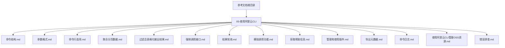

图表来源
- [README.md:11-89](file://alibaba-cloud/reference/README.md#L11-L89)

章节来源
- [README.md:11-89](file://alibaba-cloud/reference/README.md#L11-L89)

## 核心组件
- 命令结构与风格：统一的通用命令结构，区分RPC与ROA风格调用方式与参数传递。
- 命令行选项：覆盖认证、地域、接入点、协议、超时、重试、输出、轮询、模拟调用等行为控制。
- 参数格式：针对不同数据类型（整数、字符串、字符串列表、JSON数组、日期、特殊字符）的格式要求与示例。
- 高级功能：分页聚合、结果过滤与表格化输出、强制调用API、结果轮询、模拟调用、日志调试、插件化架构、元数据导出、OSS管理。

章节来源
- [命令结构.md:1-106](file://alibaba-cloud/reference/05-使用阿里云CLI/call-rpc-api-and-roa-api.md#L1-L106)
- [命令行选项.md:1-37](file://alibaba-cloud/reference/05-使用阿里云CLI/command-line-options.md#L1-L37)
- [参数格式.md:1-126](file://alibaba-cloud/reference/05-使用阿里云CLI/parameter-format-overview.md#L1-L126)

## 架构总览
阿里云CLI采用“主程序 + 插件化”的架构。主程序负责解析命令、参数与选项，调度插件执行具体云产品API调用。插件按需安装，独立更新，统一命名与参数风格，简化调用体验。

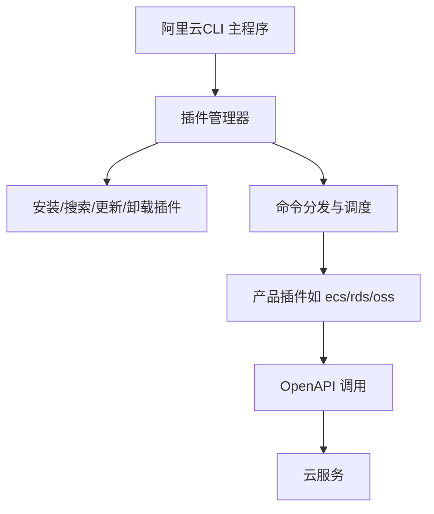

图表来源
- [管理和使用插件.md:1-191](file://alibaba-cloud/reference/05-使用阿里云CLI/managing-and-using-cli-plugins.md#L1-L191)

章节来源
- [管理和使用插件.md:1-191](file://alibaba-cloud/reference/05-使用阿里云CLI/managing-and-using-cli-plugins.md#L1-L191)

## 详细组件分析

### 命令结构与风格
- 通用结构：aliyun <Command> [SubCommand] [Options and Parameters]
- RPC风格：aliyun <ProductCode> <APIName> [Parameters]
- ROA风格：aliyun <ProductCode> <Method> <PathPattern> [RequestBody] [Parameters]
- 风格判断：通过产品或API的--help输出中“接口简述”或“PathPattern/Method”识别。

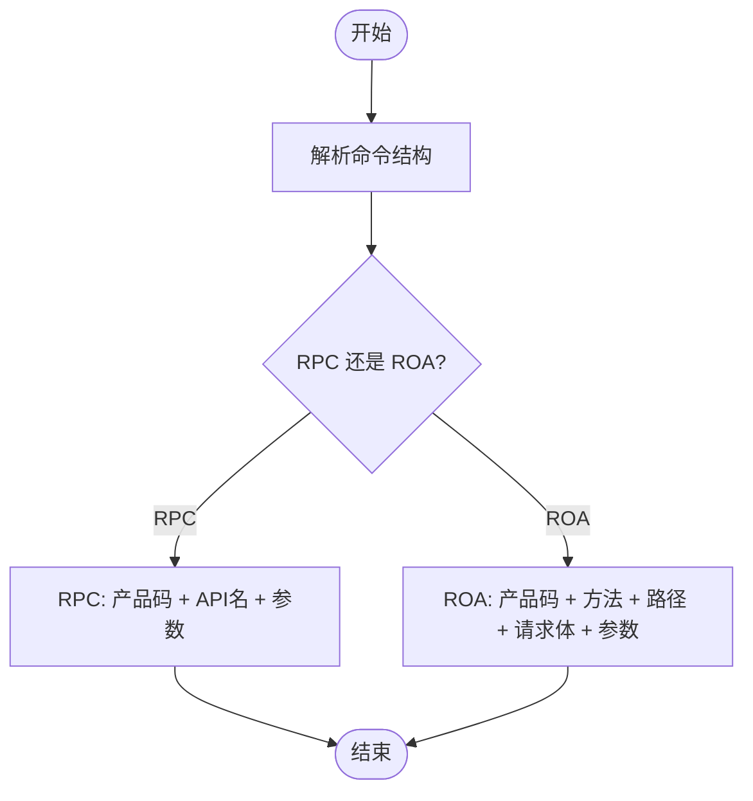

图表来源
- [命令结构.md:35-106](file://alibaba-cloud/reference/05-使用阿里云CLI/call-rpc-api-and-roa-api.md#L35-L106)

章节来源
- [命令结构.md:1-106](file://alibaba-cloud/reference/05-使用阿里云CLI/call-rpc-api-and-roa-api.md#L1-L106)

### 命令行选项与参数格式
- 选项格式：OpenAPI通用命令之后，以--options [optionParams]形式传入。
- 常用选项：--profile/--region/--endpoint/--endpoint-type/--version/--header/--body/--body-file/--read-timeout/--connect-timeout/--retry-count/--secure/--insecure/--quiet/--help/--output/--pager/--force/--waiter/--dryrun。
- 参数格式要点：严格区分大小写；字符串、数组、JSON、日期、特殊字符的处理方式与引号策略；Windows/Unix环境差异。

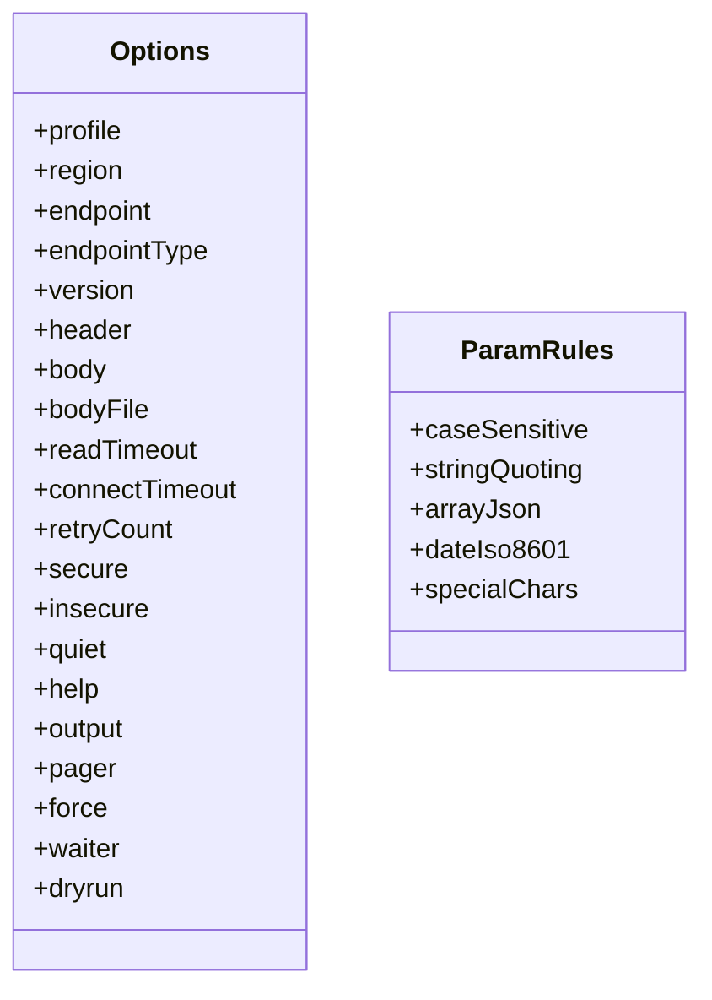

图表来源
- [命令行选项.md:15-37](file://alibaba-cloud/reference/05-使用阿里云CLI/command-line-options.md#L15-L37)
- [参数格式.md:5-126](file://alibaba-cloud/reference/05-使用阿里云CLI/parameter-format-overview.md#L5-L126)

章节来源
- [命令行选项.md:1-37](file://alibaba-cloud/reference/05-使用阿里云CLI/command-line-options.md#L1-L37)
- [参数格式.md:1-126](file://alibaba-cloud/reference/05-使用阿里云CLI/parameter-format-overview.md#L1-L126)

### 分页数据聚合
- 默认行为：分页类接口仅返回单页结果。
- --pager：聚合全量数据一次性返回；字段映射包括PageNumber、PageSize、TotalCount、NextToken、path（JMESPath）。
- 注意事项：若接口字段与默认值不一致，需手动映射字段参数。

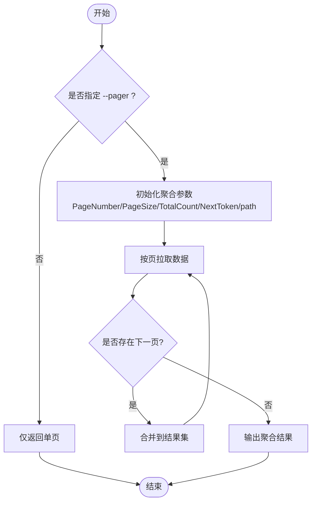

图表来源
- [聚合分页数据.md:7-37](file://alibaba-cloud/reference/05-使用阿里云CLI/aggregation-of-paging-interface-results.md#L7-L37)

章节来源
- [聚合分页数据.md:1-37](file://alibaba-cloud/reference/05-使用阿里云CLI/aggregation-of-paging-interface-results.md#L1-L37)

### 过滤且表格化输出
- --output：提取并表格化展示感兴趣字段。
- 字段说明：cols（列名，支持自定义别名与数组索引）、rows（JMESPath路径）、num（是否显示行号）。
- 使用建议：聚合后过滤时，JMESPath路径应指向聚合后的数据结构。

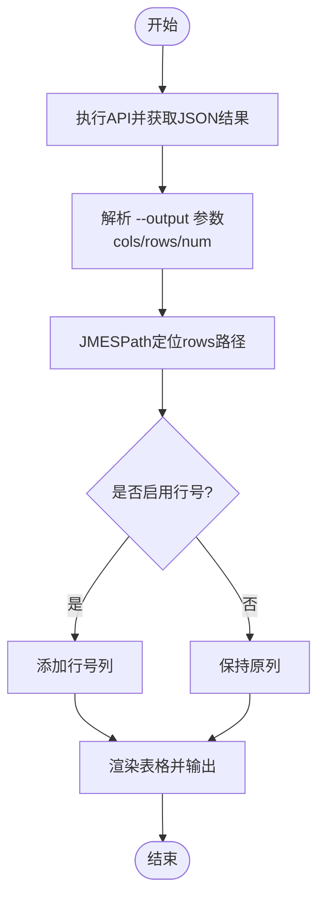

图表来源
- [过滤且表格化输出结果.md:5-69](file://alibaba-cloud/reference/05-使用阿里云CLI/filter-results-and-tabulate-output.md#L5-L69)

章节来源
- [过滤且表格化输出结果.md:1-69](file://alibaba-cloud/reference/05-使用阿里云CLI/filter-results-and-tabulate-output.md#L1-L69)

### 强制调用API
- 场景：当API版本或参数不在内置元数据中时，使用--force强制调用。
- 要求：配合--version指定API版本，必要时通过--endpoint指定接入点。
- 建议：先用--help确认产品与API名称、参数，再组合--force与--version。

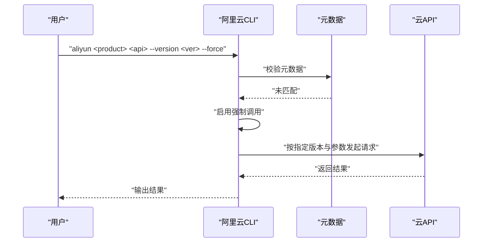

图表来源
- [强制调用接口.md:5-27](file://alibaba-cloud/reference/05-使用阿里云CLI/force-call-apis.md#L5-L27)

章节来源
- [强制调用接口.md:1-27](file://alibaba-cloud/reference/05-使用阿里云CLI/force-call-apis.md#L1-L27)

### 结果轮询
- --waiter：基于JMESPath表达式轮询，直到目标字段达到期望值。
- 字段说明：expr（JMESPath表达式）、to（目标值）。
- 应用场景：等待资源状态从“Creating”变为“Running”。

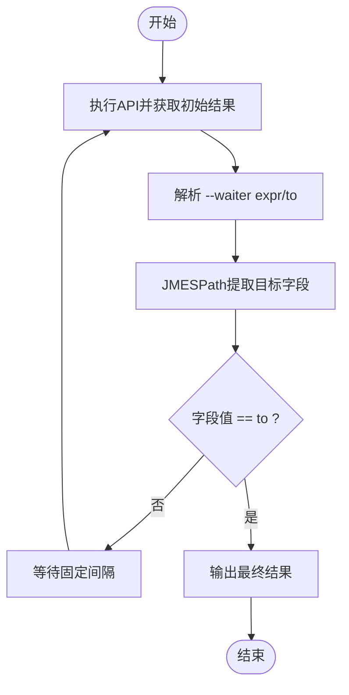

图表来源
- [结果轮询.md:5-27](file://alibaba-cloud/reference/05-使用阿里云CLI/result-polling.md#L5-L27)

章节来源
- [结果轮询.md:1-27](file://alibaba-cloud/reference/05-使用阿里云CLI/result-polling.md#L1-L27)

### 模拟调用功能
- --dryrun：打印将要发送的完整请求信息，不实际调用API。
- 互斥限制：与--pager、--waiter互斥。
- 适用场景：调试请求参数、验证签名与头部信息。

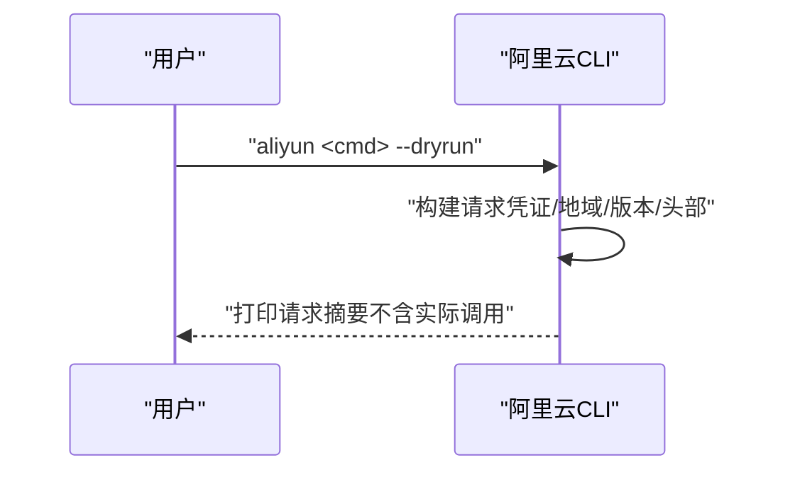

图表来源
- [模拟调用功能.md:5-35](file://alibaba-cloud/reference/05-使用阿里云CLI/simulate-a-call.md#L5-L35)

章节来源
- [模拟调用功能.md:1-35](file://alibaba-cloud/reference/05-使用阿里云CLI/simulate-a-call.md#L1-L35)

### 获取帮助信息
- aliyun --help：查看通用选项与支持产品列表。
- aliyun <product> --help：查看产品可用OpenAPI列表（RPC显示简述，ROA显示PathPattern）。
- aliyun <product> <api> --help：查看API参数详情（含类型、是否必填、取值范围等）。

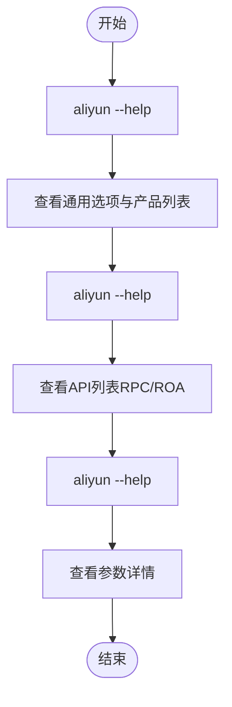

图表来源
- [获取帮助信息.md:5-62](file://alibaba-cloud/reference/05-使用阿里云CLI/use-the-help-command.md#L5-L62)

章节来源
- [获取帮助信息.md:1-62](file://alibaba-cloud/reference/05-使用阿里云CLI/use-the-help-command.md#L1-L62)

### 插件管理与使用
- 插件化：按需安装独立插件，独立更新，统一命名与参数风格。
- 命令格式：aliyun <产品Code> <命令> [--参数名 值 ...]。
- 进阶用法：数组参数重复传入、对象参数使用key=value、多版本API通过--api-version指定。
- 自动安装：可通过配置或环境变量启用自动安装插件。

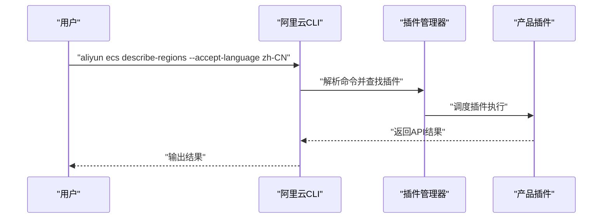

图表来源
- [管理和使用插件.md:74-191](file://alibaba-cloud/reference/05-使用阿里云CLI/managing-and-using-cli-plugins.md#L74-L191)

章节来源
- [管理和使用插件.md:1-191](file://alibaba-cloud/reference/05-使用阿里云CLI/managing-and-using-cli-plugins.md#L1-L191)

### 导出元数据
- 功能：导出CLI与OpenAPI元数据，便于调试或开发。
- 步骤：设置环境变量、执行任意CLI命令生成文件、关闭导出功能。
- 位置：当前工作目录下cli-metadata/，包含products.json与各产品API定义。

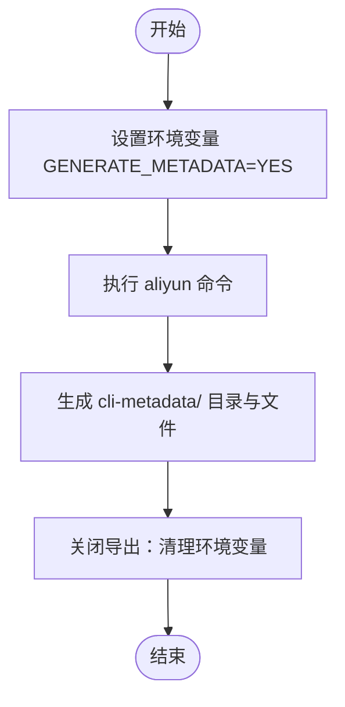

图表来源
- [导出元数据.md:12-86](file://alibaba-cloud/reference/05-使用阿里云CLI/export-metadata.md#L12-L86)

章节来源
- [导出元数据.md:1-86](file://alibaba-cloud/reference/05-使用阿里云CLI/export-metadata.md#L1-L86)

### 命令日志与调试
- CLI日志：设置环境变量DEBUG=sdk开启SDK日志，查看请求/响应细节。
- OSS日志：OSS命令使用--loglevel（info/debug）输出到文件。

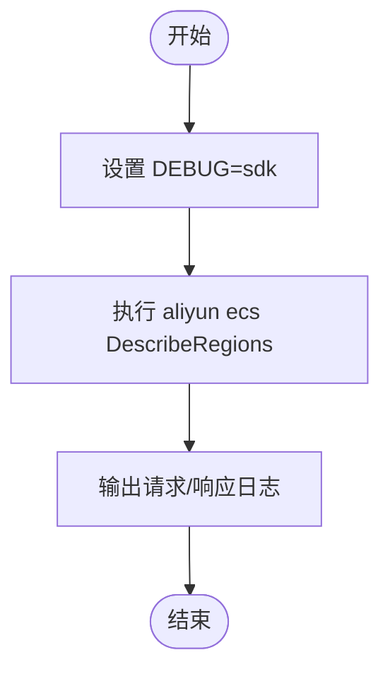

图表来源
- [命令日志.md:9-45](file://alibaba-cloud/reference/05-使用阿里云CLI/log-debugging.md#L9-L45)

章节来源
- [命令日志.md:1-45](file://alibaba-cloud/reference/05-使用阿里云CLI/log-debugging.md#L1-L45)

### 使用阿里云CLI管理OSS资源
- 集成ossutil：支持ossutil 1.0与2.0，推荐升级至ossutil 2.0。
- 命令结构：aliyun ossutil <command> [argument] [flags]。
- 选项类型：字符串、布尔、整数、时间戳、字节/时间单位后缀、字符串列表/数组。
- 输出控制：raw/json/yaml格式切换；基于JMESPath的输出筛选；友好显示（人类可读单位）。
- 返回码：0成功；1参数错误；2服务端错误；3SDK错误；4批量部分失败；5中断。

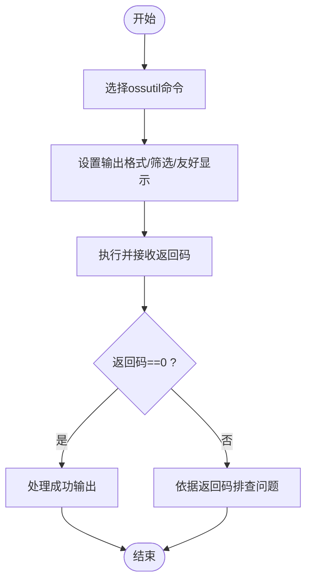

图表来源
- [使用阿里云CLI管理OSS资源.md:105-333](file://alibaba-cloud/reference/05-使用阿里云CLI/use-alibaba-cloud-cli-to-manage-oss-data.md#L105-L333)

章节来源
- [使用阿里云CLI管理OSS资源.md:1-333](file://alibaba-cloud/reference/05-使用阿里云CLI/use-alibaba-cloud-cli-to-manage-oss-data.md#L1-L333)

### 生成并调用命令
- OpenAPI门户：在线生成CLI命令示例，支持复制到本地Shell运行。
- 注意事项：默认可能包含--region选项，复制到本地后可按需删除或保留；注意参数格式与引号处理。

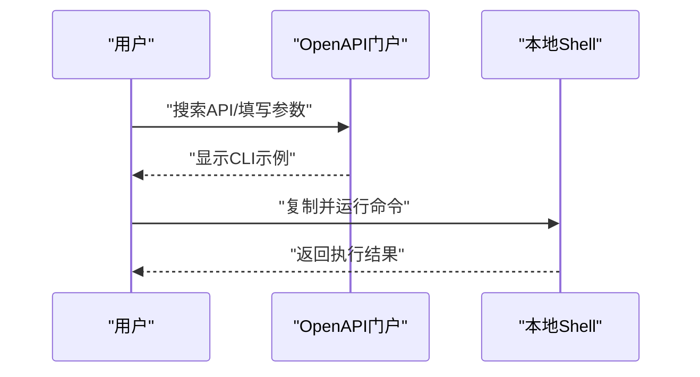

图表来源
- [生成并调用命令.md:14-66](file://alibaba-cloud/reference/05-使用阿里云CLI/sample-commands.md#L14-L66)

章节来源
- [生成并调用命令.md:1-66](file://alibaba-cloud/reference/05-使用阿里云CLI/sample-commands.md#L1-L66)

## 依赖分析
- 组件耦合：主程序与插件解耦，通过统一命令格式与参数风格协作。
- 外部依赖：云API、OpenAPI元数据、凭证与网络环境。
- 互斥关系：--dryrun与--pager/--waiter互斥；--force需配合--version；--endpoint-type与--endpoint协同。

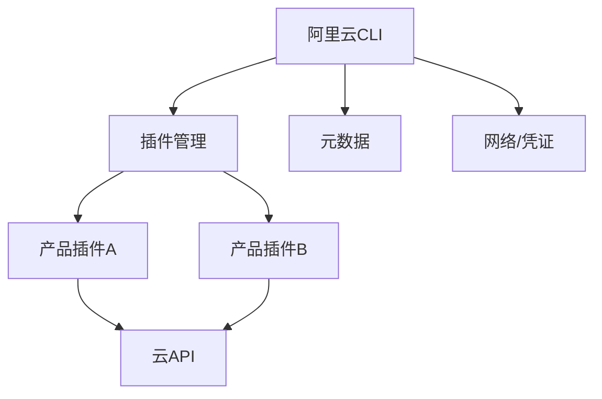

图表来源
- [管理和使用插件.md:24-46](file://alibaba-cloud/reference/05-使用阿里云CLI/managing-and-using-cli-plugins.md#L24-L46)
- [命令行选项.md:15-37](file://alibaba-cloud/reference/05-使用阿里云CLI/command-line-options.md#L15-L37)

章节来源
- [管理和使用插件.md:1-191](file://alibaba-cloud/reference/05-使用阿里云CLI/managing-and-using-cli-plugins.md#L1-L191)
- [命令行选项.md:1-37](file://alibaba-cloud/reference/05-使用阿里云CLI/command-line-options.md#L1-L37)

## 性能考虑
- 分页聚合：合理使用--pager避免多次往返；在高并发场景下注意--read-timeout与--connect-timeout配置。
- 结果轮询：设置合适的轮询间隔与超时，避免长时间占用。
- 输出控制：--output仅提取必要字段，减少传输与渲染开销。
- 插件化：按需安装插件，减少启动与解析成本。
- 日志级别：仅在调试阶段开启详细日志，避免影响生产性能。

## 故障排查指南
- 一般排查：检查网络、必需选项、命令与参数格式、地域与接入点优先级、请求详情（--dryrun或日志）。
- 凭证有效性：检查--profile优先级、配置文件/环境变量、凭证模式权限。
- 强制调用：确认--force与--version配合使用，必要时指定--endpoint。
- 常见错误：找不到命令、参数解析异常、“required parameters not assigned”、网络超时、凭证无效等。

章节来源
- [错误排查.md:7-111](file://alibaba-cloud/reference/08-错误排查/cli-troubleshooting.md#L7-L111)

## 结论
通过掌握命令结构、参数格式与命令行选项，结合分页聚合、结果过滤与表格化输出、强制调用、结果轮询与模拟调用等高级功能，您可以高效、安全地使用阿里云CLI完成日常运维与自动化任务。建议在生产环境中谨慎使用--force与--dryrun，优先通过--help与元数据导出来确认API细节，并利用日志与插件化能力提升可观测性与可维护性。

## 附录
- 实战示例：参考“生成并调用命令”章节中的ECS CreateInstance示例，按需替换参数并观察输出。
- 最佳实践：结合“管理和使用插件”实现按需安装与独立更新；利用“导出元数据”与“命令日志”提升调试效率。