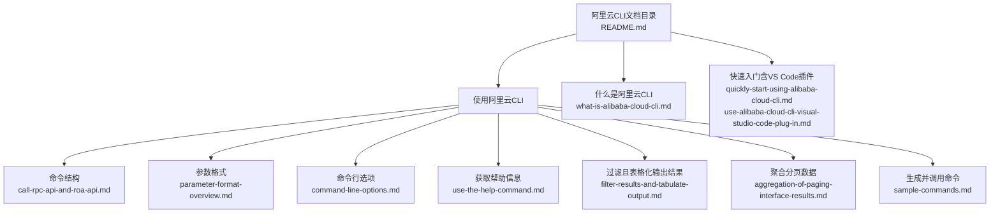
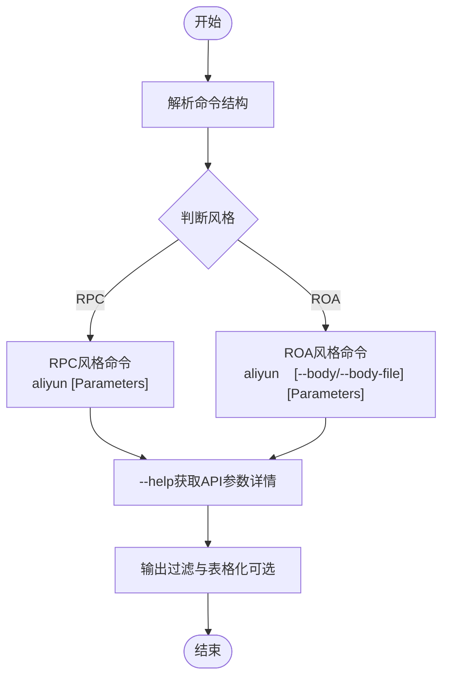
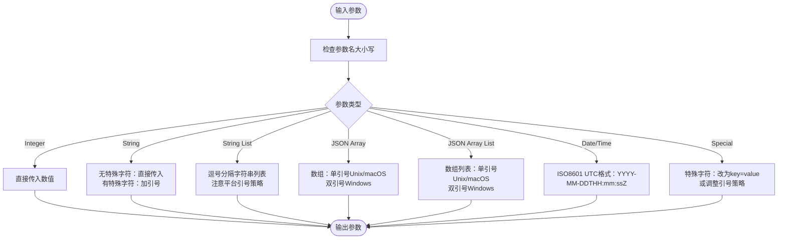
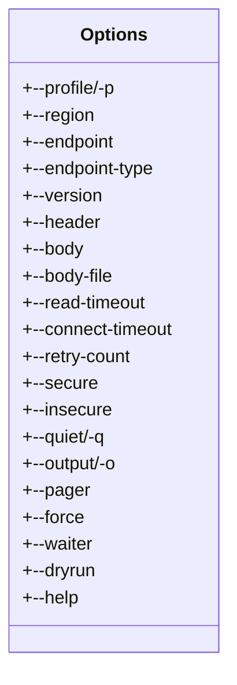
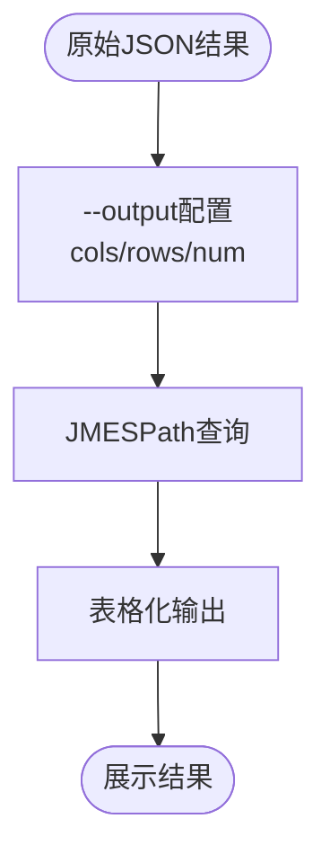
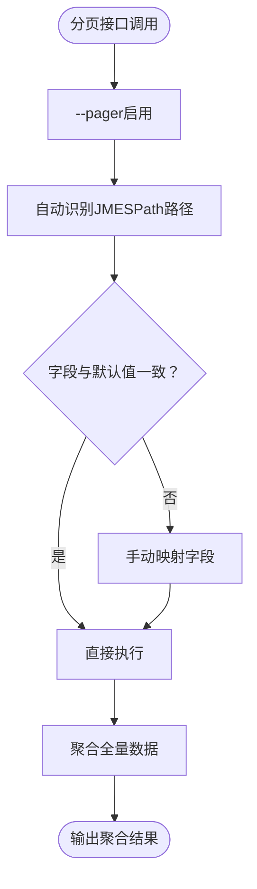
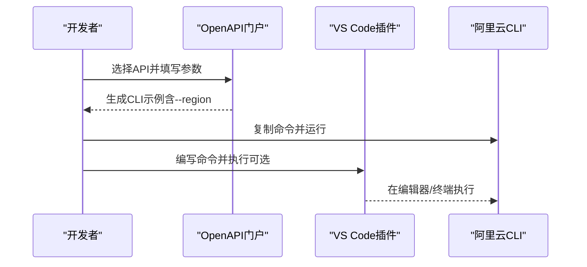
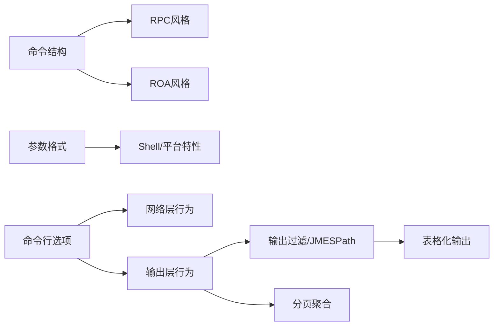

# 命令基础与参数格式

<cite>
**本文引用的文件**
- [命令行选项](file://alibaba-cloud/reference/05-使用阿里云CLI/command-line-options.md)
- [参数格式](file://alibaba-cloud/reference/05-使用阿里云CLI/parameter-format-overview.md)
- [命令结构](file://alibaba-cloud/reference/05-使用阿里云CLI/call-rpc-api-and-roa-api.md)
- [生成并调用命令](file://alibaba-cloud/reference/05-使用阿里云CLI/sample-commands.md)
- [获取帮助信息](file://alibaba-cloud/reference/05-使用阿里云CLI/use-the-help-command.md)
- [过滤且表格化输出结果](file://alibaba-cloud/reference/05-使用阿里云CLI/filter-results-and-tabulate-output.md)
- [聚合分页数据](file://alibaba-cloud/reference/05-使用阿里云CLI/aggregation-of-paging-interface-results.md)
- [什么是阿里云CLI](file://alibaba-cloud/reference/01-什么是阿里云CLI/what-is-alibaba-cloud-cli.md)
- [使用阿里云CLI调用OpenAPI](file://alibaba-cloud/reference/02-快速入门/quickly-start-using-alibaba-cloud-cli.md)
- [使用阿里云CLI Visual Studio Code插件](file://alibaba-cloud/reference/02-快速入门/use-alibaba-cloud-cli-visual-studio-code-plug-in.md)
- [阿里云CLI文档目录](file://alibaba-cloud/reference/README.md)
</cite>

## 目录
1. [简介](#简介)
2. [项目结构](#项目结构)
3. [核心组件](#核心组件)
4. [架构总览](#架构总览)
5. [详细组件分析](#详细组件分析)
6. [依赖分析](#依赖分析)
7. [性能考虑](#性能考虑)
8. [故障排查指南](#故障排查指南)
9. [结论](#结论)
10. [附录](#附录)

## 简介
本文件面向阿里云CLI使用者，系统梳理命令基础与参数格式规范，覆盖命令结构、参数类型与格式、命令行选项、帮助与输出过滤、分页聚合、以及典型示例。内容从基础语法逐步深入到复杂参数组合与最佳实践，帮助用户掌握CLI的标准格式与高效用法。

## 项目结构
本仓库按“阿里云官方文档中心”目录组织，围绕CLI安装、配置、使用、最佳实践与排错展开。与本文主题直接相关的文档集中在“使用阿里云CLI”章节，包括命令结构、参数格式、命令行选项、帮助、输出过滤、分页聚合、示例命令等。



图表来源
- [阿里云CLI文档目录](file://alibaba-cloud/reference/README.md)
- [命令结构](file://alibaba-cloud/reference/05-使用阿里云CLI/call-rpc-api-and-roa-api.md)
- [参数格式](file://alibaba-cloud/reference/05-使用阿里云CLI/parameter-format-overview.md)
- [命令行选项](file://alibaba-cloud/reference/05-使用阿里云CLI/command-line-options.md)
- [获取帮助信息](file://alibaba-cloud/reference/05-使用阿里云CLI/use-the-help-command.md)
- [过滤且表格化输出结果](file://alibaba-cloud/reference/05-使用阿里云CLI/filter-results-and-tabulate-output.md)
- [聚合分页数据](file://alibaba-cloud/reference/05-使用阿里云CLI/aggregation-of-paging-interface-results.md)
- [生成并调用命令](file://alibaba-cloud/reference/05-使用阿里云CLI/sample-commands.md)
- [什么是阿里云CLI](file://alibaba-cloud/reference/01-什么是阿里云CLI/what-is-alibaba-cloud-cli.md)
- [使用阿里云CLI调用OpenAPI](file://alibaba-cloud/reference/02-快速入门/quickly-start-using-alibaba-cloud-cli.md)
- [使用阿里云CLI Visual Studio Code插件](file://alibaba-cloud/reference/02-快速入门/use-alibaba-cloud-cli-visual-studio-code-plug-in.md)

章节来源
- [阿里云CLI文档目录](file://alibaba-cloud/reference/README.md)

## 核心组件
- 命令结构：通用命令行结构、RPC风格与ROA风格命令结构、帮助信息获取。
- 参数格式：参数名/值大小写、整数、字符串、字符串列表、JSON数组、JSON数组列表、日期与时长、特殊字符处理。
- 命令行选项：认证与区域、端点与版本、请求头与请求体、超时与重试、协议控制、静默输出、帮助、输出过滤、分页聚合、强制调用、轮询、干跑调试。
- 输出与过滤：表格化输出、JMESPath路径、列与行映射、行号显示。
- 分页聚合：页码/页大小/总数/凭证字段映射、默认与自定义路径。
- 示例与工具：OpenAPI门户生成命令、VS Code插件辅助、CloudShell在线调试。

章节来源
- [命令结构](file://alibaba-cloud/reference/05-使用阿里云CLI/call-rpc-api-and-roa-api.md)
- [参数格式](file://alibaba-cloud/reference/05-使用阿里云CLI/parameter-format-overview.md)
- [命令行选项](file://alibaba-cloud/reference/05-使用阿里云CLI/command-line-options.md)
- [过滤且表格化输出结果](file://alibaba-cloud/reference/05-使用阿里云CLI/filter-results-and-tabulate-output.md)
- [聚合分页数据](file://alibaba-cloud/reference/05-使用阿里云CLI/aggregation-of-paging-interface-results.md)
- [生成并调用命令](file://alibaba-cloud/reference/05-使用阿里云CLI/sample-commands.md)
- [获取帮助信息](file://alibaba-cloud/reference/05-使用阿里云CLI/use-the-help-command.md)
- [使用阿里云CLI Visual Studio Code插件](file://alibaba-cloud/reference/02-快速入门/use-alibaba-cloud-cli-visual-studio-code-plug-in.md)

## 架构总览
下图展示了CLI命令从输入到输出的关键流程：命令结构解析、参数格式校验、命令行选项生效、调用OpenAPI、结果过滤与表格化输出、必要时进行分页聚合与轮询。

```mermaid
sequenceDiagram
participant U as "用户"
participant CLI as "阿里云CLI"
participant OPT as "命令行选项"
participant API as "OpenAPI网关"
participant OUT as "输出/过滤"
U->>CLI : 输入命令与参数
CLI->>OPT : 解析选项profile/region/endpoint/version/header/body等
OPT-->>CLI : 应用选项协议/超时/重试/输出等
CLI->>API : 发起API请求RPC/ROA风格
API-->>CLI : 返回JSON结果
CLI->>OUT : 过滤与表格化--output
OUT-->>U : 展示结果或聚合分页--pager
```

图表来源
- [命令行选项](file://alibaba-cloud/reference/05-使用阿里云CLI/command-line-options.md)
- [过滤且表格化输出结果](file://alibaba-cloud/reference/05-使用阿里云CLI/filter-results-and-tabulate-output.md)
- [聚合分页数据](file://alibaba-cloud/reference/05-使用阿里云CLI/aggregation-of-paging-interface-results.md)
- [命令结构](file://alibaba-cloud/reference/05-使用阿里云CLI/call-rpc-api-and-roa-api.md)

## 详细组件分析

### 命令结构与风格
- 通用命令结构：aliyun <Command> [SubCommand] [Options and Parameters]
- RPC风格：aliyun <ProductCode> <APIName> [Parameters]
- ROA风格：aliyun <ProductCode> <Method> <PathPattern> [RequestBody] [Parameters]
- 帮助信息：通过--help在不同层级获取产品列表、API列表、参数详情；RPC风格显示接口描述，ROA风格显示Method与PathPattern。



图表来源
- [命令结构](file://alibaba-cloud/reference/05-使用阿里云CLI/call-rpc-api-and-roa-api.md)
- [获取帮助信息](file://alibaba-cloud/reference/05-使用阿里云CLI/use-the-help-command.md)
- [过滤且表格化输出结果](file://alibaba-cloud/reference/05-使用阿里云CLI/filter-results-and-tabulate-output.md)

章节来源
- [命令结构](file://alibaba-cloud/reference/05-使用阿里云CLI/call-rpc-api-and-roa-api.md)
- [获取帮助信息](file://alibaba-cloud/reference/05-使用阿里云CLI/use-the-help-command.md)

### 参数格式规范
- 参数名大小写：严格区分大小写，需与OpenAPI文档一致。
- 参数值大小写：部分值不区分，建议严格区分以保持一致性。
- 数据类型与格式：
  - Integer：直接传入数值。
  - String：无特殊字符可直接传入；含空格或特殊字符需加引号；Windows命令提示符与PowerShell引号策略不同。
  - 字符串列表：以逗号分隔的字符串列表，Windows与Unix风格引号策略不同。
  - JSON数组：Windows使用双引号包裹，Unix/macOS使用单引号包裹。
  - JSON数组列表：Windows使用双引号包裹，Unix/macOS使用单引号包裹。
  - 日期与时长：ISO8601 UTC格式YYYY-MM-DDTHH:mm:ssZ。
  - 特殊字符：若引号包裹后仍有解析问题，可改为key=value格式（如--PortRange=-1/-1）。



图表来源
- [参数格式](file://alibaba-cloud/reference/05-使用阿里云CLI/parameter-format-overview.md)

章节来源
- [参数格式](file://alibaba-cloud/reference/05-使用阿里云CLI/parameter-format-overview.md)

### 命令行选项详解
- 配置与区域：--profile/-p、--region
- 网络与版本：--endpoint、--endpoint-type、--version（常与--force配合）
- 请求控制：--header（可多次）、--body、--body-file（优先于--body）
- 超时与重试：--read-timeout、--connect-timeout、--retry-count
- 协议控制：--secure（强制HTTPS）、--insecure（强制HTTP）
- 输出控制：--quiet/-q（关闭正常输出）、--output/-o（过滤与表格化）、--pager（聚合分页）
- 调试与强制：--force（强制调用非元数据API）、--waiter（轮询）、--dryrun（干跑）
- 帮助：--help（获取帮助）



图表来源
- [命令行选项](file://alibaba-cloud/reference/05-使用阿里云CLI/command-line-options.md)

章节来源
- [命令行选项](file://alibaba-cloud/reference/05-使用阿里云CLI/command-line-options.md)

### 输出过滤与表格化
- --output包含cols、rows、num三个字段：
  - cols：表格列名，支持对象键名或数组索引映射。
  - rows：JMESPath路径，指定数据来源。
  - num：是否显示行号。
- 典型用法：过滤根元素字段、嵌套字段、数组字段；可选开启行号。



图表来源
- [过滤且表格化输出结果](file://alibaba-cloud/reference/05-使用阿里云CLI/filter-results-and-tabulate-output.md)

章节来源
- [过滤且表格化输出结果](file://alibaba-cloud/reference/05-使用阿里云CLI/filter-results-and-tabulate-output.md)

### 分页聚合
- --pager用于一次性获取全量数据，避免逐页拉取。
- 字段映射：PageNumber、PageSize、TotalCount、NextToken、path（默认自动识别数组路径）。
- 若默认字段与实际返回不一致，需手动映射。



图表来源
- [聚合分页数据](file://alibaba-cloud/reference/05-使用阿里云CLI/aggregation-of-paging-interface-results.md)

章节来源
- [聚合分页数据](file://alibaba-cloud/reference/05-使用阿里云CLI/aggregation-of-paging-interface-results.md)

### 示例与工具
- OpenAPI门户：在线生成CLI命令示例，支持复制到本地Shell运行；默认包含--region选项，可按需删除或保留。
- VS Code插件：提供命令补全、在编辑器或终端执行命令的能力，提升编写效率。
- 快速入门：安装、配置凭证、生成命令、调用API的完整流程。



图表来源
- [生成并调用命令](file://alibaba-cloud/reference/05-使用阿里云CLI/sample-commands.md)
- [使用阿里云CLI Visual Studio Code插件](file://alibaba-cloud/reference/02-快速入门/use-alibaba-cloud-cli-visual-studio-code-plug-in.md)

章节来源
- [生成并调用命令](file://alibaba-cloud/reference/05-使用阿里云CLI/sample-commands.md)
- [使用阿里云CLI Visual Studio Code插件](file://alibaba-cloud/reference/02-快速入门/use-alibaba-cloud-cli-visual-studio-code-plug-in.md)
- [使用阿里云CLI调用OpenAPI](file://alibaba-cloud/reference/02-快速入门/quickly-start-using-alibaba-cloud-cli.md)

## 依赖分析
- 命令结构依赖OpenAPI风格（RPC/ROA），不同风格影响命令形态与参数传递方式。
- 参数格式依赖平台与Shell特性（引号策略、转义规则）。
- 命令行选项影响网络层行为（端点、协议、超时、重试）与输出层行为（过滤、表格化、分页聚合）。
- 输出过滤依赖JMESPath表达式，需与API返回结构匹配。



图表来源
- [命令结构](file://alibaba-cloud/reference/05-使用阿里云CLI/call-rpc-api-and-roa-api.md)
- [参数格式](file://alibaba-cloud/reference/05-使用阿里云CLI/parameter-format-overview.md)
- [命令行选项](file://alibaba-cloud/reference/05-使用阿里云CLI/command-line-options.md)
- [过滤且表格化输出结果](file://alibaba-cloud/reference/05-使用阿里云CLI/filter-results-and-tabulate-output.md)
- [聚合分页数据](file://alibaba-cloud/reference/05-使用阿里云CLI/aggregation-of-paging-interface-results.md)

章节来源
- [命令结构](file://alibaba-cloud/reference/05-使用阿里云CLI/call-rpc-api-and-roa-api.md)
- [参数格式](file://alibaba-cloud/reference/05-使用阿里云CLI/parameter-format-overview.md)
- [命令行选项](file://alibaba-cloud/reference/05-使用阿里云CLI/command-line-options.md)
- [过滤且表格化输出结果](file://alibaba-cloud/reference/05-使用阿里云CLI/filter-results-and-tabulate-output.md)
- [聚合分页数据](file://alibaba-cloud/reference/05-使用阿里云CLI/aggregation-of-paging-interface-results.md)

## 性能考虑
- 使用--pager聚合分页数据可减少多次往返，但需关注内存占用与响应时间。
- 适当设置--read-timeout与--connect-timeout，避免长时间阻塞。
- 合理使用--output过滤无关字段，减少输出体积与解析成本。
- 对高并发场景，结合--retry-count与重试策略，平衡成功率与资源消耗。

## 故障排查指南
- 参数格式错误：检查参数名大小写、引号策略、特殊字符转义；必要时改为key=value格式。
- 输出不可读：使用--output进行过滤与表格化，明确cols与rows路径。
- 分页未全量：确认--pager字段映射与API返回字段一致；必要时手动指定字段。
- 超时或重试异常：调整--read-timeout、--connect-timeout、--retry-count。
- 调试请求细节：使用--dryrun打印完整请求信息，定位问题。
- 获取帮助：在不同层级使用--help，获取产品列表、API列表与参数详情。

章节来源
- [参数格式](file://alibaba-cloud/reference/05-使用阿里云CLI/parameter-format-overview.md)
- [过滤且表格化输出结果](file://alibaba-cloud/reference/05-使用阿里云CLI/filter-results-and-tabulate-output.md)
- [聚合分页数据](file://alibaba-cloud/reference/05-使用阿里云CLI/aggregation-of-paging-interface-results.md)
- [命令行选项](file://alibaba-cloud/reference/05-使用阿里云CLI/command-line-options.md)
- [获取帮助信息](file://alibaba-cloud/reference/05-使用阿里云CLI/use-the-help-command.md)

## 结论
掌握阿里云CLI的命令基础与参数格式，是高效、稳定地调用OpenAPI的前提。通过理解命令结构（RPC/ROA）、严格遵循参数格式规范、合理使用命令行选项与输出过滤、善用分页聚合与帮助信息，用户可以构建从基础到复杂的完整操作体系。配合OpenAPI门户与VS Code插件，可进一步提升开发与运维效率。

## 附录
- 快速入门流程：安装→配置凭证→生成命令→调用API。
- CLI能力概览：多产品集成、多凭证支持、流控退避、命令自动补全、多种输出格式、在线帮助、多系统支持。

章节来源
- [使用阿里云CLI调用OpenAPI](file://alibaba-cloud/reference/02-快速入门/quickly-start-using-alibaba-cloud-cli.md)
- [什么是阿里云CLI](file://alibaba-cloud/reference/01-什么是阿里云CLI/what-is-alibaba-cloud-cli.md)