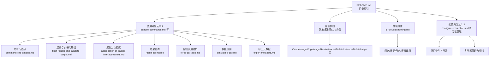
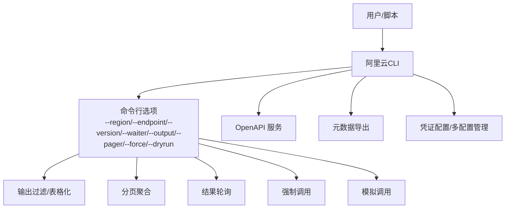
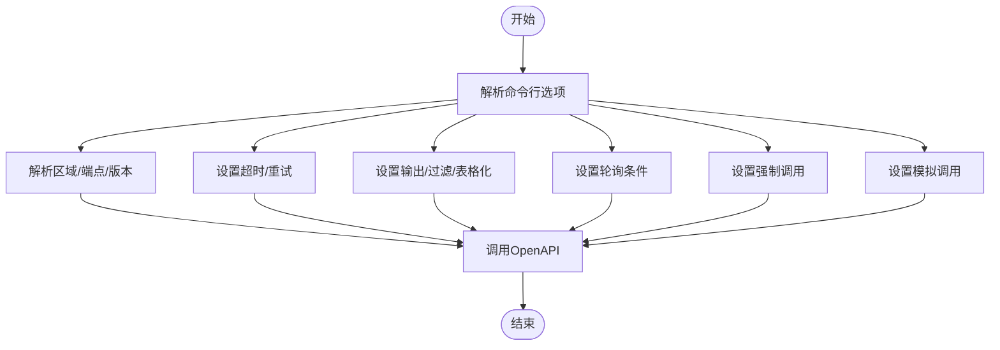
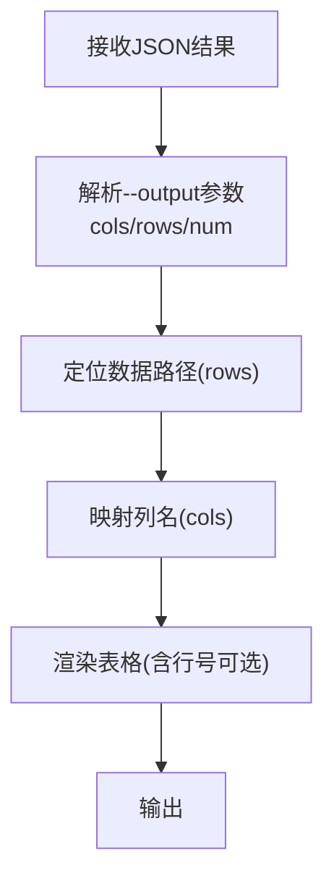
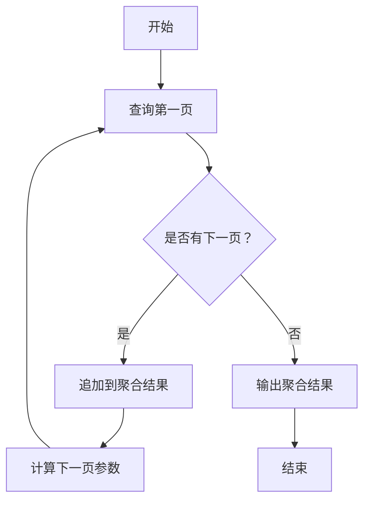
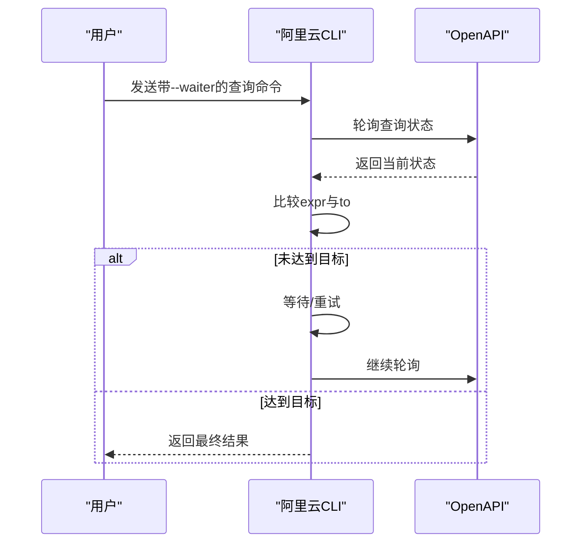
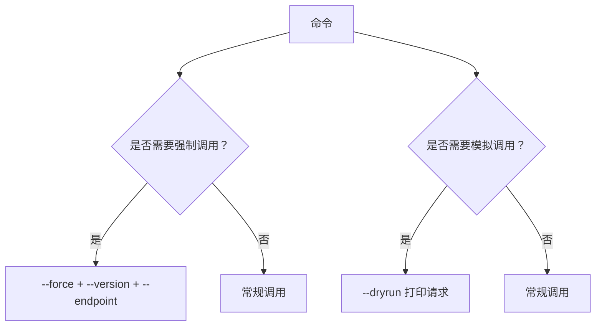
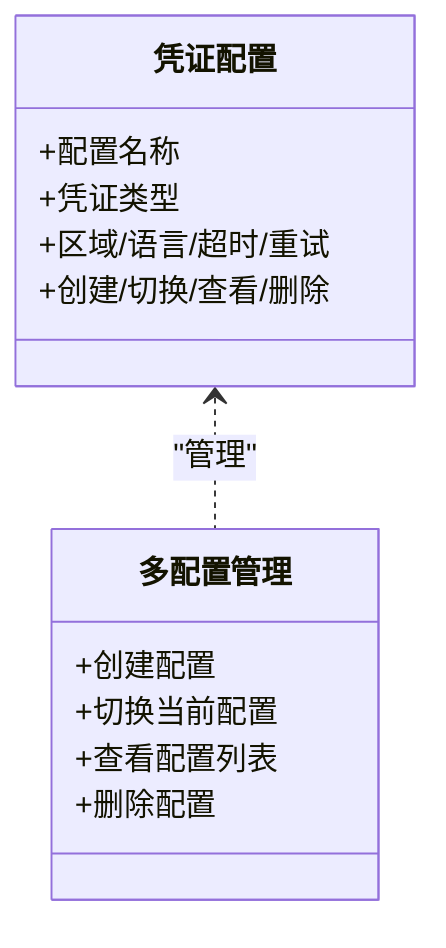
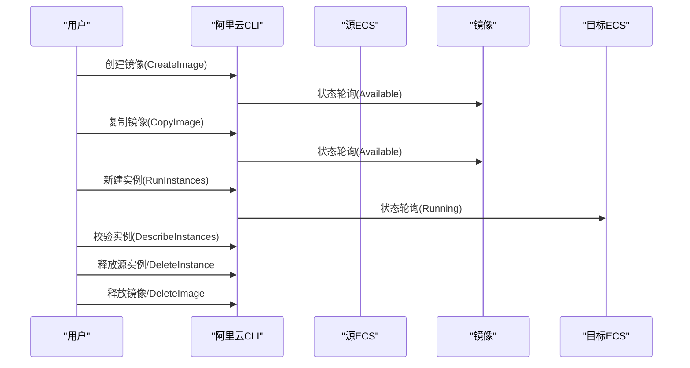
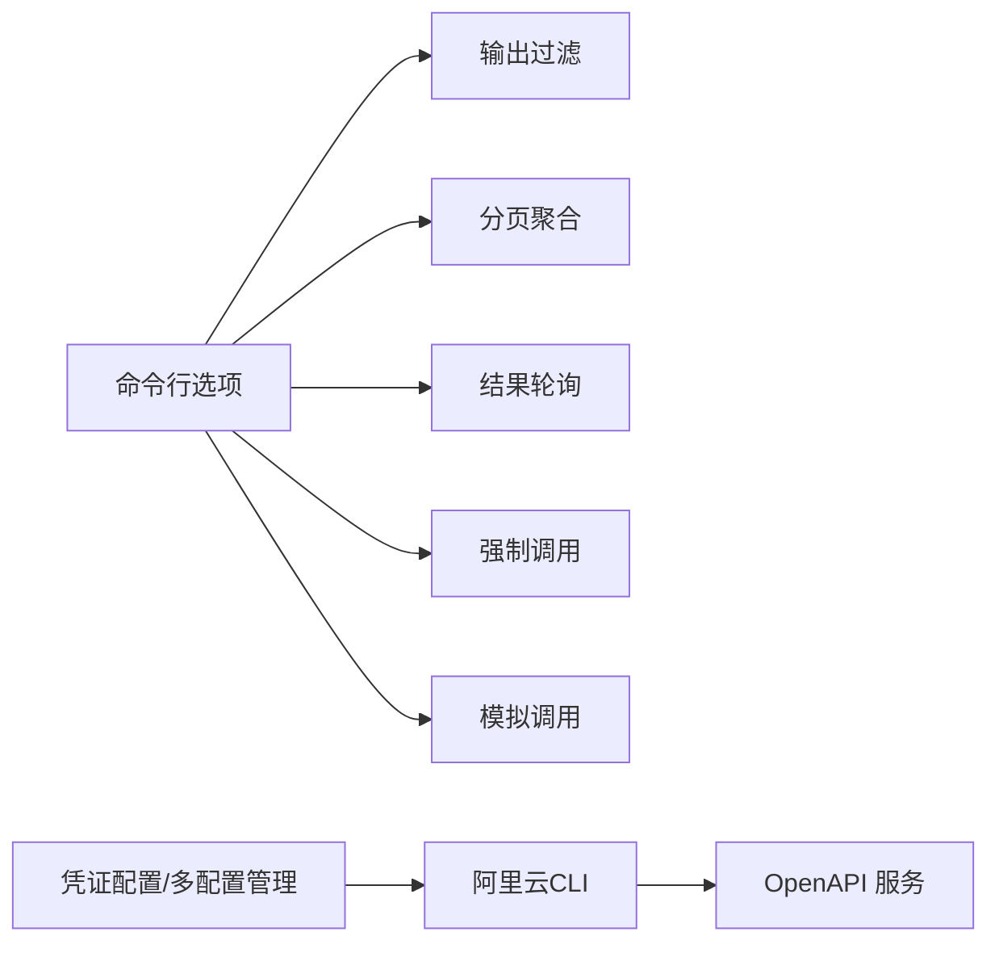

# 实际使用示例

<cite>
**本文引用的文件**
- [README.md](file://alibaba-cloud/reference/README.md)
- [sample-commands.md](file://alibaba-cloud/reference/05-使用阿里云CLI/sample-commands.md)
- [command-line-options.md](file://alibaba-cloud/reference/05-使用阿里云CLI/command-line-options.md)
- [filter-results-and-tabulate-output.md](file://alibaba-cloud/reference/05-使用阿里云CLI/filter-results-and-tabulate-output.md)
- [aggregation-of-paging-interface-results.md](file://alibaba-cloud/reference/05-使用阿里云CLI/aggregation-of-paging-interface-results.md)
- [result-polling.md](file://alibaba-cloud/reference/05-使用阿里云CLI/result-polling.md)
- [force-call-apis.md](file://alibaba-cloud/reference/05-使用阿里云CLI/force-call-apis.md)
- [simulate-a-call.md](file://alibaba-cloud/reference/05-使用阿里云CLI/simulate-a-call.md)
- [export-metadata.md](file://alibaba-cloud/reference/05-使用阿里云CLI/export-metadata.md)
- [use-alibaba-cloud-cli-to-migrate-ecs-instances-across-regions.md](file://alibaba-cloud/reference/06-最佳实践/use-alibaba-cloud-cli-to-migrate-ecs-instances-across-regions.md)
- [cli-troubleshooting.md](file://alibaba-cloud/reference/08-错误排查/cli-troubleshooting.md)
- [configure-credentials.md](file://alibaba-cloud/reference/04-配置阿里云CLI/configure-credentials.md)
- [多凭证管理.md](file://alibaba-cloud/reference/04-配置阿里云CLI/多凭证管理.md)
</cite>

## 目录
1. [简介](#简介)
2. [项目结构](#项目结构)
3. [核心组件](#核心组件)
4. [架构总览](#架构总览)
5. [详细组件分析](#详细组件分析)
6. [依赖分析](#依赖分析)
7. [性能考虑](#性能考虑)
8. [故障排查指南](#故障排查指南)
9. [结论](#结论)
10. [附录](#附录)

## 简介
本指南面向实际工作场景，围绕阿里云CLI的常见业务用例，提供从基础到进阶的实战示例，涵盖云产品管理、资源查询、批量操作、跨地域迁移等主题。每个示例均给出执行步骤、预期结果说明与常见问题的解决方案，帮助用户快速上手并提升效率。

## 项目结构
本仓库按官方文档目录组织，便于按主题检索与复用。与“实际使用示例”直接相关的内容主要集中在“使用阿里云CLI”“最佳实践”“错误排查”“配置阿里云CLI”等章节。

图表来源
- [README.md:11-89](file://alibaba-cloud/reference/README.md#L11-L89)
- [sample-commands.md:1-66](file://alibaba-cloud/reference/05-使用阿里云CLI/sample-commands.md#L1-L66)
- [use-alibaba-cloud-cli-to-migrate-ecs-instances-across-regions.md:1-201](file://alibaba-cloud/reference/06-最佳实践/use-alibaba-cloud-cli-to-migrate-ecs-instances-across-regions.md#L1-L201)
- [cli-troubleshooting.md:1-111](file://alibaba-cloud/reference/08-错误排查/cli-troubleshooting.md#L1-L111)
- [configure-credentials.md:1-862](file://alibaba-cloud/reference/04-配置阿里云CLI/configure-credentials.md#L1-L862)
- [多凭证管理.md:1-203](file://alibaba-cloud/reference/04-配置阿里云CLI/多凭证管理.md#L1-L203)

章节来源
- [README.md:11-89](file://alibaba-cloud/reference/README.md#L11-L89)

## 核心组件
- 命令行选项：提供区域、端点、版本、超时、重试、输出格式、轮询、强制调用、模拟调用等功能开关，支撑复杂场景的可控执行。
- 输出过滤与表格化：通过JMESPath路径与列映射，将复杂JSON结果转化为易读表格，便于批处理与自动化。
- 分页聚合：对分页接口进行全量聚合，减少多次调用与手工拼接。
- 结果轮询：对状态类API进行条件轮询，直到满足目标状态才返回。
- 强制调用：绕过内置元数据限制，按指定版本与端点调用API。
- 模拟调用：在不变更资源的前提下打印请求细节，辅助调试。
- 元数据导出：导出产品与API元数据，便于离线分析与二次开发。
- 跨地域迁移（ECS）：以镜像为中心的跨地域迁移流程，覆盖镜像创建、复制、实例新建、校验与资源释放。

章节来源
- [command-line-options.md:1-37](file://alibaba-cloud/reference/05-使用阿里云CLI/command-line-options.md#L1-L37)
- [filter-results-and-tabulate-output.md:1-69](file://alibaba-cloud/reference/05-使用阿里云CLI/filter-results-and-tabulate-output.md#L1-L69)
- [aggregation-of-paging-interface-results.md:1-37](file://alibaba-cloud/reference/05-使用阿里云CLI/aggregation-of-paging-interface-results.md#L1-L37)
- [result-polling.md:1-27](file://alibaba-cloud/reference/05-使用阿里云CLI/result-polling.md#L1-L27)
- [force-call-apis.md:1-27](file://alibaba-cloud/reference/05-使用阿里云CLI/force-call-apis.md#L1-L27)
- [simulate-a-call.md:1-35](file://alibaba-cloud/reference/05-使用阿里云CLI/simulate-a-call.md#L1-L35)
- [export-metadata.md:1-86](file://alibaba-cloud/reference/05-使用阿里云CLI/export-metadata.md#L1-L86)
- [use-alibaba-cloud-cli-to-migrate-ecs-instances-across-regions.md:1-201](file://alibaba-cloud/reference/06-最佳实践/use-alibaba-cloud-cli-to-migrate-ecs-instances-across-regions.md#L1-L201)

## 架构总览
下图展示了CLI在典型业务场景中的调用链路与关键能力协同：

图表来源
- [command-line-options.md:1-37](file://alibaba-cloud/reference/05-使用阿里云CLI/command-line-options.md#L1-L37)
- [filter-results-and-tabulate-output.md:1-69](file://alibaba-cloud/reference/05-使用阿里云CLI/filter-results-and-tabulate-output.md#L1-L69)
- [aggregation-of-paging-interface-results.md:1-37](file://alibaba-cloud/reference/05-使用阿里云CLI/aggregation-of-paging-interface-results.md#L1-L37)
- [result-polling.md:1-27](file://alibaba-cloud/reference/05-使用阿里云CLI/result-polling.md#L1-L27)
- [force-call-apis.md:1-27](file://alibaba-cloud/reference/05-使用阿里云CLI/force-call-apis.md#L1-L27)
- [simulate-a-call.md:1-35](file://alibaba-cloud/reference/05-使用阿里云CLI/simulate-a-call.md#L1-L35)
- [export-metadata.md:1-86](file://alibaba-cloud/reference/05-使用阿里云CLI/export-metadata.md#L1-L86)
- [configure-credentials.md:1-862](file://alibaba-cloud/reference/04-配置阿里云CLI/configure-credentials.md#L1-L862)
- [多凭证管理.md:1-203](file://alibaba-cloud/reference/04-配置阿里云CLI/多凭证管理.md#L1-L203)

## 详细组件分析

### 组件A：命令行选项与参数格式
- 作用：统一控制调用行为，覆盖区域、端点、版本、超时、重试、输出、轮询、强制调用、模拟调用等。
- 关键点：
  - 区域与端点优先级：命令行选项 > 配置profile > 环境变量。
  - 强制调用需配合版本参数。
  - 模拟调用与分页/轮询互斥。
- 适用场景：跨地域调用、版本兼容、调试验证、批量任务控制。

图表来源
- [command-line-options.md:1-37](file://alibaba-cloud/reference/05-使用阿里云CLI/command-line-options.md#L1-L37)
- [simulate-a-call.md:1-35](file://alibaba-cloud/reference/05-使用阿里云CLI/simulate-a-call.md#L1-L35)
- [force-call-apis.md:1-27](file://alibaba-cloud/reference/05-使用阿里云CLI/force-call-apis.md#L1-L27)

章节来源
- [command-line-options.md:1-37](file://alibaba-cloud/reference/05-使用阿里云CLI/command-line-options.md#L1-L37)
- [simulate-a-call.md:1-35](file://alibaba-cloud/reference/05-使用阿里云CLI/simulate-a-call.md#L1-L35)
- [force-call-apis.md:1-27](file://alibaba-cloud/reference/05-使用阿里云CLI/force-call-apis.md#L1-L27)

### 组件B：输出过滤与表格化
- 作用：将复杂JSON结果映射为表格，支持列名、行路径、行号显示。
- 关键点：
  - cols定义列名或别名，rows指定JMESPath路径。
  - 数组类型字段可自定义列名并添加索引。
- 适用场景：批量查询、报表生成、自动化脚本输出。

图表来源
- [filter-results-and-tabulate-output.md:1-69](file://alibaba-cloud/reference/05-使用阿里云CLI/filter-results-and-tabulate-output.md#L1-L69)

章节来源
- [filter-results-and-tabulate-output.md:1-69](file://alibaba-cloud/reference/05-使用阿里云CLI/filter-results-and-tabulate-output.md#L1-L69)

### 组件C：分页聚合
- 作用：一次性获取全量分页数据，避免多次调用。
- 关键点：
  - 默认字段：PageNumber、PageSize、TotalCount、NextToken。
  - 可自定义JMESPath路径以适配不同返回结构。
- 适用场景：清单导出、批量统计、合规审计。

图表来源
- [aggregation-of-paging-interface-results.md:1-37](file://alibaba-cloud/reference/05-使用阿里云CLI/aggregation-of-paging-interface-results.md#L1-L37)

章节来源
- [aggregation-of-paging-interface-results.md:1-37](file://alibaba-cloud/reference/05-使用阿里云CLI/aggregation-of-paging-interface-results.md#L1-L37)

### 组件D：结果轮询
- 作用：对状态类API进行条件轮询，直到满足目标状态。
- 关键点：
  - expr为目标字段的JMESPath表达式，to为目标值。
- 适用场景：实例启动、镜像可用、任务完成等异步操作。

图表来源
- [result-polling.md:1-27](file://alibaba-cloud/reference/05-使用阿里云CLI/result-polling.md#L1-L27)

章节来源
- [result-polling.md:1-27](file://alibaba-cloud/reference/05-使用阿里云CLI/result-polling.md#L1-L27)

### 组件E：强制调用与模拟调用
- 强制调用：绕过内置元数据限制，需配合--version指定API版本与--endpoint指定接入点。
- 模拟调用：打印请求详情，不变更资源，与--pager/--waiter互斥。
- 适用场景：版本兼容、调试验证、边界测试。

图表来源
- [force-call-apis.md:1-27](file://alibaba-cloud/reference/05-使用阿里云CLI/force-call-apis.md#L1-L27)
- [simulate-a-call.md:1-35](file://alibaba-cloud/reference/05-使用阿里云CLI/simulate-a-call.md#L1-L35)

章节来源
- [force-call-apis.md:1-27](file://alibaba-cloud/reference/05-使用阿里云CLI/force-call-apis.md#L1-L27)
- [simulate-a-call.md:1-35](file://alibaba-cloud/reference/05-使用阿里云CLI/simulate-a-call.md#L1-L35)

### 组件F：凭证配置与多配置管理
- 支持AK、StsToken、RamRoleArn、EcsRamRole、External、ChainableRamRoleArn、CredentialsURI、OIDC、CloudSSO、OAuth等多种凭证类型。
- 多配置管理：创建、切换、查看、删除配置，支持非交互式批量配置。
- 适用场景：多账号、多角色、多环境的统一管理与切换。

图表来源
- [configure-credentials.md:1-862](file://alibaba-cloud/reference/04-配置阿里云CLI/configure-credentials.md#L1-L862)
- [多凭证管理.md:1-203](file://alibaba-cloud/reference/04-配置阿里云CLI/多凭证管理.md#L1-L203)

章节来源
- [configure-credentials.md:1-862](file://alibaba-cloud/reference/04-配置阿里云CLI/configure-credentials.md#L1-L862)
- [多凭证管理.md:1-203](file://alibaba-cloud/reference/04-配置阿里云CLI/多凭证管理.md#L1-L203)

### 组件G：跨地域迁移ECS实例（最佳实践）
- 流程：创建镜像 -> 复制镜像 -> 新建实例 -> 校验 -> 释放资源。
- 关键点：
  - 使用--waiter轮询镜像/实例状态。
  - 使用--output表格化输出便于比对。
  - 注意网络类型、实例规格、公网IP处理等约束。
- 适用场景：生产环境迁移、灾备演练、资源盘点。

图表来源
- [use-alibaba-cloud-cli-to-migrate-ecs-instances-across-regions.md:1-201](file://alibaba-cloud/reference/06-最佳实践/use-alibaba-cloud-cli-to-migrate-ecs-instances-across-regions.md#L1-L201)
- [result-polling.md:1-27](file://alibaba-cloud/reference/05-使用阿里云CLI/result-polling.md#L1-L27)
- [filter-results-and-tabulate-output.md:1-69](file://alibaba-cloud/reference/05-使用阿里云CLI/filter-results-and-tabulate-output.md#L1-L69)

章节来源
- [use-alibaba-cloud-cli-to-migrate-ecs-instances-across-regions.md:1-201](file://alibaba-cloud/reference/06-最佳实践/use-alibaba-cloud-cli-to-migrate-ecs-instances-across-regions.md#L1-L201)

## 依赖分析
- 组件耦合：
  - 输出过滤依赖JMESPath路径解析，与命令行选项中的--output紧密耦合。
  - 轮询依赖--waiter表达式与目标值，常与--output结合用于最终展示。
  - 强制调用与模拟调用分别与--version/--endpoint/--force/--dryrun协作。
  - 多配置管理为凭证配置提供生命周期管理，贯穿所有调用。
- 外部依赖：
  - OpenAPI服务的接入点、版本与权限策略。
  - 网络连通性与DNS解析。
  - 凭证提供方（STS、RAM、OIDC、CloudSSO等）的可用性。

图表来源
- [command-line-options.md:1-37](file://alibaba-cloud/reference/05-使用阿里云CLI/command-line-options.md#L1-L37)
- [filter-results-and-tabulate-output.md:1-69](file://alibaba-cloud/reference/05-使用阿里云CLI/filter-results-and-tabulate-output.md#L1-L69)
- [aggregation-of-paging-interface-results.md:1-37](file://alibaba-cloud/reference/05-使用阿里云CLI/aggregation-of-paging-interface-results.md#L1-L37)
- [result-polling.md:1-27](file://alibaba-cloud/reference/05-使用阿里云CLI/result-polling.md#L1-L27)
- [force-call-apis.md:1-27](file://alibaba-cloud/reference/05-使用阿里云CLI/force-call-apis.md#L1-L27)
- [simulate-a-call.md:1-35](file://alibaba-cloud/reference/05-使用阿里云CLI/simulate-a-call.md#L1-L35)
- [configure-credentials.md:1-862](file://alibaba-cloud/reference/04-配置阿里云CLI/configure-credentials.md#L1-L862)
- [多凭证管理.md:1-203](file://alibaba-cloud/reference/04-配置阿里云CLI/多凭证管理.md#L1-L203)

## 性能考虑
- 分页聚合：一次性拉取全量数据可减少往返次数，但需关注内存占用与网络带宽。
- 输出过滤：合理设置cols/rows可减少传输与渲染开销。
- 轮询策略：适度调整轮询间隔与超时，避免频繁请求造成服务压力。
- 强制调用：明确指定版本与端点，减少元数据匹配与降级带来的额外开销。
- 并行化：在脚本中对独立资源操作进行并发，注意限流与幂等性。

## 故障排查指南
- 一般排查：
  - 检查网络连通性与DNS解析。
  - 核对命令与参数格式，必要时使用--dryrun打印请求详情。
  - 检查区域与端点优先级，确认--region/--endpoint/--profile设置。
  - 检查凭证有效性与权限范围，必要时切换配置或重新授权。
- 常见问题：
  - “required parameters not assigned”：缺少必需参数，对照API文档补齐。
  - “unknown api/unknown parameter”：使用--force并配合--version指定版本。
  - “网络连接超时”：调整--read-timeout/--connect-timeout/--retry-count。
  - “找不到aliyun命令/版本不一致”：检查PATH与安装路径，必要时重新安装或更新。
- 日志与调试：
  - 使用--dryrun查看请求细节。
  - 启用日志输出（参考相关文档）以获取更详细调用信息。

章节来源
- [cli-troubleshooting.md:1-111](file://alibaba-cloud/reference/08-错误排查/cli-troubleshooting.md#L1-L111)
- [simulate-a-call.md:1-35](file://alibaba-cloud/reference/05-使用阿里云CLI/simulate-a-call.md#L1-L35)

## 结论
通过命令行选项、输出过滤、分页聚合、结果轮询、强制调用、模拟调用与凭证管理等能力的组合，阿里云CLI能够高效支撑从资源查询到批量操作再到跨地域迁移的各类业务场景。建议在实践中逐步掌握这些能力，并结合脚本化与自动化工具，持续提升运维效率与稳定性。

## 附录
- 快速参考：
  - 生成命令：在OpenAPI门户中生成CLI示例，复制到本地Shell运行。
  - 调用示例：以ECS CreateInstance为例，展示命令结构与输出格式。
  - 最佳实践：跨地域迁移ECS实例的完整流程与注意事项。
  - 元数据导出：在开发与调试阶段导出产品与API元数据，便于离线分析。

章节来源
- [sample-commands.md:1-66](file://alibaba-cloud/reference/05-使用阿里云CLI/sample-commands.md#L1-L66)
- [use-alibaba-cloud-cli-to-migrate-ecs-instances-across-regions.md:1-201](file://alibaba-cloud/reference/06-最佳实践/use-alibaba-cloud-cli-to-migrate-ecs-instances-across-regions.md#L1-L201)
- [export-metadata.md:1-86](file://alibaba-cloud/reference/05-使用阿里云CLI/export-metadata.md#L1-L86)