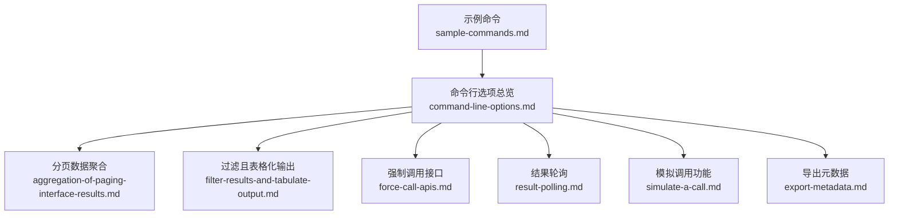
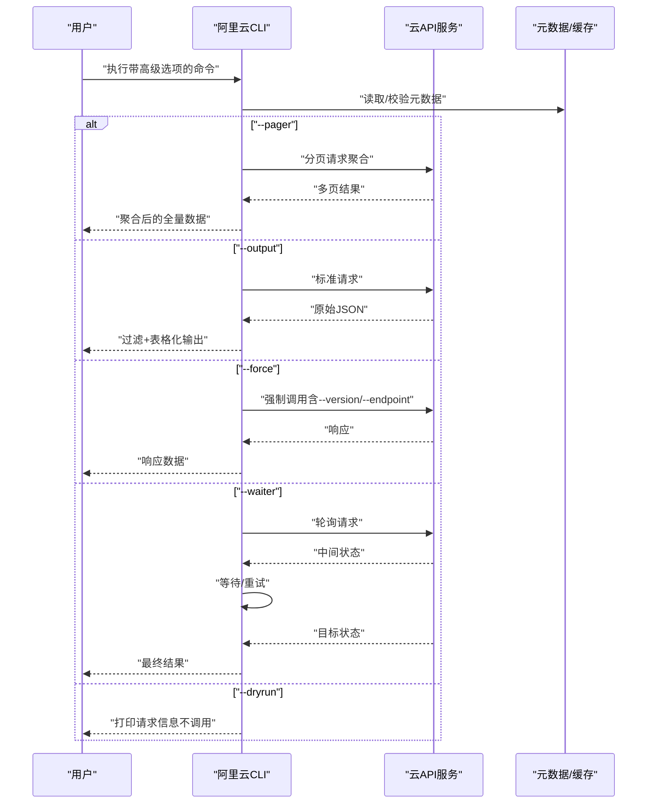
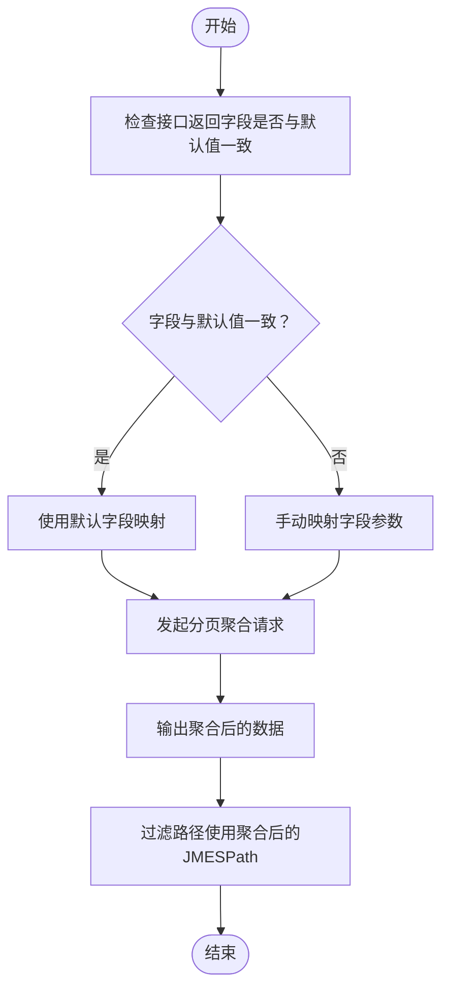
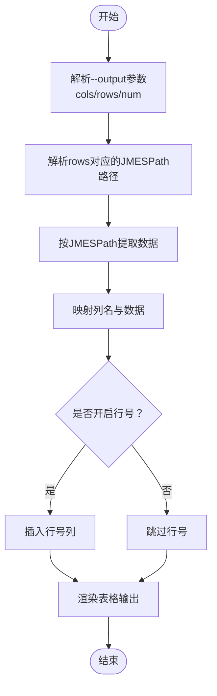
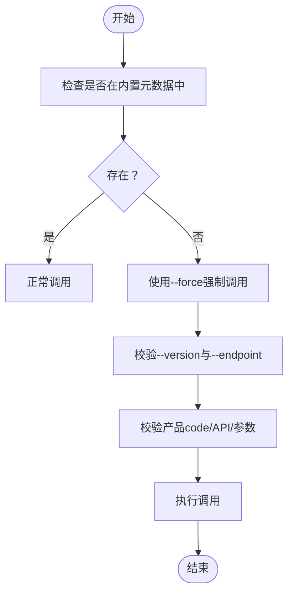
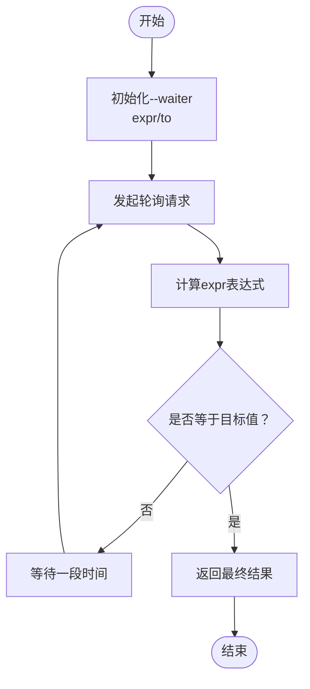
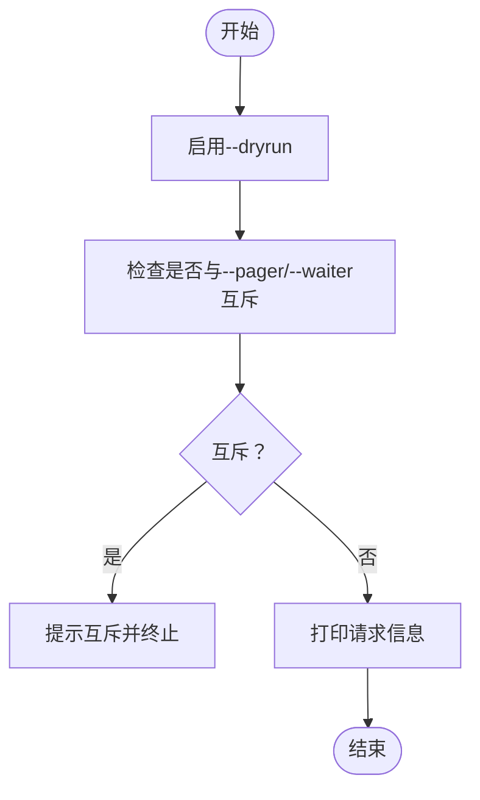
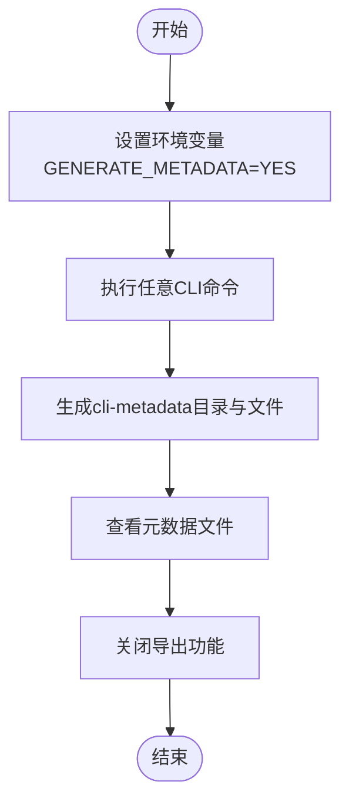
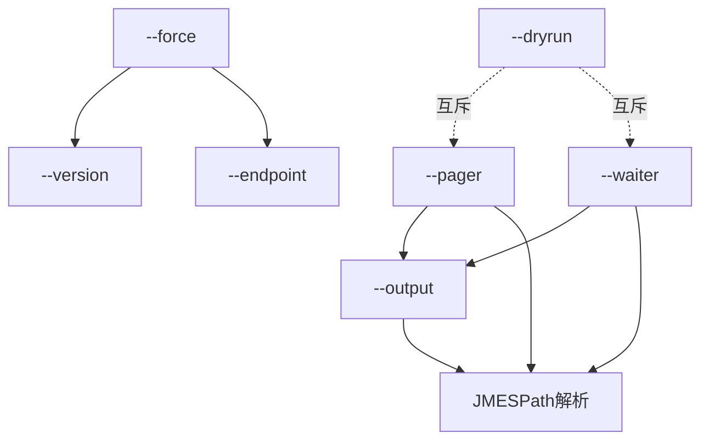

# 高级功能特性

<cite>
**本文引用的文件**
- [aggregation-of-paging-interface-results.md](file://alibaba-cloud/reference/05-使用阿里云CLI/aggregation-of-paging-interface-results.md)
- [filter-results-and-tabulate-output.md](file://alibaba-cloud/reference/05-使用阿里云CLI/filter-results-and-tabulate-output.md)
- [force-call-apis.md](file://alibaba-cloud/reference/05-使用阿里云CLI/force-call-apis.md)
- [result-polling.md](file://alibaba-cloud/reference/05-使用阿里云CLI/result-polling.md)
- [simulate-a-call.md](file://alibaba-cloud/reference/05-使用阿里云CLI/simulate-a-call.md)
- [export-metadata.md](file://alibaba-cloud/reference/05-使用阿里云CLI/export-metadata.md)
- [command-line-options.md](file://alibaba-cloud/reference/05-使用阿里云CLI/command-line-options.md)
- [sample-commands.md](file://alibaba-cloud/reference/05-使用阿里云CLI/sample-commands.md)
</cite>

## 目录
1. [简介](#简介)
2. [项目结构](#项目结构)
3. [核心组件](#核心组件)
4. [架构概览](#架构概览)
5. [详细组件分析](#详细组件分析)
6. [依赖分析](#依赖分析)
7. [性能考虑](#性能考虑)
8. [故障排查指南](#故障排查指南)
9. [结论](#结论)
10. [附录](#附录)

## 简介
本文件系统性梳理阿里云CLI的高级功能特性，围绕分页数据聚合、结果过滤与表格化输出、强制调用API、结果轮询、模拟调用以及元数据导出等能力，提供使用方法、字段映射规则、交互流程、最佳实践与排障建议。内容基于官方参考文档整理，便于不同技术背景的读者快速掌握并安全高效地使用阿里云CLI。

## 项目结构
阿里云CLI高级功能的文档分布在“使用阿里云CLI”章节下，涵盖分页聚合、过滤与表格化、强制调用、结果轮询、模拟调用、元数据导出等主题。命令行选项总览文档提供了统一的选项清单与链接，便于交叉查阅。

图表来源
- [command-line-options.md:1-37](file://alibaba-cloud/reference/05-使用阿里云CLI/command-line-options.md#L1-L37)
- [aggregation-of-paging-interface-results.md:1-37](file://alibaba-cloud/reference/05-使用阿里云CLI/aggregation-of-paging-interface-results.md#L1-L37)
- [filter-results-and-tabulate-output.md:1-69](file://alibaba-cloud/reference/05-使用阿里云CLI/filter-results-and-tabulate-output.md#L1-L69)
- [force-call-apis.md:1-27](file://alibaba-cloud/reference/05-使用阿里云CLI/force-call-apis.md#L1-L27)
- [result-polling.md:1-27](file://alibaba-cloud/reference/05-使用阿里云CLI/result-polling.md#L1-L27)
- [simulate-a-call.md:1-35](file://alibaba-cloud/reference/05-使用阿里云CLI/simulate-a-call.md#L1-L35)
- [export-metadata.md:1-86](file://alibaba-cloud/reference/05-使用阿里云CLI/export-metadata.md#L1-L86)
- [sample-commands.md:1-66](file://alibaba-cloud/reference/05-使用阿里云CLI/sample-commands.md#L1-L66)

章节来源
- [command-line-options.md:1-37](file://alibaba-cloud/reference/05-使用阿里云CLI/command-line-options.md#L1-L37)
- [sample-commands.md:1-66](file://alibaba-cloud/reference/05-使用阿里云CLI/sample-commands.md#L1-L66)

## 核心组件
- 分页数据聚合（--pager）
  - 作用：在调用分页类接口时一次性聚合全量数据，避免多次请求与拼接。
  - 字段映射：PageNumber、PageSize、TotalCount、NextToken、path（JMESPath路径）。
  - 使用建议：当接口返回字段与默认值不一致时，需手动映射字段参数；聚合后输出为聚合字段，过滤路径应使用聚合后的JMESPath路径。
- 结果过滤与表格化输出（--output）
  - 作用：通过JMESPath选择感兴趣字段并默认表格化输出。
  - 关键字段：cols（列名）、rows（JMESPath路径）、num（行号显示）。
  - 使用建议：对象类型数据列名需与键名一致；数组类型可自定义列名并通过索引映射。
- 强制调用API（--force）
  - 作用：绕过内置元数据限制，调用元数据列表外的API或参数。
  - 使用条件：需配合--version指定API版本，必要时通过--endpoint指定接入地址。
  - 使用建议：严格校验产品code、API名称、参数与版本，确保准确性。
- 结果轮询（--waiter）
  - 作用：对返回结果随时间变化的API进行轮询，直至目标字段达到期望值。
  - 关键字段：expr（JMESPath表达式）、to（目标值）。
  - 使用建议：结合具体业务状态字段，合理设置轮询策略。
- 模拟调用（--dryrun）
  - 作用：打印完整请求信息用于调试与验证，不实际操作云资源。
  - 互斥限制：与--pager、--waiter互斥。
  - 使用建议：在确认参数正确后再执行真实调用。
- 元数据导出（环境变量）
  - 作用：导出CLI命令与OpenAPI元数据，辅助调试与开发。
  - 步骤：设置环境变量、执行任意CLI命令、查看cli-metadata目录、关闭导出功能。
  - 使用建议：导出后及时关闭，避免泄露敏感信息。

章节来源
- [aggregation-of-paging-interface-results.md:1-37](file://alibaba-cloud/reference/05-使用阿里云CLI/aggregation-of-paging-interface-results.md#L1-L37)
- [filter-results-and-tabulate-output.md:1-69](file://alibaba-cloud/reference/05-使用阿里云CLI/filter-results-and-tabulate-output.md#L1-L69)
- [force-call-apis.md:1-27](file://alibaba-cloud/reference/05-使用阿里云CLI/force-call-apis.md#L1-L27)
- [result-polling.md:1-27](file://alibaba-cloud/reference/05-使用阿里云CLI/result-polling.md#L1-L27)
- [simulate-a-call.md:1-35](file://alibaba-cloud/reference/05-使用阿里云CLI/simulate-a-call.md#L1-L35)
- [export-metadata.md:1-86](file://alibaba-cloud/reference/05-使用阿里云CLI/export-metadata.md#L1-L86)

## 架构概览
下图展示了CLI高级功能在一次典型调用中的交互关系与数据流。

图表来源
- [command-line-options.md:14-37](file://alibaba-cloud/reference/05-使用阿里云CLI/command-line-options.md#L14-L37)
- [aggregation-of-paging-interface-results.md:3-18](file://alibaba-cloud/reference/05-使用阿里云CLI/aggregation-of-paging-interface-results.md#L3-L18)
- [filter-results-and-tabulate-output.md:3-14](file://alibaba-cloud/reference/05-使用阿里云CLI/filter-results-and-tabulate-output.md#L3-L14)
- [force-call-apis.md:3-13](file://alibaba-cloud/reference/05-使用阿里云CLI/force-call-apis.md#L3-L13)
- [result-polling.md:3-13](file://alibaba-cloud/reference/05-使用阿里云CLI/result-polling.md#L3-L13)
- [simulate-a-call.md:3-11](file://alibaba-cloud/reference/05-使用阿里云CLI/simulate-a-call.md#L3-L11)

## 详细组件分析

### 分页数据聚合（--pager）
- 功能要点
  - 默认仅返回单页结果；使用--pager可一次性获取全量数据。
  - 字段映射：PageNumber、PageSize、TotalCount、NextToken、path（JMESPath路径）。
  - 当接口返回字段与默认值不一致时，需手动映射字段参数，避免解析异常。
  - 聚合后仅输出聚合字段；过滤路径应使用聚合后的JMESPath路径。
- 使用示例
  - 完整指定字段：在命令中明确指定各字段映射。
  - 使用默认值简化命令：若字段与默认值一致，可省略字段声明。
- 最佳实践
  - 在调用前先确认接口返回结构，必要时手动映射字段。
  - 对于大列表场景，谨慎使用--pager，避免一次性拉取过多数据导致内存压力。
  - 如需进一步筛选，建议在聚合后再配合--output进行过滤与表格化。

图表来源
- [aggregation-of-paging-interface-results.md:7-18](file://alibaba-cloud/reference/05-使用阿里云CLI/aggregation-of-paging-interface-results.md#L7-L18)
- [aggregation-of-paging-interface-results.md:20-36](file://alibaba-cloud/reference/05-使用阿里云CLI/aggregation-of-paging-interface-results.md#L20-L36)

章节来源
- [aggregation-of-paging-interface-results.md:1-37](file://alibaba-cloud/reference/05-使用阿里云CLI/aggregation-of-paging-interface-results.md#L1-L37)

### 结果过滤与表格化输出（--output）
- 功能要点
  - 通过--output提取感兴趣字段并默认表格化输出。
  - cols：表格列名，对象类型需与键名一致，数组类型可自定义列名并配合索引。
  - rows：JMESPath路径，指定表格行在JSON结果中的数据来源。
  - num：开启行号显示（true/false）。
- 使用示例
  - 根元素字段过滤：直接指定列名。
  - 嵌套字段过滤：指定rows指向数组元素。
  - 数组类型字段过滤：通过索引映射数组元素到列。
- 最佳实践
  - 对象类型数据列名与键名保持一致，避免列名不匹配。
  - 数组类型列名自定义时，务必为每个列提供索引，确保数据对齐。
  - 输出行号可提升调试效率，但可能影响自动化处理，需按场景取舍。

图表来源
- [filter-results-and-tabulate-output.md:5-14](file://alibaba-cloud/reference/05-使用阿里云CLI/filter-results-and-tabulate-output.md#L5-L14)
- [filter-results-and-tabulate-output.md:15-69](file://alibaba-cloud/reference/05-使用阿里云CLI/filter-results-and-tabulate-output.md#L15-L69)

章节来源
- [filter-results-and-tabulate-output.md:1-69](file://alibaba-cloud/reference/05-使用阿里云CLI/filter-results-and-tabulate-output.md#L1-L69)

### 强制调用API（--force）
- 功能要点
  - 绕过内置元数据限制，调用元数据列表外的API或参数。
  - 必须配合--version指定API版本；必要时通过--endpoint指定接入地址。
  - 需要严格校验产品code、API名称、参数与版本，确保准确性。
- 使用示例
  - CMS产品在不同版本中接口名称不同，可通过--force与--version组合调用。
- 最佳实践
  - 在使用--force前，先通过--help确认产品与API信息。
  - 明确API版本与接入地址，避免因版本不匹配导致调用失败。
  - 仅在确有需要时使用--force，优先使用内置元数据以降低风险。

图表来源
- [force-call-apis.md:5-13](file://alibaba-cloud/reference/05-使用阿里云CLI/force-call-apis.md#L5-L13)
- [force-call-apis.md:14-27](file://alibaba-cloud/reference/05-使用阿里云CLI/force-call-apis.md#L14-L27)

章节来源
- [force-call-apis.md:1-27](file://alibaba-cloud/reference/05-使用阿里云CLI/force-call-apis.md#L1-L27)

### 结果轮询（--waiter）
- 功能要点
  - 对返回结果随时间变化的API进行轮询，直至目标字段达到期望值。
  - 关键字段：expr（JMESPath表达式）、to（目标值）。
- 使用示例
  - 创建实例后轮询实例状态，直到变为Running。
- 最佳实践
  - 选择合适的轮询字段与目标值，避免误判。
  - 合理设置轮询间隔与超时，平衡响应速度与成本。

图表来源
- [result-polling.md:5-13](file://alibaba-cloud/reference/05-使用阿里云CLI/result-polling.md#L5-L13)
- [result-polling.md:14-27](file://alibaba-cloud/reference/05-使用阿里云CLI/result-polling.md#L14-L27)

章节来源
- [result-polling.md:1-27](file://alibaba-cloud/reference/05-使用阿里云CLI/result-polling.md#L1-L27)

### 模拟调用（--dryrun）
- 功能要点
  - 打印完整请求信息用于调试与验证，不实际操作云资源。
  - 与--pager、--waiter互斥，不可同时使用。
- 使用示例
  - 执行--dryrun查看请求头、参数与签名等信息。
- 最佳实践
  - 在确认参数正确后再执行真实调用。
  - 注意不要在--dryrun模式下使用互斥选项。

图表来源
- [simulate-a-call.md:5-11](file://alibaba-cloud/reference/05-使用阿里云CLI/simulate-a-call.md#L5-L11)
- [simulate-a-call.md:12-35](file://alibaba-cloud/reference/05-使用阿里云CLI/simulate-a-call.md#L12-L35)

章节来源
- [simulate-a-call.md:1-35](file://alibaba-cloud/reference/05-使用阿里云CLI/simulate-a-call.md#L1-L35)

### 元数据导出（环境变量）
- 功能要点
  - 导出CLI命令与OpenAPI元数据，辅助调试与开发。
  - 生成文件包含产品列表、API定义、语言版本与CLI版本等。
- 使用步骤
  - 设置环境变量GENERATE_METADATA=YES。
  - 执行任意CLI命令，生成cli-metadata目录。
  - 查看生成的元数据文件，结束后关闭导出功能。
- 最佳实践
  - 导出后及时关闭，避免泄露敏感信息。
  - 建议升级到最新版本后再导出，确保元数据一致性。

图表来源
- [export-metadata.md:12-42](file://alibaba-cloud/reference/05-使用阿里云CLI/export-metadata.md#L12-L42)
- [export-metadata.md:44-67](file://alibaba-cloud/reference/05-使用阿里云CLI/export-metadata.md#L44-L67)
- [export-metadata.md:69-86](file://alibaba-cloud/reference/05-使用阿里云CLI/export-metadata.md#L69-L86)

章节来源
- [export-metadata.md:1-86](file://alibaba-cloud/reference/05-使用阿里云CLI/export-metadata.md#L1-L86)

## 依赖分析
- 选项耦合关系
  - --pager与--output：先聚合再过滤，路径需使用聚合后的JMESPath。
  - --force与--version/--endpoint：强制调用必须提供版本与接入地址信息。
  - --waiter与--output：轮询后可继续表格化输出。
  - --dryrun与--pager/--waiter：互斥，不可同时使用。
- 数据流依赖
  - --output依赖JMESPath解析与表格渲染。
  - --pager依赖分页字段映射与聚合逻辑。
  - --waiter依赖轮询策略与目标值判断。
  - --force依赖外部API版本与接入地址配置。
  - --dryrun依赖请求构建与打印输出。

图表来源
- [command-line-options.md:14-37](file://alibaba-cloud/reference/05-使用阿里云CLI/command-line-options.md#L14-L37)
- [aggregation-of-paging-interface-results.md:3-18](file://alibaba-cloud/reference/05-使用阿里云CLI/aggregation-of-paging-interface-results.md#L3-L18)
- [filter-results-and-tabulate-output.md:3-14](file://alibaba-cloud/reference/05-使用阿里云CLI/filter-results-and-tabulate-output.md#L3-L14)
- [force-call-apis.md:3-13](file://alibaba-cloud/reference/05-使用阿里云CLI/force-call-apis.md#L3-L13)
- [result-polling.md:3-13](file://alibaba-cloud/reference/05-使用阿里云CLI/result-polling.md#L3-L13)
- [simulate-a-call.md:3-11](file://alibaba-cloud/reference/05-使用阿里云CLI/simulate-a-call.md#L3-L11)

章节来源
- [command-line-options.md:14-37](file://alibaba-cloud/reference/05-使用阿里云CLI/command-line-options.md#L14-L37)

## 性能考虑
- 分页聚合
  - 大列表场景建议评估内存占用与网络传输，必要时结合--output进行二次过滤。
  - 对于频繁调用的场景，可考虑缓存聚合结果或分批处理。
- 过滤与表格化
  - 复杂JMESPath表达式可能增加解析开销，建议优化表达式结构。
  - 行号显示会增加额外处理，生产环境中可关闭以提升性能。
- 强制调用
  - 仅在确有需要时使用--force，避免绕过元数据校验带来的潜在性能与稳定性问题。
- 结果轮询
  - 合理设置轮询间隔与超时，避免过度轮询造成资源浪费。
- 模拟调用
  - --dryrun不涉及实际调用，性能开销极低，适合高频调试。
- 元数据导出
  - 导出过程会产生文件写入，建议在空闲时段执行并及时清理。

## 故障排查指南
- 分页聚合
  - 现象：聚合后字段缺失或解析异常。
  - 排查：确认接口返回字段与默认值是否一致，手动映射字段参数。
  - 参考：字段映射规则与示例。
- 过滤与表格化
  - 现象：列名不匹配或数组索引错误。
  - 排查：对象类型列名需与键名一致；数组类型需为每个列提供索引。
  - 参考：--output字段说明与示例。
- 强制调用
  - 现象：unknown api或unknown parameter错误。
  - 排查：确认产品code、API名称、参数与版本；必要时指定--endpoint。
  - 参考：--force使用说明与示例。
- 结果轮询
  - 现象：轮询无响应或目标值不匹配。
  - 排查：检查expr表达式与to目标值；确认轮询字段是否随时间变化。
  - 参考：--waiter字段说明与示例。
- 模拟调用
  - 现象：--dryrun与其他选项冲突。
  - 排查：移除--pager或--waiter后再使用--dryrun。
  - 参考：互斥限制说明。
- 元数据导出
  - 现象：导出失败或文件缺失。
  - 排查：确认环境变量设置正确；检查工作目录权限；升级CLI版本后重试。
  - 参考：导出步骤与注意事项。

章节来源
- [aggregation-of-paging-interface-results.md:17-18](file://alibaba-cloud/reference/05-使用阿里云CLI/aggregation-of-paging-interface-results.md#L17-L18)
- [filter-results-and-tabulate-output.md:11-13](file://alibaba-cloud/reference/05-使用阿里云CLI/filter-results-and-tabulate-output.md#L11-L13)
- [force-call-apis.md:7-12](file://alibaba-cloud/reference/05-使用阿里云CLI/force-call-apis.md#L7-L12)
- [result-polling.md:11-12](file://alibaba-cloud/reference/05-使用阿里云CLI/result-polling.md#L11-L12)
- [simulate-a-call.md:7-11](file://alibaba-cloud/reference/05-使用阿里云CLI/simulate-a-call.md#L7-L11)
- [export-metadata.md:5-10](file://alibaba-cloud/reference/05-使用阿里云CLI/export-metadata.md#L5-L10)

## 结论
阿里云CLI的高级功能为复杂场景提供了强大的支撑：分页聚合简化了全量数据获取；过滤与表格化提升了可观测性；强制调用扩展了API覆盖范围；结果轮询保障了异步任务的可观测性；模拟调用与元数据导出则为调试与开发提供了便利。建议在实际使用中结合业务场景，遵循最佳实践，谨慎选择选项组合，确保安全性与效率的平衡。

## 附录
- 命令行选项总览
  - 包含--profile、--region、--endpoint、--endpoint-type、--version、--header、--body、--body-file、--read-timeout、--connect-timeout、--retry-count、--secure、--insecure、--quiet、--help、--output、--pager、--force、--waiter、--dryrun等选项。
- 示例命令
  - 展示如何在OpenAPI门户生成CLI命令示例，并在本地Shell中运行。

章节来源
- [command-line-options.md:14-37](file://alibaba-cloud/reference/05-使用阿里云CLI/command-line-options.md#L14-L37)
- [sample-commands.md:14-40](file://alibaba-cloud/reference/05-使用阿里云CLI/sample-commands.md#L14-L40)