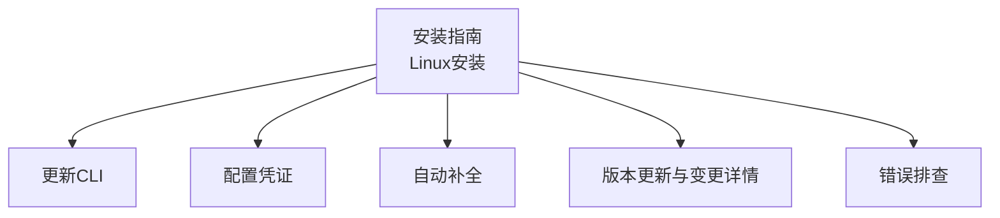
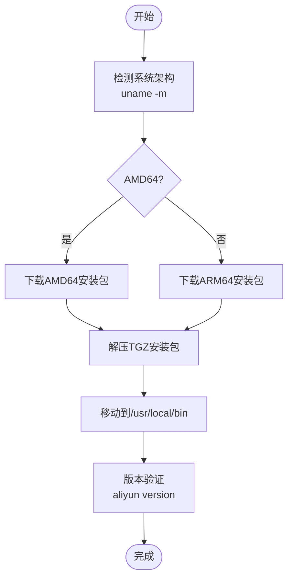
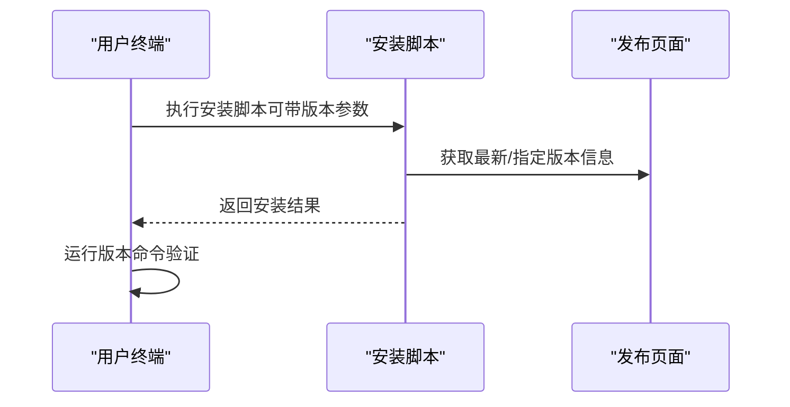
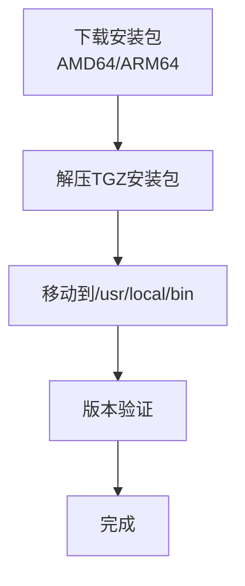
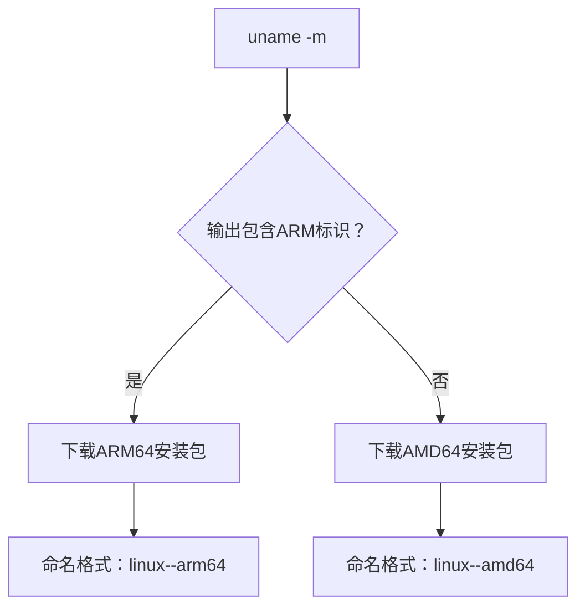
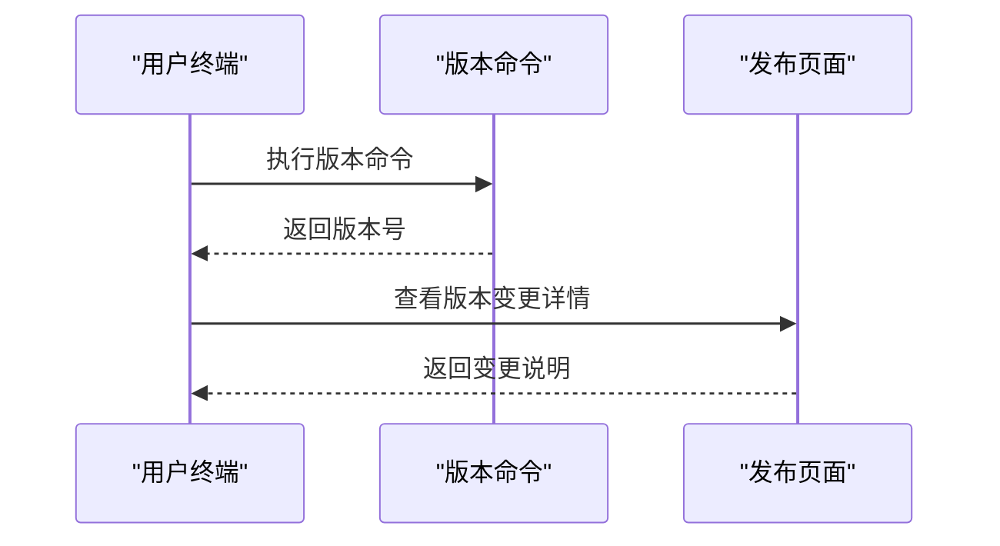
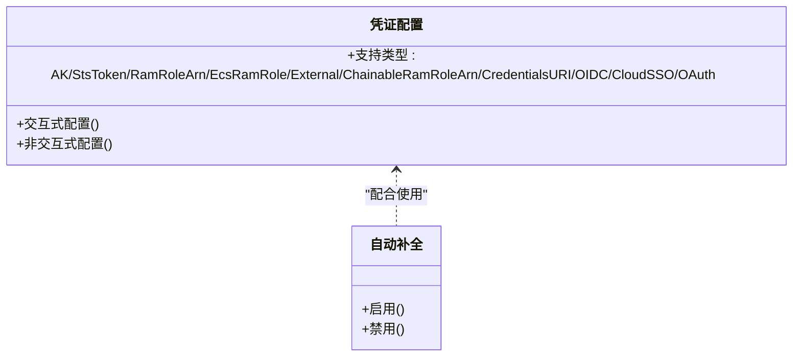
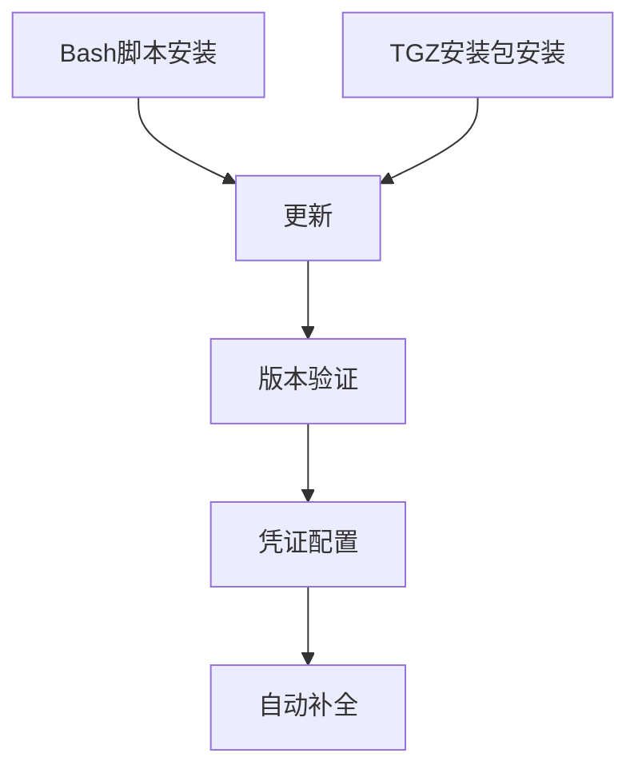
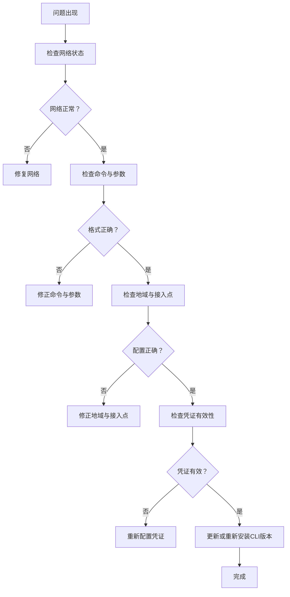

# Linux系统安装

<cite>
**本文引用的文件**
- [install-cli-on-linux.md](file://alibaba-cloud/reference/03-安装指南/install-cli-on-linux.md)
- [update-cli.md](file://alibaba-cloud/reference/03-安装指南/update-cli.md)
- [configure-credentials.md](file://alibaba-cloud/reference/04-配置阿里云CLI/configure-credentials.md)
- [auto-completion-function.md](file://alibaba-cloud/reference/04-配置阿里云CLI/auto-completion-function.md)
- [cli-troubleshooting.md](file://alibaba-cloud/reference/08-错误排查/cli-troubleshooting.md)
- [view-version-update-and-change-details.md](file://alibaba-cloud/reference/09-版本更新/view-version-update-and-change-details.md)
</cite>

## 目录
1. [简介](#简介)
2. [项目结构](#项目结构)
3. [核心组件](#核心组件)
4. [架构总览](#架构总览)
5. [详细组件分析](#详细组件分析)
6. [依赖关系分析](#依赖关系分析)
7. [性能考虑](#性能考虑)
8. [故障排查指南](#故障排查指南)
9. [结论](#结论)
10. [附录](#附录)

## 简介
本指南面向在Linux系统上安装阿里云CLI的用户，提供两种安装方式的完整流程：通过Bash脚本安装与通过TGZ安装包安装。内容涵盖架构检测（AMD64/ARM64）、下载安装包、解压安装包、配置全局调用、版本验证以及历史版本安装方法。同时给出版本更新、自动补全、常见问题排查等实用建议，帮助用户根据自身发行版与架构选择最合适的安装方式。

## 项目结构
本指南涉及的文档主要分布在“安装指南”“配置阿里云CLI”“版本更新”“错误排查”等子目录中，围绕Linux安装、更新、配置与排错形成完整的知识体系。

**章节来源**
- [install-cli-on-linux.md:1-93](file://alibaba-cloud/reference/03-安装指南/install-cli-on-linux.md#L1-L93)
- [update-cli.md:1-126](file://alibaba-cloud/reference/03-安装指南/update-cli.md#L1-L126)
- [configure-credentials.md:1-862](file://alibaba-cloud/reference/04-配置阿里云CLI/configure-credentials.md#L1-L862)
- [auto-completion-function.md:1-55](file://alibaba-cloud/reference/04-配置阿里云CLI/auto-completion-function.md#L1-L55)
- [view-version-update-and-change-details.md:1-80](file://alibaba-cloud/reference/09-版本更新/view-version-update-and-change-details.md#L1-L80)
- [cli-troubleshooting.md:1-111](file://alibaba-cloud/reference/08-错误排查/cli-troubleshooting.md#L1-L111)

## 核心组件
- 架构检测：通过系统命令识别AMD64或ARM64，指导下载对应安装包。
- Bash脚本安装：一键安装最新版本，支持指定历史版本与查看帮助。
- TGZ安装包安装：下载对应架构的安装包，解压后移动到系统路径实现全局调用。
- 版本验证：通过版本命令确认安装成功与版本号。
- 更新与卸载：遵循与初始安装方式一致的更新渠道，必要时卸载后重装。
- 凭证配置：安装完成后进行身份凭证配置，支持多种凭证类型与交互/非交互方式。
- 自动补全：在Linux/macOS上启用/禁用命令自动补全，提升使用效率。
- 故障排查：网络、命令格式、地域接入点、凭证有效性等问题的排查步骤。

**章节来源**
- [install-cli-on-linux.md:37-93](file://alibaba-cloud/reference/03-安装指南/install-cli-on-linux.md#L37-L93)
- [update-cli.md:18-56](file://alibaba-cloud/reference/03-安装指南/update-cli.md#L18-L56)
- [configure-credentials.md:11-800](file://alibaba-cloud/reference/04-配置阿里云CLI/configure-credentials.md#L11-L800)
- [auto-completion-function.md:5-18](file://alibaba-cloud/reference/04-配置阿里云CLI/auto-completion-function.md#L5-L18)
- [cli-troubleshooting.md:7-111](file://alibaba-cloud/reference/08-错误排查/cli-troubleshooting.md#L7-L111)

## 架构总览
Linux安装流程的关键在于“架构检测—下载—解压—全局调用—版本验证”。Bash脚本安装与TGZ安装包安装在架构检测与版本验证环节保持一致，差异主要体现在下载与部署细节。

**图表来源**
- [install-cli-on-linux.md:39-78](file://alibaba-cloud/reference/03-安装指南/install-cli-on-linux.md#L39-L78)
- [update-cli.md:34-56](file://alibaba-cloud/reference/03-安装指南/update-cli.md#L34-L56)

**章节来源**
- [install-cli-on-linux.md:39-78](file://alibaba-cloud/reference/03-安装指南/install-cli-on-linux.md#L39-L78)
- [update-cli.md:34-56](file://alibaba-cloud/reference/03-安装指南/update-cli.md#L34-L56)

## 详细组件分析

### 组件A：通过Bash脚本安装
- 安装最新版本：直接执行安装脚本，脚本默认获取并安装最新可用版本。
- 安装历史版本：通过选项指定版本号，访问发布页面查看历史版本。
- 显示帮助：通过选项查看安装脚本的帮助信息。
- 更新方式：同样使用同一脚本进行更新，保持安装方式一致性。

**图表来源**
- [install-cli-on-linux.md:9-35](file://alibaba-cloud/reference/03-安装指南/install-cli-on-linux.md#L9-L35)
- [update-cli.md:24-32](file://alibaba-cloud/reference/03-安装指南/update-cli.md#L24-L32)

**章节来源**
- [install-cli-on-linux.md:9-35](file://alibaba-cloud/reference/03-安装指南/install-cli-on-linux.md#L9-L35)
- [update-cli.md:24-32](file://alibaba-cloud/reference/03-安装指南/update-cli.md#L24-L32)

### 组件B：通过TGZ安装包安装
- 下载安装包：根据架构选择AMD64或ARM64的最新版本安装包。
- 历史版本：访问发布页面下载历史版本安装包，命名格式包含版本与架构。
- 解压安装包：在安装包所在目录解压，得到可执行文件。
- 配置全局调用：将可执行文件移动到系统路径，实现全局调用。
- 版本验证：执行版本命令确认安装成功与版本号。

**图表来源**
- [install-cli-on-linux.md:39-78](file://alibaba-cloud/reference/03-安装指南/install-cli-on-linux.md#L39-L78)

**章节来源**
- [install-cli-on-linux.md:39-78](file://alibaba-cloud/reference/03-安装指南/install-cli-on-linux.md#L39-L78)

### 组件C：架构检测与下载
- 架构检测：通过系统命令查看架构，若输出为特定ARM标识则为ARM64，否则为AMD64。
- 下载链接：分别提供AMD64与ARM64的最新版本安装包下载命令。
- 历史版本：通过发布页面下载历史版本安装包，命名格式包含版本与架构。

**图表来源**
- [install-cli-on-linux.md:43-62](file://alibaba-cloud/reference/03-安装指南/install-cli-on-linux.md#L43-L62)
- [update-cli.md:36-51](file://alibaba-cloud/reference/03-安装指南/update-cli.md#L36-L51)

**章节来源**
- [install-cli-on-linux.md:43-62](file://alibaba-cloud/reference/03-安装指南/install-cli-on-linux.md#L43-L62)
- [update-cli.md:36-51](file://alibaba-cloud/reference/03-安装指南/update-cli.md#L36-L51)

### 组件D：版本验证与更新
- 版本验证：执行版本命令查看当前安装版本，确认安装成功。
- 版本更新：遵循初始安装方式，使用脚本或安装包进行更新。
- 变更详情：通过发布页面查看版本变更与API元数据变更。

**图表来源**
- [install-cli-on-linux.md:80-92](file://alibaba-cloud/reference/03-安装指南/install-cli-on-linux.md#L80-L92)
- [view-version-update-and-change-details.md:9-13](file://alibaba-cloud/reference/09-版本更新/view-version-update-and-change-details.md#L9-L13)

**章节来源**
- [install-cli-on-linux.md:80-92](file://alibaba-cloud/reference/03-安装指南/install-cli-on-linux.md#L80-L92)
- [view-version-update-and-change-details.md:9-13](file://alibaba-cloud/reference/09-版本更新/view-version-update-and-change-details.md#L9-L13)

### 组件E：凭证配置与自动补全
- 凭证配置：支持交互式与非交互式配置，涵盖多种凭证类型与参数。
- 自动补全：在Linux/macOS上启用/禁用命令自动补全，提升使用效率。

**图表来源**
- [configure-credentials.md:11-800](file://alibaba-cloud/reference/04-配置阿里云CLI/configure-credentials.md#L11-L800)
- [auto-completion-function.md:5-18](file://alibaba-cloud/reference/04-配置阿里云CLI/auto-completion-function.md#L5-L18)

**章节来源**
- [configure-credentials.md:11-800](file://alibaba-cloud/reference/04-配置阿里云CLI/configure-credentials.md#L11-L800)
- [auto-completion-function.md:5-18](file://alibaba-cloud/reference/04-配置阿里云CLI/auto-completion-function.md#L5-L18)

## 依赖关系分析
- 安装方式依赖：Bash脚本安装与TGZ安装包安装在架构检测与版本验证上保持一致，差异在于下载与部署细节。
- 更新依赖：更新时需遵循初始安装方式，避免版本混淆与兼容性问题。
- 配置依赖：安装完成后进行凭证配置，支持多种凭证类型与交互/非交互方式。
- 工具依赖：自动补全功能在Linux/macOS上可用，便于提升使用效率。

**图表来源**
- [install-cli-on-linux.md:9-92](file://alibaba-cloud/reference/03-安装指南/install-cli-on-linux.md#L9-L92)
- [update-cli.md:18-56](file://alibaba-cloud/reference/03-安装指南/update-cli.md#L18-L56)
- [configure-credentials.md:11-800](file://alibaba-cloud/reference/04-配置阿里云CLI/configure-credentials.md#L11-L800)
- [auto-completion-function.md:5-18](file://alibaba-cloud/reference/04-配置阿里云CLI/auto-completion-function.md#L5-L18)

**章节来源**
- [install-cli-on-linux.md:9-92](file://alibaba-cloud/reference/03-安装指南/install-cli-on-linux.md#L9-L92)
- [update-cli.md:18-56](file://alibaba-cloud/reference/03-安装指南/update-cli.md#L18-L56)
- [configure-credentials.md:11-800](file://alibaba-cloud/reference/04-配置阿里云CLI/configure-credentials.md#L11-L800)
- [auto-completion-function.md:5-18](file://alibaba-cloud/reference/04-配置阿里云CLI/auto-completion-function.md#L5-L18)

## 性能考虑
- 安装性能：Bash脚本安装通常更快捷，适合快速部署；TGZ安装包适合需要精确控制安装路径与版本的场景。
- 更新性能：遵循初始安装方式更新，避免重复下载与覆盖带来的额外开销。
- 使用性能：启用自动补全可减少命令输入时间，提升整体使用效率。

## 故障排查指南
- 网络问题：检查网络状态，确保可访问阿里云API。
- 命令与参数：核对命令与参数格式，必要时使用模拟调用查看请求详情。
- 地域与接入点：确认地域与接入点优先级，避免因配置不当导致调用失败。
- 凭证有效性：检查当前使用的配置、保存的凭证信息与凭证模式，确保具备访问权限。
- 版本不一致：若版本命令返回的版本与安装的版本不同，建议重新安装或更新到最新版本。

**图表来源**
- [cli-troubleshooting.md:7-111](file://alibaba-cloud/reference/08-错误排查/cli-troubleshooting.md#L7-L111)

**章节来源**
- [cli-troubleshooting.md:7-111](file://alibaba-cloud/reference/08-错误排查/cli-troubleshooting.md#L7-L111)

## 结论
通过Bash脚本安装与TGZ安装包安装两种方式，均可在Linux系统上完成阿里云CLI的安装与更新。关键在于正确的架构检测、下载与部署、全局调用配置与版本验证。安装完成后，结合凭证配置与自动补全功能，可进一步提升使用效率。遇到问题时，遵循故障排查步骤可快速定位并解决问题。

## 附录
- 历史版本下载：访问发布页面，按命名格式选择对应版本与架构的安装包。
- 发布页面：查看版本变更与API元数据变更，了解功能演进与兼容性变化。

**章节来源**
- [install-cli-on-linux.md:60-62](file://alibaba-cloud/reference/03-安装指南/install-cli-on-linux.md#L60-L62)
- [view-version-update-and-change-details.md:9-13](file://alibaba-cloud/reference/09-版本更新/view-version-update-and-change-details.md#L9-L13)