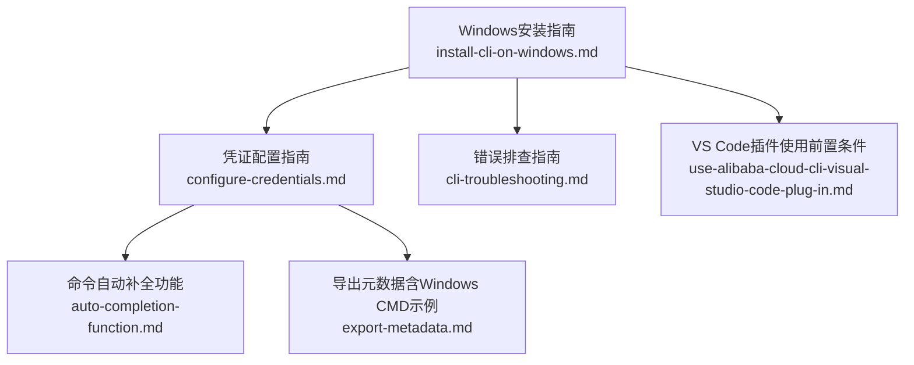
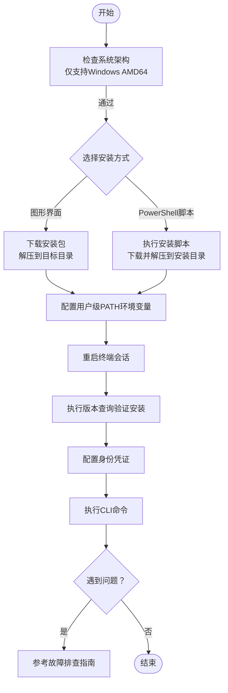
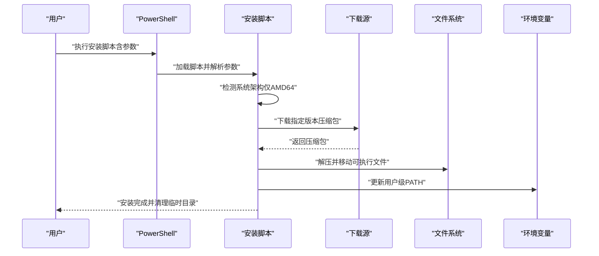
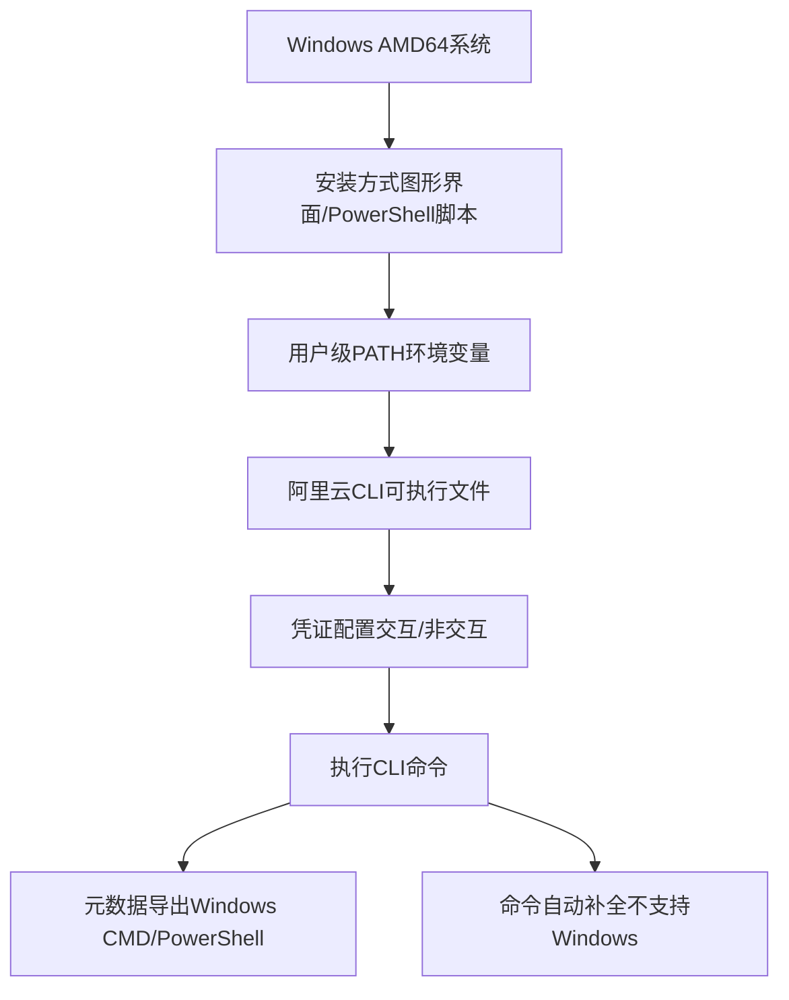

# Windows系统安装

<cite>
**本文引用的文件**
- [install-cli-on-windows.md](file://alibaba-cloud/reference/03-安装指南/install-cli-on-windows.md)
- [configure-credentials.md](file://alibaba-cloud/reference/04-配置阿里云CLI/configure-credentials.md)
- [cli-troubleshooting.md](file://alibaba-cloud/reference/08-错误排查/cli-troubleshooting.md)
- [auto-completion-function.md](file://alibaba-cloud/reference/04-配置阿里云CLI/auto-completion-function.md)
- [export-metadata.md](file://alibaba-cloud/reference/05-使用阿里云CLI/export-metadata.md)
- [use-alibaba-cloud-cli-visual-studio-code-plug-in.md](file://alibaba-cloud/reference/02-快速入门/use-alibaba-cloud-cli-visual-studio-code-plug-in.md)
</cite>

## 目录
1. [简介](#简介)
2. [项目结构](#项目结构)
3. [核心组件](#核心组件)
4. [架构总览](#架构总览)
5. [详细组件分析](#详细组件分析)
6. [依赖关系分析](#依赖关系分析)
7. [性能考虑](#性能考虑)
8. [故障排查指南](#故障排查指南)
9. [结论](#结论)
10. [附录](#附录)

## 简介
本指南面向Windows平台用户提供阿里云CLI的完整安装与配置流程，覆盖图形界面安装与PowerShell脚本安装两种方式，并补充Windows CMD命令行环境的安装要点。文档还包含版本选择、安装路径配置、环境变量设置、安装验证方法以及常见问题排查建议，帮助用户在Windows系统上顺利完成阿里云CLI的安装与使用。

## 项目结构
本仓库中与Windows安装直接相关的核心文档位于“安装指南”和“配置阿里云CLI”两大主题下，分别负责安装步骤与安装后的凭证配置。此外，“错误排查”“命令自动补全”“导出元数据”等文档为安装后的使用与维护提供辅助能力。

图表来源
- [install-cli-on-windows.md:1-160](file://alibaba-cloud/reference/03-安装指南/install-cli-on-windows.md#L1-L160)
- [configure-credentials.md:1-862](file://alibaba-cloud/reference/04-配置阿里云CLI/configure-credentials.md#L1-L862)
- [cli-troubleshooting.md:1-111](file://alibaba-cloud/reference/08-错误排查/cli-troubleshooting.md#L1-L111)
- [auto-completion-function.md:1-55](file://alibaba-cloud/reference/04-配置阿里云CLI/auto-completion-function.md#L1-L55)
- [export-metadata.md:20-86](file://alibaba-cloud/reference/05-使用阿里云CLI/export-metadata.md#L20-L86)
- [use-alibaba-cloud-cli-visual-studio-code-plug-in.md:1-67](file://alibaba-cloud/reference/02-快速入门/use-alibaba-cloud-cli-visual-studio-code-plug-in.md#L1-L67)

章节来源
- [install-cli-on-windows.md:1-160](file://alibaba-cloud/reference/03-安装指南/install-cli-on-windows.md#L1-L160)

## 核心组件
- Windows图形界面安装：下载压缩包、解压可执行文件、配置用户级环境变量PATH、重启终端后验证版本。
- PowerShell脚本安装：支持指定版本与安装目录，自动检测系统架构，下载并解压，更新用户级PATH，清理临时目录。
- CMD命令行安装：通过PowerShell脚本安装时，使用Windows CMD调用PowerShell脚本的方式执行安装。
- 凭证配置：提供交互式与非交互式两种方式，支持多种凭证类型（AK、StsToken、RamRoleArn、EcsRamRole、External、ChainableRamRoleArn、CredentialsURI、OIDC、CloudSSO、OAuth）。
- 安装验证：通过执行版本查询命令验证安装结果。
- 故障排查：涵盖网络、命令格式、地域接入点、请求详情、凭证有效性、版本更新等常见问题。

章节来源
- [install-cli-on-windows.md:13-160](file://alibaba-cloud/reference/03-安装指南/install-cli-on-windows.md#L13-L160)
- [configure-credentials.md:15-800](file://alibaba-cloud/reference/04-配置阿里云CLI/configure-credentials.md#L15-L800)
- [cli-troubleshooting.md:7-111](file://alibaba-cloud/reference/08-错误排查/cli-troubleshooting.md#L7-L111)

## 架构总览
下图展示了Windows环境下安装与使用阿里云CLI的整体流程：从下载安装包或执行PowerShell脚本，到配置环境变量与凭证，再到执行命令与故障排查。

图表来源
- [install-cli-on-windows.md:7-30](file://alibaba-cloud/reference/03-安装指南/install-cli-on-windows.md#L7-L30)
- [install-cli-on-windows.md:31-146](file://alibaba-cloud/reference/03-安装指南/install-cli-on-windows.md#L31-L146)
- [install-cli-on-windows.md:147-160](file://alibaba-cloud/reference/03-安装指南/install-cli-on-windows.md#L147-L160)
- [configure-credentials.md:15-63](file://alibaba-cloud/reference/04-配置阿里云CLI/configure-credentials.md#L15-L63)
- [cli-troubleshooting.md:7-86](file://alibaba-cloud/reference/08-错误排查/cli-troubleshooting.md#L7-L86)

## 详细组件分析

### 图形界面安装（Windows）
- 步骤概览
  - 下载最新版本或历史版本安装包（Windows AMD64格式）。
  - 解压可执行文件到期望目录（安装目录）。
  - 配置用户级PATH环境变量，将安装目录加入PATH。
  - 重启终端会话，执行版本查询命令验证安装。
- 关键注意事项
  - 仅支持Windows AMD64架构，32位系统不支持。
  - 可执行文件需通过命令行终端运行，双击无效。
  - 环境变量修改为用户级，避免管理员权限限制。
- 验证方法
  - 重启终端后执行版本查询命令，返回版本号即为成功。

章节来源
- [install-cli-on-windows.md:13-30](file://alibaba-cloud/reference/03-安装指南/install-cli-on-windows.md#L13-L30)
- [install-cli-on-windows.md:147-160](file://alibaba-cloud/reference/03-安装指南/install-cli-on-windows.md#L147-L160)

### PowerShell脚本安装（Windows）
- 功能特性
  - 支持指定版本与安装目录，默认安装到用户本地目录。
  - 自动检测系统架构（仅AMD64），否则报错退出。
  - 下载压缩包、解压、移动可执行文件到安装目录。
  - 更新用户级PATH环境变量（HKCU），并同步当前进程PATH。
  - 清理临时目录，避免残留文件。
- 命令示例与参数
  - 默认安装最新版本到用户本地目录。
  - 指定版本与安装目录。
  - 显示帮助信息。
- 注意事项
  - 需要允许执行PowerShell脚本（ExecutionPolicy）。
  - 安装目录应避免包含空格或特殊字符，减少路径问题。

图表来源
- [install-cli-on-windows.md:31-146](file://alibaba-cloud/reference/03-安装指南/install-cli-on-windows.md#L31-L146)

章节来源
- [install-cli-on-windows.md:31-146](file://alibaba-cloud/reference/03-安装指南/install-cli-on-windows.md#L31-L146)

### CMD命令行安装（Windows）
- 安装方式
  - 通过Windows CMD调用PowerShell脚本执行安装，本质与PowerShell安装一致。
  - 需要在CMD中以PowerShell命令形式调用脚本文件。
- 环境变量与路径
  - 安装脚本会自动更新用户级PATH，无需手动配置。
  - 若需手动配置，可在系统设置中添加安装目录到用户PATH。
- 验证方法
  - 重启终端后执行版本查询命令验证安装。

章节来源
- [install-cli-on-windows.md:125-146](file://alibaba-cloud/reference/03-安装指南/install-cli-on-windows.md#L125-L146)

### 凭证配置（Windows）
- 配置方式
  - 交互式配置：通过命令引导逐步填写凭证信息。
  - 非交互式配置：通过命令行参数一次性设置凭证。
- 支持的凭证类型
  - AK、StsToken、RamRoleArn、EcsRamRole、External、ChainableRamRoleArn、CredentialsURI、OIDC、CloudSSO、OAuth。
- 配置示例与要点
  - AK类型：需AccessKey ID/Secret与默认地域。
  - RamRoleArn/EcsRamRole：需角色ARN、会话名称、过期时间等。
  - External/CredentialsURI：需外部程序命令或URI地址。
  - CloudSSO/OAuth：需浏览器交互完成登录与授权。
- 验证与切换
  - 使用列出与获取命令查看配置。
  - 可通过命令切换当前使用的配置。

章节来源
- [configure-credentials.md:15-800](file://alibaba-cloud/reference/04-配置阿里云CLI/configure-credentials.md#L15-L800)

### 安装验证（Windows）
- 验证命令
  - 执行版本查询命令，返回版本号表示安装成功。
- 常见问题
  - 终端未生效：需重启终端会话或重新打开终端。
  - 环境变量未更新：检查用户级PATH是否包含安装目录。

章节来源
- [install-cli-on-windows.md:147-160](file://alibaba-cloud/reference/03-安装指南/install-cli-on-windows.md#L147-L160)

### VS Code插件（前置条件）
- 插件安装与使用
  - 在VS Code中安装阿里云CLI Tools插件。
  - 编写以特定后缀命名的文件，利用插件提供命令补全。
  - 在终端或编辑器中执行CLI命令。
- 前置要求
  - 需先安装阿里云CLI并配置身份凭证。

章节来源
- [use-alibaba-cloud-cli-visual-studio-code-plug-in.md:18-67](file://alibaba-cloud/reference/02-快速入门/use-alibaba-cloud-cli-visual-studio-code-plug-in.md#L18-L67)

## 依赖关系分析
- 安装依赖
  - 系统架构：仅支持Windows AMD64。
  - 终端环境：PowerShell脚本安装需要允许执行策略。
  - 网络访问：下载安装包需要网络可达。
- 配置依赖
  - 凭证类型依赖：不同凭证类型对应不同的权限与配置项。
  - 地域与接入点：调用API时需遵循优先级顺序。
- 工具依赖
  - 元数据导出：可结合环境变量在Windows CMD/PowerShell中使用。
  - 自动补全：当前不支持Windows，建议使用PowerShell或CMD命令行。

图表来源
- [install-cli-on-windows.md:7-30](file://alibaba-cloud/reference/03-安装指南/install-cli-on-windows.md#L7-L30)
- [install-cli-on-windows.md:31-146](file://alibaba-cloud/reference/03-安装指南/install-cli-on-windows.md#L31-L146)
- [configure-credentials.md:15-63](file://alibaba-cloud/reference/04-配置阿里云CLI/configure-credentials.md#L15-L63)
- [export-metadata.md:20-86](file://alibaba-cloud/reference/05-使用阿里云CLI/export-metadata.md#L20-L86)
- [auto-completion-function.md:1-55](file://alibaba-cloud/reference/04-配置阿里云CLI/auto-completion-function.md#L1-L55)

章节来源
- [install-cli-on-windows.md:7-160](file://alibaba-cloud/reference/03-安装指南/install-cli-on-windows.md#L7-L160)
- [configure-credentials.md:15-800](file://alibaba-cloud/reference/04-配置阿里云CLI/configure-credentials.md#L15-L800)
- [export-metadata.md:20-86](file://alibaba-cloud/reference/05-使用阿里云CLI/export-metadata.md#L20-L86)
- [auto-completion-function.md:1-55](file://alibaba-cloud/reference/04-配置阿里云CLI/auto-completion-function.md#L1-L55)

## 性能考虑
- 安装性能
  - PowerShell脚本安装通过BITS传输下载，速度受网络与下载源影响。
  - 解压与移动文件为本地IO操作，耗时较短。
- 运行性能
  - 凭证类型选择影响调用频率与权限范围，合理选择可减少重复调用。
  - 使用元数据导出有助于离线开发与缓存，减少在线查询开销。

## 故障排查指南
- 常见问题定位
  - 网络状态：检查网络连通性与代理设置。
  - 缺失选项：确认命令必需参数是否齐全。
  - 命令与参数格式：核对命令拼写与参数类型。
  - 地域与接入点：按优先级顺序检查参数设置。
  - 请求详情：使用模拟调用与日志功能定位问题。
  - 凭证有效性：检查当前配置、配置项与凭证模式。
  - 版本更新：若功能不匹配，尝试升级到最新版本。
- 具体建议
  - 无法找到aliyun命令：确认PATH已包含安装目录并重启终端。
  - 执行版本查询返回不同版本：检查是否同时安装了多个版本或PATH优先级。
  - 卸载后仍可用：确认PATH中无残留路径或使用新终端会话。
  - 命令无法识别：检查命令拼写与参数格式，必要时使用模拟调用。
  - 权限不足：为当前身份授予所需权限后重试。
  - 网络超时：检查防火墙与代理设置，必要时更换网络环境。

章节来源
- [cli-troubleshooting.md:7-111](file://alibaba-cloud/reference/08-错误排查/cli-troubleshooting.md#L7-L111)

## 结论
通过本指南，用户可以在Windows系统上完成阿里云CLI的安装与配置。推荐优先使用PowerShell脚本安装，便于版本与路径控制；安装完成后务必配置身份凭证并验证安装结果。遇到问题时，可依据故障排查指南逐项检查，确保稳定使用阿里云CLI。

## 附录
- 元数据导出（Windows CMD/PowerShell）
  - 设置环境变量后执行任意CLI命令，生成元数据文件到当前工作目录下的指定目录。
  - Windows CMD与PowerShell分别提供设置与清除环境变量的方法。
- 命令自动补全（Windows）
  - 当前不支持Windows自动补全功能，建议使用PowerShell或CMD命令行。

章节来源
- [export-metadata.md:20-86](file://alibaba-cloud/reference/05-使用阿里云CLI/export-metadata.md#L20-L86)
- [auto-completion-function.md:1-55](file://alibaba-cloud/reference/04-配置阿里云CLI/auto-completion-function.md#L1-L55)