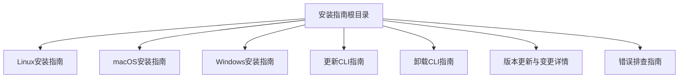
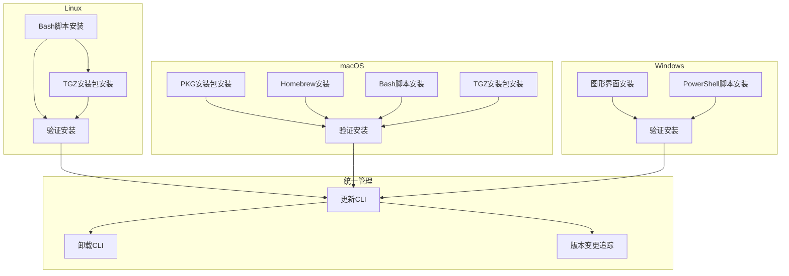
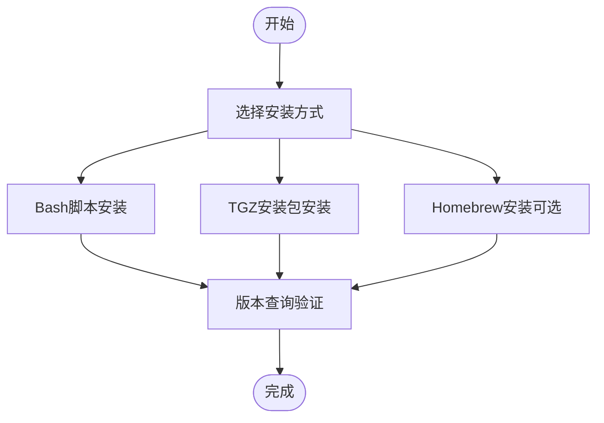
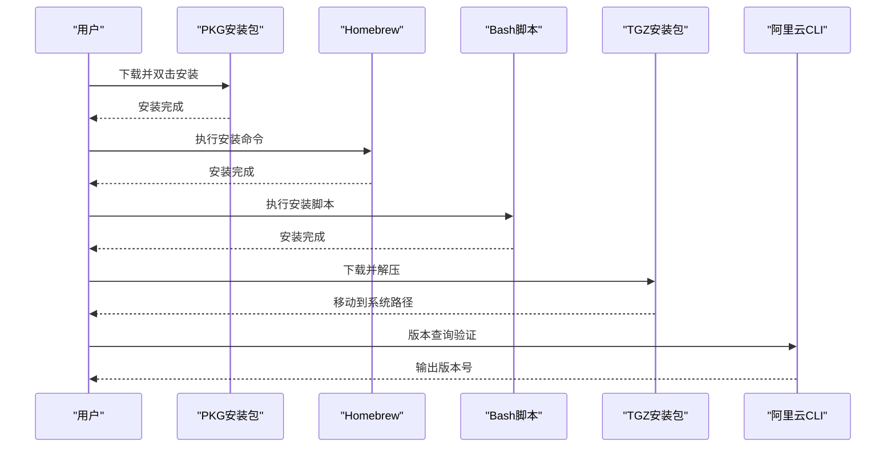
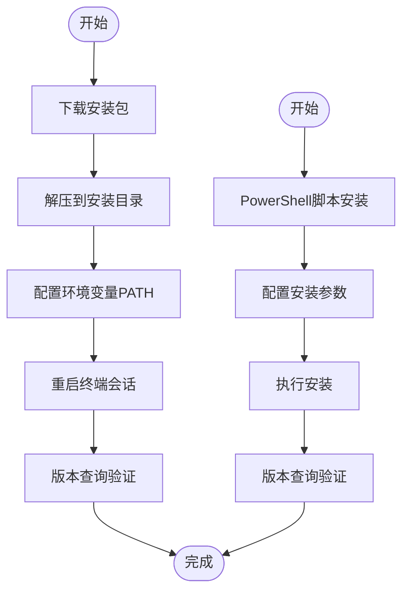
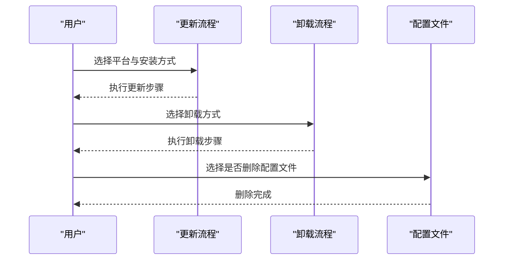
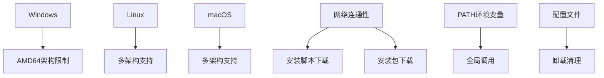

# 安装指南

<cite>
**本文引用的文件**
- [install-cli-on-linux.md](file://alibaba-cloud/reference/03-安装指南/install-cli-on-linux.md)
- [install-cli-on-macos.md](file://alibaba-cloud/reference/03-安装指南/install-cli-on-macos.md)
- [install-cli-on-windows.md](file://alibaba-cloud/reference/03-安装指南/install-cli-on-windows.md)
- [update-cli.md](file://alibaba-cloud/reference/03-安装指南/update-cli.md)
- [uninstall-cli.md](file://alibaba-cloud/reference/03-安装指南/uninstall-cli.md)
- [view-version-update-and-change-details.md](file://alibaba-cloud/reference/09-版本更新/view-version-update-and-change-details.md)
- [cli-troubleshooting.md](file://alibaba-cloud/reference/08-错误排查/cli-troubleshooting.md)
</cite>

## 目录
1. [简介](#简介)
2. [项目结构](#项目结构)
3. [核心组件](#核心组件)
4. [架构总览](#架构总览)
5. [详细组件分析](#详细组件分析)
6. [依赖关系分析](#依赖关系分析)
7. [性能考虑](#性能考虑)
8. [故障排除指南](#故障排除指南)
9. [结论](#结论)

## 简介
本指南面向在Windows、macOS、Linux三大主流操作系统上安装和配置阿里云CLI的用户。文档涵盖图形界面安装与命令行安装两种方式，提供完整的更新与卸载流程，并针对各平台特性给出注意事项与常见问题解决方案，确保用户能在任意主流操作系统上顺利完成阿里云CLI工具的安装与配置。

## 项目结构
阿里云CLI安装指南分布在参考文档的安装指南子目录中，包含三个平台的独立安装说明、更新与卸载指南，以及版本更新与故障排除相关内容。整体结构清晰，便于按平台检索与执行。

**章节来源**
- [README.md:25-32](file://alibaba-cloud/reference/README.md#L25-L32)

## 核心组件
- 平台特定安装方式：各平台提供图形界面安装与命令行安装两种途径，满足不同用户偏好。
- 统一验证机制：通过版本查询命令验证安装结果，确保CLI可正常运行。
- 更新与卸载策略：针对不同安装方式提供相应的更新与卸载步骤，避免版本混淆与残留配置。
- 版本变更追踪：提供查看版本更新与API元数据变更的方法，帮助用户了解功能演进。

**章节来源**
- [install-cli-on-linux.md:1-93](file://alibaba-cloud/reference/03-安装指南/install-cli-on-linux.md#L1-L93)
- [install-cli-on-macos.md:1-111](file://alibaba-cloud/reference/03-安装指南/install-cli-on-macos.md#L1-L111)
- [install-cli-on-windows.md:1-160](file://alibaba-cloud/reference/03-安装指南/install-cli-on-windows.md#L1-L160)
- [update-cli.md:1-126](file://alibaba-cloud/reference/03-安装指南/update-cli.md#L1-L126)
- [uninstall-cli.md:1-254](file://alibaba-cloud/reference/03-安装指南/uninstall-cli.md#L1-L254)

## 架构总览
阿里云CLI安装体系采用“平台适配 + 多通道安装 + 统一验证”的架构设计。各平台通过不同的安装包或脚本完成可执行文件部署，并通过环境变量或系统路径实现全局调用。更新与卸载流程遵循“与初始安装方式一致”的原则，确保系统状态一致性。

**图表来源**
- [install-cli-on-linux.md:9-92](file://alibaba-cloud/reference/03-安装指南/install-cli-on-linux.md#L9-L92)
- [install-cli-on-macos.md:9-110](file://alibaba-cloud/reference/03-安装指南/install-cli-on-macos.md#L9-L110)
- [install-cli-on-windows.md:13-159](file://alibaba-cloud/reference/03-安装指南/install-cli-on-windows.md#L13-L159)
- [update-cli.md:18-125](file://alibaba-cloud/reference/03-安装指南/update-cli.md#L18-L125)
- [uninstall-cli.md:13-253](file://alibaba-cloud/reference/03-安装指南/uninstall-cli.md#L13-L253)

## 详细组件分析

### Linux平台安装
Linux提供四种安装方式：Bash脚本安装、TGZ安装包安装、Homebrew安装（需额外准备）、以及通过Bash脚本安装。安装完成后通过版本查询命令验证安装结果。

- Bash脚本安装
  - 优点：一键安装，自动获取最新版本；支持指定版本与帮助信息查看。
  - 注意事项：需确保系统可访问安装脚本地址；历史版本可通过版本参数指定。
  - 验证：执行版本查询命令确认安装成功。

- TGZ安装包安装
  - 步骤：下载对应架构的安装包 -> 解压 -> 移动到系统路径 -> 配置全局调用。
  - 架构检测：通过系统命令查看架构，区分AMD64与ARM64。
  - 验证：版本查询命令输出版本号即为成功。

- Homebrew安装（可选）
  - 说明：需先安装并配置Homebrew；中国内地用户可配置国内镜像源提升下载速度。
  - 命令：安装最新版本的阿里云CLI。

- TGZ安装包安装（补充）
  - 步骤：下载安装包 -> 解压 -> 移动到/usr/local/bin -> 配置全局调用。
  - 验证：版本查询命令输出版本号。

**图表来源**
- [install-cli-on-linux.md:9-92](file://alibaba-cloud/reference/03-安装指南/install-cli-on-linux.md#L9-L92)

**章节来源**
- [install-cli-on-linux.md:9-92](file://alibaba-cloud/reference/03-安装指南/install-cli-on-linux.md#L9-L92)

### macOS平台安装
macOS提供五种安装方式：PKG安装包安装（推荐）、Homebrew安装、Bash脚本安装、TGZ安装包安装。安装完成后通过版本查询命令验证安装结果。

- PKG安装包安装（推荐）
  - 步骤：下载PKG安装包 -> 双击安装 -> 按提示完成安装。
  - 适用：最直观的方式，适合图形界面用户。

- Homebrew安装
  - 说明：需先安装并配置Homebrew；中国内地用户可配置国内镜像源。
  - 命令：安装最新版本的阿里云CLI。

- Bash脚本安装
  - 优点：一键安装，支持指定版本与帮助信息查看。
  - 注意事项：历史版本可通过版本参数指定。

- TGZ安装包安装
  - 步骤：下载安装包 -> 解压 -> 移动到/usr/local/bin -> 配置全局调用。
  - 验证：版本查询命令输出版本号。

**图表来源**
- [install-cli-on-macos.md:9-110](file://alibaba-cloud/reference/03-安装指南/install-cli-on-macos.md#L9-L110)

**章节来源**
- [install-cli-on-macos.md:9-110](file://alibaba-cloud/reference/03-安装指南/install-cli-on-macos.md#L9-L110)

### Windows平台安装
Windows提供两种安装方式：图形界面手动安装与PowerShell脚本安装。安装完成后通过版本查询命令验证安装结果。

- 图形界面手动安装
  - 步骤：下载安装包 -> 解压到目标目录 -> 配置环境变量PATH -> 重启终端会话。
  - 重要提示：可执行文件需通过命令行终端运行，双击无法正常工作。
  - 架构限制：当前仅支持Windows AMD64架构系统，不支持32位及其他非AMD64架构。

- PowerShell脚本安装
  - 功能：支持自定义版本与安装目录；仅修改用户级与进程级PATH。
  - 参数：支持帮助信息、版本参数、安装目录参数。
  - 验证：重启终端会话后执行版本查询命令确认安装成功。

**图表来源**
- [install-cli-on-windows.md:13-159](file://alibaba-cloud/reference/03-安装指南/install-cli-on-windows.md#L13-L159)

**章节来源**
- [install-cli-on-windows.md:7-159](file://alibaba-cloud/reference/03-安装指南/install-cli-on-windows.md#L7-L159)

### 更新与卸载流程
更新与卸载严格遵循“与初始安装方式一致”的原则，避免版本混淆与残留配置。各平台提供对应的更新与卸载步骤，同时提供删除配置文件的可选操作。

- 更新流程
  - Linux：支持Bash脚本更新与TGZ安装包更新；需根据系统架构选择对应安装包。
  - macOS：支持PKG安装包更新、Homebrew更新、Bash脚本更新与TGZ安装包更新。
  - Windows：支持ZIP安装包更新与PowerShell脚本更新。

- 卸载流程
  - Linux/macOS：支持Homebrew卸载、命令行界面卸载与Bash脚本卸载；可选择删除配置文件。
  - Windows：支持图形界面卸载与PowerShell脚本卸载；可选择删除配置文件。

**图表来源**
- [update-cli.md:18-125](file://alibaba-cloud/reference/03-安装指南/update-cli.md#L18-L125)
- [uninstall-cli.md:13-253](file://alibaba-cloud/reference/03-安装指南/uninstall-cli.md#L13-L253)

**章节来源**
- [update-cli.md:18-125](file://alibaba-cloud/reference/03-安装指南/update-cli.md#L18-L125)
- [uninstall-cli.md:13-253](file://alibaba-cloud/reference/03-安装指南/uninstall-cli.md#L13-L253)

### 版本更新与变更追踪
- 查看主要变更：访问GitHub Releases页面，查看目标版本的发布说明与变更日志。
- 查看API元数据变更：在线查看或本地对比导出的元数据差异，关注API接口定义与云产品信息。
- 元数据结构示例：提供API元数据文件与云产品元数据文件的结构示例，便于理解与对比。

**章节来源**
- [view-version-update-and-change-details.md:1-80](file://alibaba-cloud/reference/09-版本更新/view-version-update-and-change-details.md#L1-L80)

## 依赖关系分析
- 平台依赖：Windows安装受系统架构限制（仅AMD64），Linux与macOS支持多架构安装包。
- 网络依赖：安装脚本与安装包下载依赖网络连通性，中国内地用户可配置国内镜像源提升下载速度。
- 环境变量依赖：各平台通过PATH环境变量实现全局调用，需确保安装目录已加入PATH。
- 配置文件依赖：卸载时可选择删除配置文件，避免残留配置影响后续安装。

**图表来源**
- [install-cli-on-windows.md:7-29](file://alibaba-cloud/reference/03-安装指南/install-cli-on-windows.md#L7-L29)
- [install-cli-on-linux.md:46-78](file://alibaba-cloud/reference/03-安装指南/install-cli-on-linux.md#L46-L78)
- [install-cli-on-macos.md:30-43](file://alibaba-cloud/reference/03-安装指南/install-cli-on-macos.md#L30-L43)
- [uninstall-cli.md:248-254](file://alibaba-cloud/reference/03-安装指南/uninstall-cli.md#L248-L254)

**章节来源**
- [install-cli-on-windows.md:7-29](file://alibaba-cloud/reference/03-安装指南/install-cli-on-windows.md#L7-L29)
- [install-cli-on-linux.md:46-78](file://alibaba-cloud/reference/03-安装指南/install-cli-on-linux.md#L46-L78)
- [install-cli-on-macos.md:30-43](file://alibaba-cloud/reference/03-安装指南/install-cli-on-macos.md#L30-L43)
- [uninstall-cli.md:248-254](file://alibaba-cloud/reference/03-安装指南/uninstall-cli.md#L248-L254)

## 性能考虑
- 下载速度优化：中国内地用户可配置国内镜像源（如Homebrew中科大镜像）以提升下载速度。
- 安装包选择：根据系统架构选择对应安装包，避免不必要的兼容性检查与转换开销。
- 环境变量配置：确保安装目录已加入PATH，减少路径查找时间。
- 更新策略：保持与初始安装方式一致的更新渠道，避免重复下载与覆盖操作。

## 故障排除指南
- 常见问题排查
  - 网络状态：检查网络连通性，确保可访问阿里云API。
  - 缺失选项：检查命令必需选项与参数格式，参考帮助信息。
  - 地域与接入点：确认--endpoint、--region、配置profile与环境变量的优先级。
  - 请求详情：使用模拟调用功能查看请求详情，启用日志输出功能。
  - 凭证有效性：检查当前使用的配置、保存的凭证信息与凭证模式。
  - 权限不足：确认当前身份具备执行操作所需的权限。

- 错误信息列表
  - 命令不存在或无法识别参数：检查命令拼写与参数格式。
  - required parameters not assigned：检查必需参数是否正确传入。
  - fail to set configuration：检查配置文件写入权限。
  - 网络连接超时：检查网络连通性与代理设置。
  - 凭证无效：检查AK、Token等凭证信息的有效性。

- 版本更新与重新安装
  - 若确认命令与参数格式无误但仍报错，建议更新或重新安装到最新版本的阿里云CLI。

**章节来源**
- [cli-troubleshooting.md:84-111](file://alibaba-cloud/reference/08-错误排查/cli-troubleshooting.md#L84-L111)

## 结论
通过本指南，用户可在Windows、macOS、Linux三大平台上选择最适合的安装方式完成阿里云CLI的安装与配置。遵循“与初始安装方式一致”的更新与卸载原则，结合版本变更追踪与故障排除指南，可有效避免版本混淆与配置残留问题，确保CLI工具稳定运行。建议用户在安装前确认系统架构与网络环境，并在安装后通过版本查询命令验证安装结果。