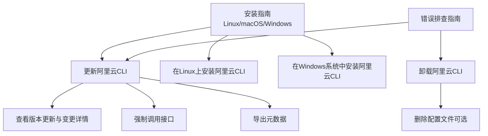
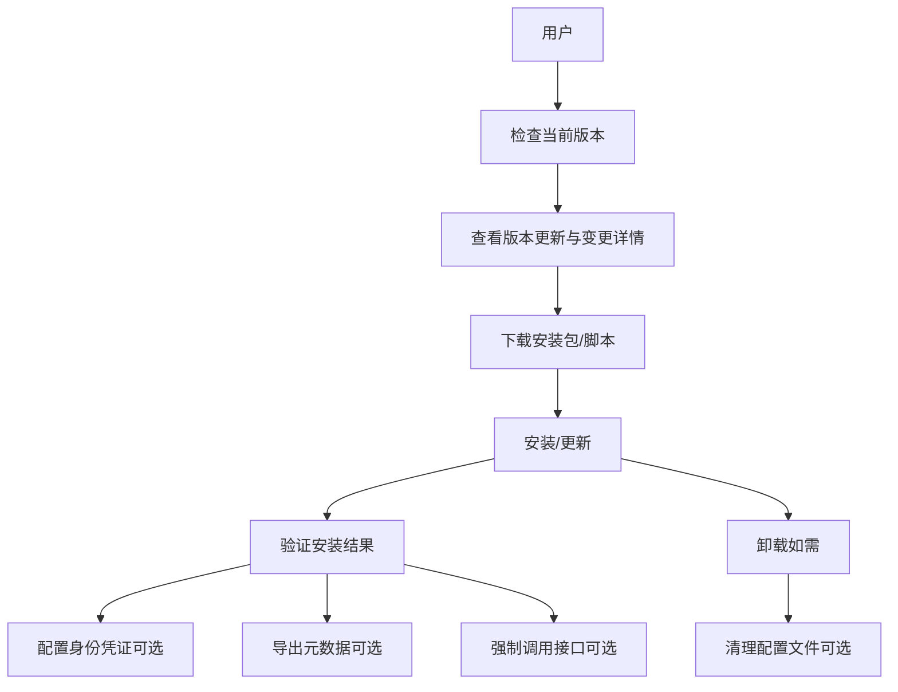
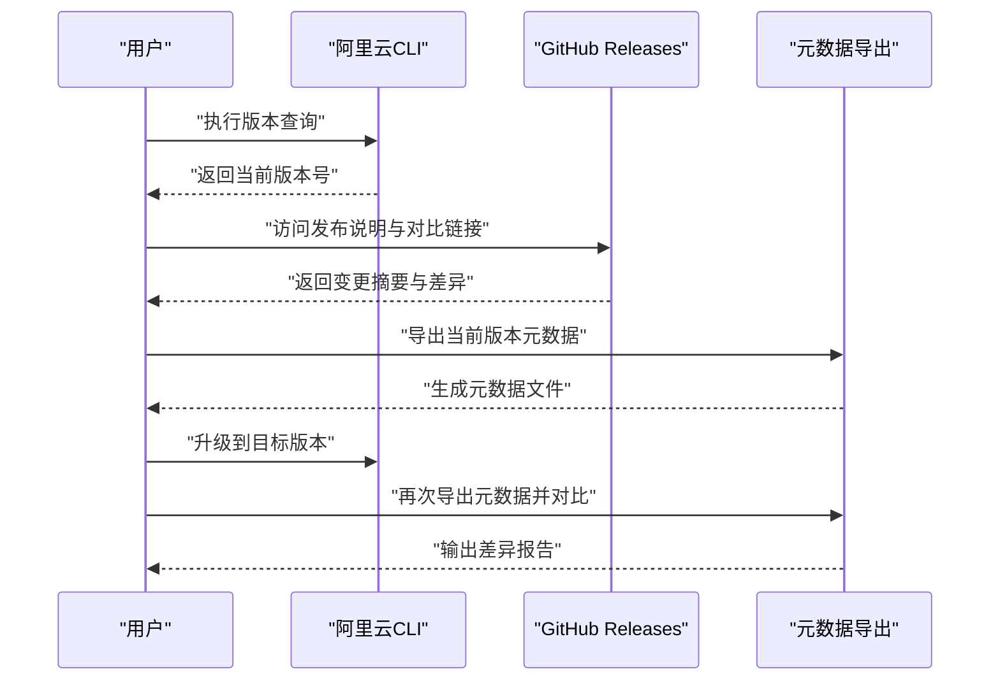
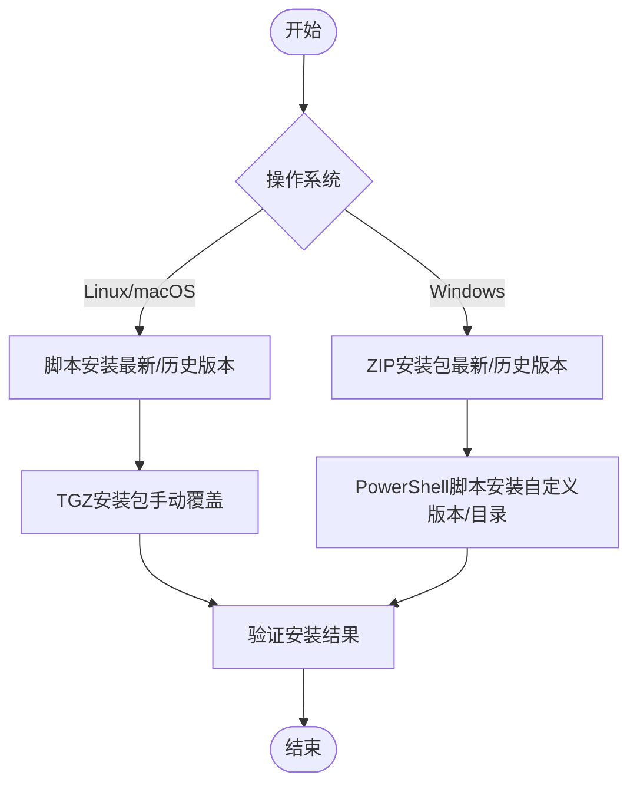
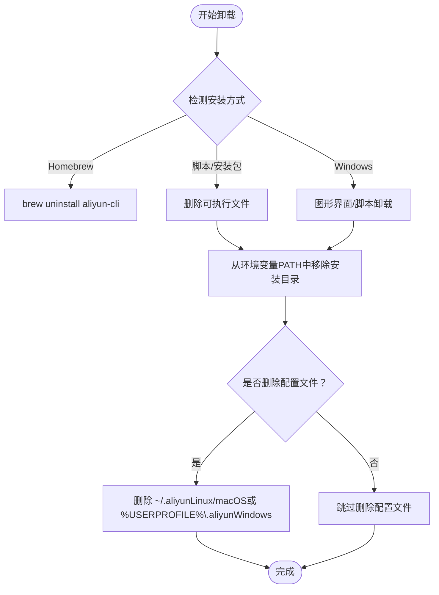
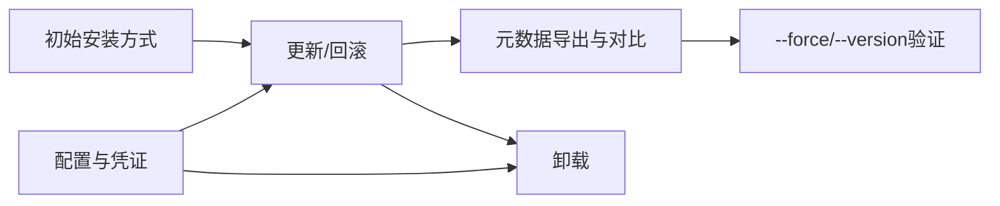

# 更新与卸载

<cite>
**本文引用的文件**
- [更新阿里云CLI](file://alibaba-cloud/reference/03-安装指南/update-cli.md)
- [卸载阿里云CLI](file://alibaba-cloud/reference/03-安装指南/uninstall-cli.md)
- [在Linux上安装阿里云CLI](file://alibaba-cloud/reference/03-安装指南/install-cli-on-linux.md)
- [在Windows系统中安装阿里云CLI](file://alibaba-cloud/reference/03-安装指南/install-cli-on-windows.md)
- [查看版本更新与变更详情](file://alibaba-cloud/reference/09-版本更新/view-version-update-and-change-details.md)
- [命令行选项](file://alibaba-cloud/reference/05-使用阿里云CLI/command-line-options.md)
- [强制调用接口](file://alibaba-cloud/reference/05-使用阿里云CLI/force-call-apis.md)
- [导出元数据](file://alibaba-cloud/reference/05-使用阿里云CLI/export-metadata.md)
- [错误排查指南](file://alibaba-cloud/reference/08-错误排查/cli-troubleshooting.md)
- [配置身份凭证](file://alibaba-cloud/reference/04-配置阿里云CLI/configure-credentials.md)
- [多凭证管理](file://alibaba-cloud/reference/04-配置阿里云CLI/多凭证管理.md)
</cite>

## 目录
1. [简介](#简介)
2. [项目结构](#项目结构)
3. [核心组件](#核心组件)
4. [架构总览](#架构总览)
5. [详细组件分析](#详细组件分析)
6. [依赖关系分析](#依赖关系分析)
7. [性能考虑](#性能考虑)
8. [故障排查指南](#故障排查指南)
9. [结论](#结论)
10. [附录](#附录)

## 简介
本指南面向需要在不同操作系统（Linux、macOS、Windows）上安全更新或完全卸载阿里云CLI的用户。内容涵盖：
- 检查当前版本
- 下载与安装新版本
- 升级与强制更新
- 回滚到历史版本
- 完全卸载（含可执行文件、配置文件、环境变量清理）
- 常见问题与排错

## 项目结构
围绕“更新与卸载”的关键文档分布于安装指南、版本更新、使用与故障排查等模块，形成“安装—更新—使用—卸载—排错”的闭环。



图表来源
- [更新阿里云CLI](file://alibaba-cloud/reference/03-安装指南/update-cli.md)
- [查看版本更新与变更详情](file://alibaba-cloud/reference/09-版本更新/view-version-update-and-change-details.md)
- [强制调用接口](file://alibaba-cloud/reference/05-使用阿里云CLI/force-call-apis.md)
- [导出元数据](file://alibaba-cloud/reference/05-使用阿里云CLI/export-metadata.md)
- [在Linux上安装阿里云CLI](file://alibaba-cloud/reference/03-安装指南/install-cli-on-linux.md)
- [在Windows系统中安装阿里云CLI](file://alibaba-cloud/reference/03-安装指南/install-cli-on-windows.md)
- [卸载阿里云CLI](file://alibaba-cloud/reference/03-安装指南/uninstall-cli.md)
- [错误排查指南](file://alibaba-cloud/reference/08-错误排查/cli-troubleshooting.md)

章节来源
- [更新阿里云CLI](file://alibaba-cloud/reference/03-安装指南/update-cli.md)
- [查看版本更新与变更详情](file://alibaba-cloud/reference/09-版本更新/view-version-update-and-change-details.md)
- [在Linux上安装阿里云CLI](file://alibaba-cloud/reference/03-安装指南/install-cli-on-linux.md)
- [在Windows系统中安装阿里云CLI](file://alibaba-cloud/reference/03-安装指南/install-cli-on-windows.md)
- [卸载阿里云CLI](file://alibaba-cloud/reference/03-安装指南/uninstall-cli.md)
- [错误排查指南](file://alibaba-cloud/reference/08-错误排查/cli-troubleshooting.md)

## 核心组件
- 版本与变更跟踪：通过GitHub Releases页面获取版本变更、API元数据差异，辅助判断升级风险与回滚需求。
- 更新通道：脚本安装、TGZ/ZIP安装包、Homebrew（macOS）等，需与初始安装方式保持一致，避免混用导致残留。
- 强制更新与回滚：通过指定版本安装包或脚本参数实现；必要时结合--force与--version进行接口层面的兼容性验证。
- 卸载与清理：删除可执行文件、清理环境变量、删除用户配置目录（可选）。

章节来源
- [查看版本更新与变更详情](file://alibaba-cloud/reference/09-版本更新/view-version-update-and-change-details.md)
- [更新阿里云CLI](file://alibaba-cloud/reference/03-安装指南/update-cli.md)
- [强制调用接口](file://alibaba-cloud/reference/05-使用阿里云CLI/force-call-apis.md)
- [卸载阿里云CLI](file://alibaba-cloud/reference/03-安装指南/uninstall-cli.md)

## 架构总览
下图展示了“检查版本—下载—安装/更新—验证—卸载”的端到端流程，以及与配置、元数据导出、强制调用的关系。



图表来源
- [查看版本更新与变更详情](file://alibaba-cloud/reference/09-版本更新/view-version-update-and-change-details.md)
- [在Linux上安装阿里云CLI](file://alibaba-cloud/reference/03-安装指南/install-cli-on-linux.md)
- [在Windows系统中安装阿里云CLI](file://alibaba-cloud/reference/03-安装指南/install-cli-on-windows.md)
- [配置身份凭证](file://alibaba-cloud/reference/04-配置阿里云CLI/configure-credentials.md)
- [导出元数据](file://alibaba-cloud/reference/05-使用阿里云CLI/export-metadata.md)
- [强制调用接口](file://alibaba-cloud/reference/05-使用阿里云CLI/force-call-apis.md)
- [卸载阿里云CLI](file://alibaba-cloud/reference/03-安装指南/uninstall-cli.md)

## 详细组件分析

### 组件A：检查当前版本与查看变更
- 检查当前版本：在终端执行版本查询命令，确认当前安装版本。
- 查看变更详情：访问GitHub Releases页面，阅读发布说明与版本对比，定位API元数据差异，评估升级影响。
- 元数据对比：导出当前版本元数据，升级到目标版本后再次导出并对比，定位接口/参数变化。



图表来源
- [在Linux上安装阿里云CLI](file://alibaba-cloud/reference/03-安装指南/install-cli-on-linux.md)
- [在Windows系统中安装阿里云CLI](file://alibaba-cloud/reference/03-安装指南/install-cli-on-windows.md)
- [查看版本更新与变更详情](file://alibaba-cloud/reference/09-版本更新/view-version-update-and-change-details.md)
- [导出元数据](file://alibaba-cloud/reference/05-使用阿里云CLI/export-metadata.md)

章节来源
- [在Linux上安装阿里云CLI](file://alibaba-cloud/reference/03-安装指南/install-cli-on-linux.md)
- [在Windows系统中安装阿里云CLI](file://alibaba-cloud/reference/03-安装指南/install-cli-on-windows.md)
- [查看版本更新与变更详情](file://alibaba-cloud/reference/09-版本更新/view-version-update-and-change-details.md)
- [导出元数据](file://alibaba-cloud/reference/05-使用阿里云CLI/export-metadata.md)

### 组件B：下载与安装新版本
- Linux/macOS：支持脚本安装与TGZ安装包；脚本安装默认获取最新版本，亦可指定历史版本；TGZ安装包需解压后覆盖安装目录。
- Windows：支持ZIP安装包与PowerShell脚本安装；注意仅AMD64架构支持；脚本安装支持自定义版本与安装目录。



图表来源
- [在Linux上安装阿里云CLI](file://alibaba-cloud/reference/03-安装指南/install-cli-on-linux.md)
- [在Windows系统中安装阿里云CLI](file://alibaba-cloud/reference/03-安装指南/install-cli-on-windows.md)

章节来源
- [在Linux上安装阿里云CLI](file://alibaba-cloud/reference/03-安装指南/install-cli-on-linux.md)
- [在Windows系统中安装阿里云CLI](file://alibaba-cloud/reference/03-安装指南/install-cli-on-windows.md)

### 组件C：升级与强制更新
- 升级策略：遵循初始安装方式（脚本/安装包/Homebrew），避免混用导致残留；如需更换安装方式或修改安装目录，建议先卸载再重新安装。
- 强制更新：当目标版本引入接口变更或参数调整，可结合--force与--version进行接口调用验证，确保兼容性。

```mermaid
sequenceDiagram
participant U as "用户"
participant UP as "更新流程"
participant CLI as "阿里云CLI"
participant OPT as "命令行选项"
U->>UP : "选择更新方式脚本/TGZ/ZIP/PowerShell"
UP->>CLI : "执行安装/覆盖"
CLI-->>U : "返回新版本号"
U->>OPT : "使用--force/--version进行接口验证"
OPT-->>U : "返回调用结果"
```

图表来源
- [更新阿里云CLI](file://alibaba-cloud/reference/03-安装指南/update-cli.md)
- [命令行选项](file://alibaba-cloud/reference/05-使用阿里云CLI/command-line-options.md)
- [强制调用接口](file://alibaba-cloud/reference/05-使用阿里云CLI/force-call-apis.md)

章节来源
- [更新阿里云CLI](file://alibaba-cloud/reference/03-安装指南/update-cli.md)
- [命令行选项](file://alibaba-cloud/reference/05-使用阿里云CLI/command-line-options.md)
- [强制调用接口](file://alibaba-cloud/reference/05-使用阿里云CLI/force-call-apis.md)

### 组件D：回滚到旧版本
- 回滚路径：通过指定历史版本的安装包或脚本参数进行安装；若升级后出现兼容性问题，优先使用历史版本安装包进行回滚。
- 注意事项：保持与初始安装方式一致，避免混用；如需更换安装方式或修改安装目录，建议先卸载再重新安装。

章节来源
- [在Linux上安装阿里云CLI](file://alibaba-cloud/reference/03-安装指南/install-cli-on-linux.md)
- [在Windows系统中安装阿里云CLI](file://alibaba-cloud/reference/03-安装指南/install-cli-on-windows.md)
- [更新阿里云CLI](file://alibaba-cloud/reference/03-安装指南/update-cli.md)

### 组件E：完全卸载与清理
- Linux/macOS：
  - 通过Homebrew卸载（如原安装方式为Homebrew）
  - 通过命令行删除可执行文件并清理环境变量PATH
  - 可选：删除用户配置目录（~/.aliyun）
- Windows：
  - 图形界面卸载：删除可执行文件、从环境变量PATH中移除安装目录
  - PowerShell脚本卸载：自动检测并删除可执行文件、清理PATH、可选删除配置文件



图表来源
- [卸载阿里云CLI](file://alibaba-cloud/reference/03-安装指南/uninstall-cli.md)
- [在Linux上安装阿里云CLI](file://alibaba-cloud/reference/03-安装指南/install-cli-on-linux.md)
- [在Windows系统中安装阿里云CLI](file://alibaba-cloud/reference/03-安装指南/install-cli-on-windows.md)

章节来源
- [卸载阿里云CLI](file://alibaba-cloud/reference/03-安装指南/uninstall-cli.md)
- [在Linux上安装阿里云CLI](file://alibaba-cloud/reference/03-安装指南/install-cli-on-linux.md)
- [在Windows系统中安装阿里云CLI](file://alibaba-cloud/reference/03-安装指南/install-cli-on-windows.md)

## 依赖关系分析
- 更新与卸载依赖于初始安装方式（脚本/安装包/Homebrew），混用可能导致残留文件与环境变量污染。
- 版本变更与元数据差异影响接口调用，升级后建议导出元数据并对比，必要时使用--force与--version进行验证。
- 配置与凭证管理影响升级/回滚后的可用性，建议在升级前后核对配置文件与当前配置。



图表来源
- [更新阿里云CLI](file://alibaba-cloud/reference/03-安装指南/update-cli.md)
- [导出元数据](file://alibaba-cloud/reference/05-使用阿里云CLI/export-metadata.md)
- [强制调用接口](file://alibaba-cloud/reference/05-使用阿里云CLI/force-call-apis.md)
- [配置身份凭证](file://alibaba-cloud/reference/04-配置阿里云CLI/configure-credentials.md)
- [多凭证管理](file://alibaba-cloud/reference/04-配置阿里云CLI/多凭证管理.md)

章节来源
- [更新阿里云CLI](file://alibaba-cloud/reference/03-安装指南/update-cli.md)
- [导出元数据](file://alibaba-cloud/reference/05-使用阿里云CLI/export-metadata.md)
- [强制调用接口](file://alibaba-cloud/reference/05-使用阿里云CLI/force-call-apis.md)
- [配置身份凭证](file://alibaba-cloud/reference/04-配置阿里云CLI/configure-credentials.md)
- [多凭证管理](file://alibaba-cloud/reference/04-配置阿里云CLI/多凭证管理.md)

## 性能考虑
- 选择就近的下载源（如国内镜像）可提升下载速度，减少等待时间。
- 升级/回滚时建议在非高峰时段执行，避免长时间占用终端。
- 导出元数据仅用于调试或开发，升级后及时关闭以避免额外开销。

## 故障排查指南
- 常见问题：找不到命令、版本不一致、卸载后仍可用、命令无法识别、参数解析异常、权限不足等。
- 排查步骤：检查网络状态、确认命令与参数格式、校验地域与接入点、启用日志与模拟调用、检查凭证有效性与权限。
- 升级/重新安装建议：若确认命令与参数无误但仍报错，建议重新安装或更新到最新版本。

章节来源
- [错误排查指南](file://alibaba-cloud/reference/08-错误排查/cli-troubleshooting.md)

## 结论
- 为确保安全与一致性，更新与卸载务必与初始安装方式保持一致，避免混用。
- 升级前建议导出元数据并对比差异，必要时使用--force与--version进行验证。
- 卸载时彻底清理可执行文件、环境变量与配置文件，避免残留影响系统环境。

## 附录
- 快速参考
  - 检查版本：在终端执行版本查询命令
  - 查看变更：访问GitHub Releases页面
  - 强制更新：使用脚本或安装包指定版本
  - 回滚：使用历史版本安装包
  - 卸载：删除可执行文件、清理PATH、删除配置文件（可选）