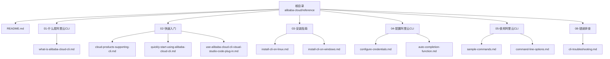
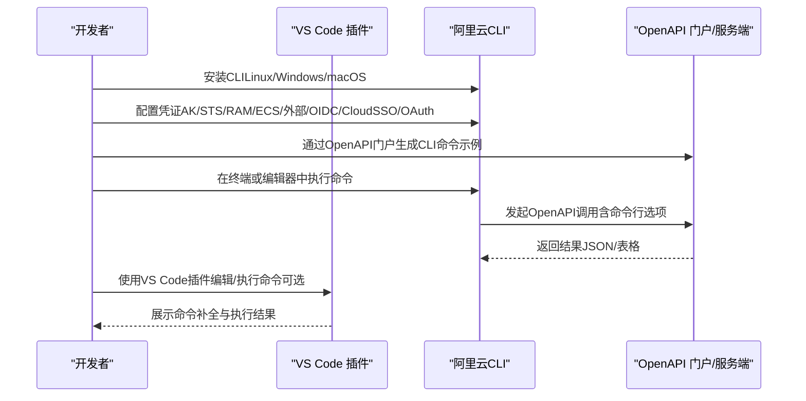
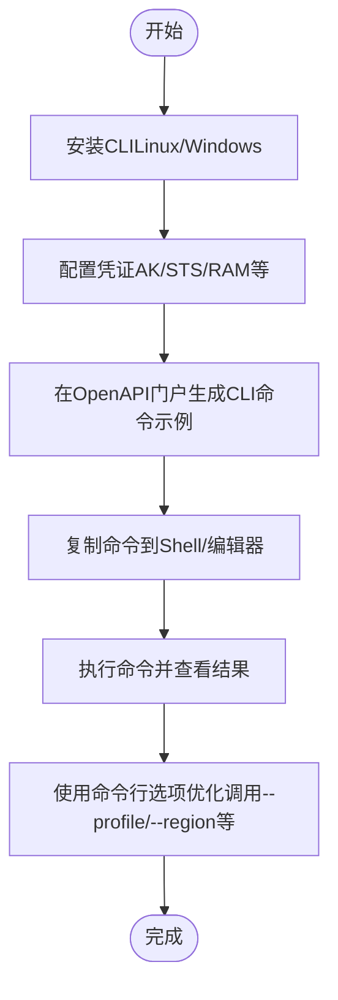
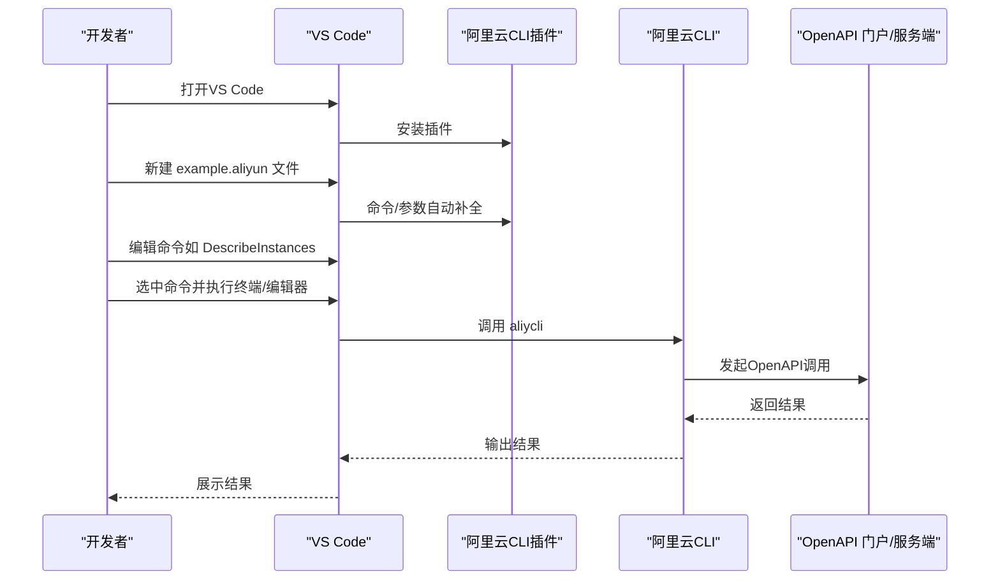
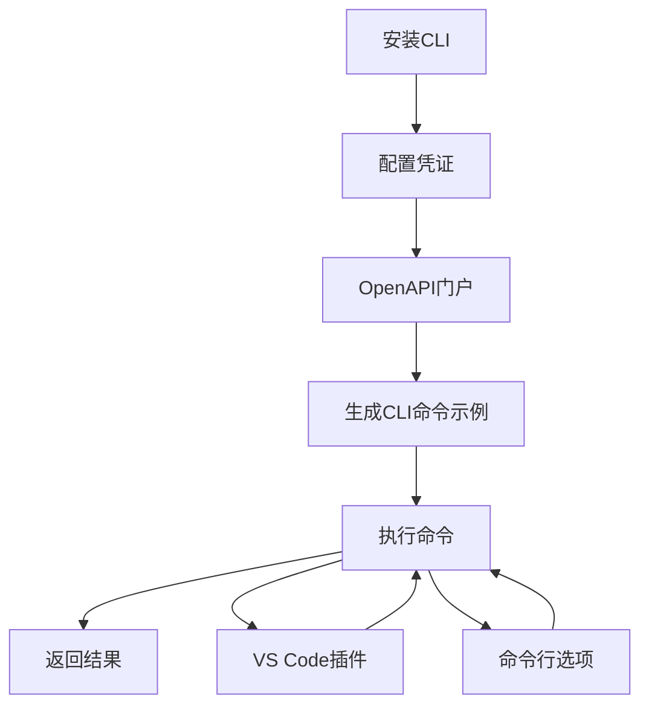

# 快速入门

<cite>
**本文引用的文件**
- [README.md](file://alibaba-cloud/reference/README.md)
- [what-is-alibaba-cloud-cli.md](file://alibaba-cloud/reference/01-什么是阿里云CLI/what-is-alibaba-cloud-cli.md)
- [cloud-products-supporting-cli.md](file://alibaba-cloud/reference/02-快速入门/cloud-products-supporting-cli.md)
- [quickly-start-using-alibaba-cloud-cli.md](file://alibaba-cloud/reference/02-快速入门/quickly-start-using-alibaba-cloud-cli.md)
- [use-alibaba-cloud-cli-visual-studio-code-plug-in.md](file://alibaba-cloud/reference/02-快速入门/use-alibaba-cloud-cli-visual-studio-code-plug-in.md)
- [install-cli-on-linux.md](file://alibaba-cloud/reference/03-安装指南/install-cli-on-linux.md)
- [install-cli-on-windows.md](file://alibaba-cloud/reference/03-安装指南/install-cli-on-windows.md)
- [configure-credentials.md](file://alibaba-cloud/reference/04-配置阿里云CLI/configure-credentials.md)
- [auto-completion-function.md](file://alibaba-cloud/reference/04-配置阿里云CLI/auto-completion-function.md)
- [sample-commands.md](file://alibaba-cloud/reference/05-使用阿里云CLI/sample-commands.md)
- [command-line-options.md](file://alibaba-cloud/reference/05-使用阿里云CLI/command-line-options.md)
- [cli-troubleshooting.md](file://alibaba-cloud/reference/08-错误排查/cli-troubleshooting.md)
</cite>

## 目录
1. [简介](#简介)
2. [项目结构](#项目结构)
3. [核心组件](#核心组件)
4. [架构总览](#架构总览)
5. [详细组件分析](#详细组件分析)
6. [依赖分析](#依赖分析)
7. [性能考虑](#性能考虑)
8. [故障排查指南](#故障排查指南)
9. [结论](#结论)
10. [附录](#附录)

## 简介
本指南面向初学者，帮助你从零开始使用阿里云CLI。内容涵盖基础概念、与专用产品CLI的区别、安装与配置、VS Code插件使用、首个命令执行流程，以及常见问题排查。通过“从概念到实操”的渐进式讲解，确保你能顺利上手并高效使用阿里云CLI。

## 项目结构
该仓库按“官方文档目录”组织，便于查阅与检索。快速入门相关的内容分布在“01-什么是阿里云CLI”“02-快速入门”“03-安装指南”“04-配置阿里云CLI”“05-使用阿里云CLI”“08-错误排查”等子目录中。

图表来源
- [README.md:11-82](file://alibaba-cloud/reference/README.md#L11-L82)

章节来源
- [README.md:1-89](file://alibaba-cloud/reference/README.md#L1-L89)

## 核心组件
- 基础概念与定位：明确CLI本质、阿里云CLI的定位、与专用产品CLI的区别、核心能力与适用场景。
- 安装与配置：覆盖Linux、Windows安装方式，凭证配置（AK、STS Token、RAM角色扮演、ECS实例角色、外部程序、OIDC、CloudSSO、OAuth等），以及命令自动补全。
- 快速上手：OpenAPI调用流程（安装→配置→生成命令→调用），VS Code插件使用，首个命令示例。
- 使用技巧：命令行选项、分页聚合、过滤与表格化输出、强制调用、结果轮询、模拟调用、日志调试。
- 故障排查：网络、命令格式、地域/接入点、凭证有效性、版本更新等常见问题。

章节来源
- [what-is-alibaba-cloud-cli.md:1-78](file://alibaba-cloud/reference/01-什么是阿里云CLI/what-is-alibaba-cloud-cli.md#L1-L78)
- [cloud-products-supporting-cli.md:1-246](file://alibaba-cloud/reference/02-快速入门/cloud-products-supporting-cli.md#L1-L246)
- [quickly-start-using-alibaba-cloud-cli.md:1-100](file://alibaba-cloud/reference/02-快速入门/quickly-start-using-alibaba-cloud-cli.md#L1-L100)
- [use-alibaba-cloud-cli-visual-studio-code-plug-in.md:1-67](file://alibaba-cloud/reference/02-快速入门/use-alibaba-cloud-cli-visual-studio-code-plug-in.md#L1-L67)
- [install-cli-on-linux.md:1-93](file://alibaba-cloud/reference/03-安装指南/install-cli-on-linux.md#L1-L93)
- [install-cli-on-windows.md:1-160](file://alibaba-cloud/reference/03-安装指南/install-cli-on-windows.md#L1-L160)
- [configure-credentials.md:1-862](file://alibaba-cloud/reference/04-配置阿里云CLI/configure-credentials.md#L1-L862)
- [auto-completion-function.md:1-55](file://alibaba-cloud/reference/04-配置阿里云CLI/auto-completion-function.md#L1-L55)
- [sample-commands.md:1-66](file://alibaba-cloud/reference/05-使用阿里云CLI/sample-commands.md#L1-L66)
- [command-line-options.md:1-37](file://alibaba-cloud/reference/05-使用阿里云CLI/command-line-options.md#L1-L37)
- [cli-troubleshooting.md:1-111](file://alibaba-cloud/reference/08-错误排查/cli-troubleshooting.md#L1-L111)

## 架构总览
下图展示了“从安装到调用OpenAPI”的端到端流程，以及VS Code插件辅助开发与调试的典型路径。

图表来源
- [quickly-start-using-alibaba-cloud-cli.md:5-12](file://alibaba-cloud/reference/02-快速入门/quickly-start-using-alibaba-cloud-cli.md#L5-L12)
- [use-alibaba-cloud-cli-visual-studio-code-plug-in.md:10-17](file://alibaba-cloud/reference/02-快速入门/use-alibaba-cloud-cli-visual-studio-code-plug-in.md#L10-L17)
- [sample-commands.md:14-40](file://alibaba-cloud/reference/05-使用阿里云CLI/sample-commands.md#L14-L40)

## 详细组件分析

### 组件A：基础概念与与专用产品CLI的区别
- CLI本质：命令行界面，通过文本命令与系统交互，常用于系统管理、运维与自动化。
- 阿里云CLI定位：基于OpenAPI的通用命令行工具，可在Linux Shell、Windows命令行、CloudShell等环境中运行，支持跨产品、跨区域调用OpenAPI，适合需要统一管理多云产品与跨域场景的用户。
- 与专用产品CLI的区别：
  - 阿里云CLI：覆盖100+产品，统一命令集，适合跨产品、跨账号管理。
  - 专用产品CLI：针对特定产品（如日志服务CLI）提供更专业、定制化的功能，适合对单一产品有深度需求的用户。

章节来源
- [what-is-alibaba-cloud-cli.md:14-78](file://alibaba-cloud/reference/01-什么是阿里云CLI/what-is-alibaba-cloud-cli.md#L14-L78)

### 组件B：安装与配置（Linux/Windows）
- Linux安装
  - 一键脚本安装（最新/历史版本）、TGZ安装包（AMD64/ARM64）、解压与全局调用配置、版本验证。
- Windows安装
  - 仅支持AMD64架构；提供图形界面与PowerShell脚本两种安装方式；配置环境变量PATH；版本验证。
- 凭证配置
  - 交互式与非交互式配置；支持AK、STS Token、RamRoleArn、EcsRamRole、External、ChainableRamRoleArn、CredentialsURI、OIDC、CloudSSO、OAuth等多种模式；命令自动补全（bash/zsh）。

章节来源
- [install-cli-on-linux.md:1-93](file://alibaba-cloud/reference/03-安装指南/install-cli-on-linux.md#L1-L93)
- [install-cli-on-windows.md:1-160](file://alibaba-cloud/reference/03-安装指南/install-cli-on-windows.md#L1-L160)
- [configure-credentials.md:11-862](file://alibaba-cloud/reference/04-配置阿里云CLI/configure-credentials.md#L11-L862)
- [auto-completion-function.md:1-55](file://alibaba-cloud/reference/04-配置阿里云CLI/auto-completion-function.md#L1-L55)

### 组件C：快速上手与首个命令
- 快速上手流程
  - 安装CLI → 配置凭证（建议RAM用户+AccessKey）→ 在OpenAPI门户生成CLI命令示例 → 在Shell中执行命令 → 使用常用命令行选项（--profile/--region等）。
- 首个命令示例
  - 以ECS CreateInstance为例，展示命令结构、参数格式与输出结果。

图表来源
- [quickly-start-using-alibaba-cloud-cli.md:5-12](file://alibaba-cloud/reference/02-快速入门/quickly-start-using-alibaba-cloud-cli.md#L5-L12)
- [sample-commands.md:41-66](file://alibaba-cloud/reference/05-使用阿里云CLI/sample-commands.md#L41-L66)

章节来源
- [quickly-start-using-alibaba-cloud-cli.md:1-100](file://alibaba-cloud/reference/02-快速入门/quickly-start-using-alibaba-cloud-cli.md#L1-L100)
- [sample-commands.md:1-66](file://alibaba-cloud/reference/05-使用阿里云CLI/sample-commands.md#L1-L66)

### 组件D：VS Code插件使用
- 前置准备：安装CLI并配置凭证；授予RAM用户只读访问ECS的权限策略。
- 方案概览：安装插件→编辑命令→执行命令（终端/编辑器）。
- 操作要点：在VS Code中创建以“.aliyun”为后缀的文件，利用插件提供命令/方法/参数级自动补全；支持在终端或编辑器中执行选中命令。

图表来源
- [use-alibaba-cloud-cli-visual-studio-code-plug-in.md:10-67](file://alibaba-cloud/reference/02-快速入门/use-alibaba-cloud-cli-visual-studio-code-plug-in.md#L10-L67)

章节来源
- [use-alibaba-cloud-cli-visual-studio-code-plug-in.md:1-67](file://alibaba-cloud/reference/02-快速入门/use-alibaba-cloud-cli-visual-studio-code-plug-in.md#L1-L67)

### 组件E：命令行选项与使用技巧
- 常用选项
  - --profile/-p：指定配置名称，优先于默认配置与环境变量。
  - --region：指定地域ID，优先于默认配置与环境变量。
  - --endpoint/--endpoint-type：指定接入点与类型（如VPC）。
  - --version/--force：指定API版本并强制调用。
  - --header/--body/--body-file：为ROA风格API传入请求头与请求体。
  - --read-timeout/--connect-timeout/--retry-count：控制超时与重试。
  - --secure/--insecure：强制HTTPS/HTTP。
  - --quiet/-q：关闭标准输出。
  - --help：获取帮助。
  - --output/-o：提取字段并表格化输出。
  - --pager：聚合分页接口结果。
  - --waiter：结果轮询直至满足条件。
  - --dryrun：打印请求详情用于调试。
- 使用技巧
  - 利用命令自动补全提升效率（bash/zsh）。
  - 使用OpenAPI门户生成命令示例，注意参数格式与--region选项的影响。

章节来源
- [command-line-options.md:1-37](file://alibaba-cloud/reference/05-使用阿里云CLI/command-line-options.md#L1-L37)
- [auto-completion-function.md:1-55](file://alibaba-cloud/reference/04-配置阿里云CLI/auto-completion-function.md#L1-L55)
- [sample-commands.md:1-66](file://alibaba-cloud/reference/05-使用阿里云CLI/sample-commands.md#L1-L66)

### 组件F：支持的云产品一览
- 覆盖数据库、迁移与运维管理、容器、域名与网站、人工智能与机器学习、计算、大数据计算、企业服务与云通信、网络与CDN、安全、开发工具、媒体服务、中间件、物联网、存储、Serverless、未分类等多个类别，总计100+产品。
- 动态查询：执行“aliyun --help”或访问GitHub仓库元数据获取最新支持产品信息。

章节来源
- [cloud-products-supporting-cli.md:1-246](file://alibaba-cloud/reference/02-快速入门/cloud-products-supporting-cli.md#L1-L246)

## 依赖分析
- 组件耦合与协作
  - 安装与配置是调用OpenAPI的前提，凭证配置直接影响命令执行与权限。
  - OpenAPI门户负责生成命令示例，CLI负责执行命令并返回结果。
  - VS Code插件提供编辑与执行辅助，增强开发体验。
  - 命令行选项与技巧贯穿调用过程，决定调用行为与输出形态。
- 外部依赖与集成点
  - OpenAPI门户与服务端API。
  - VS Code生态（插件市场/扩展页面）。
  - 操作系统与Shell（bash/zsh/PowerShell/命令提示符）。
  - 网络与代理（可配置代理信息）。

图表来源
- [quickly-start-using-alibaba-cloud-cli.md:5-12](file://alibaba-cloud/reference/02-快速入门/quickly-start-using-alibaba-cloud-cli.md#L5-L12)
- [use-alibaba-cloud-cli-visual-studio-code-plug-in.md:10-67](file://alibaba-cloud/reference/02-快速入门/use-alibaba-cloud-cli-visual-studio-code-plug-in.md#L10-L67)
- [command-line-options.md:1-37](file://alibaba-cloud/reference/05-使用阿里云CLI/command-line-options.md#L1-L37)

## 性能考虑
- 流控退避：阿里云CLI内置基于流控策略的优雅退避机制，减少不必要的重试，降低资源消耗并提升整体效率。
- 超时与重试：通过--read-timeout、--connect-timeout、--retry-count等选项合理配置，避免长时间阻塞。
- 输出格式：选择合适的输出格式（JSON/表格）与--output选项，有助于减少二次处理开销。
- 并发与批处理：在脚本中批量调用时，注意控制并发度与速率，避免触发限流。

章节来源
- [what-is-alibaba-cloud-cli.md:51-57](file://alibaba-cloud/reference/01-什么是阿里云CLI/what-is-alibaba-cloud-cli.md#L51-L57)

## 故障排查指南
- 一般排查步骤
  - 检查网络状态与连通性。
  - 检查命令与参数格式，必要时使用--dryrun打印请求详情。
  - 检查地域/接入点优先级（--endpoint/--region/--profile/环境变量）。
  - 检查凭证有效性与权限，确认凭证模式可用性（RamRoleArn、EcsRamRole、External、CredentialsURI、OIDC、CloudSSO、OAuth等）。
  - 更新或重新安装CLI版本，确保支持最新API与功能。
- 常见问题
  - 找不到aliyun命令、版本不一致、卸载后仍可用、无法识别命令、字符串解析异常、缺少必需参数、配置凭证失败、网络超时、凭证无效等。

章节来源
- [cli-troubleshooting.md:7-111](file://alibaba-cloud/reference/08-错误排查/cli-troubleshooting.md#L7-L111)

## 结论
通过本指南，你可以完成阿里云CLI的安装与配置，理解与专用产品CLI的区别，掌握在OpenAPI门户生成命令并在Shell中执行的方法，学会使用VS Code插件提升开发效率，并通过命令行选项与技巧优化调用体验。遇到问题时，可依据故障排查指南快速定位与解决。建议在实践中逐步探索更多命令行选项与技巧，以满足更复杂的运维与自动化需求。

## 附录
- 相关链接
  - [阿里云CLI GitHub仓库](https://github.com/aliyun/aliyun-cli)
  - [OpenAPI门户](https://api.aliyun.com/)
  - [阿里云官方文档中心](https://help.aliyun.com/zh/cli/)