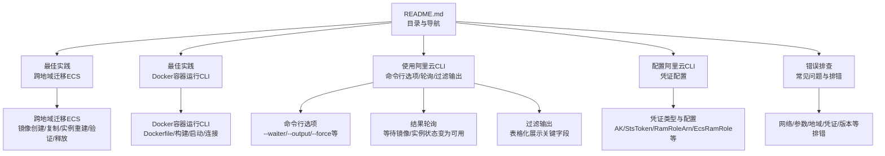
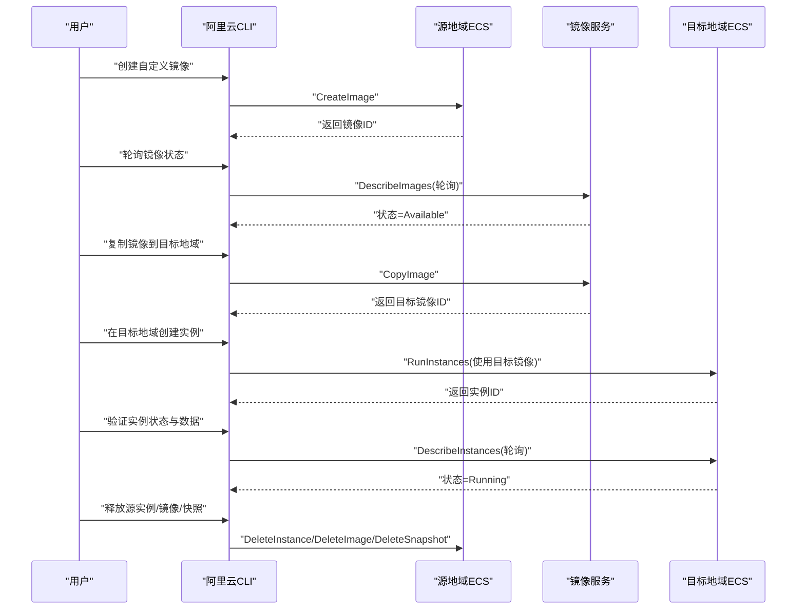
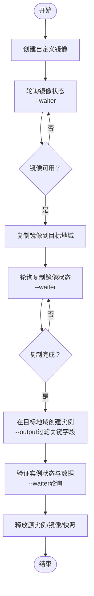
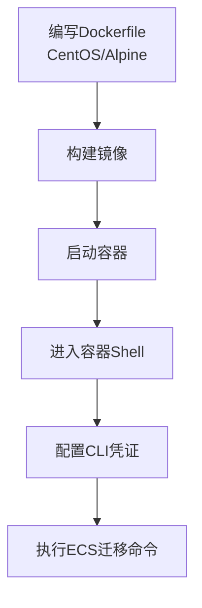
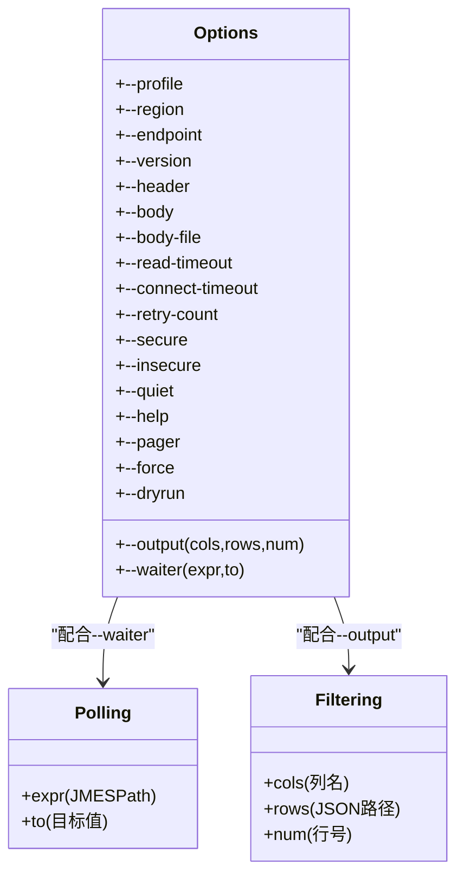
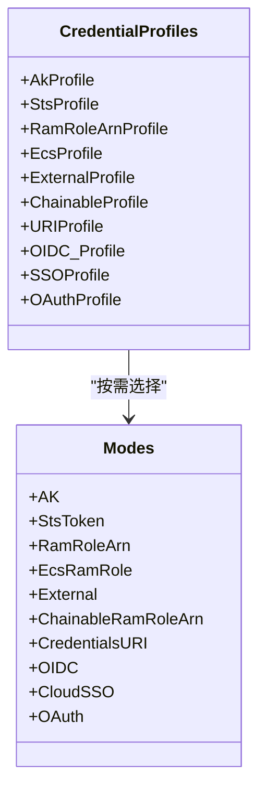
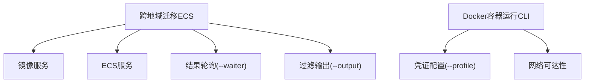

# 最佳实践

<cite>
**本文引用的文件**
- [use-alibaba-cloud-cli-to-migrate-ecs-instances-across-regions.md](file://alibaba-cloud/reference/06-最佳实践/use-alibaba-cloud-cli-to-migrate-ecs-instances-across-regions.md)
- [run-alibaba-cloud-cli-in-a-docker-container.md](file://alibaba-cloud/reference/06-最佳实践/run-alibaba-cloud-cli-in-a-docker-container.md)
- [README.md](file://alibaba-cloud/reference/README.md)
- [sample-commands.md](file://alibaba-cloud/reference/05-使用阿里云CLI/sample-commands.md)
- [command-line-options.md](file://alibaba-cloud/reference/05-使用阿里云CLI/command-line-options.md)
- [result-polling.md](file://alibaba-cloud/reference/05-使用阿里云CLI/result-polling.md)
- [filter-results-and-tabulate-output.md](file://alibaba-cloud/reference/05-使用阿里云CLI/filter-results-and-tabulate-output.md)
- [configure-credentials.md](file://alibaba-cloud/reference/04-配置阿里云CLI/configure-credentials.md)
- [cli-troubleshooting.md](file://alibaba-cloud/reference/08-错误排查/cli-troubleshooting.md)
</cite>

## 目录
1. [简介](#简介)
2. [项目结构](#项目结构)
3. [核心组件](#核心组件)
4. [架构总览](#架构总览)
5. [详细组件分析](#详细组件分析)
6. [依赖分析](#依赖分析)
7. [性能考虑](#性能考虑)
8. [故障排查指南](#故障排查指南)
9. [结论](#结论)
10. [附录](#附录)

## 简介
本最佳实践集合聚焦于阿里云CLI在真实生产环境中的落地应用，特别围绕“ECS实例跨地域迁移”的完整流程展开，涵盖镜像创建与复制、实例重建与验证、资源释放与清理等关键环节。同时提供在Docker容器中运行CLI的实操指南，帮助用户在隔离、可复现的环境中稳定执行自动化任务。文档以步骤化、可视化的方式呈现，配套注意事项与常见问题解决方案，便于不同技术背景的读者高效落地。

## 项目结构
该仓库按官方文档目录结构组织，便于按主题检索与复用。最佳实践相关的核心文件集中在“最佳实践”章节，配合“使用阿里云CLI”“配置阿里云CLI”“错误排查”等辅助文档，形成从安装、配置、调用、轮询、过滤输出到排错的完整闭环。

图表来源
- [README.md:1-89](file://alibaba-cloud/reference/README.md#L1-L89)
- [use-alibaba-cloud-cli-to-migrate-ecs-instances-across-regions.md:1-201](file://alibaba-cloud/reference/06-最佳实践/use-alibaba-cloud-cli-to-migrate-ecs-instances-across-regions.md#L1-L201)
- [run-alibaba-cloud-cli-in-a-docker-container.md:1-76](file://alibaba-cloud/reference/06-最佳实践/run-alibaba-cloud-cli-in-a-docker-container.md#L1-L76)
- [command-line-options.md:1-37](file://alibaba-cloud/reference/05-使用阿里云CLI/command-line-options.md#L1-L37)
- [result-polling.md:1-27](file://alibaba-cloud/reference/05-使用阿里云CLI/result-polling.md#L1-L27)
- [filter-results-and-tabulate-output.md:1-69](file://alibaba-cloud/reference/05-使用阿里云CLI/filter-results-and-tabulate-output.md#L1-L69)
- [configure-credentials.md:1-862](file://alibaba-cloud/reference/04-配置阿里云CLI/configure-credentials.md#L1-L862)
- [cli-troubleshooting.md:1-111](file://alibaba-cloud/reference/08-错误排查/cli-troubleshooting.md#L1-L111)

章节来源
- [README.md:1-89](file://alibaba-cloud/reference/README.md#L1-L89)

## 核心组件
- 跨地域迁移ECS最佳实践：覆盖镜像创建、镜像复制、目标实例创建、实例验证、资源释放的完整流程与注意事项。
- Docker容器运行CLI：提供CentOS与Alpine两种Dockerfile模板，指导构建、启动与连接容器，完成CLI配置与调用。
- CLI使用能力：命令行选项（如--waiter、--output、--force）、结果轮询、过滤输出等，支撑自动化与可观测性。
- 凭证配置：支持AK、StsToken、RamRoleArn、EcsRamRole、External、ChainableRamRoleArn、CredentialsURI、OIDC、CloudSSO、OAuth等多种模式，满足不同安全与运维场景。
- 故障排查：从网络、参数、地域、请求详情、凭证有效性到版本更新，提供系统化排错路径。

章节来源
- [use-alibaba-cloud-cli-to-migrate-ecs-instances-across-regions.md:1-201](file://alibaba-cloud/reference/06-最佳实践/use-alibaba-cloud-cli-to-migrate-ecs-instances-across-regions.md#L1-L201)
- [run-alibaba-cloud-cli-in-a-docker-container.md:1-76](file://alibaba-cloud/reference/06-最佳实践/run-alibaba-cloud-cli-in-a-docker-container.md#L1-L76)
- [command-line-options.md:1-37](file://alibaba-cloud/reference/05-使用阿里云CLI/command-line-options.md#L1-L37)
- [result-polling.md:1-27](file://alibaba-cloud/reference/05-使用阿里云CLI/result-polling.md#L1-L27)
- [filter-results-and-tabulate-output.md:1-69](file://alibaba-cloud/reference/05-使用阿里云CLI/filter-results-and-tabulate-output.md#L1-L69)
- [configure-credentials.md:1-862](file://alibaba-cloud/reference/04-配置阿里云CLI/configure-credentials.md#L1-L862)
- [cli-troubleshooting.md:1-111](file://alibaba-cloud/reference/08-错误排查/cli-troubleshooting.md#L1-L111)

## 架构总览
下图展示了跨地域迁移ECS的端到端流程：从源ECS实例出发，经由镜像创建与复制，再到目标地域实例重建与验证，最后在确认无误后释放源资源。该流程贯穿CLI命令、API调用、状态轮询与输出过滤，形成可观察、可回滚、可自动化的工作流。

图表来源
- [use-alibaba-cloud-cli-to-migrate-ecs-instances-across-regions.md:36-188](file://alibaba-cloud/reference/06-最佳实践/use-alibaba-cloud-cli-to-migrate-ecs-instances-across-regions.md#L36-L188)
- [result-polling.md:1-27](file://alibaba-cloud/reference/05-使用阿里云CLI/result-polling.md#L1-L27)

## 详细组件分析

### 组件A：跨地域迁移ECS（镜像创建与复制、实例重建与验证）
- 流程概览
  - 创建镜像：在源地域为ECS实例创建自定义镜像，必要时先停止实例以保证一致性。
  - 复制镜像：将镜像复制到目标地域，获得目标镜像ID。
  - 新建实例：在目标地域使用复制的镜像创建ECS实例，注意网络类型与规格库存限制。
  - 检查实例：通过轮询与过滤输出确认实例状态与关键字段，验证业务可用性。
  - 释放资源：在确认迁移成功后，按需释放源实例、镜像与快照，避免持续计费。
- 关键要点
  - 元数据变化：新实例的实例元数据会重新生成，需更新集群内私网IP、许可证绑定等。
  - 公网IP处理：如需保留公网IP，可先转换为弹性公网IP（EIP），迁移后重新绑定。
  - 本地盘与本地SSD：部分实例规格不支持创建包含系统盘与数据盘的镜像，需提前评估。
  - 输出过滤与轮询：使用--output与--waiter提升可观测性与自动化效率。
- 常见问题
  - 镜像状态长时间未变为Available：检查快照计费与地域可用区库存。
  - 实例规格无库存：提前规划目标地域与可用区的规格。
  - 元数据变更导致业务异常：迁移前后更新资源关联关系。

图表来源
- [use-alibaba-cloud-cli-to-migrate-ecs-instances-across-regions.md:36-188](file://alibaba-cloud/reference/06-最佳实践/use-alibaba-cloud-cli-to-migrate-ecs-instances-across-regions.md#L36-L188)
- [result-polling.md:1-27](file://alibaba-cloud/reference/05-使用阿里云CLI/result-polling.md#L1-L27)
- [filter-results-and-tabulate-output.md:1-69](file://alibaba-cloud/reference/05-使用阿里云CLI/filter-results-and-tabulate-output.md#L1-L69)

章节来源
- [use-alibaba-cloud-cli-to-migrate-ecs-instances-across-regions.md:1-201](file://alibaba-cloud/reference/06-最佳实践/use-alibaba-cloud-cli-to-migrate-ecs-instances-across-regions.md#L1-L201)

### 组件B：在Docker容器中运行阿里云CLI
- 方案概览
  - CentOS与Alpine两种Dockerfile模板，分别适配不同基础镜像。
  - 构建镜像、启动容器、进入容器内部执行CLI命令与配置。
  - 注意ARM架构与Alpine的动态链接库兼容性。
- 实操步骤
  - 编写Dockerfile并构建镜像。
  - 启动容器并进入交互式Shell。
  - 在容器内配置CLI凭证，随后执行ECS迁移相关命令。
- 适用场景
  - CI/CD流水线中的隔离执行环境。
  - 临时任务的快速部署与清理。
  - 多版本CLI对比与回归测试。

图表来源
- [run-alibaba-cloud-cli-in-a-docker-container.md:1-76](file://alibaba-cloud/reference/06-最佳实践/run-alibaba-cloud-cli-in-a-docker-container.md#L1-L76)

章节来源
- [run-alibaba-cloud-cli-in-a-docker-container.md:1-76](file://alibaba-cloud/reference/06-最佳实践/run-alibaba-cloud-cli-in-a-docker-container.md#L1-L76)

### 组件C：CLI使用能力（命令行选项、结果轮询、过滤输出）
- 命令行选项
  - --profile/--region/--endpoint/--version/--header/--body/--body-file/--read-timeout/--connect-timeout/--retry-count/--secure/--insecure/--quiet/--help/--output/--pager/--force/--waiter/--dryrun等。
- 结果轮询
  - 使用--waiter表达式与目标值，对镜像状态、实例状态等进行轮询，直至满足条件。
- 过滤输出
  - 使用--output的cols/rows/num字段，将复杂JSON结构化结果表格化输出，便于观测与自动化处理。

图表来源
- [command-line-options.md:1-37](file://alibaba-cloud/reference/05-使用阿里云CLI/command-line-options.md#L1-L37)
- [result-polling.md:1-27](file://alibaba-cloud/reference/05-使用阿里云CLI/result-polling.md#L1-L27)
- [filter-results-and-tabulate-output.md:1-69](file://alibaba-cloud/reference/05-使用阿里云CLI/filter-results-and-tabulate-output.md#L1-L69)

章节来源
- [command-line-options.md:1-37](file://alibaba-cloud/reference/05-使用阿里云CLI/command-line-options.md#L1-L37)
- [result-polling.md:1-27](file://alibaba-cloud/reference/05-使用阿里云CLI/result-polling.md#L1-L27)
- [filter-results-and-tabulate-output.md:1-69](file://alibaba-cloud/reference/05-使用阿里云CLI/filter-results-and-tabulate-output.md#L1-L69)

### 组件D：凭证配置与切换
- 支持凭证类型
  - AK、StsToken、RamRoleArn、EcsRamRole、External、ChainableRamRoleArn、CredentialsURI、OIDC、CloudSSO、OAuth。
- 配置方式
  - 交互式与非交互式配置，支持多配置文件（profile）切换与优先级管理。
- 安全建议
  - 优先使用RAM用户AccessKey；在容器或CI中推荐使用EcsRamRole或OIDC等免密访问模式。

图表来源
- [configure-credentials.md:1-862](file://alibaba-cloud/reference/04-配置阿里云CLI/configure-credentials.md#L1-L862)

章节来源
- [configure-credentials.md:1-862](file://alibaba-cloud/reference/04-配置阿里云CLI/configure-credentials.md#L1-L862)

### 组件E：示例命令与OpenAPI门户
- 通过OpenAPI门户生成CLI命令示例，便于快速获取参数与调用方式。
- 示例命令展示如何创建按量付费ECS实例，包含关键参数与输出结构。

章节来源
- [sample-commands.md:1-66](file://alibaba-cloud/reference/05-使用阿里云CLI/sample-commands.md#L1-L66)

## 依赖分析
- 组件耦合
  - 跨地域迁移流程强依赖镜像服务与ECS服务；轮询与过滤输出提升可观测性与自动化能力。
  - Docker容器运行CLI依赖凭证配置与网络可达性。
- 外部依赖
  - 阿里云OpenAPI服务、凭证提供方（RAM/STS/OIDC/SSO/OAuth等）。
- 潜在风险
  - 地域与可用区库存限制、镜像/快照计费、实例元数据变更带来的业务影响。

图表来源
- [use-alibaba-cloud-cli-to-migrate-ecs-instances-across-regions.md:36-188](file://alibaba-cloud/reference/06-最佳实践/use-alibaba-cloud-cli-to-migrate-ecs-instances-across-regions.md#L36-L188)
- [command-line-options.md:1-37](file://alibaba-cloud/reference/05-使用阿里云CLI/command-line-options.md#L1-L37)
- [run-alibaba-cloud-cli-in-a-docker-container.md:1-76](file://alibaba-cloud/reference/06-最佳实践/run-alibaba-cloud-cli-in-a-docker-container.md#L1-L76)
- [configure-credentials.md:1-862](file://alibaba-cloud/reference/04-配置阿里云CLI/configure-credentials.md#L1-L862)

## 性能考虑
- 轮询频率与超时
  - 合理设置--waiter轮询表达式与目标值，避免过于频繁导致API压力；结合--read-timeout/--connect-timeout控制I/O与连接超时。
- 输出过滤
  - 使用--output仅提取关键字段，减少解析与传输开销，提升脚本处理效率。
- 资源规划
  - 提前确认目标地域与可用区的规格库存，避免因缺货导致重试与延迟。
- 容器化执行
  - 在Docker中复用缓存层与最小化镜像，缩短构建与启动时间；合理设置环境变量与凭证注入策略。

## 故障排查指南
- 一般排查步骤
  - 检查网络连通性与DNS解析；确认命令与参数格式正确；核对地域与接入点优先级；使用--dryrun模拟请求；启用日志输出定位问题。
- 凭证相关
  - 检查当前使用的配置（--profile/环境变量/当前配置）；校验凭证信息与权限；针对RamRoleArn/EcsRamRole等模式检查Provider与权限策略。
- 常见问题
  - “找不到aliyun命令”“required parameters not assigned”“网络连接超时”“凭证无效”等，按指引逐一验证。
- 版本与更新
  - 若命令或参数格式正确但CLI报错，尝试更新到最新版本以获得最新支持。

章节来源
- [cli-troubleshooting.md:1-111](file://alibaba-cloud/reference/08-错误排查/cli-troubleshooting.md#L1-L111)

## 结论
通过本最佳实践集合，用户可以基于阿里云CLI完成ECS实例的跨地域迁移，覆盖镜像创建与复制、实例重建与验证、资源释放与清理的全流程，并在Docker容器中稳定运行CLI以提升可复现性与安全性。配合命令行选项、结果轮询与过滤输出，可显著增强自动化与可观测性。同时，完善的凭证配置与故障排查机制，有助于在复杂环境中快速定位与解决问题。

## 附录
- 相关文档与链接
  - OpenAPI门户与CLI GitHub仓库、官方文档中心等，便于进一步学习与查阅。

章节来源
- [README.md:84-89](file://alibaba-cloud/reference/README.md#L84-L89)