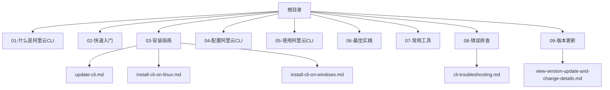
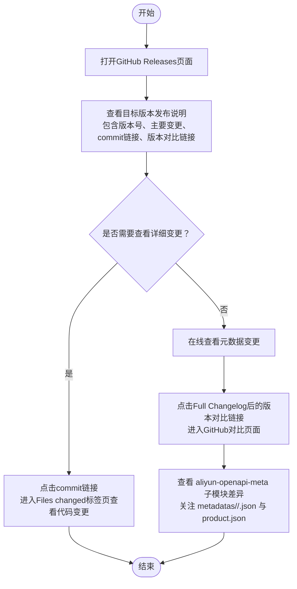
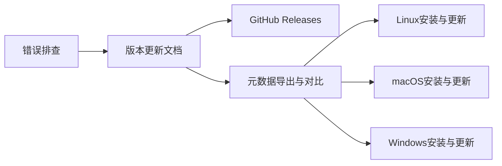

# 版本更新

<cite>
**本文引用的文件**
- [view-version-update-and-change-details.md](file://alibaba-cloud/reference/09-版本更新/view-version-update-and-change-details.md)
- [README.md](file://alibaba-cloud/reference/README.md)
- [update-cli.md](file://alibaba-cloud/reference/03-安装指南/update-cli.md)
- [install-cli-on-linux.md](file://alibaba-cloud/reference/03-安装指南/install-cli-on-linux.md)
- [install-cli-on-windows.md](file://alibaba-cloud/reference/03-安装指南/install-cli-on-windows.md)
- [cli-troubleshooting.md](file://alibaba-cloud/reference/08-错误排查/cli-troubleshooting.md)
</cite>

## 目录
1. [简介](#简介)
2. [项目结构](#项目结构)
3. [核心组件](#核心组件)
4. [架构总览](#架构总览)
5. [详细组件分析](#详细组件分析)
6. [依赖关系分析](#依赖关系分析)
7. [性能考量](#性能考量)
8. [故障排查指南](#故障排查指南)
9. [结论](#结论)
10. [附录](#附录)

## 简介
本章节面向需要了解阿里云CLI版本演进与变更详情的用户，提供如何查看版本更新、API元数据变更以及如何进行版本对比的完整流程说明。文档强调通过官方GitHub Releases页面获取变更日志，并结合元数据导出与对比，帮助用户理解新版本的功能改进、问题修复与性能优化，从而及时更新到最新版本以获得更好的使用体验与功能支持。

## 项目结构
本仓库按“阿里云官方文档中心”的目录结构组织，便于查阅。版本更新相关内容位于“09-版本更新”目录下，配套的安装、更新与故障排查文档分布在“03-安装指南”“08-错误排查”等目录中。

图表来源
- [README.md:11-81](file://alibaba-cloud/reference/README.md#L11-L81)

章节来源
- [README.md:11-81](file://alibaba-cloud/reference/README.md#L11-L81)

## 核心组件
- 版本更新查看流程：通过GitHub Releases页面获取每个版本的主要变更、commit链接与版本对比链接，必要时进一步查看Files changed以了解具体代码变更。
- API元数据变更查看：在线查看通过Full Changelog的版本对比链接，定位到aliyun-openapi-meta子模块差异；本地对比通过导出元数据并在新旧版本间比较metadatas目录差异。
- 元数据结构示例：提供API元数据与云产品元数据的典型字段说明，帮助理解元数据的用途与结构。

章节来源
- [view-version-update-and-change-details.md:5-32](file://alibaba-cloud/reference/09-版本更新/view-version-update-and-change-details.md#L5-L32)
- [view-version-update-and-change-details.md:34-79](file://alibaba-cloud/reference/09-版本更新/view-version-update-and-change-details.md#L34-L79)

## 架构总览
下图展示了“查看版本更新与变更详情”的整体流程，从用户发起到获取变更信息与元数据对比的全过程。

图表来源
- [view-version-update-and-change-details.md:9-26](file://alibaba-cloud/reference/09-版本更新/view-version-update-and-change-details.md#L9-L26)

章节来源
- [view-version-update-and-change-details.md:9-26](file://alibaba-cloud/reference/09-版本更新/view-version-update-and-change-details.md#L9-L26)

## 详细组件分析

### 组件A：查看主要变更
- 操作步骤
  1) 访问阿里云CLI的GitHub Releases页面，查找目标版本的发布说明。
  2) 在发布说明中查看版本号、主要变更及对应commit链接、版本对比链接。
  3) 如需查看详细变更信息，点击commit链接，在Files changed标签页查看对应的代码变更。
- 适用场景
  - 用户希望快速了解某版本的新增功能、修复问题与依赖库更新等主要变更。
  - 需要追溯具体变更的代码范围时，通过commit链接深入查看。

章节来源
- [view-version-update-and-change-details.md:9-13](file://alibaba-cloud/reference/09-版本更新/view-version-update-and-change-details.md#L9-L13)

### 组件B：查看API元数据变更（在线）
- 操作步骤
  1) 访问阿里云CLI的GitHub Releases页面，查找目标版本的发布说明。
  2) 点击Full Changelog后的版本对比链接，进入GitHub的对比页面。
  3) 在该页面中查看 aliyun-openapi-meta 子模块差异，重点关注：
     - metadatas/<PRODUCT_NAME>/<API_Name>.json - API接口定义
     - metadatas/product.json - 云产品信息
- 说明
  - 本文所述API元数据专为构建阿里云CLI而设计，与通过OpenAPI门户获取的OpenAPI元数据存在差异。

章节来源
- [view-version-update-and-change-details.md:20-26](file://alibaba-cloud/reference/09-版本更新/view-version-update-and-change-details.md#L20-L26)
- [view-version-update-and-change-details.md:17-18](file://alibaba-cloud/reference/09-版本更新/view-version-update-and-change-details.md#L17-L18)

### 组件C：查看API元数据变更（本地对比）
- 操作步骤
  1) 从当前版本中导出元数据。
  2) 更新阿里云CLI至目标版本，再次执行导出操作。
  3) 对比版本更新前后 metadatas 目录下的元数据差异。
- 适用场景
  - 用户希望在本地环境中直接对比新旧版本的元数据变化，便于评估对自动化脚本与集成的影响。

章节来源
- [view-version-update-and-change-details.md:28-32](file://alibaba-cloud/reference/09-版本更新/view-version-update-and-change-details.md#L28-L32)

### 组件D：元数据结构示例
- API元数据文件示例
  - 字段包括：name、protocol、method、pathPattern、parameters等，用于描述API的调用方式与参数结构。
- 云产品元数据文件示例
  - 字段包括：products数组，包含code、version、name（多语言）、location_service_code、regional_endpoints、global_endpoint、api_style、apis等，用于描述产品与API集合。
- 作用
  - 帮助用户理解元数据的结构与用途，便于在版本更新后评估API与产品信息的变化。

章节来源
- [view-version-update-and-change-details.md:34-79](file://alibaba-cloud/reference/09-版本更新/view-version-update-and-change-details.md#L34-L79)

### 组件E：版本更新与变更说明（安装与更新）
- 更新注意事项
  - 建议使用与初始安装方法一致的更新渠道，避免版本混淆与兼容性问题。
  - 自定义安装路径需保持一致，必要时先卸载后再重新安装。
- 更新步骤（Linux/macOS/Windows）
  - 通过脚本安装包更新、TGZ安装包更新、Homebrew更新（macOS）等。
  - Windows可通过ZIP安装包或PowerShell脚本更新。
- 版本号验证
  - 更新完成后执行版本查询命令，确认当前版本号。

章节来源
- [update-cli.md:5-17](file://alibaba-cloud/reference/03-安装指南/update-cli.md#L5-L17)
- [update-cli.md:18-126](file://alibaba-cloud/reference/03-安装指南/update-cli.md#L18-L126)
- [install-cli-on-linux.md:80-92](file://alibaba-cloud/reference/03-安装指南/install-cli-on-linux.md#L80-L92)
- [install-cli-on-windows.md:147-159](file://alibaba-cloud/reference/03-安装指南/install-cli-on-windows.md#L147-L159)

## 依赖关系分析
- 文档间的依赖
  - “版本更新”文档依赖于“安装指南”中的更新与安装流程，以便用户在了解变更后执行相应更新。
  - “错误排查”文档中提及若命令或参数无误但CLI仍报错，建议更新到最新版本，体现了版本更新对问题解决的重要性。
- 外部依赖
  - GitHub Releases作为版本变更信息的权威来源，提供发布说明、版本对比链接与commit链接。
  - aliyun-openapi-meta子模块作为元数据来源，影响CLI对API与产品的支持范围。

图表来源
- [view-version-update-and-change-details.md:9-26](file://alibaba-cloud/reference/09-版本更新/view-version-update-and-change-details.md#L9-L26)
- [update-cli.md:18-126](file://alibaba-cloud/reference/03-安装指南/update-cli.md#L18-L126)
- [cli-troubleshooting.md:84-86](file://alibaba-cloud/reference/08-错误排查/cli-troubleshooting.md#L84-L86)

章节来源
- [view-version-update-and-change-details.md:9-26](file://alibaba-cloud/reference/09-版本更新/view-version-update-and-change-details.md#L9-L26)
- [update-cli.md:18-126](file://alibaba-cloud/reference/03-安装指南/update-cli.md#L18-L126)
- [cli-troubleshooting.md:84-86](file://alibaba-cloud/reference/08-错误排查/cli-troubleshooting.md#L84-L86)

## 性能考量
- 版本更新频率与变更粒度
  - 定期更新有助于减少大规模变更带来的兼容性风险，建议优先采用小步快跑的更新策略。
- 元数据变更对性能的影响
  - 元数据变更可能影响CLI对API的解析与调用效率，建议在更新后进行关键命令的基准测试，确保性能稳定。
- 网络与下载
  - 中国大陆用户在使用Homebrew更新时可能受网络影响，可考虑使用国内镜像源以提升更新速度与成功率。

## 故障排查指南
- 常见问题与处理建议
  - 命令不存在或无法识别可用参数：建议更新到最新版本的阿里云CLI，以获得最新的命令与参数支持。
  - 版本不一致：执行版本查询命令核对当前版本，确保与预期版本一致。
  - 无法识别命令或字符串解析异常：检查CLI版本是否过旧，必要时重新安装或更新。
  - 网络连接超时：检查网络环境或使用国内镜像源重试。
  - 凭证无效：确认凭证配置正确，必要时重新配置。
- 相关文档
  - 可参考错误排查文档中的常见问题与技术支持入口，获取进一步帮助。

章节来源
- [cli-troubleshooting.md:84-106](file://alibaba-cloud/reference/08-错误排查/cli-troubleshooting.md#L84-L106)

## 结论
通过本指南，用户可以系统地了解阿里云CLI的版本更新流程与变更详情，掌握在线查看与本地对比两种元数据变更方式，并在遇到问题时优先考虑更新到最新版本以获得更好的使用体验与功能支持。建议将版本更新纳入日常运维流程，定期关注GitHub Releases中的变更日志，确保CLI能力与阿里云服务保持同步。

## 附录
- 相关链接
  - 阿里云CLI GitHub仓库：https://github.com/aliyun/aliyun-cli
  - OpenAPI门户：https://api.aliyun.com/
  - 阿里云官方文档中心：https://help.aliyun.com/zh/cli/