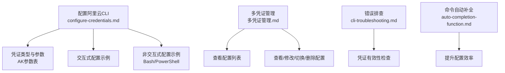
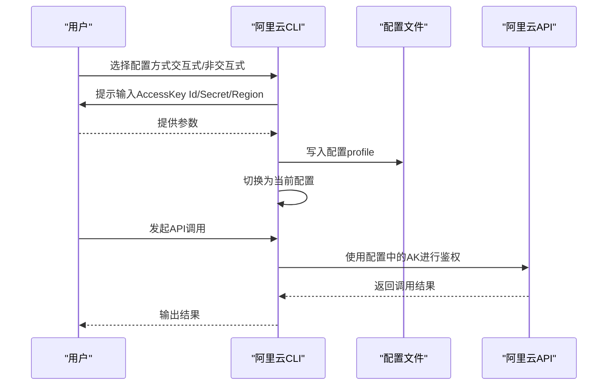
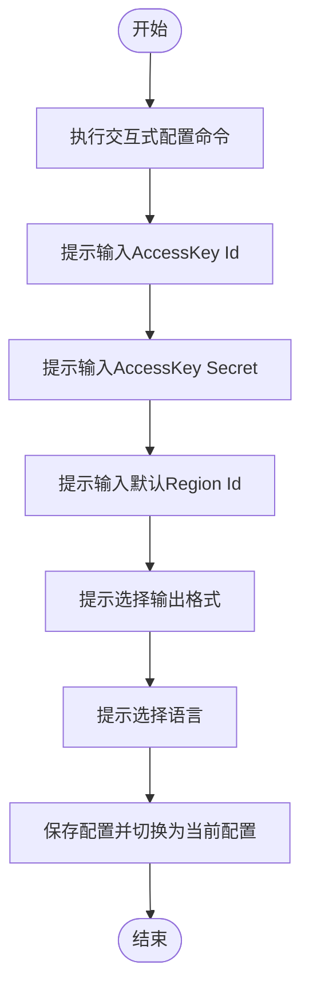
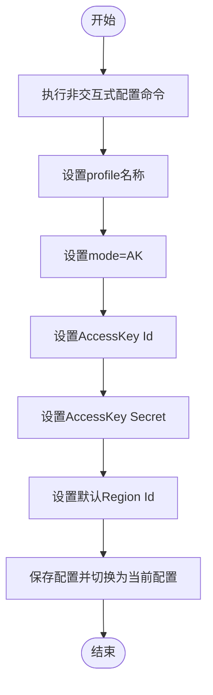
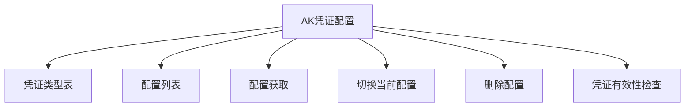

# AK凭证类型

<cite>
**本文引用的文件**
- [configure-credentials.md](file://alibaba-cloud/reference/04-配置阿里云CLI/configure-credentials.md)
- [多凭证管理.md](file://alibaba-cloud/reference/04-配置阿里云CLI/多凭证管理.md)
- [cli-troubleshooting.md](file://alibaba-cloud/reference/08-错误排查/cli-troubleshooting.md)
- [auto-completion-function.md](file://alibaba-cloud/reference/04-配置阿里云CLI/auto-completion-function.md)
</cite>

## 目录
1. [简介](#简介)
2. [项目结构](#项目结构)
3. [核心组件](#核心组件)
4. [架构总览](#架构总览)
5. [详细组件分析](#详细组件分析)
6. [依赖关系分析](#依赖关系分析)
7. [性能考量](#性能考量)
8. [故障排查指南](#故障排查指南)
9. [结论](#结论)
10. [附录](#附录)

## 简介
本指南面向使用阿里云CLI的用户，系统讲解AK（AccessKey）凭证类型的配置与使用。内容涵盖：
- AK凭证的基本概念、适用场景与安全注意事项
- AccessKey Id、AccessKey Secret、Region Id等关键参数的配置方法
- 交互式与非交互式两种配置方式（含Bash与PowerShell示例）
- 手动刷新策略与免密钥访问不支持的特性说明
- 配置验证与常见问题排查方法

## 项目结构
本仓库与AK凭证配置直接相关的文档集中在“配置阿里云CLI”章节，其中：
- configure-credentials.md：权威的凭证类型与配置说明，包含AK的参数表、交互/非交互式配置示例
- 多凭证管理.md：提供配置列表、查看、切换、删除等管理命令
- cli-troubleshooting.md：提供凭证相关错误排查步骤
- auto-completion-function.md：命令自动补全功能，辅助高效配置

图表来源
- [configure-credentials.md:1-150](file://alibaba-cloud/reference/04-配置阿里云CLI/configure-credentials.md#L1-L150)
- [多凭证管理.md:1-120](file://alibaba-cloud/reference/04-配置阿里云CLI/多凭证管理.md#L1-L120)
- [cli-troubleshooting.md:50-80](file://alibaba-cloud/reference/08-错误排查/cli-troubleshooting.md#L50-L80)
- [auto-completion-function.md:1-20](file://alibaba-cloud/reference/04-配置阿里云CLI/auto-completion-function.md#L1-L20)

章节来源
- [configure-credentials.md:1-150](file://alibaba-cloud/reference/04-配置阿里云CLI/configure-credentials.md#L1-L150)
- [多凭证管理.md:1-120](file://alibaba-cloud/reference/04-配置阿里云CLI/多凭证管理.md#L1-L120)
- [cli-troubleshooting.md:50-80](file://alibaba-cloud/reference/08-错误排查/cli-troubleshooting.md#L50-L80)
- [auto-completion-function.md:1-20](file://alibaba-cloud/reference/04-配置阿里云CLI/auto-completion-function.md#L1-L20)

## 核心组件
- 凭证类型与参数
  - AK类型为默认凭证类型，使用AccessKey信息作为身份凭证
  - 关键参数：AccessKey Id、AccessKey Secret、Region Id
- 配置方式
  - 交互式：通过交互式命令逐步输入参数
  - 非交互式：通过命令行参数一次性设置
- 刷新策略与免密访问
  - AK凭证采用手动刷新策略
  - 不支持免密钥访问（即不支持无需AccessKey即可访问）

章节来源
- [configure-credentials.md:65-120](file://alibaba-cloud/reference/04-配置阿里云CLI/configure-credentials.md#L65-L120)
- [configure-credentials.md:82-98](file://alibaba-cloud/reference/04-配置阿里云CLI/configure-credentials.md#L82-L98)

## 架构总览
AK凭证配置在CLI中的整体流程如下：
- 选择配置方式（交互式/非交互式）
- 输入必要参数（AccessKey Id、AccessKey Secret、Region Id）
- 保存配置并切换为当前配置
- 使用配置进行API调用
- 验证配置有效性并进行故障排查

图表来源
- [configure-credentials.md:15-64](file://alibaba-cloud/reference/04-配置阿里云CLI/configure-credentials.md#L15-L64)
- [多凭证管理.md:160-181](file://alibaba-cloud/reference/04-配置阿里云CLI/多凭证管理.md#L160-L181)

章节来源
- [configure-credentials.md:15-64](file://alibaba-cloud/reference/04-配置阿里云CLI/configure-credentials.md#L15-L64)
- [多凭证管理.md:160-181](file://alibaba-cloud/reference/04-配置阿里云CLI/多凭证管理.md#L160-L181)

## 详细组件分析

### AK凭证参数与适用场景
- 参数说明
  - AccessKey Id：AccessKey标识
  - AccessKey Secret：AccessKey密钥
  - Region Id：默认地域
- 适用场景
  - 通过RAM用户创建的AccessKey进行API访问
  - 适用于需要直接使用AccessKey进行鉴权的自动化脚本与CI/CD流水线
- 安全建议
  - 为API访问创建专用RAM用户并生成AccessKey
  - 定期轮换AccessKey，避免长期使用同一密钥

章节来源
- [configure-credentials.md:82-98](file://alibaba-cloud/reference/04-配置阿里云CLI/configure-credentials.md#L82-L98)

### 交互式配置流程
- 命令语法
  - 通过交互式命令逐步输入参数
- 典型交互过程
  - 输入AccessKey Id、AccessKey Secret、默认Region Id、输出格式、语言等
- 适用场景
  - 新手用户快速上手
  - 需要逐步确认参数的场景

图表来源
- [configure-credentials.md:15-46](file://alibaba-cloud/reference/04-配置阿里云CLI/configure-credentials.md#L15-L46)
- [configure-credentials.md:103-122](file://alibaba-cloud/reference/04-配置阿里云CLI/configure-credentials.md#L103-L122)

章节来源
- [configure-credentials.md:15-46](file://alibaba-cloud/reference/04-配置阿里云CLI/configure-credentials.md#L15-L46)
- [configure-credentials.md:103-122](file://alibaba-cloud/reference/04-配置阿里云CLI/configure-credentials.md#L103-L122)

### 非交互式配置流程（Bash/PowerShell）
- 命令语法
  - 使用非交互式命令一次性设置参数
- Bash示例
  - 包含profile、mode、AccessKey Id/Secret、region等参数
- PowerShell示例
  - 使用反引号进行续行，参数与Bash一致
- 适用场景
  - 自动化部署、容器化环境、CI/CD流水线

图表来源
- [configure-credentials.md:47-64](file://alibaba-cloud/reference/04-配置阿里云CLI/configure-credentials.md#L47-L64)
- [configure-credentials.md:123-146](file://alibaba-cloud/reference/04-配置阿里云CLI/configure-credentials.md#L123-L146)

章节来源
- [configure-credentials.md:47-64](file://alibaba-cloud/reference/04-配置阿里云CLI/configure-credentials.md#L47-L64)
- [configure-credentials.md:123-146](file://alibaba-cloud/reference/04-配置阿里云CLI/configure-credentials.md#L123-L146)

### 配置验证与管理
- 查看配置列表
  - 使用配置列表命令查看各profile的状态与基本信息
- 查看指定配置
  - 使用配置获取命令查看profile的详细设置
- 切换当前配置
  - 将指定profile切换为当前生效配置
- 删除配置
  - 删除不再使用的profile，注意保留至少一个配置

章节来源
- [多凭证管理.md:99-181](file://alibaba-cloud/reference/04-配置阿里云CLI/多凭证管理.md#L99-L181)

### 刷新策略与免密访问
- 刷新策略
  - AK凭证采用手动刷新策略，需定期更新AccessKey Id/Secret
- 免密访问
  - AK凭证不支持免密钥访问，必须提供有效的AccessKey信息

章节来源
- [configure-credentials.md:69-81](file://alibaba-cloud/reference/04-配置阿里云CLI/configure-credentials.md#L69-L81)

## 依赖关系分析
AK凭证配置与其他模块的关系如下：
- 与凭证类型表的耦合：AK凭证参数与凭证类型表保持一致
- 与多凭证管理的耦合：配置列表、查看、切换、删除等命令依赖配置文件
- 与错误排查的耦合：凭证有效性检查与配置列表/获取命令密切相关

图表来源
- [configure-credentials.md:65-81](file://alibaba-cloud/reference/04-配置阿里云CLI/configure-credentials.md#L65-L81)
- [多凭证管理.md:99-181](file://alibaba-cloud/reference/04-配置阿里云CLI/多凭证管理.md#L99-L181)
- [cli-troubleshooting.md:52-80](file://alibaba-cloud/reference/08-错误排查/cli-troubleshooting.md#L52-L80)

章节来源
- [configure-credentials.md:65-81](file://alibaba-cloud/reference/04-配置阿里云CLI/configure-credentials.md#L65-L81)
- [多凭证管理.md:99-181](file://alibaba-cloud/reference/04-配置阿里云CLI/多凭证管理.md#L99-L181)
- [cli-troubleshooting.md:52-80](file://alibaba-cloud/reference/08-错误排查/cli-troubleshooting.md#L52-L80)

## 性能考量
- 配置加载与切换
  - 切换当前配置为轻量操作，对性能影响可忽略
- API调用性能
  - AK凭证本身不引入额外鉴权开销，性能主要受网络与API调用影响
- 自动补全
  - 开启命令自动补全可减少输入错误，间接提升整体效率

[本节为通用指导，不涉及具体文件分析]

## 故障排查指南
- 凭证有效性检查
  - 使用配置列表与获取命令核对当前配置与参数
- 常见问题定位
  - 网络状态、命令格式、地域与接入点、请求详情、凭证模式与权限
- 重新安装或更新CLI
  - 若命令不存在或参数无法识别，考虑更新到最新版本

章节来源
- [cli-troubleshooting.md:52-80](file://alibaba-cloud/reference/08-错误排查/cli-troubleshooting.md#L52-L80)

## 结论
AK凭证是阿里云CLI的默认凭证类型，适合通过RAM用户AccessKey进行API访问。配置时应优先采用专用RAM用户并定期轮换密钥，结合交互式与非交互式两种方式满足不同场景需求。通过多凭证管理命令可高效维护配置，配合错误排查与自动补全功能，可显著提升配置与使用的可靠性与效率。

[本节为总结性内容，不涉及具体文件分析]

## 附录
- 命令自动补全
  - 支持zsh、bash，可提升配置效率
- 快速开始
  - 在VS Code插件中使用CLI进行ECS操作示例（与AK配置协同）

章节来源
- [auto-completion-function.md:1-20](file://alibaba-cloud/reference/04-配置阿里云CLI/auto-completion-function.md#L1-L20)
- [use-alibaba-cloud-cli-visual-studio-code-plug-in.md:1-67](file://alibaba-cloud/reference/02-快速入门/use-alibaba-cloud-cli-visual-studio-code-plug-in.md#L1-L67)