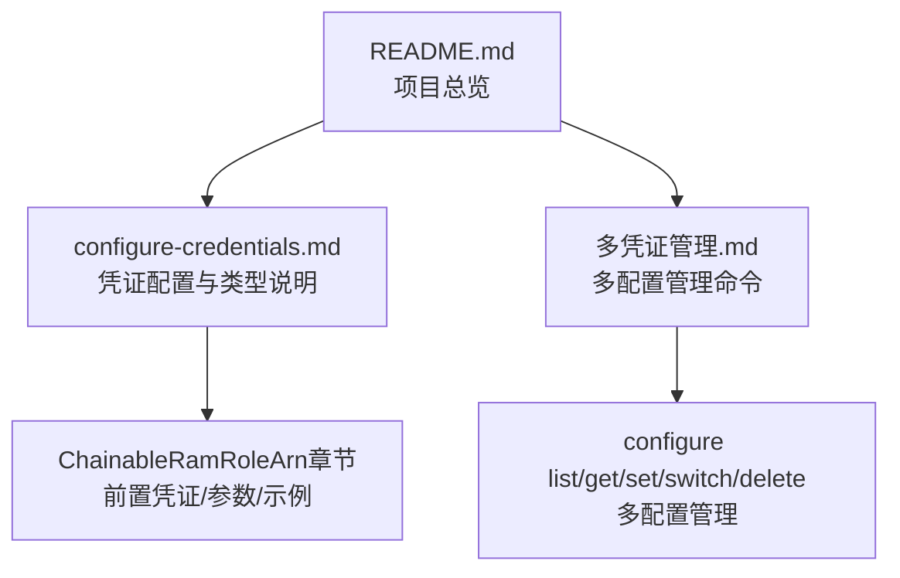
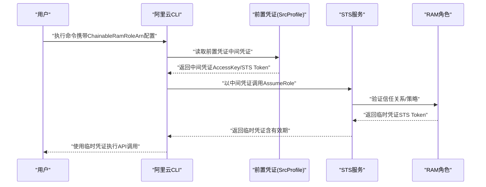

# ChainableRamRoleArn凭证类型

<cite>
**本文引用的文件**
- [configure-credentials.md](file://alibaba-cloud/reference/04-配置阿里云CLI/configure-credentials.md)
- [多凭证管理.md](file://alibaba-cloud/reference/04-配置阿里云CLI/多凭证管理.md)
- [README.md](file://alibaba-cloud/reference/README.md)
</cite>

## 目录
1. [简介](#简介)
2. [项目结构](#项目结构)
3. [核心组件](#核心组件)
4. [架构总览](#架构总览)
5. [详细组件分析](#详细组件分析)
6. [依赖关系分析](#依赖关系分析)
7. [性能考量](#性能考量)
8. [故障排查指南](#故障排查指南)
9. [结论](#结论)
10. [附录](#附录)

## 简介
本指南围绕阿里云CLI中的ChainableRamRoleArn（链式RAM角色扮演）凭证类型展开，系统讲解其多层授权机制、前置凭证（Source Profile）概念、关键参数配置方法，以及交互式与非交互式配置流程。同时，结合RAM角色扮演的权限传递与刷新策略，给出权限配置建议与最佳实践，帮助读者在生产环境中安全、稳定地使用链式角色扮演凭证。

## 项目结构
本仓库为阿里云CLI官方文档的整理版，其中与ChainableRamRoleArn直接相关的内容集中在“配置阿里云CLI”章节下的“配置凭证”与“多凭证管理”两篇文档中。ChainableRamRoleArn属于凭证类型之一，其配置与使用与其他凭证类型共享同一套CLI命令体系。

图表来源
- [README.md:11-41](file://alibaba-cloud/reference/README.md#L11-L41)
- [configure-credentials.md:65-81](file://alibaba-cloud/reference/04-配置阿里云CLI/configure-credentials.md#L65-L81)
- [多凭证管理.md:5-181](file://alibaba-cloud/reference/04-配置阿里云CLI/多凭证管理.md#L5-L181)

章节来源
- [README.md:11-41](file://alibaba-cloud/reference/README.md#L11-L41)

## 核心组件
- 凭证类型总览：ChainableRamRoleArn在凭证类型表中明确标注“遵循前置凭证刷新策略”，并支持免密钥访问。
- 前置凭证（Source Profile）：ChainableRamRoleArn通过指定一个前置身份凭证配置，从前置配置中获取中间凭证（AccessKey或STS Token），再基于中间凭证完成角色扮演，获取最终的临时身份凭证（STS Token）。
- 关键参数：
  - Source Profile：前置身份凭证配置名称
  - STS Region：获取STS Token时发起调用的地域
  - Ram Role Arn：需要扮演的RAM角色ARN
  - Role Session Name：角色会话名称
  - External Id：角色外部ID（用于防混淆代理人）
  - Expired Seconds：凭证失效时间（秒）
  - Region Id：默认地域

章节来源
- [configure-credentials.md:69-81](file://alibaba-cloud/reference/04-配置阿里云CLI/configure-credentials.md#L69-L81)
- [configure-credentials.md:443-463](file://alibaba-cloud/reference/04-配置阿里云CLI/configure-credentials.md#L443-L463)
- [configure-credentials.md:452-462](file://alibaba-cloud/reference/04-配置阿里云CLI/configure-credentials.md#L452-L462)

## 架构总览
ChainableRamRoleArn的链式授权由两层组成：
- 第一层：前置凭证（Source Profile）提供中间凭证（AccessKey或STS Token）
- 第二层：基于中间凭证调用STS AssumeRole，获取最终的临时身份凭证（STS Token）

图表来源
- [configure-credentials.md:450-451](file://alibaba-cloud/reference/04-配置阿里云CLI/configure-credentials.md#L450-L451)
- [configure-credentials.md:456-462](file://alibaba-cloud/reference/04-配置阿里云CLI/configure-credentials.md#L456-L462)

## 详细组件分析

### 前置凭证（Source Profile）与权限要求
- 前置凭证必须先于ChainableRamRoleArn配置存在，且其RAM身份需具备系统权限策略AliyunSTSAssumeRoleAccess，以便能够代入目标RAM角色。
- 前置凭证可为多种类型（如AK、StsToken、RamRoleArn等），只要能提供有效的中间凭证即可。

章节来源
- [configure-credentials.md:467-470](file://alibaba-cloud/reference/04-配置阿里云CLI/configure-credentials.md#L467-L470)

### 参数详解与配置要点
- Source Profile：指定前置凭证配置名称，用于从该配置中获取中间凭证。
- STS Region：指定调用STS服务的地域，需与目标RAM角色所在地域一致或可跨域访问。
- Ram Role Arn：目标RAM角色ARN，需与前置凭证的RAM身份具备信任关系。
- Role Session Name：角色会话名称，建议唯一且可识别，便于审计。
- External Id：可选参数，用于增强信任关系的外部标识，防止混淆代理人问题。
- Expired Seconds：临时凭证有效期（秒），不得超过目标角色的MaxSessionDuration。
- Region Id：默认地域，影响后续API调用的地域选择。

章节来源
- [configure-credentials.md:452-462](file://alibaba-cloud/reference/04-配置阿里云CLI/configure-credentials.md#L452-L462)

### 交互式配置流程
- 先配置前置凭证（如RamRoleArn类型），再配置ChainableRamRoleArn类型，并在Source Profile处填写前置配置名称。
- 交互式流程中，CLI会逐项提示输入上述参数，确认无误后保存配置。

章节来源
- [configure-credentials.md:472-496](file://alibaba-cloud/reference/04-配置阿里云CLI/configure-credentials.md#L472-L496)

### 非交互式配置流程
- CLI自特定版本起支持非交互式配置ChainableRamRoleArn类型凭证，通过configure set命令一次性设置所有必要参数。
- 建议在CI/CD或自动化脚本中使用非交互式配置，提高稳定性与可重复性。

章节来源
- [configure-credentials.md:498-528](file://alibaba-cloud/reference/04-配置阿里云CLI/configure-credentials.md#L498-L528)

### 凭证刷新策略与权限传递
- 刷新策略：ChainableRamRoleArn遵循“前置凭证刷新策略”。即，当前置凭证发生变化或即将过期时，CLI会基于前置凭证重新获取中间凭证，再重新扮演目标RAM角色，获得新的临时凭证。
- 权限传递：前置凭证的RAM身份必须具备AliyunSTSAssumeRoleAccess，以允许其代入目标RAM角色；目标RAM角色的策略决定了最终可执行的API权限。

章节来源
- [configure-credentials.md:76-76](file://alibaba-cloud/reference/04-配置阿里云CLI/configure-credentials.md#L76-L76)
- [configure-credentials.md:467-469](file://alibaba-cloud/reference/04-配置阿里云CLI/configure-credentials.md#L467-L469)

### 多凭证管理与切换
- 多凭证管理命令包括：创建、查看、修改、切换、删除等，便于在不同账户/角色间灵活切换。
- 可通过configure list查看所有配置概要，configure get查看指定配置详情，configure switch切换当前生效配置，configure delete删除指定配置。

章节来源
- [多凭证管理.md:5-181](file://alibaba-cloud/reference/04-配置阿里云CLI/多凭证管理.md#L5-L181)

## 依赖关系分析
ChainableRamRoleArn的配置与使用依赖于：
- 前置凭证（Source Profile）的存在与有效性
- RAM角色的ARN与信任关系配置
- AliyunSTSAssumeRoleAccess权限策略
- STS服务的地域与可用性
- CLI版本对ChainableRamRoleArn的支持

图表来源
- [configure-credentials.md:450-451](file://alibaba-cloud/reference/04-配置阿里云CLI/configure-credentials.md#L450-L451)
- [configure-credentials.md:467-469](file://alibaba-cloud/reference/04-配置阿里云CLI/configure-credentials.md#L467-L469)

## 性能考量
- 凭证刷新频率：ChainableRamRoleArn遵循前置凭证刷新策略，建议合理设置Expire Seconds，避免频繁刷新带来的开销。
- STS Region选择：尽量选择靠近目标资源的地域，减少网络延迟。
- 多配置管理：在多账户/多角色场景下，通过多凭证管理命令快速切换，减少配置切换成本。

## 故障排查指南
- 前置凭证无效：检查前置凭证配置是否存在、参数是否正确、是否具备AliyunSTSAssumeRoleAccess权限。
- RAM角色不可代入：确认RAM角色ARN正确、信任关系配置有效、角色策略允许AssumeRole。
- 外部ID校验失败：如启用External Id，需确保与角色策略中配置一致。
- 地域不匹配：STS Region与目标RAM角色所在地域需一致或可跨域访问。
- 凭证过期：Expire Seconds应不超过目标角色MaxSessionDuration，避免提前过期。

章节来源
- [configure-credentials.md:467-469](file://alibaba-cloud/reference/04-配置阿里云CLI/configure-credentials.md#L467-L469)
- [configure-credentials.md:456-462](file://alibaba-cloud/reference/04-配置阿里云CLI/configure-credentials.md#L456-L462)

## 结论
ChainableRamRoleArn通过“前置凭证+RAM角色扮演”的双层授权机制，实现了灵活、安全的身份凭证管理。正确配置Source Profile、STS Region、Ram Role Arn、Role Session Name、External Id、Expired Seconds与Region Id等参数，并确保前置凭证具备AliyunSTSAssumeRoleAccess权限，是保障链式角色扮演顺利运行的关键。结合多凭证管理命令，可在多账户/多角色场景下高效切换与维护。

## 附录
- 交互式配置示例（前置凭证与主凭证）：参考“配置ChainableRamRoleArn类型凭证ChainableProfile，使用RamRoleArn类型凭证RamRoleArnProfile作为前置身份凭证”的交互式流程。
- 非交互式配置示例（前置凭证与主凭证）：参考“以非交互式方式配置ChainableRamRoleArn类型凭证”的命令示例。
- 多凭证管理命令：configure list、configure get、configure set、configure switch、configure delete。

章节来源
- [configure-credentials.md:472-496](file://alibaba-cloud/reference/04-配置阿里云CLI/configure-credentials.md#L472-L496)
- [configure-credentials.md:498-528](file://alibaba-cloud/reference/04-配置阿里云CLI/configure-credentials.md#L498-L528)
- [多凭证管理.md:5-181](file://alibaba-cloud/reference/04-配置阿里云CLI/多凭证管理.md#L5-L181)