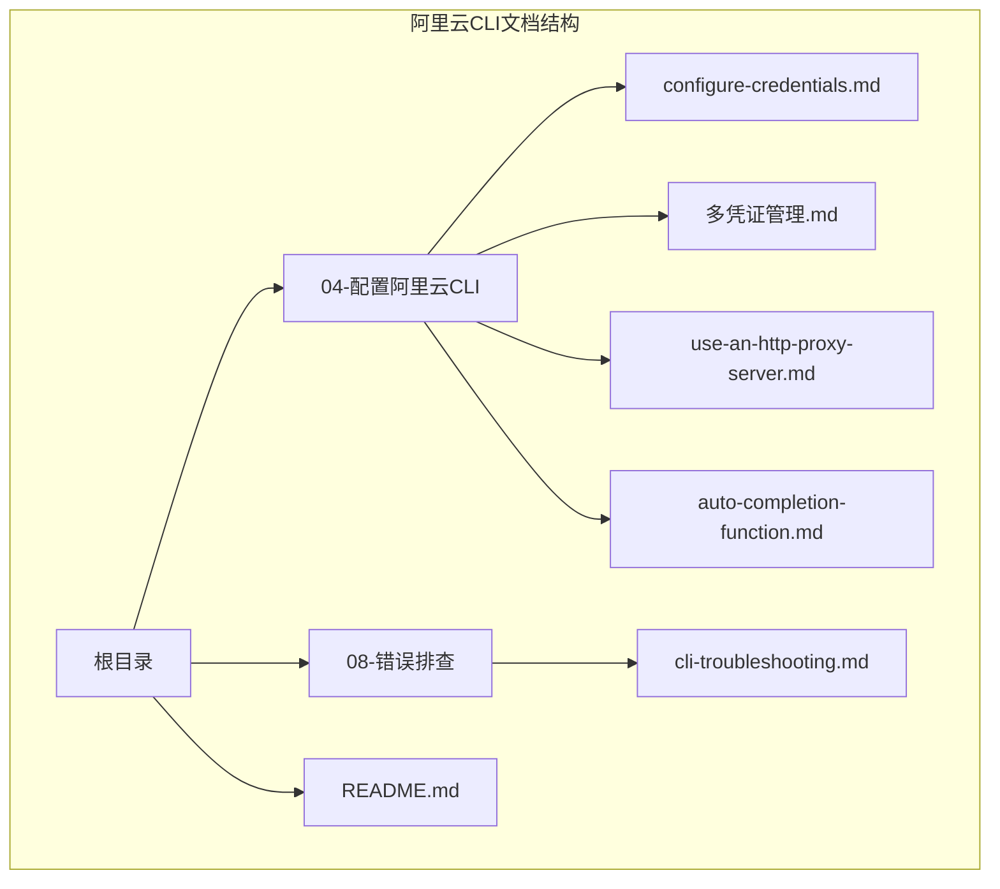
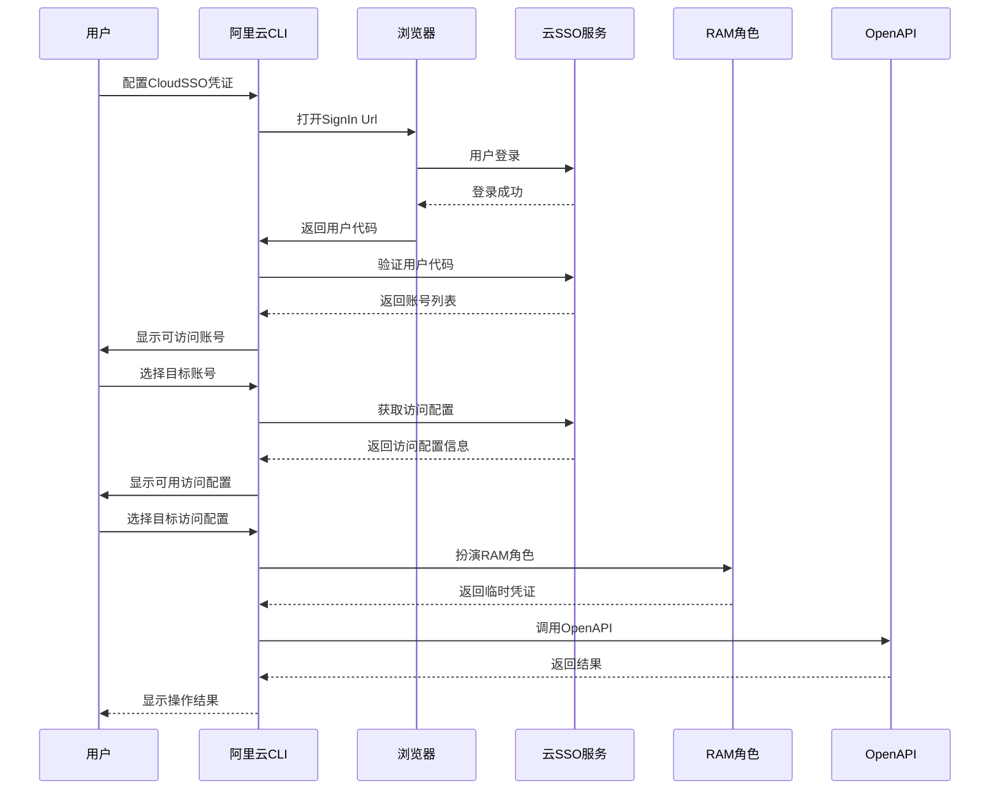
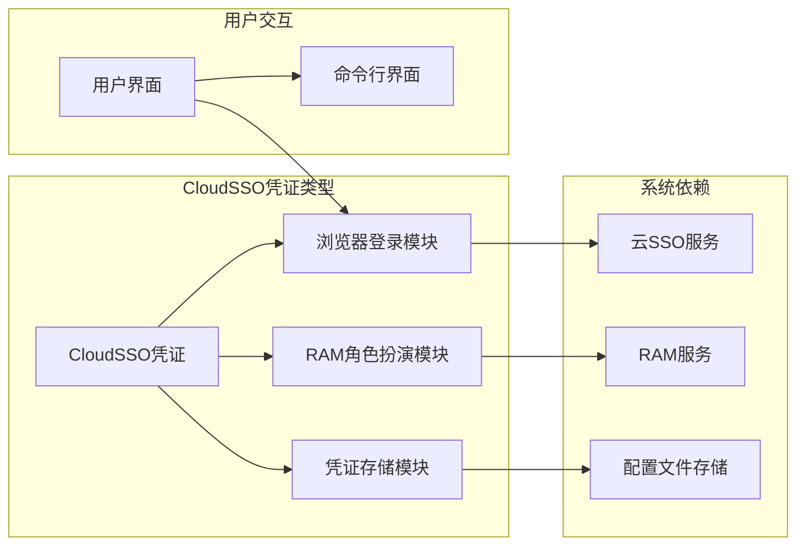
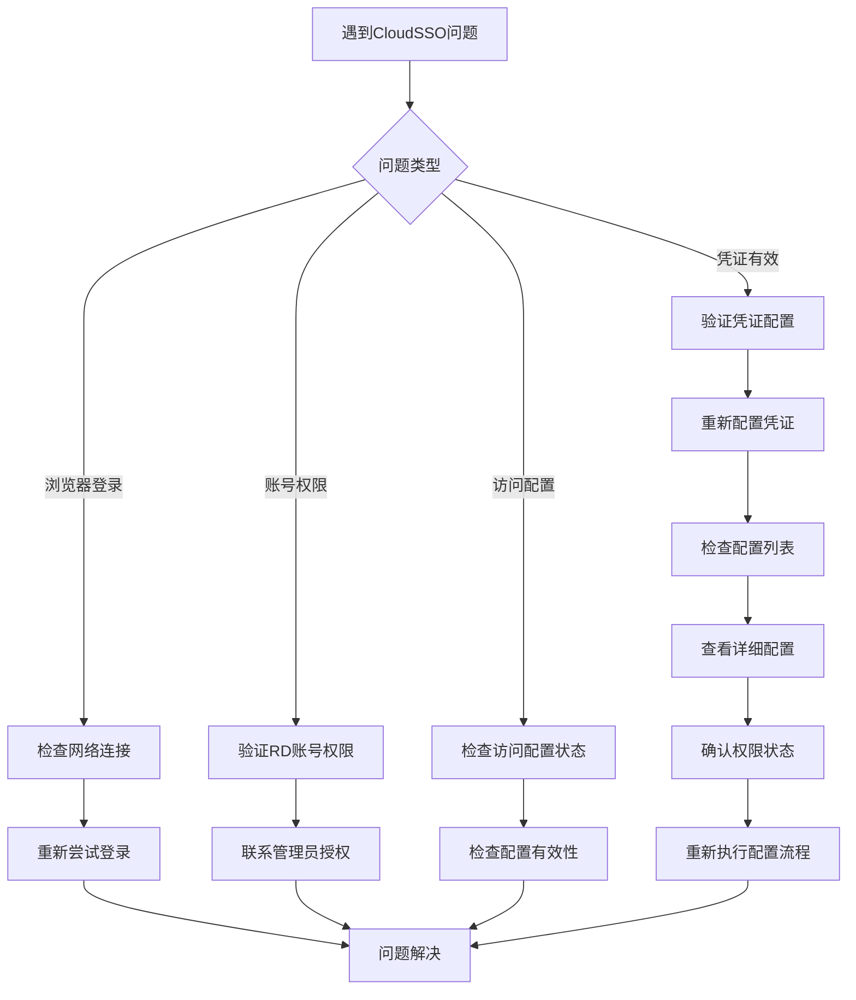

# CloudSSO凭证类型

<cite>
**本文档引用的文件**
- [configure-credentials.md](file://alibaba-cloud/reference/04-配置阿里云CLI/configure-credentials.md)
- [多凭证管理.md](file://alibaba-cloud/reference/04-配置阿里云CLI/多凭证管理.md)
- [cli-troubleshooting.md](file://alibaba-cloud/reference/08-错误排查/cli-troubleshooting.md)
- [README.md](file://alibaba-cloud/reference/README.md)
</cite>

## 目录
1. [简介](#简介)
2. [项目结构](#项目结构)
3. [核心组件](#核心组件)
4. [架构概述](#架构概述)
5. [详细组件分析](#详细组件分析)
6. [依赖关系分析](#依赖关系分析)
7. [性能考虑](#性能考虑)
8. [故障排除指南](#故障排除指南)
9. [结论](#结论)

## 简介

CloudSSO（云SSO）凭证类型是阿里云CLI在3.0.271版本中引入的重要功能，专门用于简化阿里云资源目录（Resource Directory，简称RD）的多账号统一身份管理和访问控制流程。该凭证类型通过浏览器登录机制，为用户提供了一种安全、便捷的方式来管理跨账号的云资源访问权限。

CloudSSO凭证的核心优势在于它能够：
- 简化多账号统一身份管理流程
- 提供基于浏览器的用户交互体验
- 降低AccessKey泄露的安全风险
- 支持自动化的凭证刷新机制

## 项目结构

本项目采用模块化组织结构，围绕阿里云CLI的配置管理功能进行组织：



**图表来源**
- [README.md:1-89](file://alibaba-cloud/reference/README.md#L1-L89)

**章节来源**
- [README.md:1-89](file://alibaba-cloud/reference/README.md#L1-L89)

## 核心组件

### CloudSSO凭证类型概述

CloudSSO凭证类型是阿里云CLI中专门设计用于处理阿里云资源目录（RD）多账号统一身份管理的凭证类型。该类型凭证具有以下关键特征：

#### 主要特性
- **浏览器依赖性**：需要通过浏览器完成身份认证过程
- **自动刷新机制**：支持凭证的自动刷新，无需手动干预
- **安全优势**：通过扮演RAM角色获取临时身份凭证，降低AccessKey泄露风险
- **多账号支持**：支持资源目录下的多个RD账号统一管理

#### 支持的凭证刷新策略
| 凭证类型 | 刷新策略 | 免密钥访问支持 |
|---------|---------|---------------|
| CloudSSO | 需通过浏览器登录 | 支持 |

**章节来源**
- [configure-credentials.md:69-81](file://alibaba-cloud/reference/04-配置阿里云CLI/configure-credentials.md#L69-L81)

### 凭证参数详解

CloudSSO凭证类型包含以下关键参数：

#### SignIn Url（用户登录地址）
- **用途**：用户登录地址，用于启动浏览器登录流程
- **获取方式**：登录云SSO控制台，在概览页面右侧获取用户登录URL
- **示例格式**：`https://signin-******.alibabacloudsso.com/device/login`

#### Account（RD账号）
- **用途**：指定要访问的资源目录账号
- **获取方式**：登录云SSO控制台，在多账号权限管理页面右侧获取RD账号UID
- **格式要求**：账号的唯一标识符（UID）

#### Access Configuration（访问配置）
- **用途**：指定具体的访问配置
- **获取方式**：登录云SSO控制台，在访问配置页面获取访问配置ID
- **格式要求**：访问配置的唯一标识符（AC-ID）

#### Region Id（默认地域）
- **用途**：设置默认的地域信息
- **建议**：优先设置为已购资源所在的地域
- **示例**：`cn-hangzhou`

**章节来源**
- [configure-credentials.md:660-668](file://alibaba-cloud/reference/04-配置阿里云CLI/configure-credentials.md#L660-L668)

## 架构概述

CloudSSO凭证类型的工作架构基于浏览器登录和RAM角色扮演机制：



**图表来源**
- [configure-credentials.md:654-668](file://alibaba-cloud/reference/04-配置阿里云CLI/configure-credentials.md#L654-L668)

## 详细组件分析

### 交互式配置流程

CloudSSO凭证的交互式配置提供了完整的用户引导流程：

#### 步骤1：启动配置
```bash
aliyun configure --profile SSOProfile --mode CloudSSO
```

#### 步骤2：输入SignIn Url
系统会提示输入用户登录地址：
```
CloudSSO Sign In Url []: https://signin-******.alibabacloudsso.com/device/login
```

#### 步骤3：浏览器登录
在弹出的浏览器窗口中完成云SSO用户登录。如果浏览器未自动弹出，CLI会提供手动登录所需的URL和用户码信息。

#### 步骤4：选择RD账号
登录成功后，CLI会列出可访问的RD账号供用户选择：
```
1. <RD Management Account>
2. AccountName
Please input the account number: 1
```

#### 步骤5：选择访问配置
从可用的访问配置列表中选择目标配置：
```
1. AccessConfiguration1
2. AccessConfiguration2
Please input the access configuration number: 2
```

#### 步骤6：设置默认地域
最后设置默认地域信息：
```
Default Region Id []: cn-hangzhou
```

**章节来源**
- [configure-credentials.md:673-731](file://alibaba-cloud/reference/04-配置阿里云CLI/configure-credentials.md#L673-L731)

### 非交互式配置限制

目前CloudSSO凭证类型**暂不支持非交互式配置**。这意味着用户必须通过交互式流程完成所有配置步骤，确保浏览器登录过程的完整性。

**章节来源**
- [configure-credentials.md:731-734](file://alibaba-cloud/reference/04-配置阿里云CLI/configure-credentials.md#L731-L734)

### 多凭证管理集成

CloudSSO凭证类型与阿里云CLI的多凭证管理系统完全集成：

#### 支持的配置命令
- `aliyun configure` - 交互式创建配置
- `aliyun configure set` - 非交互式创建或修改配置
- `aliyun configure list` - 查看配置列表
- `aliyun configure get` - 查看指定配置信息
- `aliyun configure switch` - 切换当前配置
- `aliyun configure delete` - 删除指定配置

#### CloudSSO专用配置参数
多凭证管理文档中包含了CloudSSO相关的配置参数：

| 参数名称 | 描述 | 示例值 |
|---------|------|-------|
| --cloud-sso-sign-in-url | 云SSO用户登录地址 | `https://signin-******.alibabacloudsso.com/device/login` |
| --cloud-sso-access-config | 云SSO访问配置ID | `ac-012345678910abcde****` |
| --cloud-sso-account-id | 云SSO登录云账号UID | `012345678910****` |

**章节来源**
- [多凭证管理.md:75-80](file://alibaba-cloud/reference/04-配置阿里云CLI/多凭证管理.md#L75-L80)

## 依赖关系分析

### 组件耦合度分析

CloudSSO凭证类型与系统其他组件的依赖关系如下：



### 外部依赖

CloudSSO凭证类型对外部系统的依赖主要包括：

1. **云SSO服务**：提供统一身份认证和访问控制
2. **RAM服务**：提供角色扮演和临时凭证生成
3. **浏览器环境**：提供用户交互界面
4. **网络连接**：确保与阿里云服务的通信

**章节来源**
- [configure-credentials.md:654-668](file://alibaba-cloud/reference/04-配置阿里云CLI/configure-credentials.md#L654-L668)

## 性能考虑

### 凭证刷新机制

CloudSSO凭证类型采用自动刷新机制，具有以下性能特点：

- **自动刷新**：无需用户手动干预，系统自动处理凭证刷新
- **最小化延迟**：通过浏览器登录减少重复认证的频率
- **资源优化**：避免频繁的API调用，降低系统负载

### 网络优化

- **连接复用**：利用浏览器的连接复用机制
- **缓存策略**：合理利用浏览器缓存减少重复加载
- **异步处理**：后台处理凭证刷新，不影响用户操作

## 故障排除指南

### 常见问题及解决方案

#### 浏览器登录问题
**问题**：浏览器未自动弹出或登录失败
**解决方案**：
1. 检查网络连接状态
2. 手动复制CLI提供的登录URL到浏览器
3. 确保浏览器允许弹窗
4. 清除浏览器缓存后重试

#### 账号选择问题
**问题**：无法看到预期的RD账号
**解决方案**：
1. 确认用户已被授予相应的RD账号访问权限
2. 检查云SSO控制台中的账号状态
3. 联系管理员确认权限配置

#### 访问配置问题
**问题**：访问配置列表为空或不可用
**解决方案**：
1. 确认用户已被授予相应的访问配置权限
2. 检查访问配置的状态和有效性
3. 验证访问配置与目标账号的关联关系

#### 凭证有效性检查
**问题**：配置后仍无法正常调用API
**解决方案**：
1. 使用`aliyun configure list`检查配置状态
2. 使用`aliyun configure get`查看详细配置信息
3. 重新执行CloudSSO凭证配置流程

**章节来源**
- [cli-troubleshooting.md:88-111](file://alibaba-cloud/reference/08-错误排查/cli-troubleshooting.md#L88-L111)

### 错误诊断流程



**图表来源**
- [cli-troubleshooting.md:52-83](file://alibaba-cloud/reference/08-错误排查/cli-troubleshooting.md#L52-L83)

## 结论

CloudSSO凭证类型为阿里云CLI用户提供了现代化的多账号统一身份管理解决方案。通过浏览器登录机制和RAM角色扮演技术，该凭证类型实现了以下价值：

### 主要优势
1. **安全性提升**：通过临时凭证和角色扮演机制降低安全风险
2. **用户体验优化**：简化的配置流程和直观的浏览器交互
3. **管理效率提高**：统一的多账号访问控制管理
4. **自动化程度高**：支持凭证的自动刷新和管理

### 最佳实践建议
1. **定期检查权限**：确保用户始终具备最新的访问权限
2. **监控凭证状态**：定期验证凭证的有效性和可用性
3. **备份配置**：妥善保存重要的配置信息
4. **培训用户**：确保团队成员了解CloudSSO的使用方法

CloudSSO凭证类型代表了现代云服务管理的发展方向，通过技术创新简化了复杂的多账号管理任务，为用户提供了更加安全、便捷的云资源访问体验。