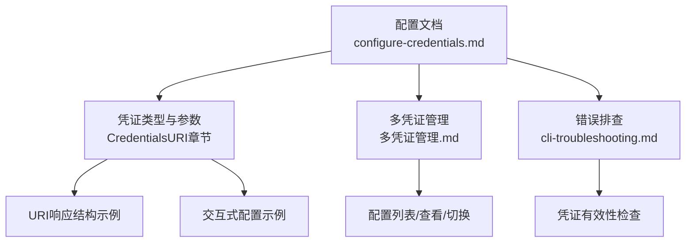
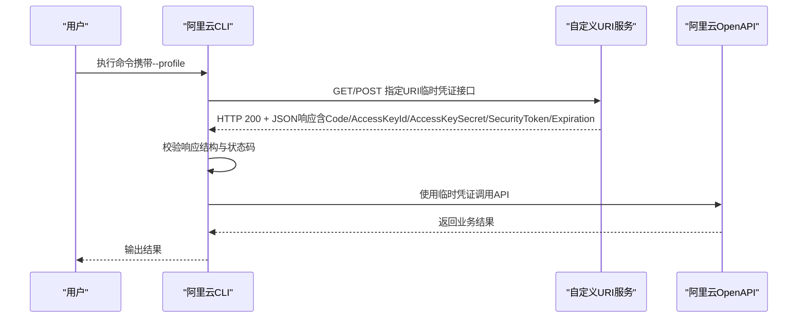
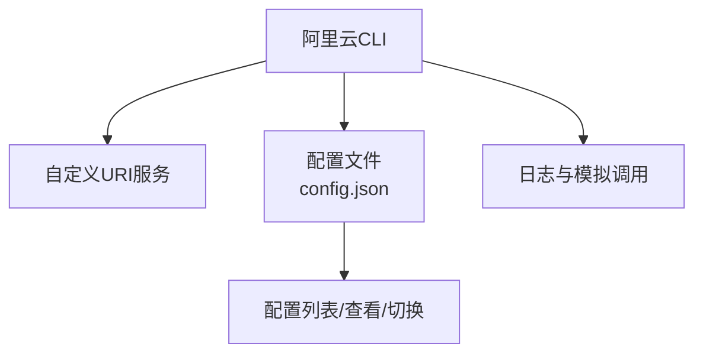

# CredentialsURI凭证类型

<cite>
**本文引用的文件**
- [configure-credentials.md](file://alibaba-cloud/reference/04-配置阿里云CLI/configure-credentials.md)
- [多凭证管理.md](file://alibaba-cloud/reference/04-配置阿里云CLI/多凭证管理.md)
- [cli-troubleshooting.md](file://alibaba-cloud/reference/08-错误排查/cli-troubleshooting.md)
</cite>

## 目录
1. [简介](#简介)
2. [项目结构](#项目结构)
3. [核心组件](#核心组件)
4. [架构总览](#架构总览)
5. [详细组件分析](#详细组件分析)
6. [依赖关系分析](#依赖关系分析)
7. [性能考量](#性能考量)
8. [故障排查指南](#故障排查指南)
9. [结论](#结论)
10. [附录](#附录)

## 简介
本指南面向需要通过URI地址动态获取临时身份凭证（STS Token）的用户，系统讲解CredentialsURI凭证类型的配置方法、参数要求、URI响应格式规范、访问与错误处理机制，并提供交互式配置示例、开发与调试建议，帮助您快速实现自定义凭证获取服务并与阿里云CLI集成。

## 项目结构
本仓库中与CredentialsURI相关的内容集中在“配置阿里云CLI”文档中，包括：
- 凭证类型与配置说明
- 交互式与非交互式配置示例
- URI响应结构示例
- 凭证存储位置与多凭证管理
- 常见错误排查要点

图表来源
- [configure-credentials.md](file://alibaba-cloud/reference/04-配置阿里云CLI/configure-credentials.md)
- [多凭证管理.md](file://alibaba-cloud/reference/04-配置阿里云CLI/多凭证管理.md)
- [cli-troubleshooting.md](file://alibaba-cloud/reference/08-错误排查/cli-troubleshooting.md)

章节来源
- [configure-credentials.md:530-580](file://alibaba-cloud/reference/04-配置阿里云CLI/configure-credentials.md#L530-L580)
- [多凭证管理.md:1-154](file://alibaba-cloud/reference/04-配置阿里云CLI/多凭证管理.md#L1-L154)
- [cli-troubleshooting.md:31-82](file://alibaba-cloud/reference/08-错误排查/cli-troubleshooting.md#L31-L82)

## 核心组件
- 凭证类型：CredentialsURI
  - 说明：通过访问您提供的URI地址获取临时身份凭证（STS Token）以调用OpenAPI。
  - 参数：
    - CredentialsURI：本地或远程URI地址。当指定地址无法正常返回HTTP 200响应状态码，或其响应内容的结构不符合预期格式时，阿里云CLI将对该请求按失败情况处理。
    - Region Id：默认地域。部分云产品不支持跨地域访问，建议优先将默认地域设置为已购资源所在地域。
  - URI响应结构示例（关键字段）：
    - Code：字符串，如Success
    - AccessKeyId：临时AccessKey ID
    - AccessKeySecret：临时AccessKey Secret
    - SecurityToken：临时安全令牌
    - Expiration：UTC时间戳，ISO 8601格式

章节来源
- [configure-credentials.md:530-580](file://alibaba-cloud/reference/04-配置阿里云CLI/configure-credentials.md#L530-L580)

## 架构总览
下图展示了CredentialsURI在阿里云CLI中的工作流：CLI在调用API前，从指定URI拉取临时凭证，校验响应格式与状态码，成功后使用临时凭证发起请求。

图表来源
- [configure-credentials.md:530-580](file://alibaba-cloud/reference/04-配置阿里云CLI/configure-credentials.md#L530-L580)

## 详细组件分析

### 组件A：CredentialsURI配置与参数
- 配置入口
  - 交互式配置：通过交互式命令创建CredentialsURI类型配置，随后输入CredentialsURI与默认Region Id。
  - 非交互式配置：不支持直接以非交互方式配置CredentialsURI类型凭证。
- 参数要求
  - CredentialsURI：可指向本地或远程URI地址。CLI在请求失败时的判定标准为：
    - HTTP响应状态码非200
    - 响应内容结构不符合预期格式（缺少关键字段或字段类型不匹配）
  - Region Id：默认地域，建议与资源所在地域一致。

章节来源
- [configure-credentials.md:530-580](file://alibaba-cloud/reference/04-配置阿里云CLI/configure-credentials.md#L530-L580)

### 组件B：URI响应格式规范
- 必备字段
  - Code：字符串，如Success
  - AccessKeyId：临时AccessKey ID
  - AccessKeySecret：临时AccessKey Secret
  - SecurityToken：临时安全令牌
  - Expiration：UTC时间戳，ISO 8601格式
- 结构示例
  - 参考文档中的JSON示例，包含上述字段。

章节来源
- [configure-credentials.md:542-552](file://alibaba-cloud/reference/04-配置阿里云CLI/configure-credentials.md#L542-L552)

### 组件C：交互式配置示例
- 创建配置
  - 使用交互式命令创建CredentialsURI类型配置，并输入CredentialsURI与默认Region Id。
- 配置流程
  - CLI提示输入Credentials URI与默认Region Id，确认后保存配置。

章节来源
- [configure-credentials.md:558-575](file://alibaba-cloud/reference/04-配置阿里云CLI/configure-credentials.md#L558-L575)

### 组件D：URI地址访问要求与错误处理
- 访问要求
  - 服务需返回HTTP 200状态码。
  - 响应体为JSON，包含Code、AccessKeyId、AccessKeySecret、SecurityToken、Expiration等字段。
- 错误处理
  - 若状态码非200或响应结构不符合预期，CLI将视作失败处理，拒绝使用该凭证并中断后续调用。

章节来源
- [configure-credentials.md:532-541](file://alibaba-cloud/reference/04-配置阿里云CLI/configure-credentials.md#L532-L541)

### 组件E：凭证存储与多凭证管理
- 存储位置
  - 凭证配置以JSON格式存储于用户目录下的.aliyun/config.json文件中。
  - Windows：C:\Users\<USER_NAME>\.aliyun
  - Linux/macOS：/home/<USER_NAME>/.aliyun
- 多凭证管理
  - 列表查看、查看指定配置、切换当前配置、在命令行中指定配置等。

章节来源
- [configure-credentials.md:851-862](file://alibaba-cloud/reference/04-配置阿里云CLI/configure-credentials.md#L851-L862)
- [多凭证管理.md:100-154](file://alibaba-cloud/reference/04-配置阿里云CLI/多凭证管理.md#L100-L154)

### 组件F：开发与调试指南
- 开发建议
  - 严格遵循响应格式规范，确保字段齐全且类型正确。
  - 提供稳定的HTTP 200响应，避免网络波动导致的失败。
  - Expiration字段使用UTC时间戳，便于CLI端统一解析。
- 调试方法
  - 使用模拟调用功能查看请求详情（dryrun）。
  - 启用并检查阿里云CLI日志，定位问题。
  - 检查当前使用的配置、配置中保存的凭证信息、凭证模式有效性以及身份权限。

章节来源
- [cli-troubleshooting.md:31-82](file://alibaba-cloud/reference/08-错误排查/cli-troubleshooting.md#L31-L82)

## 依赖关系分析
- CLI与URI服务的耦合点
  - CLI仅依赖URI服务返回符合规范的JSON响应与HTTP 200状态码。
  - CLI不关心URI的具体实现细节，仅关注响应结构与状态码。
- 多凭证管理与配置存储
  - CLI通过配置文件管理多套凭证，支持切换与命令行指定，便于在不同场景复用。

图表来源
- [configure-credentials.md:851-862](file://alibaba-cloud/reference/04-配置阿里云CLI/configure-credentials.md#L851-L862)
- [多凭证管理.md:100-154](file://alibaba-cloud/reference/04-配置阿里云CLI/多凭证管理.md#L100-L154)
- [cli-troubleshooting.md:31-82](file://alibaba-cloud/reference/08-错误排查/cli-troubleshooting.md#L31-L82)

## 性能考量
- 响应延迟
  - URI服务的响应时间直接影响CLI调用的首包时延，建议优化服务端处理逻辑与网络链路。
- 并发与稳定性
  - 在高并发场景下，确保URI服务具备足够的吞吐能力与稳定性，避免因超时或失败导致CLI整体调用失败。
- 过期时间
  - 正确设置Expiration字段，避免过早过晚导致频繁刷新或过期重试。

## 故障排查指南
- 常见问题定位
  - 检查地域与接入点：确认--region或配置中的Region Id与资源所在地域一致。
  - 检查请求详情：使用--dryrun查看CLI模拟调用的请求拼装与凭证使用情况。
  - 检查凭证有效性：确认当前配置、配置中保存的凭证信息、凭证模式有效性与身份权限。
- 与CredentialsURI相关的排查
  - 确认URI服务返回HTTP 200且响应体为JSON，包含Code、AccessKeyId、AccessKeySecret、SecurityToken、Expiration。
  - 若失败，检查URI可达性、网络策略、防火墙与代理设置。

章节来源
- [cli-troubleshooting.md:31-82](file://alibaba-cloud/reference/08-错误排查/cli-troubleshooting.md#L31-L82)

## 结论
CredentialsURI为用户提供了一种灵活的外部凭证获取机制。通过严格遵循响应格式与状态码要求，结合稳定的URI服务与完善的调试手段，可在多种场景下安全、可靠地使用临时凭证调用阿里云OpenAPI。建议在生产环境中做好监控与告警，确保URI服务的高可用与低延迟。

## 附录

### A. 配置命令与示例（路径引用）
- 交互式创建CredentialsURI配置
  - 参考：[交互式配置示例:558-575](file://alibaba-cloud/reference/04-配置阿里云CLI/configure-credentials.md#L558-L575)
- 非交互式配置
  - 说明：不支持直接以非交互方式配置CredentialsURI类型凭证。
  - 参考：[非交互式配置说明:577-579](file://alibaba-cloud/reference/04-配置阿里云CLI/configure-credentials.md#L577-L579)

### B. URI响应结构示例（字段说明）
- 字段清单
  - Code：字符串，如Success
  - AccessKeyId：临时AccessKey ID
  - AccessKeySecret：临时AccessKey Secret
  - SecurityToken：临时安全令牌
  - Expiration：UTC时间戳，ISO 8601格式
- 示例参考
  - 参考：[URI响应结构示例:542-552](file://alibaba-cloud/reference/04-配置阿里云CLI/configure-credentials.md#L542-L552)

### C. 凭证存储位置
- 存储位置
  - Windows：C:\Users\<USER_NAME>\.aliyun
  - Linux/macOS：/home/<USER_NAME>/.aliyun
- 文件：config.json
- 参考：[凭证配置存储位置:851-862](file://alibaba-cloud/reference/04-配置阿里云CLI/configure-credentials.md#L851-L862)

### D. 多凭证管理命令（路径引用）
- 列表查看
  - 参考：[获取配置列表:100-108](file://alibaba-cloud/reference/04-配置阿里云CLI/多凭证管理.md#L100-L108)
- 查看指定配置
  - 参考：[查看指定配置信息:120-148](file://alibaba-cloud/reference/04-配置阿里云CLI/多凭证管理.md#L120-L148)
- 切换当前配置
  - 参考：[设置当前配置:81-98](file://alibaba-cloud/reference/04-配置阿里云CLI/多凭证管理.md#L81-L98)