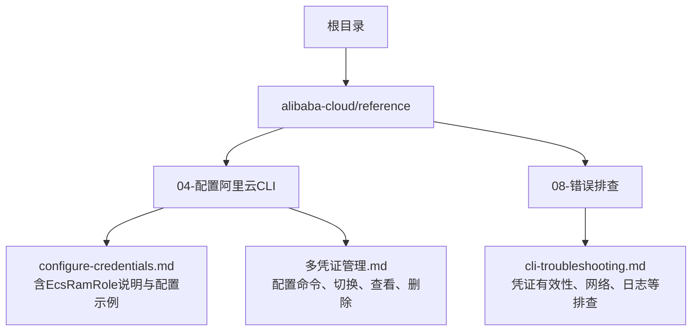
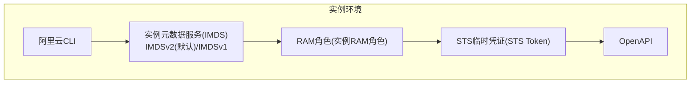
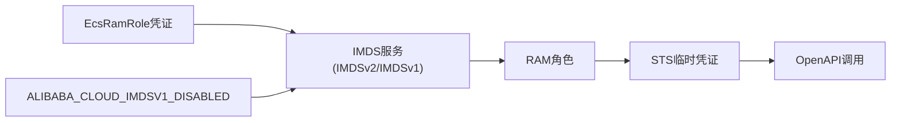

# EcsRamRole凭证类型

<cite>
**本文引用的文件**
- [configure-credentials.md](file://alibaba-cloud/reference/04-配置阿里云CLI/configure-credentials.md)
- [多凭证管理.md](file://alibaba-cloud/reference/04-配置阿里云CLI/多凭证管理.md)
- [cli-troubleshooting.md](file://alibaba-cloud/reference/08-错误排查/cli-troubleshooting.md)
</cite>

## 目录
1. [简介](#简介)
2. [项目结构](#项目结构)
3. [核心组件](#核心组件)
4. [架构总览](#架构总览)
5. [详细组件分析](#详细组件分析)
6. [依赖关系分析](#依赖关系分析)
7. [性能考量](#性能考量)
8. [故障排除指南](#故障排除指南)
9. [结论](#结论)
10. [附录](#附录)

## 简介
本指南围绕EcsRamRole（ECS实例RAM角色）凭证类型，系统讲解其免密钥访问的优势、IMDSv2加固模式与IMDSv1普通模式的区别、参数配置方法（含Ecs Ram Role与Region Id）、环境变量ALIBABA_CLOUD_IMDSV1_DISABLED的使用、交互式与非交互式配置示例、异常处理策略、元数据服务获取凭证的机制与安全优势，以及实际配置命令与故障排除方法。目标是帮助读者在ECS/ECI实例内安全、稳定地使用EcsRamRole免密钥访问云资源。

## 项目结构
本仓库中与EcsRamRole凭证类型直接相关的文档集中在“配置阿里云CLI”章节，包含凭证类型说明、交互/非交互式配置示例、多凭证管理与故障排查等内容。下图给出与EcsRamRole相关的文档位置概览。

图表来源
- [configure-credentials.md](file://alibaba-cloud/reference/04-配置阿里云CLI/configure-credentials.md)
- [多凭证管理.md](file://alibaba-cloud/reference/04-配置阿里云CLI/多凭证管理.md)
- [cli-troubleshooting.md](file://alibaba-cloud/reference/08-错误排查/cli-troubleshooting.md)

章节来源
- [configure-credentials.md:297-361](file://alibaba-cloud/reference/04-配置阿里云CLI/configure-credentials.md#L297-L361)
- [多凭证管理.md:1-203](file://alibaba-cloud/reference/04-配置阿里云CLI/多凭证管理.md#L1-L203)
- [cli-troubleshooting.md:1-111](file://alibaba-cloud/reference/08-错误排查/cli-troubleshooting.md#L1-L111)

## 核心组件
- EcsRamRole凭证类型：免密钥访问，通过ECS/ECI实例内的元数据服务（IMDS）获取RAM角色的临时身份凭证（STS Token），降低AccessKey泄露风险。
- IMDSv2加固模式：默认使用，具备抗中间人攻击与会话固定等安全增强能力；IMDSv1普通模式为兼容性兜底。
- 环境变量ALIBABA_CLOUD_IMDSV1_DISABLED：控制IMDSv1的可用性与异常处理策略。
- 关键参数：
  - Ecs Ram Role：授予ECS实例的RAM角色名称；若不指定，CLI将自动访问元数据服务获取RoleName后再取凭证，增加一次请求。
  - Region Id：默认地域，建议优先设为已购资源所在地域。

章节来源
- [configure-credentials.md:299-316](file://alibaba-cloud/reference/04-配置阿里云CLI/configure-credentials.md#L299-L316)

## 架构总览
EcsRamRole在ECS/ECI实例内通过阿里云CLI访问IMDS（IMDSv2优先），从RAM角色获取STS临时凭证，随后调用OpenAPI。若IMDSv2异常，可依据ALIBABA_CLOUD_IMDSV1_DISABLED的值决定回退到IMDSv1或抛出异常。

图表来源
- [configure-credentials.md:299-316](file://alibaba-cloud/reference/04-配置阿里云CLI/configure-credentials.md#L299-L316)

## 详细组件分析

### EcsRamRole免密钥访问与IMDS机制
- 免密钥优势：无需在CLI配置中存储AccessKey，避免密钥泄露风险；实例内通过元数据服务动态获取短期STSToken。
- IMDSv2加固模式：默认启用，具备更强的安全性；IMDSv1为兼容模式。
- 异常处理：当IMDSv2异常时，可通过ALIBABA_CLOUD_IMDSV1_DISABLED控制行为：
  - false（默认）：回退到IMDSv1继续获取凭证；
  - true：仅允许IMDSv2，异常时直接抛出错误。

章节来源
- [configure-credentials.md:303-310](file://alibaba-cloud/reference/04-配置阿里云CLI/configure-credentials.md#L303-L310)

### 参数配置详解
- Ecs Ram Role
  - 作用：指定授予ECS实例的RAM角色名称。
  - 行为：若不指定，CLI将先读取元数据服务中的RoleName，再据此获取凭证，整体多一次请求。
- Region Id
  - 作用：默认地域，部分云产品不支持跨地域访问，建议设为资源所在地域。

章节来源
- [configure-credentials.md:311-316](file://alibaba-cloud/reference/04-配置阿里云CLI/configure-credentials.md#L311-L316)

### IMDSv1与IMDSv2对比与使用场景
- IMDSv2（推荐）
  - 特点：带令牌校验、防中间人攻击、会话固定防护。
  - 场景：生产环境优先使用，提升安全性。
- IMDSv1（兼容兜底）
  - 特点：简单易用，兼容旧版实例或特定网络限制。
  - 场景：实例或网络不支持IMDSv2时的回退方案。

章节来源
- [configure-credentials.md:303-310](file://alibaba-cloud/reference/04-配置阿里云CLI/configure-credentials.md#L303-L310)

### 环境变量ALIBABA_CLOUD_IMDSV1_DISABLED
- 用途：控制IMDSv1的可用性与异常处理策略。
- 取值与行为：
  - false（默认）：IMDSv2异常时回退到IMDSv1。
  - true：仅允许IMDSv2，异常时抛出错误。
- 生效范围：影响EcsRamRole在实例内获取凭证时的IMDS模式选择。

章节来源
- [configure-credentials.md:307-309](file://alibaba-cloud/reference/04-配置阿里云CLI/configure-credentials.md#L307-L309)

### 交互式配置示例
- 命令：通过交互式配置创建EcsRamRole类型凭证。
- 步骤要点：
  - 指定模式为EcsRamRole；
  - 输入RAM角色名称（可选，不填将触发二次元数据请求）；
  - 设置默认Region Id。
- 参考路径：
  - [configure-credentials.md:322-339](file://alibaba-cloud/reference/04-配置阿里云CLI/configure-credentials.md#L322-L339)

章节来源
- [configure-credentials.md:322-339](file://alibaba-cloud/reference/04-配置阿里云CLI/configure-credentials.md#L322-L339)

### 非交互式配置示例
- 命令：通过非交互式配置创建EcsRamRole类型凭证。
- 必填参数：
  - --mode EcsRamRole
  - --ram-role-name（可选，不填将触发二次元数据请求）
  - --region（默认地域）
- 参考路径：
  - [configure-credentials.md:341-361](file://alibaba-cloud/reference/04-配置阿里云CLI/configure-credentials.md#L341-L361)
  - [多凭证管理.md:69](file://alibaba-cloud/reference/04-配置阿里云CLI/多凭证管理.md#L69)

章节来源
- [configure-credentials.md:341-361](file://alibaba-cloud/reference/04-配置阿里云CLI/configure-credentials.md#L341-L361)
- [多凭证管理.md:69](file://alibaba-cloud/reference/04-配置阿里云CLI/多凭证管理.md#L69)

### 多凭证管理与切换
- 列表查看：使用configure list查看各配置概要（含EcsRamRole配置）。
- 查看详情：使用configure get查看指定配置的完整设置。
- 切换当前配置：使用configure switch将某配置设为当前生效配置。
- 删除配置：使用configure delete删除指定配置（注意保留至少一项配置）。

章节来源
- [多凭证管理.md:99-203](file://alibaba-cloud/reference/04-配置阿里云CLI/多凭证管理.md#L99-L203)

### 元数据服务获取凭证机制与安全优势
- 机制概述：
  - 实例内CLI访问IMDS（IMDSv2优先），获取RAM角色的临时凭证（STS Token）。
  - 若未显式指定RAM角色名，CLI会先读取元数据中的RoleName，再获取凭证，整体多一次请求。
- 安全优势：
  - 无AccessKey明文存储于CLI配置；
  - 凭证为短期有效（由STS颁发），降低泄露风险；
  - IMDSv2具备更强的抗攻击能力。

章节来源
- [configure-credentials.md:305-316](file://alibaba-cloud/reference/04-配置阿里云CLI/configure-credentials.md#L305-L316)

## 依赖关系分析
- 组件耦合
  - EcsRamRole依赖实例内的IMDS服务（IMDSv2/IMDSv1）。
  - CLI在实例内通过IMDS获取RAM角色的临时凭证，再调用OpenAPI。
  - ALIBABA_CLOUD_IMDSV1_DISABLED影响IMDS模式选择与异常处理。
- 外部依赖
  - RAM角色权限策略：需为实例授予RAM角色，以便CLI通过IMDS获取凭证。
  - 网络可达性：实例需能访问IMDS端点。

图表来源
- [configure-credentials.md:303-316](file://alibaba-cloud/reference/04-配置阿里云CLI/configure-credentials.md#L303-L316)

章节来源
- [configure-credentials.md:303-316](file://alibaba-cloud/reference/04-配置阿里云CLI/configure-credentials.md#L303-L316)

## 性能考量
- 请求次数
  - 显式指定RAM角色名：仅一次元数据请求获取凭证。
  - 未指定RAM角色名：需先读取RoleName，再获取凭证，整体多一次请求。
- 地域设置
  - Region Id建议设为资源所在地域，减少跨地域调用开销与失败概率。

章节来源
- [configure-credentials.md:315-316](file://alibaba-cloud/reference/04-配置阿里云CLI/configure-credentials.md#L315-L316)

## 故障排除指南
- 凭证有效性检查
  - 使用configure list与configure get核对配置信息与当前生效配置。
  - 对于EcsRamRole，确认实例已授予RAM角色，并确保IMDS可达。
- 网络与日志
  - 检查网络连通性与代理设置（如需）。
  - 使用--dryrun或开启日志输出定位问题。
- IMDS相关异常
  - 若IMDSv2异常，可设置ALIBABA_CLOUD_IMDSV1_DISABLED：
    - false：回退到IMDSv1继续获取凭证；
    - true：仅IMDSv2，异常时直接报错。
- 其他常见问题
  - 缺少必要选项、命令格式错误、地域接入点不匹配、权限不足等，均可在故障排查文档中找到对应步骤。

章节来源
- [cli-troubleshooting.md:7-86](file://alibaba-cloud/reference/08-错误排查/cli-troubleshooting.md#L7-L86)
- [configure-credentials.md:307-310](file://alibaba-cloud/reference/04-配置阿里云CLI/configure-credentials.md#L307-L310)

## 结论
EcsRamRole凭证类型通过实例内的IMDS服务免密钥获取RAM角色的短期临时凭证，显著降低AccessKey泄露风险。默认采用IMDSv2加固模式，具备更强安全性；当IMDSv2异常时，可通过ALIBABA_CLOUD_IMDSV1_DISABLED灵活控制回退策略。结合正确的参数配置（Ecs Ram Role与Region Id）、多凭证管理与故障排查流程，可在ECS/ECI实例内安全、稳定地使用免密钥访问云资源。

## 附录
- 实际配置命令参考路径
  - 交互式配置：[configure-credentials.md:322-339](file://alibaba-cloud/reference/04-配置阿里云CLI/configure-credentials.md#L322-L339)
  - 非交互式配置：[configure-credentials.md:341-361](file://alibaba-cloud/reference/04-配置阿里云CLI/configure-credentials.md#L341-L361)
  - 多凭证管理：[多凭证管理.md:99-203](file://alibaba-cloud/reference/04-配置阿里云CLI/多凭证管理.md#L99-L203)
- 故障排查参考路径
  - [cli-troubleshooting.md:7-86](file://alibaba-cloud/reference/08-错误排查/cli-troubleshooting.md#L7-L86)