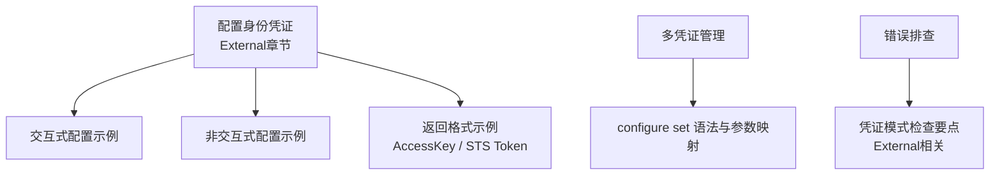
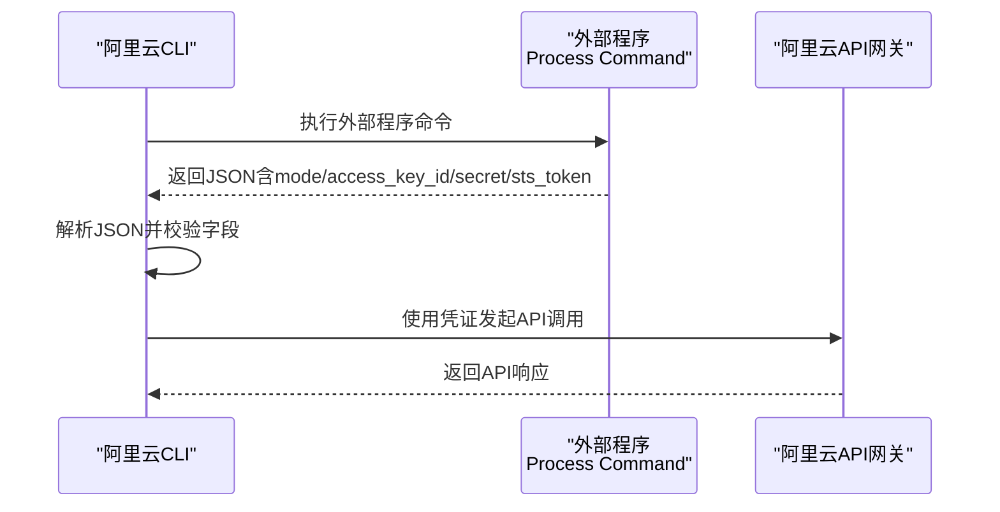
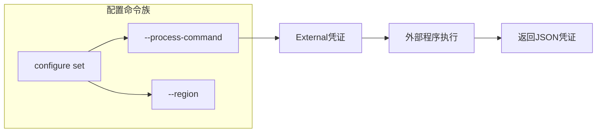

# External凭证类型

<cite>
**本文引用的文件**
- [configure-credentials.md](file://alibaba-cloud/reference/04-配置阿里云CLI/configure-credentials.md)
- [多凭证管理.md](file://alibaba-cloud/reference/04-配置阿里云CLI/多凭证管理.md)
- [cli-troubleshooting.md](file://alibaba-cloud/reference/08-错误排查/cli-troubleshooting.md)
</cite>

## 目录
1. [简介](#简介)
2. [项目结构](#项目结构)
3. [核心组件](#核心组件)
4. [架构总览](#架构总览)
5. [详细组件分析](#详细组件分析)
6. [依赖关系分析](#依赖关系分析)
7. [性能考量](#性能考量)
8. [故障排查指南](#故障排查指南)
9. [结论](#结论)
10. [附录](#附录)

## 简介
本指南面向使用阿里云CLI的开发者与运维人员，聚焦“External（外部程序）”凭证类型的配置与使用。External凭证允许通过外部程序动态生成并返回阿里云身份凭证，适用于企业内已有认证体系、SSO集成、硬件安全模块（HSM）、或自研密钥管理系统的场景。文档将从机制原理、参数配置、返回格式、执行时机与刷新策略、交互与非交互配置示例、开发与安全最佳实践、以及调试方法等方面进行系统化说明。

## 项目结构
本仓库中与External凭证类型直接相关的文档集中在“配置阿里云CLI”与“错误排查”两个主题下：
- “配置阿里云CLI”主题下的“配置身份凭证”文档明确列出了External凭证类型及其参数、返回格式示例与交互/非交互配置示例。
- “多凭证管理”文档补充了配置命令语法、参数映射与常用管理命令。
- “错误排查”文档提供了针对凭证模式（含External）的常见问题定位思路与建议。

**图表来源**
- [configure-credentials.md:363-442](file://alibaba-cloud/reference/04-配置阿里云CLI/configure-credentials.md#L363-L442)
- [多凭证管理.md:37-80](file://alibaba-cloud/reference/04-配置阿里云CLI/多凭证管理.md#L37-L80)
- [cli-troubleshooting.md:72-78](file://alibaba-cloud/reference/08-错误排查/cli-troubleshooting.md#L72-L78)

**章节来源**
- [configure-credentials.md:363-442](file://alibaba-cloud/reference/04-配置阿里云CLI/configure-credentials.md#L363-L442)
- [多凭证管理.md:37-80](file://alibaba-cloud/reference/04-配置阿里云CLI/多凭证管理.md#L37-L80)
- [cli-troubleshooting.md:72-78](file://alibaba-cloud/reference/08-错误排查/cli-troubleshooting.md#L72-L78)

## 核心组件
- 外部程序（Process Command）
  - 由用户自定义，用于生成并返回符合规范的凭证JSON。
  - 支持两种返回模式：AccessKey（AK）与STS Token。
- 返回JSON结构
  - AccessKey模式：包含mode、access_key_id、access_key_secret。
  - STS Token模式：包含mode、access_key_id、access_key_secret、sts_token。
- 配置项
  - Process Command：外部程序命令行。
  - Region Id：默认地域。
- 执行与刷新
  - External凭证的刷新策略由外部程序决定；CLI在每次需要调用API时触发外部程序执行，获取最新凭证。

**章节来源**
- [configure-credentials.md:367-396](file://alibaba-cloud/reference/04-配置阿里云CLI/configure-credentials.md#L367-L396)
- [configure-credentials.md:421-441](file://alibaba-cloud/reference/04-配置阿里云CLI/configure-credentials.md#L421-L441)

## 架构总览
External凭证的工作流可抽象为：CLI在调用API前，执行外部程序命令，解析其标准输出的JSON，提取凭证字段，随后使用该凭证发起API调用。外部程序负责凭证的生成、轮换与有效期管理。

**图表来源**
- [configure-credentials.md:367-396](file://alibaba-cloud/reference/04-配置阿里云CLI/configure-credentials.md#L367-L396)

## 详细组件分析

### 外部程序命令（Process Command）配置
- 交互式配置
  - 使用交互式configure命令进入External模式，输入Process Command。
- 非交互式配置
  - 使用configure set命令，通过--process-command参数指定外部程序命令。
- 参数映射
  - 多凭证管理文档中明确列出--process-command参数的用途与示例值。

**章节来源**
- [configure-credentials.md:402-441](file://alibaba-cloud/reference/04-配置阿里云CLI/configure-credentials.md#L402-L441)
- [多凭证管理.md:73](file://alibaba-cloud/reference/04-配置阿里云CLI/多凭证管理.md#L73)

### 返回格式与示例
- AccessKey模式
  - JSON字段：mode、access_key_id、access_key_secret。
- STS Token模式
  - JSON字段：mode、access_key_id、access_key_secret、sts_token。
- 示例路径
  - AccessKey示例：[configure-credentials.md:377-385](file://alibaba-cloud/reference/04-配置阿里云CLI/configure-credentials.md#L377-L385)
  - STS Token示例：[configure-credentials.md:387-396](file://alibaba-cloud/reference/04-配置阿里云CLI/configure-credentials.md#L387-L396)

**章节来源**
- [configure-credentials.md:375-396](file://alibaba-cloud/reference/04-配置阿里云CLI/configure-credentials.md#L375-L396)

### 执行时机与刷新机制
- 执行时机
  - CLI在每次需要调用API时，会触发外部程序执行，以获取最新的凭证。
- 刷新策略
  - External凭证的刷新由外部程序自行控制；CLI不主动轮询或缓存凭证，而是按需触发外部程序。
- 适用场景
  - 企业SSO集成、硬件密钥管理、临时凭证轮换、集中式认证中心等。

**章节来源**
- [configure-credentials.md:367-374](file://alibaba-cloud/reference/04-配置阿里云CLI/configure-credentials.md#L367-L374)

### 交互式与非交互式配置示例
- 交互式配置
  - 进入External模式，输入Process Command与Region Id。
  - 示例命令与交互过程见：[configure-credentials.md:402-419](file://alibaba-cloud/reference/04-配置阿里云CLI/configure-credentials.md#L402-L419)
- 非交互式配置
  - 使用configure set命令，指定--process-command与--region。
  - 示例命令见：[configure-credentials.md:421-441](file://alibaba-cloud/reference/04-配置阿里云CLI/configure-credentials.md#L421-L441)

**章节来源**
- [configure-credentials.md:402-441](file://alibaba-cloud/reference/04-配置阿里云CLI/configure-credentials.md#L402-L441)

### 开发最佳实践与安全考虑
- 外部程序设计
  - 输出严格遵循JSON规范，字段齐全且类型正确。
  - 对外暴露的命令应最小化权限，避免硬编码敏感信息。
- 安全建议
  - 将外部程序部署在受控环境中，限制访问与执行权限。
  - 使用短有效期的临时凭证（STS Token）以降低泄露风险。
  - 对外部程序的输入参数进行白名单校验，防止注入攻击。
- 可靠性
  - 外部程序应具备幂等性与容错能力，避免重复执行导致的状态不一致。
  - 提供健康检查与降级策略，保障CLI调用不受外部程序异常影响。

[本节为通用指导，不直接分析具体文件，故无“章节来源”标注]

### 调试方法
- 检查凭证模式
  - External与CredentialsURI模式需重点检查外部程序命令能否正常获取凭证。
  - 参考：[cli-troubleshooting.md:72-78](file://alibaba-cloud/reference/08-错误排查/cli-troubleshooting.md#L72-L78)
- 日志与模拟调用
  - 使用--dryrun选项查看请求详情与凭证使用情况。
  - 启用日志输出以获取更详细的调用链路信息。
  - 参考：[cli-troubleshooting.md:44-50](file://alibaba-cloud/reference/08-错误排查/cli-troubleshooting.md#L44-L50)
- 配置验证
  - 使用configure list与configure get查看配置与参数是否正确。
  - 参考：[多凭证管理.md:99-162](file://alibaba-cloud/reference/04-配置阿里云CLI/多凭证管理.md#L99-L162)

**章节来源**
- [cli-troubleshooting.md:44-50](file://alibaba-cloud/reference/08-错误排查/cli-troubleshooting.md#L44-L50)
- [多凭证管理.md:99-162](file://alibaba-cloud/reference/04-配置阿里云CLI/多凭证管理.md#L99-L162)

## 依赖关系分析
External凭证类型与其他凭证类型在配置层面对齐，共享相同的配置命令与参数映射。其关键差异在于“凭证来源”与“刷新策略”的实现由外部程序承担。

**图表来源**
- [多凭证管理.md:45-80](file://alibaba-cloud/reference/04-配置阿里云CLI/多凭证管理.md#L45-L80)
- [configure-credentials.md:367-396](file://alibaba-cloud/reference/04-配置阿里云CLI/configure-credentials.md#L367-L396)

**章节来源**
- [多凭证管理.md:45-80](file://alibaba-cloud/reference/04-配置阿里云CLI/多凭证管理.md#L45-L80)
- [configure-credentials.md:367-396](file://alibaba-cloud/reference/04-配置阿里云CLI/configure-credentials.md#L367-L396)

## 性能考量
- 外部程序执行开销
  - 每次API调用都会触发外部程序执行，建议优化外部程序启动与认证流程，减少延迟。
- 凭证有效期
  - 使用STS Token可缩短凭证有效期，降低长期驻留风险，但需平衡外部程序调用频率。
- 并发与锁
  - 若外部程序涉及共享资源（如密钥库），需确保并发安全与互斥控制。

[本节为通用指导，不直接分析具体文件，故无“章节来源”标注]

## 故障排查指南
- 外部程序不可用
  - 确认Process Command可执行且返回合法JSON。
  - 使用--dryrun与日志输出定位问题。
- 字段缺失或类型错误
  - 确保返回JSON包含mode、access_key_id、access_key_secret；STS Token模式还需包含sts_token。
- 权限不足
  - 确认外部程序具备必要的认证与授权能力，以便生成有效凭证。
- 配置核对
  - 使用configure list与configure get核对配置项是否正确。

**章节来源**
- [cli-troubleshooting.md:44-50](file://alibaba-cloud/reference/08-错误排查/cli-troubleshooting.md#L44-L50)
- [cli-troubleshooting.md:72-78](file://alibaba-cloud/reference/08-错误排查/cli-troubleshooting.md#L72-L78)
- [多凭证管理.md:99-162](file://alibaba-cloud/reference/04-配置阿里云CLI/多凭证管理.md#L99-L162)

## 结论
External凭证类型为CLI提供了灵活的外部认证集成能力。通过合理设计外部程序、严格遵循返回格式、并结合完善的调试与安全措施，可在保持CLI易用性的同时，满足复杂企业认证场景的需求。建议在生产环境中采用STS Token模式与最小权限原则，并建立完善的监控与告警机制。

[本节为总结性内容，不直接分析具体文件，故无“章节来源”标注]

## 附录

### 命令语法与参数速查
- 交互式配置（External）
  - 示例命令与交互过程见：[configure-credentials.md:402-419](file://alibaba-cloud/reference/04-配置阿里云CLI/configure-credentials.md#L402-L419)
- 非交互式配置（External）
  - 示例命令见：[configure-credentials.md:421-441](file://alibaba-cloud/reference/04-配置阿里云CLI/configure-credentials.md#L421-L441)
- 参数映射（多凭证管理）
  - --process-command：外部程序运行命令
  - --region：默认地域
  - 参考：[多凭证管理.md:73-79](file://alibaba-cloud/reference/04-配置阿里云CLI/多凭证管理.md#L73-L79)

**章节来源**
- [configure-credentials.md:402-441](file://alibaba-cloud/reference/04-配置阿里云CLI/configure-credentials.md#L402-L441)
- [多凭证管理.md:73-79](file://alibaba-cloud/reference/04-配置阿里云CLI/多凭证管理.md#L73-L79)