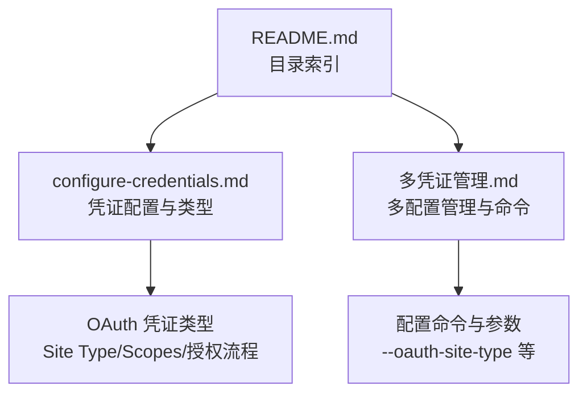
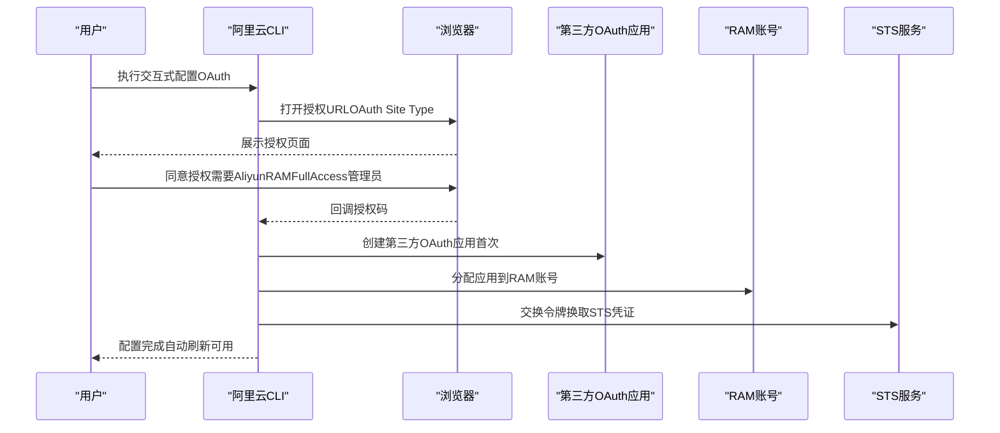
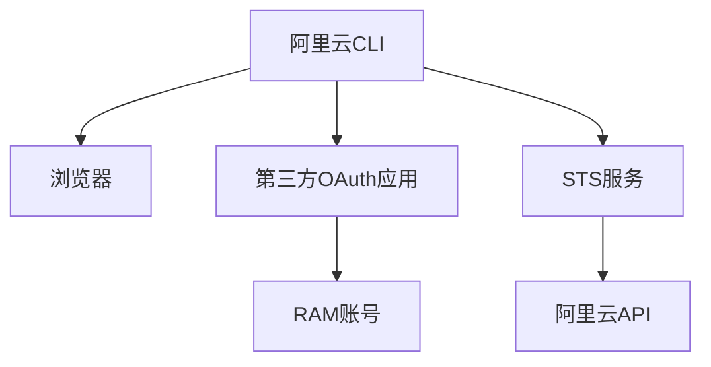

# OAuth凭证类型

<cite>
**本文引用的文件**
- [configure-credentials.md](file://alibaba-cloud/reference/04-配置阿里云CLI/configure-credentials.md)
- [多凭证管理.md](file://alibaba-cloud/reference/04-配置阿里云CLI/多凭证管理.md)
- [README.md](file://alibaba-cloud/reference/README.md)
</cite>

## 目录
1. [简介](#简介)
2. [项目结构](#项目结构)
3. [核心组件](#核心组件)
4. [架构总览](#架构总览)
5. [详细组件分析](#详细组件分析)
6. [依赖关系分析](#依赖关系分析)
7. [性能考量](#性能考量)
8. [故障排查指南](#故障排查指南)
9. [结论](#结论)
10. [附录](#附录)

## 简介
本指南聚焦于阿里云CLI中的OAuth凭证类型，系统性讲解OAuth 2.0授权机制、第三方OAuth应用的创建与授权流程、OAuth Site Type参数配置选项、OAuth范围（Scopes）的权限说明，以及首次授权与后续自动刷新机制。文档还提供交互式配置示例、浏览器授权流程说明、权限配置要求与实际命令示例，帮助用户正确设置OAuth授权并安全高效地使用阿里云CLI。

## 项目结构
本仓库为阿里云CLI官方文档的整理版，围绕“配置阿里云CLI”主题组织内容，其中OAuth凭证类型相关内容集中在“配置凭证”与“多凭证管理”两篇文档中。README提供了整体目录索引，便于定位相关章节。

图表来源
- [README.md:34-40](file://alibaba-cloud/reference/README.md#L34-L40)
- [configure-credentials.md:735-819](file://alibaba-cloud/reference/04-配置阿里云CLI/configure-credentials.md#L735-L819)
- [多凭证管理.md:78-79](file://alibaba-cloud/reference/04-配置阿里云CLI/多凭证管理.md#L78-L79)

章节来源
- [README.md:34-40](file://alibaba-cloud/reference/README.md#L34-L40)

## 核心组件
- OAuth 凭证类型：首次授权需浏览器交互，后续可自动刷新；需在同一设备上运行的浏览器与CLI配合完成授权。
- OAuth Site Type：登录站点选项，支持中国站（CN/0）与国际站（INTL/1），默认为中国站。
- OAuth Scopes：包含openid与/internal/ram/usersts两个核心范围，分别用于获取OpenID与换取STS凭证。
- 第三方OAuth应用：首次授权时由CLI在访问控制中创建，授权后用于换取代表用户身份的令牌。
- 权限要求：首次授权需要具备AliyunRAMFullAccess权限的管理员执行。

章节来源
- [configure-credentials.md:735-819](file://alibaba-cloud/reference/04-配置阿里云CLI/configure-credentials.md#L735-L819)

## 架构总览
OAuth凭证在CLI中的工作流分为“首次授权创建应用”和“后续自动刷新”两大阶段。首次授权通过浏览器完成，随后CLI将应用与RAM账号关联，完成授权闭环；之后CLI可自动刷新令牌以维持访问。

图表来源
- [configure-credentials.md:767-815](file://alibaba-cloud/reference/04-配置阿里云CLI/configure-credentials.md#L767-L815)

## 详细组件分析

### OAuth Site Type 参数配置
- 作用：指定OAuth登录站点，决定授权端点与回调行为。
- 可选值：
  - 中国站：CN 或 0
  - 国际站：INTL 或 1
  - 默认：CN
- 配置入口：交互式配置时提示输入；也可通过非交互式命令传入参数。

章节来源
- [configure-credentials.md:748-750](file://alibaba-cloud/reference/04-配置阿里云CLI/configure-credentials.md#L748-L750)
- [多凭证管理.md:78-79](file://alibaba-cloud/reference/04-配置阿里云CLI/多凭证管理.md#L78-L79)

### OAuth Scopes 权限说明
- openid
  - 用途：获取RAM用户的OpenID（唯一标识用户，不包含阿里云UID、用户名等敏感信息）。
- /internal/ram/usersts
  - 用途：用于换取STS凭证，以便调用阿里云服务API。

章节来源
- [configure-credentials.md:752-757](file://alibaba-cloud/reference/04-配置阿里云CLI/configure-credentials.md#L752-L757)

### 浏览器授权流程与第三方应用创建
- 首次授权：
  - CLI打开授权URL，用户在浏览器中完成授权（需要AliyunRAMFullAccess管理员）。
  - 授权成功后，CLI在访问控制中创建第三方OAuth应用。
  - 需要在控制台为应用分配RAM账号，然后重新发起授权。
- 授权成功后，CLI会提示设置默认地域，随后配置完成。

章节来源
- [configure-credentials.md:771-815](file://alibaba-cloud/reference/04-配置阿里云CLI/configure-credentials.md#L771-L815)

### 首次授权与后续自动刷新机制
- 首次授权：需浏览器交互，且浏览器与CLI需在同一设备上运行。
- 后续刷新：OAuth凭证类型支持自动刷新，避免频繁重复授权。

章节来源
- [configure-credentials.md:737-744](file://alibaba-cloud/reference/04-配置阿里云CLI/configure-credentials.md#L737-L744)

### 配置命令与权限要求
- 交互式配置命令：执行配置命令后，按提示输入OAuth Site Type并完成浏览器授权。
- 非交互式配置：当前不支持直接配置OAuth类型凭证（OAuth类型暂不支持非交互式配置）。
- 权限要求：首次授权需要具备AliyunRAMFullAccess权限的管理员执行。

章节来源
- [configure-credentials.md:767-819](file://alibaba-cloud/reference/04-配置阿里云CLI/configure-credentials.md#L767-L819)
- [多凭证管理.md:78-79](file://alibaba-cloud/reference/04-配置阿里云CLI/多凭证管理.md#L78-L79)

## 依赖关系分析
OAuth凭证类型依赖于以下组件与流程：
- 浏览器与CLI在同一设备上运行，确保授权回调与令牌交换顺利进行。
- 第三方OAuth应用在访问控制中创建并分配RAM账号，是授权闭环的关键。
- STS服务用于换取临时凭证（STS Token），支撑后续API调用。

图表来源
- [configure-credentials.md:743-744](file://alibaba-cloud/reference/04-配置阿里云CLI/configure-credentials.md#L743-L744)
- [configure-credentials.md:794-797](file://alibaba-cloud/reference/04-配置阿里云CLI/configure-credentials.md#L794-L797)

## 性能考量
- 自动刷新：OAuth凭证类型支持自动刷新，减少重复授权带来的交互成本。
- 地域与网络：OAuth Site Type影响端点与回调，合理选择可降低网络延迟与失败率。
- 令牌生命周期：结合STS凭证的有效期与刷新策略，避免频繁重新授权。

## 故障排查指南
- 浏览器未弹出：根据CLI提示手动复制登录URL至浏览器完成登录与授权。
- 权限不足：首次授权需要AliyunRAMFullAccess权限的管理员执行，若无权限请联系管理员。
- 应用未分配RAM账号：授权后需在控制台为第三方OAuth应用分配RAM账号，再重新发起授权。
- 非交互式配置不可用：OAuth类型暂不支持非交互式配置，需使用交互式流程。

章节来源
- [configure-credentials.md:785-790](file://alibaba-cloud/reference/04-配置阿里云CLI/configure-credentials.md#L785-L790)
- [configure-credentials.md:800-807](file://alibaba-cloud/reference/04-配置阿里云CLI/configure-credentials.md#L800-L807)
- [configure-credentials.md:817-819](file://alibaba-cloud/reference/04-配置阿里云CLI/configure-credentials.md#L817-L819)

## 结论
OAuth凭证类型为阿里云CLI提供了安全、便捷的用户身份授权方式。通过明确OAuth Site Type与Scopes的配置与作用，理解首次授权与后续自动刷新机制，并遵循权限与流程要求，用户可以在不同站点环境下高效、安全地使用阿里云CLI进行资源管理与API调用。

## 附录
- 交互式配置示例（概述）
  - 执行配置命令后，按提示输入OAuth Site Type（CN/0 或 INTL/1），随后在浏览器中完成授权。
  - 授权成功后，CLI会提示设置默认地域，配置完成。
- 非交互式配置现状
  - OAuth类型暂不支持非交互式配置，需使用交互式流程。

章节来源
- [configure-credentials.md:767-815](file://alibaba-cloud/reference/04-配置阿里云CLI/configure-credentials.md#L767-L815)
- [configure-credentials.md:817-819](file://alibaba-cloud/reference/04-配置阿里云CLI/configure-credentials.md#L817-L819)