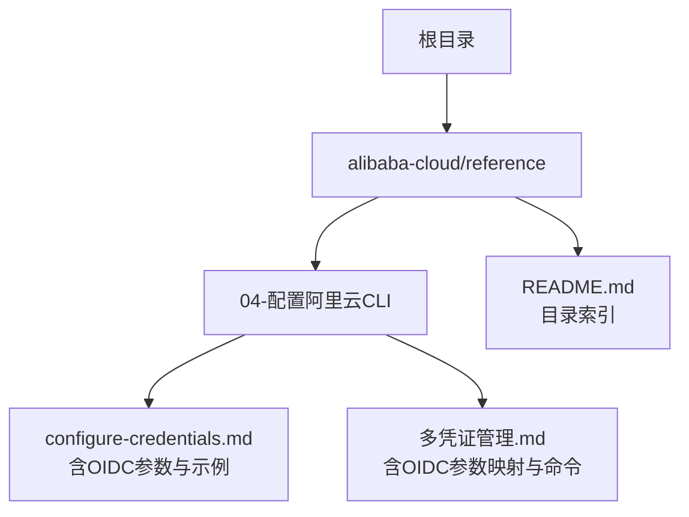
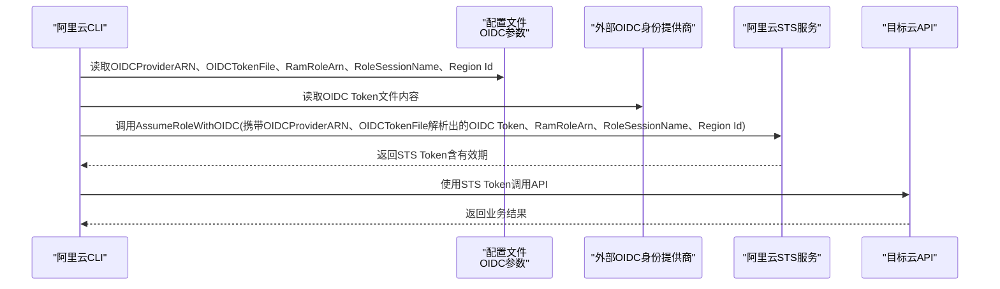

# OIDC凭证类型

<cite>
**本文引用的文件**
- [configure-credentials.md](file://alibaba-cloud/reference/04-配置阿里云CLI/configure-credentials.md)
- [多凭证管理.md](file://alibaba-cloud/reference/04-配置阿里云CLI/多凭证管理.md)
- [README.md](file://alibaba-cloud/reference/README.md)
</cite>

## 目录
1. [简介](#简介)
2. [项目结构](#项目结构)
3. [核心组件](#核心组件)
4. [架构总览](#架构总览)
5. [详细组件分析](#详细组件分析)
6. [依赖关系分析](#依赖关系分析)
7. [性能考量](#性能考量)
8. [故障排查指南](#故障排查指南)
9. [结论](#结论)
10. [附录](#附录)

## 简介
本指南聚焦于阿里云CLI中的OIDC（OpenID Connect）凭证类型，系统性说明其工作原理、关键参数配置方法、OIDC Token文件的获取与管理、交互式与非交互式配置示例、自动刷新机制以及适用场景与最佳实践。OIDC凭证类型具备“自动刷新”能力，并支持免密钥访问，适用于CI/CD流水线、容器平台与无服务器场景。

## 项目结构
本仓库围绕“配置阿里云CLI”主题组织文档，OIDC相关内容集中于“配置凭证”与“多凭证管理”两篇文档中，便于快速定位与交叉引用。

图表来源
- [README.md:11-40](file://alibaba-cloud/reference/README.md#L11-L40)

章节来源
- [README.md:11-40](file://alibaba-cloud/reference/README.md#L11-L40)

## 核心组件
- OIDC凭证类型：通过调用STS服务的AssumeRoleWithOIDC接口换取绑定角色的临时身份凭证（STS Token），具备“自动刷新”能力，支持免密钥访问。
- 关键参数：
  - OIDCProviderARN：OIDC身份提供商ARN。
  - OIDCTokenFile：OIDC Token文件路径。
  - RamRoleArn：需要扮演的RAM角色ARN。
  - RoleSessionName：角色会话名称。
  - Region Id：默认地域。
- 配置方式：支持交互式与非交互式两种方式，均可通过configure系列命令完成。

章节来源
- [configure-credentials.md:78-79](file://alibaba-cloud/reference/04-配置阿里云CLI/configure-credentials.md#L78-L79)
- [configure-credentials.md:581-595](file://alibaba-cloud/reference/04-配置阿里云CLI/configure-credentials.md#L581-L595)
- [多凭证管理.md:74-75](file://alibaba-cloud/reference/04-配置阿里云CLI/多凭证管理.md#L74-L75)

## 架构总览
OIDC凭证在阿里云CLI中的工作流概览如下：CLI读取配置中的OIDCProviderARN与OIDCTokenFile，结合RamRoleArn、RoleSessionName与Region Id，调用AssumeRoleWithOIDC接口获取STS Token；随后以该STS Token进行后续API调用。OIDC凭证类型具备“自动刷新”，可在令牌即将过期时自动续期。

图表来源
- [configure-credentials.md:584-585](file://alibaba-cloud/reference/04-配置阿里云CLI/configure-credentials.md#L584-L585)

## 详细组件分析

### OIDC凭证类型与AssumeRoleWithOIDC接口
- 工作原理：OIDC凭证通过AssumeRoleWithOIDC接口换取临时身份凭证（STS Token），用于后续OpenAPI调用。
- 刷新策略：OIDC凭证类型具备“自动刷新”能力，适合长期运行场景。
- 免密钥访问：支持免密钥访问，降低密钥泄露风险。

章节来源
- [configure-credentials.md:78](file://alibaba-cloud/reference/04-配置阿里云CLI/configure-credentials.md#L78)
- [configure-credentials.md:584-585](file://alibaba-cloud/reference/04-配置阿里云CLI/configure-credentials.md#L584-L585)

### OIDC参数详解与配置方法
- OIDCProviderARN：OIDC身份提供商ARN，可通过RAM控制台或API查询。
- OIDCTokenFile：OIDC Token文件路径，文件内容由外部IdP签发。
- RamRoleArn：需要扮演的RAM角色ARN。
- RoleSessionName：角色会话名称，用于区分不同使用者。
- Region Id：默认地域，建议与资源所在地域一致。

章节来源
- [configure-credentials.md:588-594](file://alibaba-cloud/reference/04-配置阿里云CLI/configure-credentials.md#L588-L594)

### OIDC Token文件的获取与管理
- 获取来源：OIDC Token由外部IdP签发，CLI仅读取文件内容。
- 文件管理建议：
  - 将OIDC Token文件置于受控目录，限制访问权限。
  - 采用自动化流程定期更新Token文件，避免过期。
  - 在CI/CD中通过安全的密文存储或机密卷挂载方式注入Token文件。
  - 对Token文件进行定期轮换，遵循最小权限原则。

章节来源
- [configure-credentials.md:591](file://alibaba-cloud/reference/04-配置阿里云CLI/configure-credentials.md#L591)

### 交互式配置示例
- 交互式命令：通过交互式方式创建OIDC配置，按提示输入各参数。
- 交互流程要点：依次输入OIDC Provider ARN、OIDC Token File、RAM Role ARN、Role Session Name、Region Id。

章节来源
- [configure-credentials.md:600-620](file://alibaba-cloud/reference/04-配置阿里云CLI/configure-credentials.md#L600-L620)

### 非交互式配置示例
- 非交互式命令：通过configure set命令一次性设置OIDC相关参数。
- 关键参数映射：
  - --oidc-provider-arn 对应 OIDCProviderARN
  - --oidc-token-file 对应 OIDCTokenFile
  - --ram-role-arn 对应 RamRoleArn
  - --role-session-name 对应 RoleSessionName
  - --region 对应 Region Id

章节来源
- [configure-credentials.md:622-648](file://alibaba-cloud/reference/04-配置阿里云CLI/configure-credentials.md#L622-L648)
- [多凭证管理.md:74-75](file://alibaba-cloud/reference/04-配置阿里云CLI/多凭证管理.md#L74-L75)

### OIDC凭证的自动刷新机制
- 刷新策略：OIDC凭证类型具备“自动刷新”，在令牌接近过期时自动续期，减少人工干预。
- 适用场景：CI/CD流水线、容器编排、无服务器函数等需要长期稳定访问的场景。

章节来源
- [configure-credentials.md:78](file://alibaba-cloud/reference/04-配置阿里云CLI/configure-credentials.md#L78)

### 实际配置命令与参数说明
- 交互式配置命令：aliyun configure --profile <PROFILE_NAME> --mode OIDC
- 非交互式配置命令：aliyun configure set --profile <PROFILE_NAME> --mode OIDC --oidc-provider-arn ... --oidc-token-file ... --ram-role-arn ... --role-session-name ... --region ...
- 参数说明：参见“OIDC参数详解与配置方法”。

章节来源
- [configure-credentials.md:604-648](file://alibaba-cloud/reference/04-配置阿里云CLI/configure-credentials.md#L604-L648)

### OIDC集成的最佳实践
- 最小权限：为RAM角色配置最小权限策略，遵循“按需授权”原则。
- 地域一致性：Region Id建议与资源所在地域一致，避免跨地域调用失败。
- 会话命名：RoleSessionName建议包含使用者标识，便于审计追踪。
- Token轮换：建立Token文件轮换机制，避免长期使用同一Token。
- CI/CD集成：在流水线中使用安全的密文存储或机密卷挂载，避免明文暴露。

章节来源
- [configure-credentials.md:592-594](file://alibaba-cloud/reference/04-配置阿里云CLI/configure-credentials.md#L592-L594)

## 依赖关系分析
- 配置文件依赖：OIDC凭证类型依赖配置文件中的OIDCProviderARN、OIDCTokenFile、RamRoleArn、RoleSessionName、Region Id。
- 外部依赖：OIDC Token文件由外部IdP签发，CLI仅读取文件内容。
- 接口依赖：通过AssumeRoleWithOIDC接口换取STS Token，后续API调用使用该STS Token。

图表来源
- [configure-credentials.md:584-585](file://alibaba-cloud/reference/04-配置阿里云CLI/configure-credentials.md#L584-L585)

章节来源
- [configure-credentials.md:584-594](file://alibaba-cloud/reference/04-配置阿里云CLI/configure-credentials.md#L584-L594)

## 性能考量
- 自动刷新：OIDC凭证的自动刷新机制减少了频繁的手动续期开销，适合长时间运行的任务。
- 地域选择：Region Id与资源所在地域一致可减少网络延迟与跨地域调用失败概率。
- Token大小：OIDC Token文件体积不宜过大，避免读取与传输开销。

## 故障排查指南
- OIDC Token文件不可读：检查文件路径与权限，确保CLI进程可读。
- RAM角色权限不足：确认RAM角色已授予必要的权限策略，避免API调用失败。
- Region Id不匹配：检查Region Id与资源所在地域是否一致。
- 会话名称冲突：如出现重复的RoleSessionName，建议调整为唯一标识符。
- 自动刷新失败：检查OIDC Token是否过期或被吊销，必要时重新获取并更新Token文件。

## 结论
OIDC凭证类型通过AssumeRoleWithOIDC接口实现自动刷新与免密钥访问，适合CI/CD、容器与无服务器等场景。正确配置OIDCProviderARN、OIDCTokenFile、RamRoleArn、RoleSessionName与Region Id，并遵循最小权限与Token轮换等最佳实践，可显著提升安全性与稳定性。

## 附录
- 相关文档与命令：
  - 交互式配置：aliyun configure --profile <PROFILE_NAME> --mode OIDC
  - 非交互式配置：aliyun configure set --profile <PROFILE_NAME> --mode OIDC --oidc-provider-arn ... --oidc-token-file ... --ram-role-arn ... --role-session-name ... --region ...
  - 查看配置：aliyun configure get --profile <PROFILE_NAME>
  - 切换配置：aliyun configure switch --profile <PROFILE_NAME>
  - 列出配置：aliyun configure list

章节来源
- [configure-credentials.md:604-648](file://alibaba-cloud/reference/04-配置阿里云CLI/configure-credentials.md#L604-L648)
- [多凭证管理.md:100-180](file://alibaba-cloud/reference/04-配置阿里云CLI/多凭证管理.md#L100-L180)