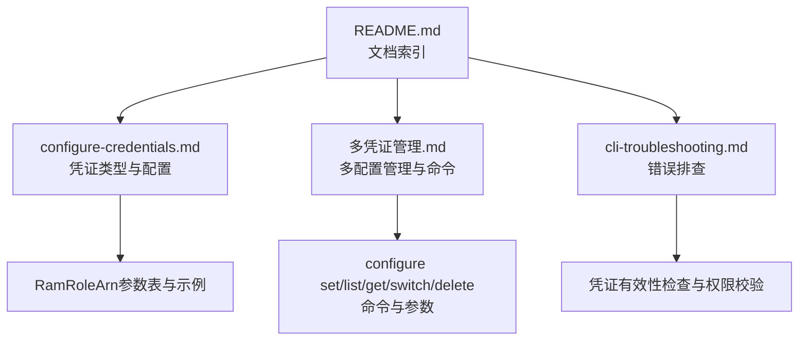
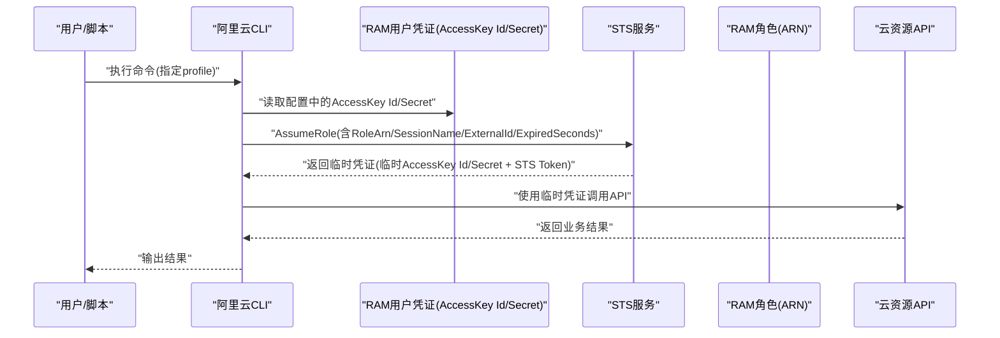
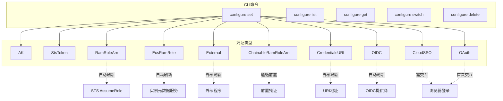

# RamRoleArn凭证类型

<cite>
**本文引用的文件**
- [configure-credentials.md](file://alibaba-cloud/reference/04-配置阿里云CLI/configure-credentials.md)
- [多凭证管理.md](file://alibaba-cloud/reference/04-配置阿里云CLI/多凭证管理.md)
- [cli-troubleshooting.md](file://alibaba-cloud/reference/08-错误排查/cli-troubleshooting.md)
- [README.md](file://alibaba-cloud/reference/README.md)
</cite>

## 目录
1. [简介](#简介)
2. [项目结构](#项目结构)
3. [核心组件](#核心组件)
4. [架构总览](#架构总览)
5. [详细组件分析](#详细组件分析)
6. [依赖关系分析](#依赖关系分析)
7. [性能考量](#性能考量)
8. [故障排查指南](#故障排查指南)
9. [结论](#结论)
10. [附录](#附录)

## 简介
本指南围绕RamRoleArn（RAM角色扮演）凭证类型展开，系统讲解其工作机制、AssumeRole接口调用原理、关键参数配置方法（AccessKey Id、AccessKey Secret、STS Region、RAM Role Arn、Role Session Name、External Id、Expired Seconds、Region Id）、交互式与非交互式配置示例、凭证自动刷新策略与有效期管理，以及最佳实践与常见问题排查。目标是帮助读者在不同环境中正确、安全地配置与使用RamRoleArn凭证。

## 项目结构
本仓库为阿里云CLI官方文档的整理版，围绕“配置阿里云CLI”主题提供凭证类型、多凭证管理、错误排查等内容。RamRoleArn相关内容集中在“配置凭证”与“多凭证管理”两篇文档中，辅以“错误排查”文档用于定位配置与调用问题。

图表来源
- [README.md:11-89](file://alibaba-cloud/reference/README.md#L11-L89)
- [configure-credentials.md:65-295](file://alibaba-cloud/reference/04-配置阿里云CLI/configure-credentials.md#L65-L295)
- [多凭证管理.md:37-107](file://alibaba-cloud/reference/04-配置阿里云CLI/多凭证管理.md#L37-L107)
- [cli-troubleshooting.md:52-82](file://alibaba-cloud/reference/08-错误排查/cli-troubleshooting.md#L52-L82)

章节来源
- [README.md:11-89](file://alibaba-cloud/reference/README.md#L11-L89)

## 核心组件
- 凭证类型与刷新策略
  - RamRoleArn：自动刷新（基于AssumeRole获取临时凭证）
  - EcsRamRole：自动刷新（通过实例元数据获取）
  - External/CredentialsURI/OIDC/CloudSSO/OAuth：外部系统刷新或需交互
- 关键参数
  - AccessKey Id/Secret：发起AssumeRole的主体凭证
  - STS Region：调用STS接口的地域
  - RAM Role Arn：目标角色ARN
  - Role Session Name：会话标识，便于审计
  - External Id：外部提供的角色标识，防混淆代理人问题
  - Expired Seconds：临时凭证有效期（秒）
  - Region Id：默认调用地域

章节来源
- [configure-credentials.md:69-81](file://alibaba-cloud/reference/04-配置阿里云CLI/configure-credentials.md#L69-L81)
- [configure-credentials.md:221-232](file://alibaba-cloud/reference/04-配置阿里云CLI/configure-credentials.md#L221-L232)

## 架构总览
RamRoleArn的典型调用链路：本地CLI使用RAM用户AccessKey调用STS AssumeRole接口，换取临时凭证（AccessKey Id/Secret + STS Token），随后以临时凭证访问云资源。External Id用于增强角色扮演的可追溯性与防混淆。

图表来源
- [configure-credentials.md:220-232](file://alibaba-cloud/reference/04-配置阿里云CLI/configure-credentials.md#L220-L232)
- [多凭证管理.md:82-91](file://alibaba-cloud/reference/04-配置阿里云CLI/多凭证管理.md#L82-L91)

## 详细组件分析

### RamRoleArn参数与配置要点
- 参数说明与取值范围
  - AccessKey Id/Secret：RAM用户的长期凭证
  - STS Region：调用STS的地域（需支持STS接入点）
  - RAM Role Arn：扮演的目标角色ARN
  - Role Session Name：2~64字符，允许字母、数字与特殊字符.@-_
  - External Id：2~1224字符，允许字母、数字与特殊字符=,.@:/-_
  - Expired Seconds：默认900，不超过角色MaxSessionDuration
  - Region Id：默认调用地域
- 交互式配置流程
  - 步骤：执行configure命令，选择RamRoleArn模式，依次输入各参数
  - 输出：保存成功后显示欢迎信息
- 非交互式配置流程
  - 命令：configure set + --mode RamRoleArn + 各参数
  - 幂等性：成功后自动切换为当前配置
- External Id的作用
  - 防混淆代理人问题：通过外部ID标识角色来源，便于审计与溯源
  - 版本支持：自v3.0.276起在RamRoleArn与ChainableRamRoleArn中支持

章节来源
- [configure-credentials.md:212-295](file://alibaba-cloud/reference/04-配置阿里云CLI/configure-credentials.md#L212-L295)
- [configure-credentials.md:443-528](file://alibaba-cloud/reference/04-配置阿里云CLI/configure-credentials.md#L443-L528)

### 配置示例与命令语法
- 交互式配置
  - 语法：aliyun configure --profile <NAME> --mode RamRoleArn
  - 流程：依次输入AccessKey Id/Secret、STS Region、RAM Role Arn、Role Session Name、External Id、Expired Seconds、Region Id
- 非交互式配置
  - 语法：aliyun configure set --profile <NAME> --mode RamRoleArn --access-key-id ... --access-key-secret ... --sts-region ... --ram-role-arn ... --role-session-name ... --external-id ... --expired-seconds ... --region ...
  - 幂等：成功后自动切换为当前配置
- 多配置管理
  - 列表：aliyun configure list
  - 查看：aliyun configure get --profile <NAME>
  - 切换：aliyun configure switch --profile <NAME>
  - 删除：aliyun configure delete --profile <NAME>

章节来源
- [多凭证管理.md:37-107](file://alibaba-cloud/reference/04-配置阿里云CLI/多凭证管理.md#L37-L107)
- [多凭证管理.md:164-202](file://alibaba-cloud/reference/04-配置阿里云CLI/多凭证管理.md#L164-L202)

### 凭证自动刷新与有效期管理
- 刷新策略
  - RamRoleArn：自动刷新（基于AssumeRole获取临时凭证）
  - EcsRamRole：自动刷新（实例元数据）
  - 其他类型：外部系统刷新或需交互
- 有效期
  - Expired Seconds：临时凭证有效期（秒），默认900，不超过角色MaxSessionDuration
  - 临时凭证包含临时AccessKey Id/Secret与STS Token，用于后续API调用
- 最佳实践
  - 将Expire Seconds设置为满足任务时长的最小值，避免过长暴露面
  - 为前置RAM身份授予AliyunSTSAssumeRoleAccess权限（针对ChainableRamRoleArn）

章节来源
- [configure-credentials.md:69-81](file://alibaba-cloud/reference/04-配置阿里云CLI/configure-credentials.md#L69-L81)
- [configure-credentials.md:230-232](file://alibaba-cloud/reference/04-配置阿里云CLI/configure-credentials.md#L230-L232)
- [configure-credentials.md:468-468](file://alibaba-cloud/reference/04-配置阿里云CLI/configure-credentials.md#L468-L468)

### External Id的作用与使用场景
- 作用
  - 防混淆代理人问题：通过External Id标识角色来源，便于审计与溯源
  - 适用于跨系统、跨团队协作的角色扮演场景
- 使用场景
  - 多租户或多组织共享角色
  - 第三方集成或自动化平台扮演角色
  - 审计要求严格的企业环境
- 注意事项
  - External Id长度与字符集限制
  - 与Role Session Name结合使用，提升可追溯性

章节来源
- [configure-credentials.md:216-231](file://alibaba-cloud/reference/04-配置阿里云CLI/configure-credentials.md#L216-L231)
- [configure-credentials.md:448-460](file://alibaba-cloud/reference/04-配置阿里云CLI/configure-credentials.md#L448-L460)

### 假设角色（AssumeRole）接口工作原理
- 角色扮演流程
  - RAM用户使用AccessKey调用STS AssumeRole接口
  - 指定目标角色ARN、会话名称、外部ID、有效期
  - 返回临时凭证（临时AccessKey Id/Secret + STS Token）
- 审计与溯源
  - Role Session Name用于区分不同使用者
  - External Id用于区分不同来源系统或平台
- 权限与约束
  - RAM用户需具备AliyunSTSAssumeRoleAccess权限
  - Expired Seconds不得超过角色MaxSessionDuration

章节来源
- [configure-credentials.md:220-232](file://alibaba-cloud/reference/04-配置阿里云CLI/configure-credentials.md#L220-L232)
- [cli-troubleshooting.md:76-76](file://alibaba-cloud/reference/08-错误排查/cli-troubleshooting.md#L76-L76)

## 依赖关系分析
- CLI命令与凭证配置
  - configure set：创建/修改配置（支持多模式）
  - configure list/get/switch/delete：多配置管理
- 凭证类型与刷新策略
  - RamRoleArn/EcsRamRole：自动刷新
  - External/CredentialsURI/OIDC/CloudSSO/OAuth：外部系统刷新或需交互
- 外部依赖
  - STS服务（AssumeRole接口）
  - RAM角色与策略（AliyunSTSAssumeRoleAccess）
  - 实例元数据服务（EcsRamRole）

图表来源
- [多凭证管理.md:37-107](file://alibaba-cloud/reference/04-配置阿里云CLI/多凭证管理.md#L37-L107)
- [configure-credentials.md:69-81](file://alibaba-cloud/reference/04-配置阿里云CLI/configure-credentials.md#L69-L81)

章节来源
- [多凭证管理.md:37-107](file://alibaba-cloud/reference/04-配置阿里云CLI/多凭证管理.md#L37-L107)
- [configure-credentials.md:69-81](file://alibaba-cloud/reference/04-配置阿里云CLI/configure-credentials.md#L69-L81)

## 性能考量
- 临时凭证有效期
  - Expired Seconds越短，刷新频率越高，但安全性更好
  - 建议根据任务时长设置最小有效值，避免频繁刷新带来的开销
- STS调用地域
  - STS Region应尽量靠近调用方，减少网络延迟
- 多配置管理
  - 使用configure switch快速切换，避免重复参数传递
- 外部刷新类型
  - External/CredentialsURI/OIDC等类型依赖外部系统，需关注外部系统的可用性与延迟

[本节为通用指导，不直接分析具体文件]

## 故障排查指南
- 凭证有效性检查
  - 使用configure list/get确认配置是否正确
  - 使用--dryrun或开启日志查看请求详情
- 权限问题
  - RamRoleArn/ChainableRamRoleArn需为RAM用户授予AliyunSTSAssumeRoleAccess
  - EcsRamRole需确保实例元数据服务可用与IMDSv2配置正确
- 地域与接入点
  - 检查--region/--endpoint优先级与配置文件中的Region Id
- 常见错误
  - “required parameters not assigned”：缺少必要参数
  - “fail to set configuration”：配置参数不合法或权限不足
  - “凭证无效”：AccessKey或临时凭证过期

章节来源
- [cli-troubleshooting.md:52-82](file://alibaba-cloud/reference/08-错误排查/cli-troubleshooting.md#L52-L82)
- [多凭证管理.md:164-202](file://alibaba-cloud/reference/04-配置阿里云CLI/多凭证管理.md#L164-L202)

## 结论
RamRoleArn凭证类型通过AssumeRole接口实现自动刷新的临时凭证，适合需要跨系统、跨团队协作且强调审计与安全的场景。合理配置AccessKey、STS Region、RAM Role Arn、Role Session Name、External Id与Expired Seconds，并结合多配置管理与权限治理，可显著提升CLI使用的安全性与可维护性。遇到问题时，优先检查凭证有效性、权限与地域配置，结合日志与模拟调用定位根因。

[本节为总结性内容，不直接分析具体文件]

## 附录

### 命令速查与示例路径
- 交互式配置RamRoleArn
  - 语法：aliyun configure --profile <NAME> --mode RamRoleArn
  - 示例路径：[交互式配置示例:240-261](file://alibaba-cloud/reference/04-配置阿里云CLI/configure-credentials.md#L240-L261)
- 非交互式配置RamRoleArn
  - 语法：aliyun configure set --profile <NAME> --mode RamRoleArn ...
  - 示例路径：[非交互式配置示例(Bash):265-295](file://alibaba-cloud/reference/04-配置阿里云CLI/configure-credentials.md#L265-L295)，[非交互式配置示例(PowerShell):281-295](file://alibaba-cloud/reference/04-配置阿里云CLI/configure-credentials.md#L281-L295)
- 多配置管理
  - 列表：aliyun configure list
  - 查看：aliyun configure get --profile <NAME>
  - 切换：aliyun configure switch --profile <NAME>
  - 删除：aliyun configure delete --profile <NAME>
  - 示例路径：[多凭证管理命令:37-107](file://alibaba-cloud/reference/04-配置阿里云CLI/多凭证管理.md#L37-L107)

### 参数对照表
- RamRoleArn关键参数
  - AccessKey Id/Secret：RAM用户长期凭证
  - STS Region：调用STS的地域
  - RAM Role Arn：目标角色ARN
  - Role Session Name：会话标识
  - External Id：外部ID（防混淆代理人）
  - Expired Seconds：临时凭证有效期（秒）
  - Region Id：默认调用地域
- 示例路径：[参数说明与取值范围:221-232](file://alibaba-cloud/reference/04-配置阿里云CLI/configure-credentials.md#L221-L232)