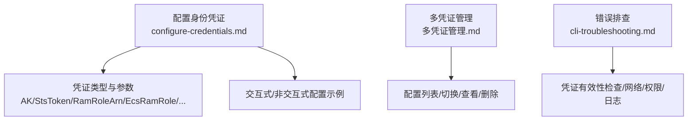
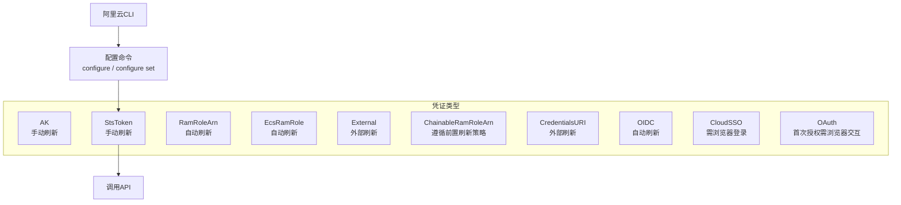
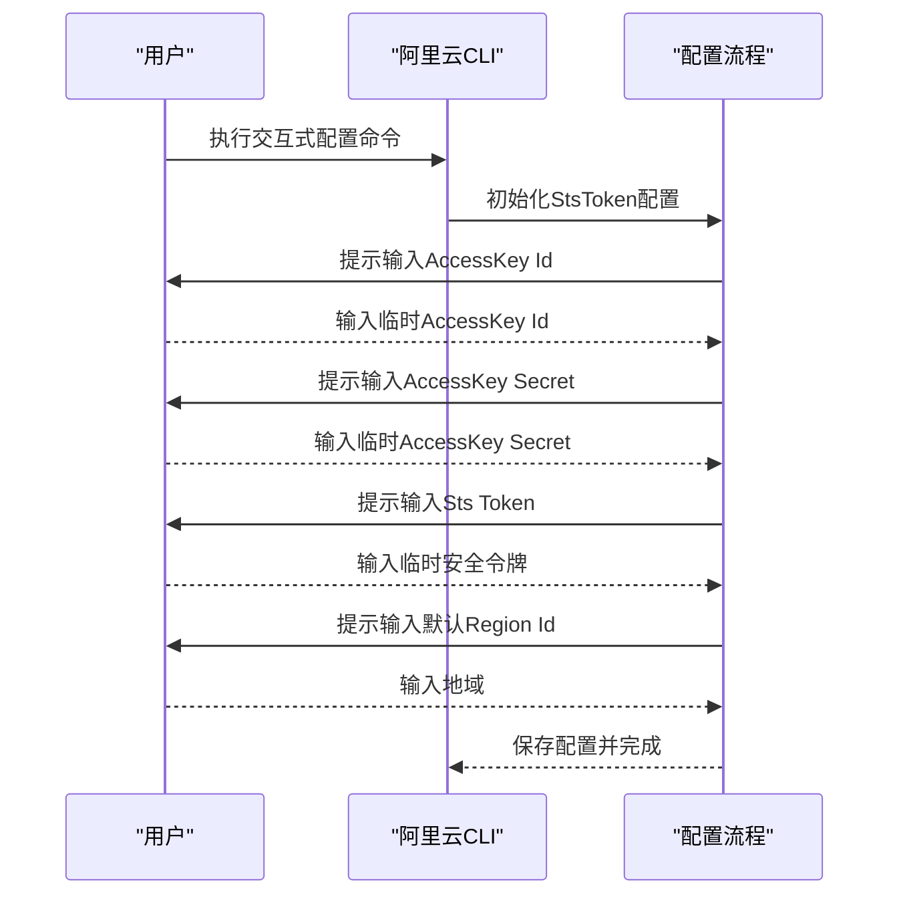
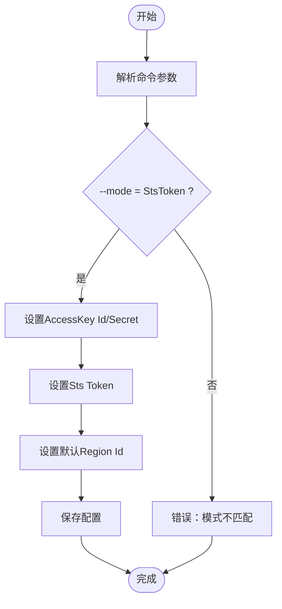
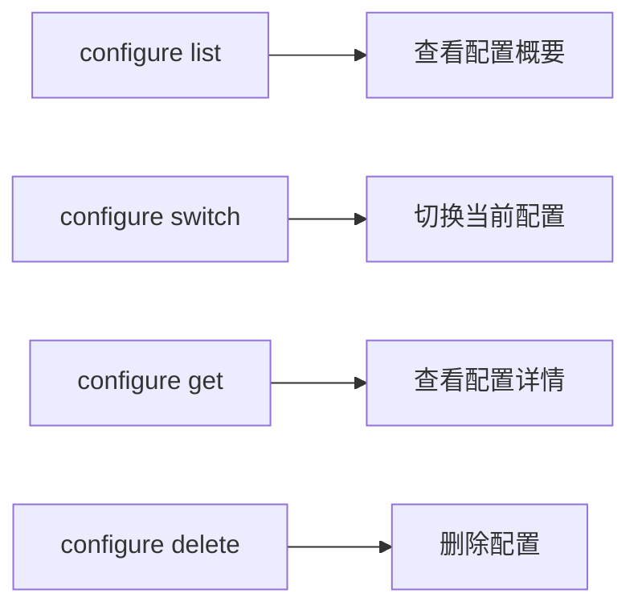

# STS Token凭证类型

<cite>
**本文引用的文件**
- [configure-credentials.md](file://alibaba-cloud/reference/04-配置阿里云CLI/configure-credentials.md)
- [多凭证管理.md](file://alibaba-cloud/reference/04-配置阿里云CLI/多凭证管理.md)
- [cli-troubleshooting.md](file://alibaba-cloud/reference/08-错误排查/cli-troubleshooting.md)
</cite>

## 目录
1. [简介](#简介)
2. [项目结构](#项目结构)
3. [核心组件](#核心组件)
4. [架构总览](#架构总览)
5. [详细组件分析](#详细组件分析)
6. [依赖关系分析](#依赖关系分析)
7. [性能考虑](#性能考虑)
8. [故障排查指南](#故障排查指南)
9. [结论](#结论)
10. [附录](#附录)

## 简介
本指南聚焦于阿里云CLI中的STS Token（Security Token Service）临时访问凭证类型，系统讲解其概念、优势、参数配置、交互式与非交互式配置示例、有效期管理机制以及常见错误处理方法。通过结合仓库中的官方文档，帮助用户理解并正确使用STS临时凭证，降低长期密钥暴露风险，提升运维安全性与合规性。

## 项目结构
围绕STS Token配置的相关文档主要分布在“配置阿里云CLI”与“错误排查”两大主题下，其中：
- 凭证类型与配置示例集中在“配置身份凭证”文档中
- 多凭证管理与切换、查看、删除等操作集中在“多凭证管理”文档中
- 常见错误与排查方法集中在“错误排查”文档中



图表来源
- [configure-credentials.md:65-211](file://alibaba-cloud/reference/04-配置阿里云CLI/configure-credentials.md#L65-L211)
- [多凭证管理.md:1-203](file://alibaba-cloud/reference/04-配置阿里云CLI/多凭证管理.md#L1-L203)
- [cli-troubleshooting.md:1-111](file://alibaba-cloud/reference/08-错误排查/cli-troubleshooting.md#L1-L111)

章节来源
- [configure-credentials.md:1-862](file://alibaba-cloud/reference/04-配置阿里云CLI/configure-credentials.md#L1-L862)
- [多凭证管理.md:1-203](file://alibaba-cloud/reference/04-配置阿里云CLI/多凭证管理.md#L1-L203)
- [cli-troubleshooting.md:1-111](file://alibaba-cloud/reference/08-错误排查/cli-troubleshooting.md#L1-L111)

## 核心组件
- 凭证类型与刷新策略
  - StsToken：手动刷新，适合短期任务或一次性场景
  - 其他类型如AK、RamRoleArn、EcsRamRole等具备不同刷新策略与适用场景
- STS Token关键参数
  - AccessKey Id：临时AccessKey ID（以特定前缀标识）
  - AccessKey Secret：临时AccessKey Secret
  - STS Token：临时安全令牌
  - Region Id：默认地域
- 配置方式
  - 交互式：通过交互式命令逐步输入参数
  - 非交互式：通过命令行参数一次性设置

章节来源
- [configure-credentials.md:69-81](file://alibaba-cloud/reference/04-配置阿里云CLI/configure-credentials.md#L69-L81)
- [configure-credentials.md:147-211](file://alibaba-cloud/reference/04-配置阿里云CLI/configure-credentials.md#L147-L211)

## 架构总览
下图展示了STS Token在CLI配置中的位置与与其他凭证类型的对比关系，以及配置与使用的基本流程。



图表来源
- [configure-credentials.md:65-81](file://alibaba-cloud/reference/04-配置阿里云CLI/configure-credentials.md#L65-L81)
- [configure-credentials.md:147-211](file://alibaba-cloud/reference/04-配置阿里云CLI/configure-credentials.md#L147-L211)

## 详细组件分析

### STS Token概念与优势
- STS是阿里云提供的临时访问权限管理服务，通过短期有效令牌降低长期密钥泄露风险
- 适用于短期任务、一次性授权、最小权限原则等场景
- 与AK相比，STS Token具备临时性与有效期限制，增强安全性

章节来源
- [configure-credentials.md:149-151](file://alibaba-cloud/reference/04-配置阿里云CLI/configure-credentials.md#L149-L151)

### STS Token参数说明
- AccessKey Id：临时AccessKey ID（以特定前缀标识）
- AccessKey Secret：临时AccessKey Secret
- STS Token：临时安全令牌
- Region Id：默认地域（建议与资源所在地域一致）

章节来源
- [configure-credentials.md:154-159](file://alibaba-cloud/reference/04-配置阿里云CLI/configure-credentials.md#L154-L159)

### 交互式配置流程
- 命令语法：通过交互式命令逐步输入参数
- 流程要点：输入AccessKey Id、AccessKey Secret、Sts Token、默认Region等
- 成功提示：保存成功后显示配置完成信息



图表来源
- [configure-credentials.md:169-184](file://alibaba-cloud/reference/04-配置阿里云CLI/configure-credentials.md#L169-L184)

章节来源
- [configure-credentials.md:165-184](file://alibaba-cloud/reference/04-配置阿里云CLI/configure-credentials.md#L165-L184)

### 非交互式配置流程
- 命令语法：通过configure set一次性设置参数
- 关键参数：--mode StsToken、--access-key-id、--access-key-secret、--sts-token、--region
- 平台示例：Bash与PowerShell命令示例



图表来源
- [configure-credentials.md:188-210](file://alibaba-cloud/reference/04-配置阿里云CLI/configure-credentials.md#L188-L210)

章节来源
- [configure-credentials.md:186-210](file://alibaba-cloud/reference/04-配置阿里云CLI/configure-credentials.md#L186-L210)

### 多凭证管理与STS Token集成
- 列表查看：通过configure list查看各配置状态
- 切换当前配置：通过configure switch切换默认配置
- 查看指定配置：通过configure get查看详细信息
- 删除配置：通过configure delete删除指定配置



图表来源
- [多凭证管理.md:99-203](file://alibaba-cloud/reference/04-配置阿里云CLI/多凭证管理.md#L99-L203)

章节来源
- [多凭证管理.md:99-203](file://alibaba-cloud/reference/04-配置阿里云CLI/多凭证管理.md#L99-L203)

### STS Token有效期与临时性管理
- 临时性：StsToken为临时访问凭证，有效期有限
- 手动刷新：需要在凭证过期前重新获取并更新配置
- 最佳实践：为短期任务或一次性授权场景使用，避免长期依赖同一STS Token

章节来源
- [configure-credentials.md:69-72](file://alibaba-cloud/reference/04-配置阿里云CLI/configure-credentials.md#L69-L72)

## 依赖关系分析
- CLI与配置文件
  - 配置文件以JSON格式存储在用户目录下的.config/aliyun/config.json中
  - 不同凭证类型共享同一存储结构，通过mode字段区分类型
- CLI与凭证类型
  - StsToken属于手动刷新类型，与其他自动刷新类型（如RamRoleArn、EcsRamRole等）在刷新策略上存在差异
- CLI与多凭证管理
  - 多凭证管理命令与STS Token配置相互独立但可协同使用，便于在多场景下切换与复用

```mermaid
graph TB
CFG["配置文件<br/>config.json"] <- --> MODE["mode字段<br/>AK/StsToken/RamRoleArn/..."]
CLI["阿里云CLI"] --> CFG
CLI --> MAN["多凭证管理命令"]
MAN --> CFG
```

图表来源
- [configure-credentials.md:851-862](file://alibaba-cloud/reference/04-配置阿里云CLI/configure-credentials.md#L851-L862)
- [多凭证管理.md:99-203](file://alibaba-cloud/reference/04-配置阿里云CLI/多凭证管理.md#L99-L203)

章节来源
- [configure-credentials.md:851-862](file://alibaba-cloud/reference/04-配置阿里云CLI/configure-credentials.md#L851-L862)
- [多凭证管理.md:99-203](file://alibaba-cloud/reference/04-配置阿里云CLI/多凭证管理.md#L99-L203)

## 性能考虑
- 临时凭证的优势在于降低长期密钥泄露风险，但频繁刷新会增加管理成本
- 对于高并发或自动化场景，建议采用自动刷新类型（如RamRoleArn、EcsRamRole等）以减少人工干预
- 若必须使用StsToken，建议在脚本中加入到期检测与自动续期逻辑，避免因过期导致调用失败

## 故障排查指南
- 凭证有效性检查
  - 使用configure list与configure get确认配置是否正确
  - 检查当前使用的配置是否为目标配置（可通过--profile显式指定）
- 常见错误与处理
  - 凭证无效：检查AccessKey Id/Secret与Sts Token是否正确、是否过期
  - 权限不足：确认身份具备调用目标API的权限
  - 网络异常：检查网络连通性与代理设置
  - 日志与模拟调用：启用日志或使用--dryrun模拟调用以定位问题
- 多凭证切换
  - 使用configure switch切换默认配置，或在命令中通过--profile显式指定

章节来源
- [cli-troubleshooting.md:52-83](file://alibaba-cloud/reference/08-错误排查/cli-troubleshooting.md#L52-L83)
- [多凭证管理.md:164-181](file://alibaba-cloud/reference/04-配置阿里云CLI/多凭证管理.md#L164-L181)

## 结论
STS Token作为临时访问凭证，为短期任务与最小权限场景提供了更高的安全性。通过交互式与非交互式配置方式，用户可快速完成StsToken配置，并结合多凭证管理实现灵活切换与复用。在使用过程中，务必关注其临时性与有效期管理，配合日志与模拟调用进行故障排查，确保调用稳定与安全。

## 附录
- 快速参考
  - 交互式配置命令：[configure-credentials.md:169-184](file://alibaba-cloud/reference/04-配置阿里云CLI/configure-credentials.md#L169-L184)
  - 非交互式配置命令（Bash）：[configure-credentials.md:188-210](file://alibaba-cloud/reference/04-配置阿里云CLI/configure-credentials.md#L188-L210)
  - 非交互式配置命令（PowerShell）：[configure-credentials.md:200-210](file://alibaba-cloud/reference/04-配置阿里云CLI/configure-credentials.md#L200-L210)
  - 多凭证管理命令：[多凭证管理.md:99-203](file://alibaba-cloud/reference/04-配置阿里云CLI/多凭证管理.md#L99-L203)
  - 故障排查指引：[cli-troubleshooting.md:52-83](file://alibaba-cloud/reference/08-错误排查/cli-troubleshooting.md#L52-L83)