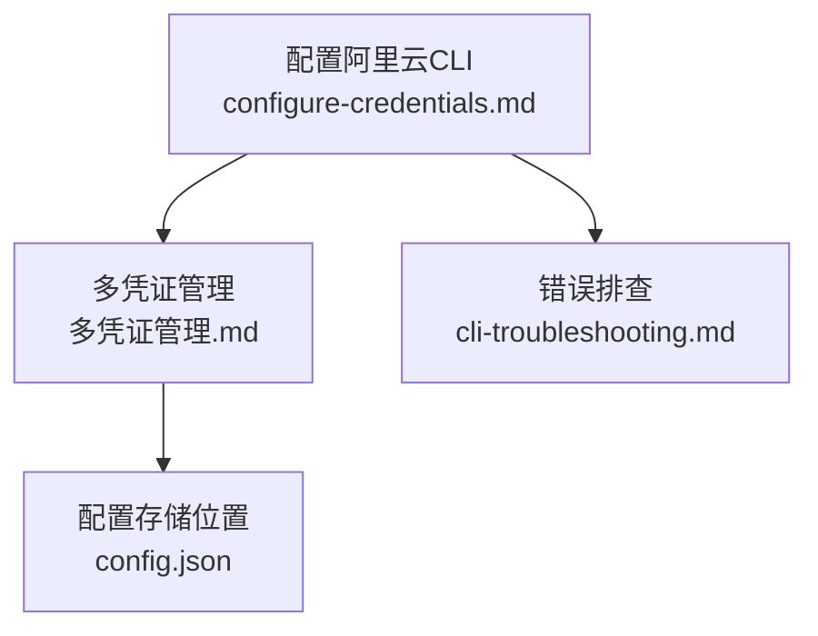
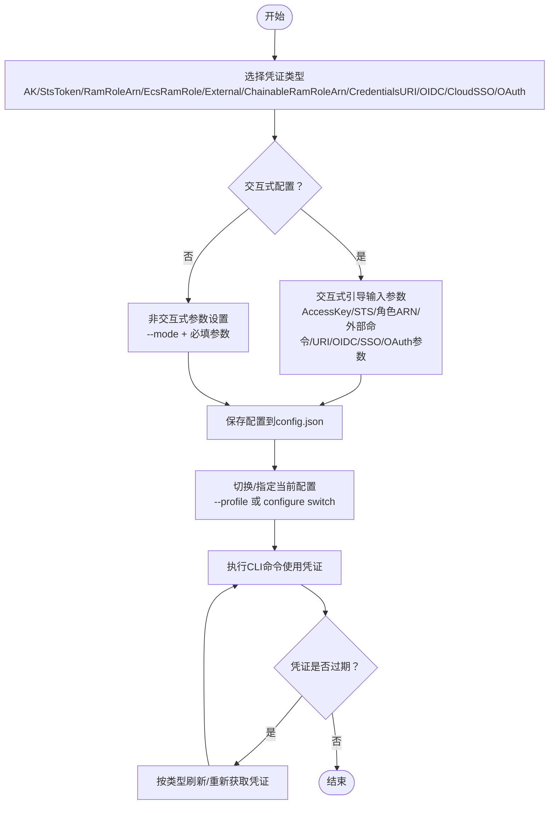
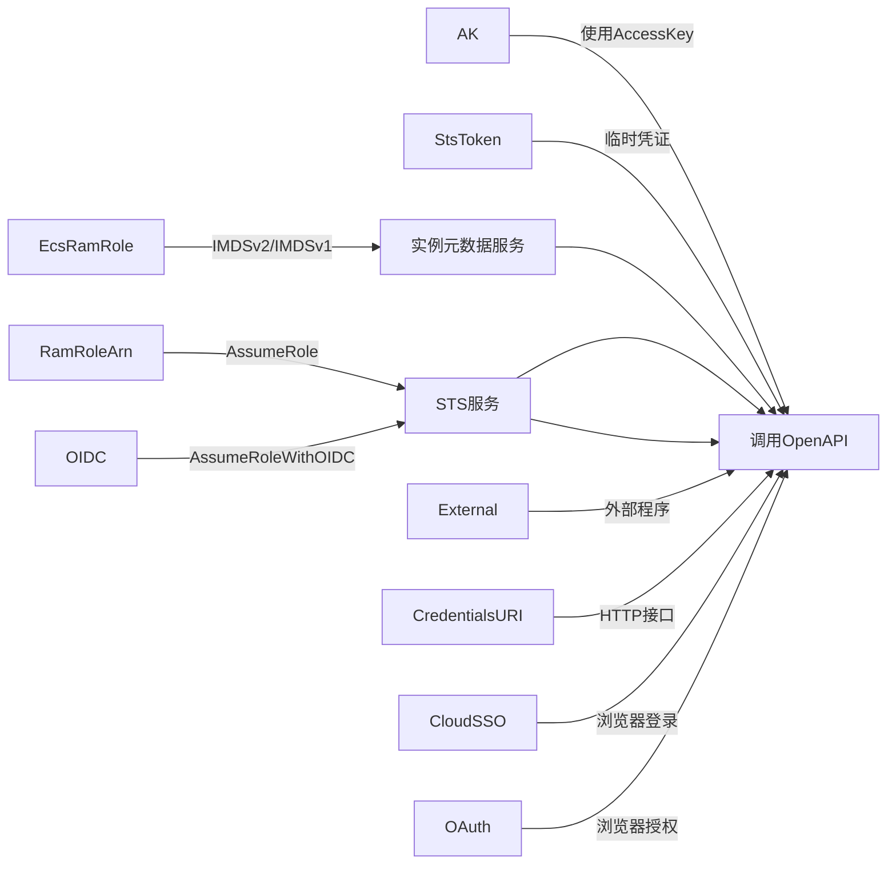

# 凭证类型配置

<cite>
**本文引用的文件**
- [configure-credentials.md](file://alibaba-cloud/reference/04-配置阿里云CLI/configure-credentials.md)
- [多凭证管理.md](file://alibaba-cloud/reference/04-配置阿里云CLI/多凭证管理.md)
- [cli-troubleshooting.md](file://alibaba-cloud/reference/08-错误排查/cli-troubleshooting.md)
</cite>

## 目录
1. [简介](#简介)
2. [项目结构](#项目结构)
3. [核心组件](#核心组件)
4. [架构总览](#架构总览)
5. [详细组件分析](#详细组件分析)
6. [依赖关系分析](#依赖关系分析)
7. [性能考量](#性能考量)
8. [故障排查指南](#故障排查指南)
9. [结论](#结论)
10. [附录](#附录)

## 简介
本指南面向使用阿里云CLI的用户，系统讲解十种凭证类型的配置方法与最佳实践，包括：
- AK（AccessKey）
- StsToken（临时访问令牌）
- RamRoleArn（RAM角色扮演）
- EcsRamRole（ECS实例RAM角色）
- External（外部程序）
- ChainableRamRoleArn（链式RAM角色）
- CredentialsURI（凭证URI）
- OIDC（开放身份认证）
- CloudSSO（云SSO）
- OAuth（第三方OAuth）

内容涵盖适用场景、配置参数、交互式与非交互式配置示例、凭证刷新策略、免密钥访问支持、安全注意事项与常见问题排查。

## 项目结构
本指南涉及的文档主要位于“配置阿里云CLI”章节，核心文件如下：
- configure-credentials.md：凭证类型、参数、交互/非交互式配置示例与刷新策略
- 多凭证管理.md：配置的增删改查、切换、查看与存储位置
- cli-troubleshooting.md：常见错误排查与凭证有效性检查

图表来源
- [configure-credentials.md:1-862](file://alibaba-cloud/reference/04-配置阿里云CLI/configure-credentials.md#L1-L862)
- [多凭证管理.md:1-203](file://alibaba-cloud/reference/04-配置阿里云CLI/多凭证管理.md#L1-L203)
- [cli-troubleshooting.md:1-111](file://alibaba-cloud/reference/08-错误排查/cli-troubleshooting.md#L1-L111)

章节来源
- [configure-credentials.md:1-862](file://alibaba-cloud/reference/04-配置阿里云CLI/configure-credentials.md#L1-L862)
- [多凭证管理.md:1-203](file://alibaba-cloud/reference/04-配置阿里云CLI/多凭证管理.md#L1-L203)
- [cli-troubleshooting.md:1-111](file://alibaba-cloud/reference/08-错误排查/cli-troubleshooting.md#L1-L111)

## 核心组件
- 凭证类型与刷新策略
  - AK：手动刷新，不支持免密钥访问
  - StsToken：手动刷新，不支持免密钥访问
  - RamRoleArn：自动刷新，不支持免密钥访问
  - EcsRamRole：自动刷新，支持免密钥访问
  - External：外部系统刷新，支持免密钥访问
  - ChainableRamRoleArn：遵循前置凭证刷新策略，支持免密钥访问
  - CredentialsURI：外部系统刷新，支持免密钥访问
  - OIDC：自动刷新，支持免密钥访问
  - CloudSSO：需浏览器登录，支持免密钥访问
  - OAuth：首次授权需浏览器交互，后续可自动刷新，支持免密钥访问

- 配置命令与参数
  - 交互式：aliyun configure [--profile <NAME>] [--mode <TYPE>]
  - 非交互式：aliyun configure set [--profile <NAME>] [--mode <TYPE>] [--settingName <VALUE>...]
  - 列表/查看/切换/删除：configure list/get/switch/delete

章节来源
- [configure-credentials.md:65-81](file://alibaba-cloud/reference/04-配置阿里云CLI/configure-credentials.md#L65-L81)
- [多凭证管理.md:9-91](file://alibaba-cloud/reference/04-配置阿里云CLI/多凭证管理.md#L9-L91)

## 架构总览
下图展示了阿里云CLI凭证配置的整体流程与关键交互点。

图表来源
- [configure-credentials.md:15-63](file://alibaba-cloud/reference/04-配置阿里云CLI/configure-credentials.md#L15-L63)
- [多凭证管理.md:164-181](file://alibaba-cloud/reference/04-配置阿里云CLI/多凭证管理.md#L164-L181)

## 详细组件分析

### AK（AccessKey）
- 适用场景
  - 本地开发、CI/CD流水线、脚本自动化等直接使用长期凭证
- 配置参数
  - AccessKey Id、AccessKey Secret、Region Id
- 交互式配置
  - aliyun configure --profile <NAME>
  - 依次输入AccessKey Id/Secret与默认Region
- 非交互式配置
  - aliyun configure set --profile <NAME> --mode AK --access-key-id <ID> --access-key-secret <SECRET> --region <REGION>
- 刷新策略与免密钥访问
  - 手动刷新；不支持免密钥访问
- 安全注意事项
  - 建议为API访问创建专用RAM用户并生成AccessKey
  - 避免将AccessKey硬编码在脚本中，优先使用短期凭证或免密钥访问方案

章节来源
- [configure-credentials.md:82-146](file://alibaba-cloud/reference/04-配置阿里云CLI/configure-credentials.md#L82-L146)
- [多凭证管理.md:55-91](file://alibaba-cloud/reference/04-配置阿里云CLI/多凭证管理.md#L55-L91)

### StsToken（临时访问令牌）
- 适用场景
  - 临时授权、短期任务、最小权限原则
- 配置参数
  - AccessKey Id、AccessKey Secret、Sts Token、Region Id
- 交互式配置
  - aliyun configure --profile <NAME> --mode StsToken
- 非交互式配置
  - aliyun configure set --profile <NAME> --mode StsToken --access-key-id <ID> --access-key-secret <SECRET> --sts-token <TOKEN> --region <REGION>
- 刷新策略与免密钥访问
  - 手动刷新；不支持免密钥访问
- 安全注意事项
  - 严格限制有效期；避免长期持有

章节来源
- [configure-credentials.md:147-211](file://alibaba-cloud/reference/04-配置阿里云CLI/configure-credentials.md#L147-L211)
- [多凭证管理.md:67-68](file://alibaba-cloud/reference/04-配置阿里云CLI/多凭证管理.md#L67-L68)

### RamRoleArn（RAM角色扮演）
- 适用场景
  - 跨账号/跨角色授权、最小权限、集中管理
- 配置参数
  - AccessKey Id/Secret、Sts Region、Ram Role Arn、Role Session Name、External Id、Expired Seconds、Region Id
- 交互式配置
  - aliyun configure --profile <NAME> --mode RamRoleArn
- 非交互式配置
  - aliyun configure set --profile <NAME> --mode RamRoleArn --access-key-id <ID> --access-key-secret <SECRET> --sts-region <REGION> --ram-role-arn <ARN> --role-session-name <NAME> --external-id <ID> --expired-seconds <SECONDS> --region <REGION>
- 刷新策略与免密钥访问
  - 自动刷新；不支持免密钥访问
- 安全注意事项
  - 为RAM用户授予AliyunSTSAssumeRoleAccess权限
  - External Id可防混淆代理人问题

章节来源
- [configure-credentials.md:212-296](file://alibaba-cloud/reference/04-配置阿里云CLI/configure-credentials.md#L212-L296)
- [多凭证管理.md:69-72](file://alibaba-cloud/reference/04-配置阿里云CLI/多凭证管理.md#L69-L72)

### EcsRamRole（ECS实例RAM角色）
- 适用场景
  - 在ECS/ECI实例内免密钥访问云资源
- 配置参数
  - Ecs Ram Role（可选）、Region Id
- 交互式配置
  - aliyun configure --profile <NAME> --mode EcsRamRole
- 非交互式配置
  - aliyun configure set --profile <NAME> --mode EcsRamRole --ram-role-name <ROLE> --region <REGION>
- 刷新策略与免密钥访问
  - 自动刷新；支持免密钥访问
- 安全注意事项
  - CLI默认使用IMDSv2；可通过环境变量控制IMDSv1行为
  - 为实例授予RAM角色

章节来源
- [configure-credentials.md:297-362](file://alibaba-cloud/reference/04-配置阿里云CLI/configure-credentials.md#L297-L362)
- [多凭证管理.md:69](file://alibaba-cloud/reference/04-配置阿里云CLI/多凭证管理.md#L69)

### External（外部程序）
- 适用场景
  - 企业SSO/自定义凭证提供器
- 配置参数
  - Process Command、Region Id
- 交互式配置
  - aliyun configure --profile <NAME> --mode External
- 非交互式配置
  - aliyun configure set --profile <NAME> --mode External --process-command "<CMD>" --region <REGION>
- 刷新策略与免密钥访问
  - 外部系统刷新；支持免密钥访问
- 安全注意事项
  - 外部程序需返回标准JSON结构（AK或StsToken）

章节来源
- [configure-credentials.md:363-442](file://alibaba-cloud/reference/04-配置阿里云CLI/configure-credentials.md#L363-L442)
- [多凭证管理.md:73](file://alibaba-cloud/reference/04-配置阿里云CLI/多凭证管理.md#L73)

### ChainableRamRoleArn（链式RAM角色）
- 适用场景
  - 多级角色扮演、前置凭证到最终角色的链式授权
- 配置参数
  - Source Profile、Sts Region、Ram Role Arn、Role Session Name、External Id、Expired Seconds、Region Id
- 交互式配置
  - 先配置前置凭证（如RamRoleArn），再配置ChainableRamRoleArn并指定Source Profile
- 非交互式配置
  - aliyun configure set --profile <NAME> --mode ChainableRamRoleArn --source-profile <SRC> --sts-region <REGION> --ram-role-arn <ARN> --role-session-name <NAME> --external-id <ID> --expired-seconds <SECONDS> --region <REGION>
- 刷新策略与免密钥访问
  - 遵循前置凭证刷新策略；支持免密钥访问
- 安全注意事项
  - 为前置凭证授予AliyunSTSAssumeRoleAccess权限

章节来源
- [configure-credentials.md:443-529](file://alibaba-cloud/reference/04-配置阿里云CLI/configure-credentials.md#L443-L529)
- [多凭证管理.md:72](file://alibaba-cloud/reference/04-配置阿里云CLI/多凭证管理.md#L72)

### CredentialsURI（凭证URI）
- 适用场景
  - 通过HTTP接口动态获取临时凭证
- 配置参数
  - CredentialsURI、Region Id
- 交互式配置
  - aliyun configure --profile <NAME> --mode CredentialsURI
- 非交互式配置
  - 不支持（提示暂不支持）
- 刷新策略与免密钥访问
  - 外部系统刷新；支持免密钥访问
- 安全注意事项
  - URI需返回HTTP 200且符合预期结构

章节来源
- [configure-credentials.md:530-580](file://alibaba-cloud/reference/04-配置阿里云CLI/configure-credentials.md#L530-L580)
- [多凭证管理.md:74](file://alibaba-cloud/reference/04-配置阿里云CLI/多凭证管理.md#L74)

### OIDC（开放身份认证）
- 适用场景
  - Kubernetes工作负载与RAM角色绑定、Pod级权限隔离
- 配置参数
  - OIDCProviderARN、OIDCTokenFile、Ram Role Arn、Role Session Name、Region Id
- 交互式配置
  - aliyun configure --profile <NAME> --mode OIDC
- 非交互式配置
  - aliyun configure set --profile <NAME> --mode OIDC --oidc-provider-arn <ARN> --oidc-token-file <PATH> --ram-role-arn <ARN> --role-session-name <NAME> --region <REGION>
- 刷新策略与免密钥访问
  - 自动刷新；支持免密钥访问
- 安全注意事项
  - OIDC Token由外部IdP签发；确保Provider与Token文件有效

章节来源
- [configure-credentials.md:581-649](file://alibaba-cloud/reference/04-配置阿里云CLI/configure-credentials.md#L581-L649)
- [多凭证管理.md:74-75](file://alibaba-cloud/reference/04-配置阿里云CLI/多凭证管理.md#L74-L75)

### CloudSSO（云SSO）
- 适用场景
  - 多账号统一身份管理与访问控制
- 配置参数
  - SignIn Url、Account、Access Configuration、Region Id
- 交互式配置
  - aliyun configure --profile <NAME> --mode CloudSSO
  - 需浏览器登录并选择账号与访问配置
- 非交互式配置
  - 不支持
- 刷新策略与免密钥访问
  - 需浏览器登录；支持免密钥访问
- 安全注意事项
  - 首次登录需管理员授权；登录后选择RD账号与访问配置

章节来源
- [configure-credentials.md:650-734](file://alibaba-cloud/reference/04-配置阿里云CLI/configure-credentials.md#L650-L734)
- [多凭证管理.md:76-78](file://alibaba-cloud/reference/04-配置阿里云CLI/多凭证管理.md#L76-L78)

### OAuth（第三方OAuth）
- 适用场景
  - 第三方OAuth应用授权，代表用户身份访问资源
- 配置参数
  - OAuth Site Type（CN/INTL）、Region Id
- 交互式配置
  - aliyun configure --profile <NAME> --mode OAuth
  - 首次授权需浏览器交互，后续可自动刷新
- 非交互式配置
  - 不支持
- 刷新策略与免密钥访问
  - 首次授权需浏览器交互，后续自动刷新；支持免密钥访问
- 安全注意事项
  - 首次授权需管理员创建OAuth应用并分配RAM账号

章节来源
- [configure-credentials.md:735-820](file://alibaba-cloud/reference/04-配置阿里云CLI/configure-credentials.md#L735-L820)
- [多凭证管理.md:79](file://alibaba-cloud/reference/04-配置阿里云CLI/多凭证管理.md#L79)

### 凭证管理与切换
- 列表/查看/切换/删除
  - 列表：aliyun configure list
  - 查看：aliyun configure get [--profile <NAME>] [<SETTING>...]
  - 切换：aliyun configure switch --profile <NAME>
  - 删除：aliyun configure delete --profile <NAME>
- 存储位置
  - ~/.aliyun/config.json（Windows/Linux/macOS）

章节来源
- [多凭证管理.md:99-203](file://alibaba-cloud/reference/04-配置阿里云CLI/多凭证管理.md#L99-L203)
- [configure-credentials.md:851-857](file://alibaba-cloud/reference/04-配置阿里云CLI/configure-credentials.md#L851-L857)

## 依赖关系分析
- 凭证类型依赖
  - RamRoleArn/ChainableRamRoleArn依赖STS AssumeRole能力
  - EcsRamRole依赖实例元数据服务（IMDSv2/IMDSv1）
  - External/CredentialsURI依赖外部系统/URI返回凭证
  - OIDC依赖外部IdP与Provider
  - CloudSSO/OAuth依赖浏览器登录与授权
- 配置命令依赖
  - configure set依赖各凭证类型的必填参数
  - configure switch/get/list/delete依赖config.json

图表来源
- [configure-credentials.md:65-81](file://alibaba-cloud/reference/04-配置阿里云CLI/configure-credentials.md#L65-L81)
- [configure-credentials.md:212-296](file://alibaba-cloud/reference/04-配置阿里云CLI/configure-credentials.md#L212-L296)
- [configure-credentials.md:297-362](file://alibaba-cloud/reference/04-配置阿里云CLI/configure-credentials.md#L297-L362)
- [configure-credentials.md:363-442](file://alibaba-cloud/reference/04-配置阿里云CLI/configure-credentials.md#L363-L442)
- [configure-credentials.md:530-580](file://alibaba-cloud/reference/04-配置阿里云CLI/configure-credentials.md#L530-L580)
- [configure-credentials.md:581-649](file://alibaba-cloud/reference/04-配置阿里云CLI/configure-credentials.md#L581-L649)
- [configure-credentials.md:650-734](file://alibaba-cloud/reference/04-配置阿里云CLI/configure-credentials.md#L650-L734)
- [configure-credentials.md:735-820](file://alibaba-cloud/reference/04-配置阿里云CLI/configure-credentials.md#L735-L820)

## 性能考量
- 刷新策略
  - 自动刷新类型（RamRoleArn、EcsRamRole、OIDC、CloudSSO、OAuth）在凭证接近过期时触发刷新，减少手工干预
  - 手动刷新类型（AK、StsToken）需用户主动更新
- 免密钥访问
  - EcsRamRole、External、ChainableRamRoleArn、CredentialsURI、OIDC、CloudSSO、OAuth支持免密钥访问，降低密钥泄露风险
- 网络与超时
  - 可通过配置项设置读取超时、连接超时、重试次数，提升网络不稳定环境下的稳定性

章节来源
- [configure-credentials.md:69-81](file://alibaba-cloud/reference/04-配置阿里云CLI/configure-credentials.md#L69-L81)
- [多凭证管理.md:61-64](file://alibaba-cloud/reference/04-配置阿里云CLI/多凭证管理.md#L61-L64)

## 故障排查指南
- 常见问题
  - 网络异常：检查网络连通性与代理设置
  - 缺失必需选项：核对命令与参数格式
  - 地域/接入点：确认--endpoint/--region/--profile/环境变量优先级
  - 凭证无效：检查当前配置、凭证模式与权限
- 凭证有效性检查
  - 使用configure list/get查看配置概要与详细信息
  - 使用--dryrun或开启日志查看请求详情
- 特定凭证模式
  - RamRoleArn/ChainableRamRoleArn：确认RAM用户/角色已授予AliyunSTSAssumeRoleAccess
  - EcsRamRole：确认实例已授予RAM角色且IMDSv2可用
  - External/CredentialsURI：确认外部程序/URI可返回有效凭证

章节来源
- [cli-troubleshooting.md:7-83](file://alibaba-cloud/reference/08-错误排查/cli-troubleshooting.md#L7-L83)
- [多凭证管理.md:64-79](file://alibaba-cloud/reference/04-配置阿里云CLI/多凭证管理.md#L64-L79)

## 结论
- 选择凭证类型应结合业务场景与安全要求
  - 长期任务与本地开发：AK（配合短期令牌）
  - 跨账号/最小权限：RamRoleArn/ChainableRamRoleArn
  - 实例内免密访问：EcsRamRole
  - 企业SSO/自定义：External/CredentialsURI
  - 工作负载与Pod级权限：OIDC
  - 多账号统一身份：CloudSSO
  - 第三方授权：OAuth
- 建议
  - 优先采用自动刷新与免密钥访问方案
  - 严格控制凭证有效期与最小权限
  - 使用多配置管理与切换机制提升运维效率

## 附录
- 命令速查
  - 交互式配置：aliyun configure [--profile <NAME>] [--mode <TYPE>]
  - 非交互式配置：aliyun configure set [--profile <NAME>] [--mode <TYPE>] [--settingName <VALUE>...]
  - 列表/查看/切换/删除：aliyun configure list/get/switch/delete
- 存储位置
  - Windows：C:\Users\<USER_NAME>\.aliyun
  - Linux/macOS：/home/<USER_NAME>/.aliyun

章节来源
- [多凭证管理.md:9-91](file://alibaba-cloud/reference/04-配置阿里云CLI/多凭证管理.md#L9-L91)
- [configure-credentials.md:851-857](file://alibaba-cloud/reference/04-配置阿里云CLI/configure-credentials.md#L851-L857)