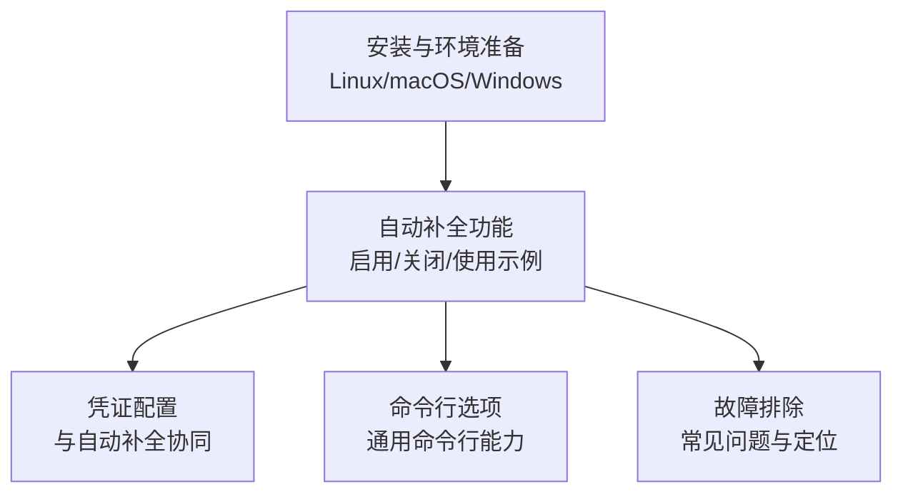
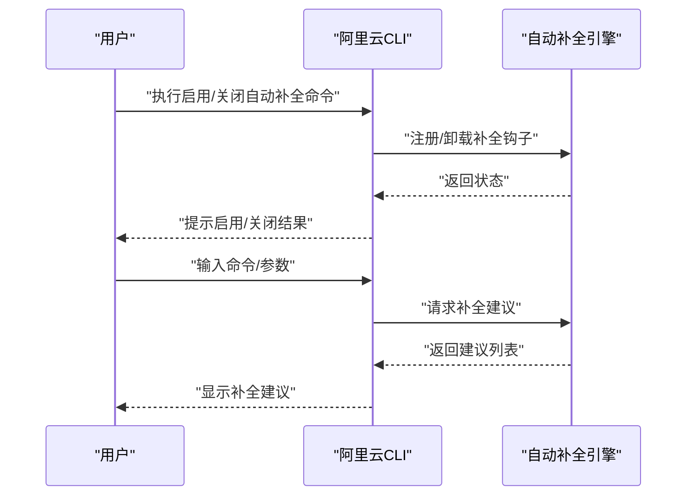
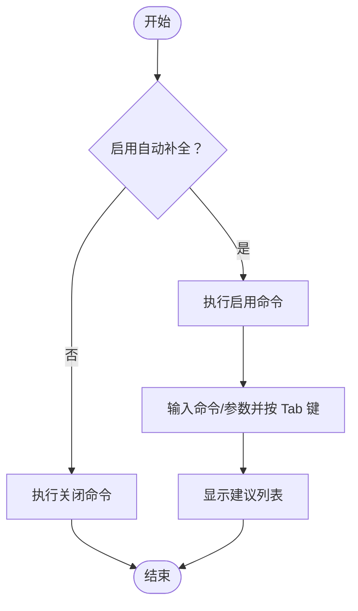
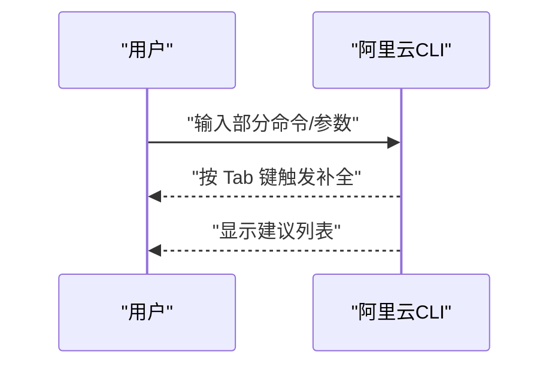
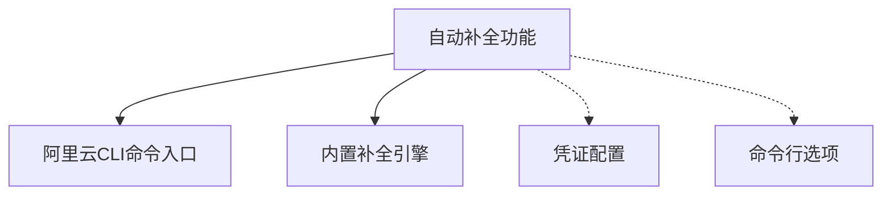

# 命令自动补全

<cite>
**本文引用的文件**
- [auto-completion-function.md](file://alibaba-cloud/reference/04-配置阿里云CLI/auto-completion-function.md)
- [install-cli-on-linux.md](file://alibaba-cloud/reference/03-安装指南/install-cli-on-linux.md)
- [install-cli-on-macos.md](file://alibaba-cloud/reference/03-安装指南/install-cli-on-macos.md)
- [install-cli-on-windows.md](file://alibaba-cloud/reference/03-安装指南/install-cli-on-windows.md)
- [cli-troubleshooting.md](file://alibaba-cloud/reference/08-错误排查/cli-troubleshooting.md)
- [command-line-options.md](file://alibaba-cloud/reference/05-使用阿里云CLI/command-line-options.md)
- [configure-credentials.md](file://alibaba-cloud/reference/04-配置阿里云CLI/configure-credentials.md)
</cite>

## 目录
1. [简介](#简介)
2. [项目结构](#项目结构)
3. [核心组件](#核心组件)
4. [架构总览](#架构总览)
5. [详细组件分析](#详细组件分析)
6. [依赖关系分析](#依赖关系分析)
7. [性能考虑](#性能考虑)
8. [故障排除指南](#故障排除指南)
9. [结论](#结论)
10. [附录](#附录)

## 简介
本指南面向在不同操作系统（Windows、macOS、Linux）与多种 Shell（bash、zsh、PowerShell）环境中使用阿里云CLI的用户，提供命令自动补全功能的完整配置与使用说明。根据官方文档，阿里云CLI内置与 zsh、bash 兼容的自动补全能力，支持在输入命令、子命令与参数时通过 Tab 键触发建议与补全。Windows 环境当前不支持自动补全功能。

## 项目结构
围绕“命令自动补全”的相关文档分布在以下模块：
- 安装与环境准备：Linux/macOS/Windows 安装与验证
- 自动补全功能：启用/关闭、使用示例
- 凭证配置：与自动补全协同工作的基础能力
- 命令行选项：与自动补全相关的通用命令行能力
- 故障排除：常见问题与定位思路

**章节来源**
- [install-cli-on-linux.md:1-93](file://alibaba-cloud/reference/03-安装指南/install-cli-on-linux.md#L1-L93)
- [install-cli-on-macos.md:1-111](file://alibaba-cloud/reference/03-安装指南/install-cli-on-macos.md#L1-L111)
- [install-cli-on-windows.md:1-160](file://alibaba-cloud/reference/03-安装指南/install-cli-on-windows.md#L1-L160)
- [auto-completion-function.md:1-55](file://alibaba-cloud/reference/04-配置阿里云CLI/auto-completion-function.md#L1-L55)
- [command-line-options.md:1-37](file://alibaba-cloud/reference/05-使用阿里云CLI/command-line-options.md#L1-L37)
- [cli-troubleshooting.md:1-111](file://alibaba-cloud/reference/08-错误排查/cli-troubleshooting.md#L1-L111)

## 核心组件
- 自动补全命令入口
  - 启用自动补全：通过命令入口启用自动补全功能
  - 关闭自动补全：通过命令入口卸载自动补全
- 补全触发机制
  - 在输入命令、子命令或参数时，按 Tab 键触发建议与补全
- 兼容性与限制
  - 仅支持 zsh、bash；Windows 暂不支持
  - Linux/macOS 无需额外配置，Windows 不支持自动补全

**章节来源**
- [auto-completion-function.md:5-18](file://alibaba-cloud/reference/04-配置阿里云CLI/auto-completion-function.md#L5-L18)
- [auto-completion-function.md:20-55](file://alibaba-cloud/reference/04-配置阿里云CLI/auto-completion-function.md#L20-L55)

## 架构总览
自动补全功能在阿里云CLI内部以命令入口的形式提供，用户通过命令入口启用或卸载补全能力。补全建议由CLI内置的自动补全引擎生成，支持命令、子命令与参数的智能提示。

**图表来源**
- [auto-completion-function.md:5-18](file://alibaba-cloud/reference/04-配置阿里云CLI/auto-completion-function.md#L5-L18)

**章节来源**
- [auto-completion-function.md:5-18](file://alibaba-cloud/reference/04-配置阿里云CLI/auto-completion-function.md#L5-L18)

## 详细组件分析

### 组件一：自动补全命令入口
- 启用自动补全
  - 通过命令入口启用自动补全功能
- 关闭自动补全
  - 通过命令入口卸载自动补全功能
- 触发方式
  - 在输入命令、子命令或参数时，按 Tab 键触发建议与补全

**图表来源**
- [auto-completion-function.md:5-18](file://alibaba-cloud/reference/04-配置阿里云CLI/auto-completion-function.md#L5-L18)

**章节来源**
- [auto-completion-function.md:5-18](file://alibaba-cloud/reference/04-配置阿里云CLI/auto-completion-function.md#L5-L18)

### 组件二：自动补全使用示例
- 显示建议的命令列表
  - 输入命令首字母后按 Tab 键，系统显示以该字母开头的可用命令列表
- 显示建议的参数列表
  - 输入参数首字母后按 Tab 键，系统显示该命令下以该字母开头的可用参数列表

**图表来源**
- [auto-completion-function.md:20-55](file://alibaba-cloud/reference/04-配置阿里云CLI/auto-completion-function.md#L20-L55)

**章节来源**
- [auto-completion-function.md:20-55](file://alibaba-cloud/reference/04-配置阿里云CLI/auto-completion-function.md#L20-L55)

### 组件三：凭证配置与自动补全的关系
- 自动补全功能独立于凭证配置，但建议在配置好凭证后使用自动补全，以便更高效地调用命令
- 凭证配置支持多种模式（AK、STS Token、RamRoleArn、EcsRamRole、External、ChainableRamRoleArn、CredentialsURI、OIDC、CloudSSO、OAuth），可与自动补全协同使用

**章节来源**
- [configure-credentials.md:1-800](file://alibaba-cloud/reference/04-配置阿里云CLI/configure-credentials.md#L1-L800)

### 组件四：命令行选项与自动补全
- 自动补全功能与通用命令行选项（如 --profile、--region、--endpoint 等）互不冲突，可在启用自动补全的同时使用其他命令行选项

**章节来源**
- [command-line-options.md:1-37](file://alibaba-cloud/reference/05-使用阿里云CLI/command-line-options.md#L1-L37)

## 依赖关系分析
- 自动补全功能依赖于阿里云CLI的命令入口与内置补全引擎
- 自动补全功能与凭证配置相互独立，但建议在配置好凭证后使用自动补全
- 自动补全功能与命令行选项互不冲突，可同时使用

**图表来源**
- [auto-completion-function.md:5-18](file://alibaba-cloud/reference/04-配置阿里云CLI/auto-completion-function.md#L5-L18)
- [configure-credentials.md:1-800](file://alibaba-cloud/reference/04-配置阿里云CLI/configure-credentials.md#L1-L800)
- [command-line-options.md:1-37](file://alibaba-cloud/reference/05-使用阿里云CLI/command-line-options.md#L1-L37)

**章节来源**
- [auto-completion-function.md:5-18](file://alibaba-cloud/reference/04-配置阿里云CLI/auto-completion-function.md#L5-L18)
- [configure-credentials.md:1-800](file://alibaba-cloud/reference/04-配置阿里云CLI/configure-credentials.md#L1-L800)
- [command-line-options.md:1-37](file://alibaba-cloud/reference/05-使用阿里云CLI/command-line-options.md#L1-L37)

## 性能考虑
- 自动补全建议由CLI内置引擎即时生成，通常对性能影响较小
- 在大量命令与参数场景下，建议保持命令行简洁，避免过度嵌套，以提升补全效率

## 故障排除指南
- Windows 环境不支持自动补全
  - 若在 Windows 上使用自动补全命令，将无法获得补全建议
- 找不到 aliyun 命令
  - 检查 PATH 环境变量是否包含阿里云CLI安装目录
- 执行 aliyun version 返回版本与安装版本不同
  - 可能存在多个版本的CLI，建议清理旧版本并重新安装
- 卸载后仍能使用 aliyun 命令
  - 检查 PATH 环境变量中是否还包含旧路径
- 无法识别命令
  - 检查命令拼写与格式，确认命令存在于当前CLI版本
- 字符串解析异常
  - 检查传入参数是否包含特殊字符，必要时进行转义
- 调用API时发生“required parameters not assigned”类型错误
  - 确认必需参数是否已正确传入
- 配置身份凭证时发生“fail to set configuration”类型错误
  - 检查凭证信息是否正确，必要时重新配置
- 网络连接超时
  - 检查网络状态，确保可访问阿里云API
- 凭证无效
  - 检查当前使用的配置、配置中保存的凭证信息、凭证模式与权限

**章节来源**
- [cli-troubleshooting.md:88-111](file://alibaba-cloud/reference/08-错误排查/cli-troubleshooting.md#L88-L111)

## 结论
阿里云CLI的命令自动补全功能为用户提供了便捷的命令与参数补全体验，尤其适用于 zsh、bash 环境。Windows 环境当前不支持自动补全。建议在配置好凭证后使用自动补全，以提升命令调用效率。若遇到问题，可参考故障排除指南进行定位与修复。

## 附录

### 不同操作系统与Shell的配置要点
- Linux/macOS
  - 无需额外配置，直接使用自动补全命令即可启用/关闭
  - 支持 zsh、bash
- Windows
  - 不支持自动补全功能
  - 建议使用 PowerShell 进行命令行操作，但无法获得自动补全

**章节来源**
- [auto-completion-function.md:3](file://alibaba-cloud/reference/04-配置阿里云CLI/auto-completion-function.md#L3)
- [install-cli-on-linux.md:1-93](file://alibaba-cloud/reference/03-安装指南/install-cli-on-linux.md#L1-L93)
- [install-cli-on-macos.md:1-111](file://alibaba-cloud/reference/03-安装指南/install-cli-on-macos.md#L1-L111)
- [install-cli-on-windows.md:1-160](file://alibaba-cloud/reference/03-安装指南/install-cli-on-windows.md#L1-L160)

### 自动补全命令与使用技巧
- 启用自动补全
  - 通过命令入口启用自动补全功能
- 关闭自动补全
  - 通过命令入口卸载自动补全功能
- 使用技巧
  - 输入命令/参数首字母后按 Tab 键触发建议
  - 在复杂命令中，建议逐步输入以缩小候选范围

**章节来源**
- [auto-completion-function.md:5-18](file://alibaba-cloud/reference/04-配置阿里云CLI/auto-completion-function.md#L5-L18)
- [auto-completion-function.md:20-55](file://alibaba-cloud/reference/04-配置阿里云CLI/auto-completion-function.md#L20-L55)