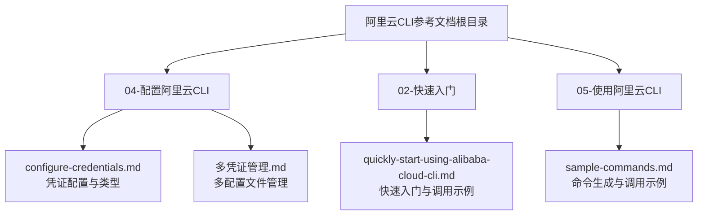
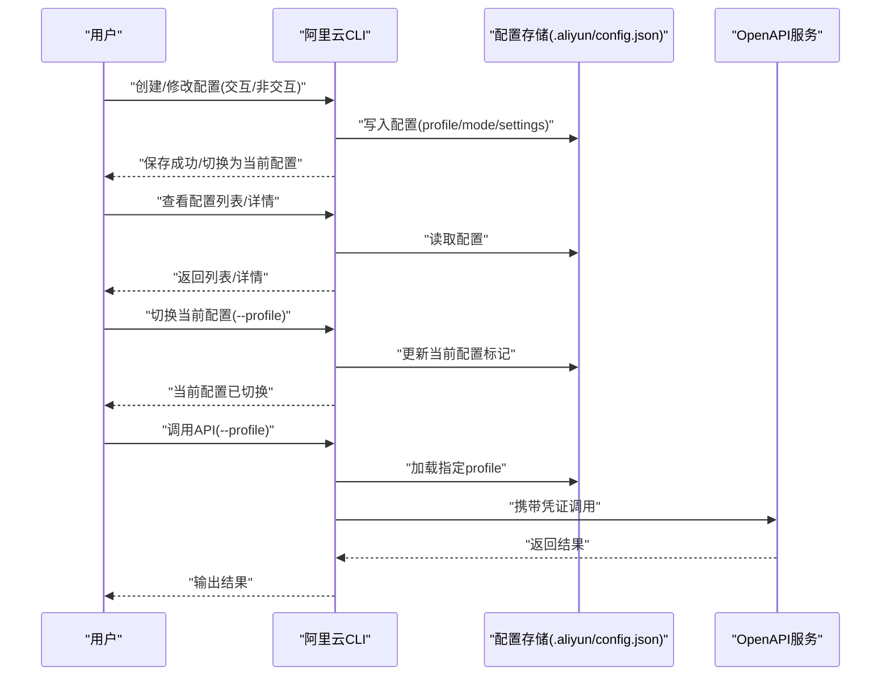
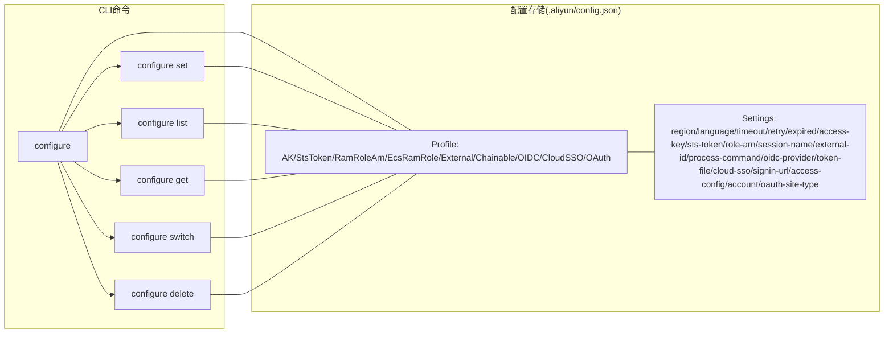

# 多凭证管理

<cite>
**本文引用的文件**
- [多凭证管理.md](file://alibaba-cloud/reference/04-配置阿里云CLI/多凭证管理.md)
- [configure-credentials.md](file://alibaba-cloud/reference/04-配置阿里云CLI/configure-credentials.md)
- [quickly-start-using-alibaba-cloud-cli.md](file://alibaba-cloud/reference/02-快速入门/quickly-start-using-alibaba-cloud-cli.md)
- [sample-commands.md](file://alibaba-cloud/reference/05-使用阿里云CLI/sample-commands.md)
- [README.md](file://alibaba-cloud/reference/README.md)
</cite>

## 目录
1. [简介](#简介)
2. [项目结构](#项目结构)
3. [核心组件](#核心组件)
4. [架构总览](#架构总览)
5. [详细组件分析](#详细组件分析)
6. [依赖分析](#依赖分析)
7. [性能考虑](#性能考虑)
8. [故障排查指南](#故障排查指南)
9. [结论](#结论)
10. [附录](#附录)

## 简介
本指南围绕阿里云CLI的多凭证管理能力，系统讲解如何创建、配置、切换与管理多个凭证配置文件，覆盖凭证类型、配置继承关系、默认配置设置方法，并提供多账号、多环境、多项目的最佳实践与操作示例。读者将掌握查看、编辑、删除配置的方法，以及在实际场景中如何通过profile灵活切换凭证。

## 项目结构
本指南涉及的文档来自阿里云CLI官方文档的参考目录，重点聚焦于“配置阿里云CLI”与“使用阿里云CLI”的相关章节，便于从配置到使用的完整闭环学习。

图表来源
- [README.md:11-82](file://alibaba-cloud/reference/README.md#L11-L82)

章节来源
- [README.md:11-82](file://alibaba-cloud/reference/README.md#L11-L82)

## 核心组件
- 配置命令族
  - 交互式配置：aliyun configure
  - 非交互式配置：aliyun configure set
  - 列表查看：aliyun configure list
  - 详情查看：aliyun configure get
  - 切换当前配置：aliyun configure switch
  - 删除配置：aliyun configure delete
- 凭证类型
  - AK、StsToken、RamRoleArn、EcsRamRole、External、ChainableRamRoleArn、CredentialsURI、OIDC、CloudSSO、OAuth
- 配置项
  - 地域、语言、超时、重试、过期时间、AccessKey、STS Token、RAM角色ARN、会话名称、外部ID、进程命令、OIDC提供商ARN与Token文件、云SSO登录地址与访问配置、OAuth站点类型等

章节来源
- [多凭证管理.md:9-203](file://alibaba-cloud/reference/04-配置阿里云CLI/多凭证管理.md#L9-L203)
- [configure-credentials.md:65-81](file://alibaba-cloud/reference/04-配置阿里云CLI/configure-credentials.md#L65-L81)

## 架构总览
下图展示了多凭证管理在CLI中的整体工作流：从创建配置、查看与切换，到在命令调用时按profile生效，以及在不同凭证类型之间的差异与继承关系。

图表来源
- [多凭证管理.md:99-203](file://alibaba-cloud/reference/04-配置阿里云CLI/多凭证管理.md#L99-L203)
- [configure-credentials.md:17-63](file://alibaba-cloud/reference/04-配置阿里云CLI/configure-credentials.md#L17-L63)
- [quickly-start-using-alibaba-cloud-cli.md:75-82](file://alibaba-cloud/reference/02-快速入门/quickly-start-using-alibaba-cloud-cli.md#L75-L82)

## 详细组件分析

### 1. 交互式创建配置
- 命令语法
  - aliyun configure [--mode <AUTHENTICATE_MODE>] [--profile <PROFILE_NAME>]
- 行为说明
  - 若未指定profile，则优先修改当前配置；若指定的profile不存在则新建。
  - AUTHENTICATE_MODE为空时默认创建AK类型凭证配置。
- 典型流程
  - 选择认证模式
  - 输入AccessKey/Secret、默认Region、输出格式、语言等
  - 保存成功后提示完成

章节来源
- [多凭证管理.md:9-36](file://alibaba-cloud/reference/04-配置阿里云CLI/多凭证管理.md#L9-L36)
- [configure-credentials.md:17-45](file://alibaba-cloud/reference/04-配置阿里云CLI/configure-credentials.md#L17-L45)

### 2. 非交互式创建或修改配置
- 命令语法
  - aliyun configure set [--mode <AUTHENTICATE_MODE>] [--profile <PROFILE_NAME>] [--settingName <settingValue>...]
- 行为说明
  - 成功修改后，CLI会将被修改的配置切换为当前配置。
  - settingName需满足对应凭证类型的必填项，否则创建失败。
- 设置项清单（节选）
  - 地域、语言、读取超时、连接超时、重试次数、凭证过期时间、AccessKey、STS Token、RAM角色ARN、会话名称、外部ID、源配置、进程命令、OIDC提供商ARN与Token文件、云SSO登录地址与访问配置、OAuth站点类型等

章节来源
- [多凭证管理.md:37-98](file://alibaba-cloud/reference/04-配置阿里云CLI/多凭证管理.md#L37-L98)
- [多凭证管理.md:55-80](file://alibaba-cloud/reference/04-配置阿里云CLI/多凭证管理.md#L55-L80)
- [configure-credentials.md:47-63](file://alibaba-cloud/reference/04-配置阿里云CLI/configure-credentials.md#L47-L63)

### 3. 获取配置列表与详情
- 列表查看
  - aliyun configure list
  - 返回每条配置的概要信息（Profile、凭证类型、有效性、Region、Language等）
- 详情查看
  - aliyun configure get [--profile <PROFILE_NAME>] [<SETTING_NAME>...]
  - 可查看全部或部分设置项

章节来源
- [多凭证管理.md:99-163](file://alibaba-cloud/reference/04-配置阿里云CLI/多凭证管理.md#L99-L163)

### 4. 切换当前配置
- 命令语法
  - aliyun configure switch --profile <PROFILE_NAME>
- 行为说明
  - 将指定配置切换为当前生效配置，成功后返回提示信息。

章节来源
- [多凭证管理.md:164-181](file://alibaba-cloud/reference/04-配置阿里云CLI/多凭证管理.md#L164-L181)

### 5. 删除指定配置
- 命令语法
  - aliyun configure delete --profile <PROFILE_NAME>
- 行为说明
  - 若删除的是当前配置，删除完成后会自动将列表最顶端配置切换为当前配置。
  - 建议保留至少一项配置；若清空配置，CLI将无法正常工作，需手动删除config.json文件。

章节来源
- [多凭证管理.md:182-203](file://alibaba-cloud/reference/04-配置阿里云CLI/多凭证管理.md#L182-L203)

### 6. 凭证类型与配置继承关系
- 支持的凭证类型
  - AK、StsToken、RamRoleArn、EcsRamRole、External、ChainableRamRoleArn、CredentialsURI、OIDC、CloudSSO、OAuth
- 继承与链式关系
  - ChainableRamRoleArn通过指定“源配置”（source-profile）从前置配置中获取中间凭证，再基于中间凭证完成角色扮演，最终获得临时凭证。
  - RamRoleArn与ChainableRamRoleArn均支持会话名称与外部ID，便于审计与防混淆代理人问题。
  - EcsRamRole无需AccessKey，通过实例元数据服务获取临时凭证。
  - External与CredentialsURI通过外部程序或URI获取临时凭证。
  - OIDC、CloudSSO、OAuth通过外部身份提供商或浏览器交互获取临时凭证。

章节来源
- [configure-credentials.md:65-81](file://alibaba-cloud/reference/04-配置阿里云CLI/configure-credentials.md#L65-L81)
- [configure-credentials.md:443-528](file://alibaba-cloud/reference/04-配置阿里云CLI/configure-credentials.md#L443-L528)
- [configure-credentials.md:212-296](file://alibaba-cloud/reference/04-配置阿里云CLI/configure-credentials.md#L212-L296)
- [configure-credentials.md:297-362](file://alibaba-cloud/reference/04-配置阿里云CLI/configure-credentials.md#L297-L362)
- [configure-credentials.md:363-442](file://alibaba-cloud/reference/04-配置阿里云CLI/configure-credentials.md#L363-L442)
- [configure-credentials.md:530-580](file://alibaba-cloud/reference/04-配置阿里云CLI/configure-credentials.md#L530-L580)
- [configure-credentials.md:581-648](file://alibaba-cloud/reference/04-配置阿里云CLI/configure-credentials.md#L581-L648)
- [configure-credentials.md:650-734](file://alibaba-cloud/reference/04-配置阿里云CLI/configure-credentials.md#L650-L734)
- [configure-credentials.md:735-800](file://alibaba-cloud/reference/04-配置阿里云CLI/configure-credentials.md#L735-L800)

### 7. 默认配置设置方法
- 默认配置的来源
  - 当未显式指定profile时，CLI优先使用当前配置。
  - 可通过switch命令将某profile设为当前配置。
- 与命令行选项的关系
  - 使用--profile可强制指定某profile进行调用，覆盖默认配置。
  - 使用--region可覆盖默认配置中的地域设置。

章节来源
- [多凭证管理.md:164-181](file://alibaba-cloud/reference/04-配置阿里云CLI/多凭证管理.md#L164-L181)
- [quickly-start-using-alibaba-cloud-cli.md:75-82](file://alibaba-cloud/reference/02-快速入门/quickly-start-using-alibaba-cloud-cli.md#L75-L82)

### 8. profile命名规则与最佳实践
- 命名建议
  - 使用语义化命名，如AkProfile、StsTokenProfile、RamRoleArnProfile、EcsRamRoleProfile、ExternalProfile、ChainableProfile、URIProfile、OIDC_Profile、SSOProfile、OAuthProfile等。
  - 在多账号、多环境、多项目场景下，建议结合业务维度命名，如：prod-cn-hangzhou、dev-us-west-1、project-a-prod等。
- 最佳实践
  - 多账号：为每个账号创建独立profile，避免混用。
  - 多环境：按env区分（dev/staging/prod），配合region与语言设置。
  - 多项目：按项目名或团队名划分，便于审计与权限最小化。
  - 安全：优先使用RAM角色或外部凭证（External/CredentialsURI/OIDC/CloudSSO/OAuth），减少AccessKey长期暴露风险。
  - 审计：为RAM角色设置合理的RoleSessionName与ExternalId，便于审计追踪。

章节来源
- [多凭证管理.md:55-80](file://alibaba-cloud/reference/04-配置阿里云CLI/多凭证管理.md#L55-L80)
- [configure-credentials.md:65-81](file://alibaba-cloud/reference/04-配置阿里云CLI/configure-credentials.md#L65-L81)

### 9. 实际使用场景与命令示例
- 查看配置列表
  - aliyun configure list
- 查看指定配置详情
  - aliyun configure get --profile <PROFILE_NAME>
- 切换当前配置
  - aliyun configure switch --profile <PROFILE_NAME>
- 调用API时指定profile
  - aliyun ecs DescribeRegions --profile prod-cn-hangzhou
- 生成并调用命令
  - 在OpenAPI门户生成CLI示例，复制到Shell中运行，或直接在Cloud Shell中调试。

章节来源
- [多凭证管理.md:99-181](file://alibaba-cloud/reference/04-配置阿里云CLI/多凭证管理.md#L99-L181)
- [quickly-start-using-alibaba-cloud-cli.md:75-100](file://alibaba-cloud/reference/02-快速入门/quickly-start-using-alibaba-cloud-cli.md#L75-L100)
- [sample-commands.md:14-66](file://alibaba-cloud/reference/05-使用阿里云CLI/sample-commands.md#L14-L66)

## 依赖分析
- 组件耦合
  - configure命令族相互依赖，list/get/switch/delete均以配置存储为数据源。
  - ChainableRamRoleArn依赖前置profile（source-profile）。
  - EcsRamRole依赖实例元数据服务（IMDSv2/IMDSv1）。
  - External/CredentialsURI/OIDC/CloudSSO/OAuth依赖外部系统或浏览器交互。
- 外部依赖
  - OpenAPI门户用于生成命令示例。
  - 浏览器用于CloudSSO/OAuth首次授权。
  - 外部程序或URI用于External/CredentialsURI获取临时凭证。

图表来源
- [多凭证管理.md:9-203](file://alibaba-cloud/reference/04-配置阿里云CLI/多凭证管理.md#L9-L203)
- [configure-credentials.md:65-81](file://alibaba-cloud/reference/04-配置阿里云CLI/configure-credentials.md#L65-L81)

## 性能考虑
- 凭证刷新策略
  - AK/StsToken为手动刷新，适合短期任务。
  - RamRoleArn/EcsRamRole/ChainableRamRoleArn/OIDC/CloudSSO/OAuth为自动刷新，适合长期稳定运行。
- 超时与重试
  - 通过--read-timeout/--connect-timeout/--retry-count优化网络不稳定场景下的稳定性。
- 凭证过期时间
  - 通过--expired-seconds合理设置，平衡安全性与频繁刷新成本。
- 外部程序/URI
  - External/CredentialsURI应确保外部系统响应稳定与格式正确，避免CLI调用失败。

章节来源
- [configure-credentials.md:65-81](file://alibaba-cloud/reference/04-配置阿里云CLI/configure-credentials.md#L65-L81)
- [多凭证管理.md:55-80](file://alibaba-cloud/reference/04-配置阿里云CLI/多凭证管理.md#L55-L80)

## 故障排查指南
- 清空配置导致CLI不可用
  - 现象：无法调用任何命令。
  - 处理：删除config.json文件后重新配置。
  - 位置参考：Windows、Linux/macOS用户目录下的.aliyun文件夹。
- 删除当前配置后的切换
  - 删除当前配置后，CLI会自动将列表最顶端配置切换为当前配置。
- IMDSv2异常
  - EcsRamRole在IMDSv2异常时可通过环境变量控制行为，必要时仅使用IMDSv1。
- 外部凭证异常
  - External/CredentialsURI/OIDC/CloudSSO/OAuth需检查外部系统连通性、权限与格式。

章节来源
- [多凭证管理.md:182-203](file://alibaba-cloud/reference/04-配置阿里云CLI/多凭证管理.md#L182-L203)
- [configure-credentials.md:297-317](file://alibaba-cloud/reference/04-配置阿里云CLI/configure-credentials.md#L297-L317)

## 结论
通过多凭证管理，阿里云CLI实现了对多账号、多环境、多项目的灵活支持。结合合适的凭证类型与profile命名规范，配合默认配置与命令行选项，可以在保证安全性的前提下高效完成日常运维与自动化任务。建议在生产环境中优先采用自动刷新与免密访问的凭证类型，并建立完善的审计与权限最小化策略。

## 附录
- 快速开始与命令调用
  - 在OpenAPI门户生成CLI示例，复制到本地Shell或Cloud Shell中运行。
- 常用命令选项
  - --profile：指定profile
  - --region：覆盖默认地域
  - --help：获取帮助信息

章节来源
- [quickly-start-using-alibaba-cloud-cli.md:75-100](file://alibaba-cloud/reference/02-快速入门/quickly-start-using-alibaba-cloud-cli.md#L75-L100)
- [sample-commands.md:14-66](file://alibaba-cloud/reference/05-使用阿里云CLI/sample-commands.md#L14-L66)