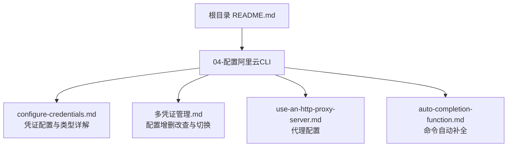
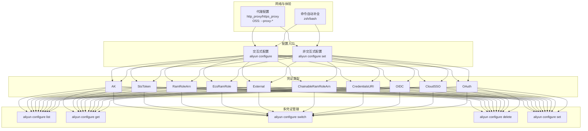
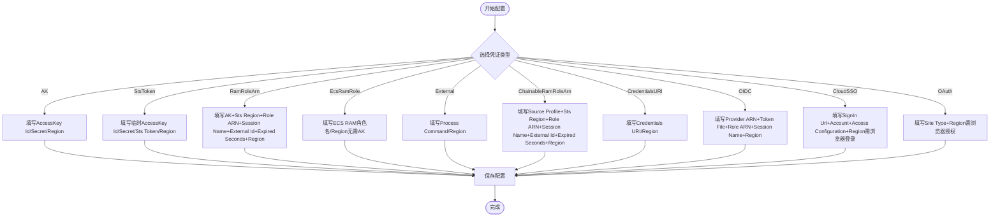
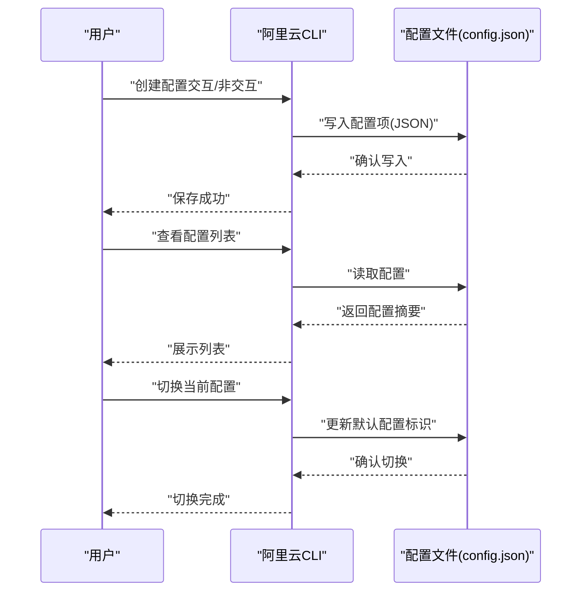
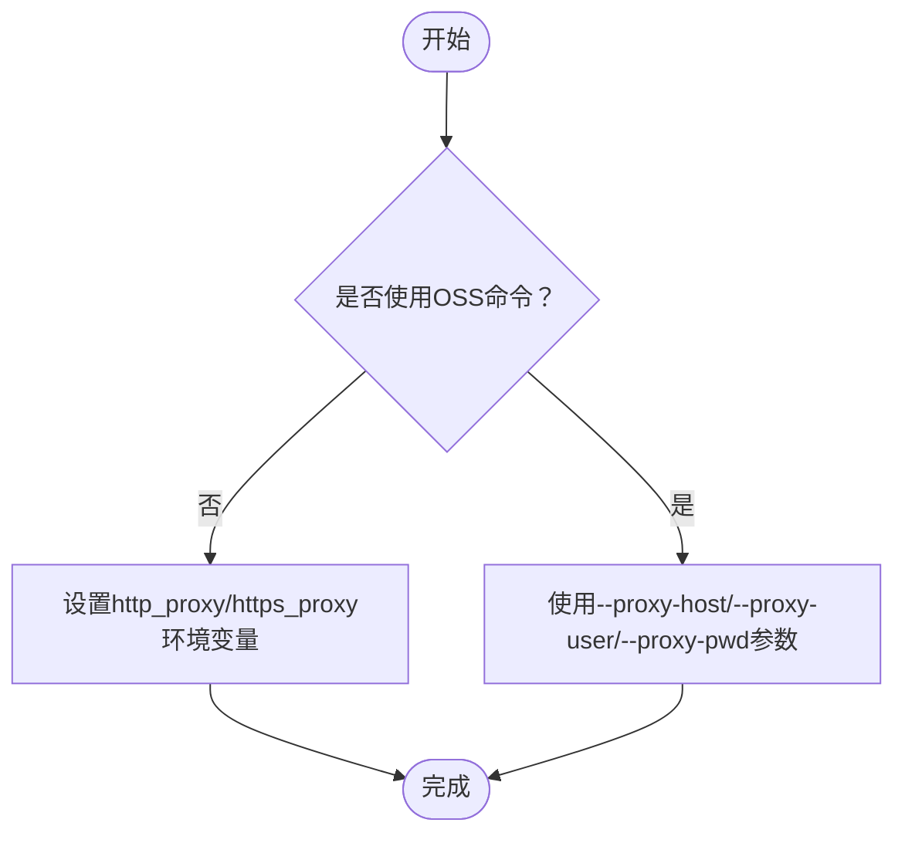
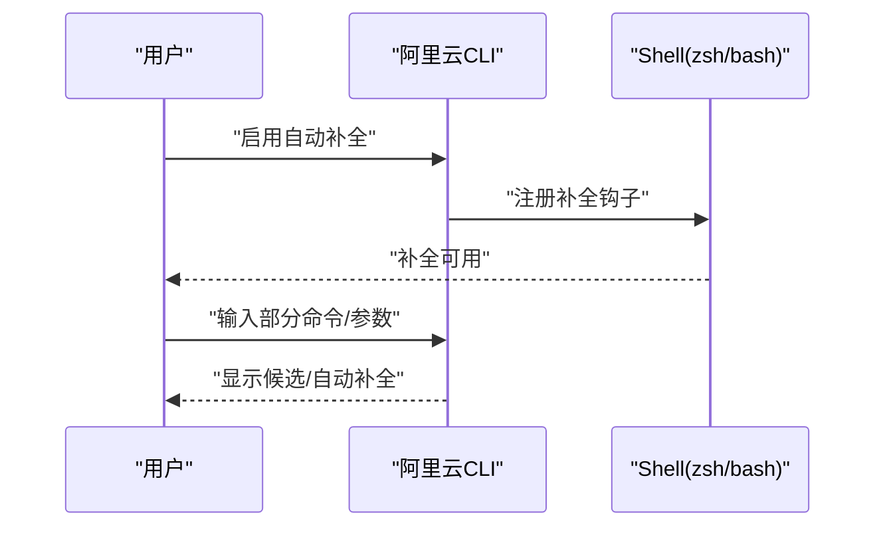
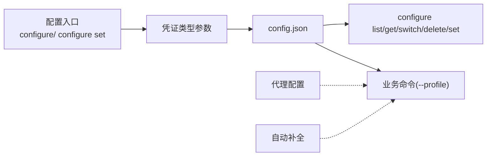

# 配置管理

<cite>
**本文引用的文件**
- [configure-credentials.md](file://alibaba-cloud/reference/04-配置阿里云CLI/configure-credentials.md)
- [多凭证管理.md](file://alibaba-cloud/reference/04-配置阿里云CLI/多凭证管理.md)
- [auto-completion-function.md](file://alibaba-cloud/reference/04-配置阿里云CLI/auto-completion-function.md)
- [use-an-http-proxy-server.md](file://alibaba-cloud/reference/04-配置阿里云CLI/use-an-http-proxy-server.md)
- [README.md](file://alibaba-cloud/reference/README.md)
</cite>

## 目录
1. [简介](#简介)
2. [项目结构](#项目结构)
3. [核心组件](#核心组件)
4. [架构总览](#架构总览)
5. [详细组件分析](#详细组件分析)
6. [依赖关系分析](#依赖关系分析)
7. [性能考量](#性能考量)
8. [故障排查指南](#故障排查指南)
9. [结论](#结论)
10. [附录](#附录)

## 简介
本指南围绕阿里云CLI的配置管理，系统讲解凭证类型配置（AK、STS、RAM Role等）、交互式与非交互式配置流程、多凭证管理最佳实践、网络代理配置以及命令自动补全功能启用方法。内容覆盖从基础配置到高级定制的完整配置体系，帮助用户在不同场景下安全、高效地使用阿里云CLI。

## 项目结构
本章节聚焦“配置阿里云CLI”主题下的文档组织与关联关系，便于快速定位与交叉引用。

图表来源
- [README.md:34-41](file://alibaba-cloud/reference/README.md#L34-L41)
- [configure-credentials.md:1-10](file://alibaba-cloud/reference/04-配置阿里云CLI/configure-credentials.md#L1-L10)
- [多凭证管理.md:1-3](file://alibaba-cloud/reference/04-配置阿里云CLI/多凭证管理.md#L1-L3)
- [use-an-http-proxy-server.md:1-4](file://alibaba-cloud/reference/04-配置阿里云CLI/use-an-http-proxy-server.md#L1-L4)
- [auto-completion-function.md:1-3](file://alibaba-cloud/reference/04-配置阿里云CLI/auto-completion-function.md#L1-L3)

章节来源
- [README.md:34-41](file://alibaba-cloud/reference/README.md#L34-L41)

## 核心组件
- 凭证配置与类型
  - 支持AK、StsToken、RamRoleArn、EcsRamRole、External、ChainableRamRoleArn、CredentialsURI、OIDC、CloudSSO、OAuth等多种凭证类型，每种类型具备不同的参数与刷新策略。
  - 提供交互式与非交互式两种配置方式，满足不同自动化与运维场景。
- 多凭证管理
  - 通过configure系列命令实现配置的创建、查询、切换、删除与修改，支持批量查看与按需切换。
- 代理配置
  - 通过环境变量http_proxy/https_proxy实现HTTP/HTTPS代理；针对OSS命令提供独立的代理参数。
- 命令自动补全
  - 支持zsh、bash的命令自动补全，提升命令输入效率与准确性。

章节来源
- [configure-credentials.md:65-81](file://alibaba-cloud/reference/04-配置阿里云CLI/configure-credentials.md#L65-L81)
- [多凭证管理.md:5-17](file://alibaba-cloud/reference/04-配置阿里云CLI/多凭证管理.md#L5-L17)
- [use-an-http-proxy-server.md:13-24](file://alibaba-cloud/reference/04-配置阿里云CLI/use-an-http-proxy-server.md#L13-L24)
- [auto-completion-function.md:1-18](file://alibaba-cloud/reference/04-配置阿里云CLI/auto-completion-function.md#L1-L18)

## 架构总览
下图展示了阿里云CLI配置管理的整体架构与关键交互路径：凭证类型选择、配置入口（交互/非交互）、多配置管理、代理与自动补全的集成。

图表来源
- [configure-credentials.md:15-63](file://alibaba-cloud/reference/04-配置阿里云CLI/configure-credentials.md#L15-L63)
- [多凭证管理.md:99-203](file://alibaba-cloud/reference/04-配置阿里云CLI/多凭证管理.md#L99-L203)
- [use-an-http-proxy-server.md:13-44](file://alibaba-cloud/reference/04-配置阿里云CLI/use-an-http-proxy-server.md#L13-L44)
- [auto-completion-function.md:1-18](file://alibaba-cloud/reference/04-配置阿里云CLI/auto-completion-function.md#L1-L18)

## 详细组件分析

### 凭证类型与配置流程
- 交互式配置
  - 通用语法：aliyun configure [--profile <配置名>] [--mode <凭证类型>]
  - 支持按提示逐项填写参数，适合初学者与一次性配置。
- 非交互式配置
  - 通用语法：aliyun configure set [--profile <配置名>] [--mode <凭证类型>] [--settingName <settingValue>...]
  - 适合脚本化与CI/CD流水线，需一次性提供所有必需参数。
- 凭证类型一览与参数要点
  - AK：AccessKey Id/Secret、Region Id
  - StsToken：AccessKey Id/Secret、Sts Token、Region Id
  - RamRoleArn：AccessKey Id/Secret、Sts Region、Ram Role Arn、Role Session Name、External Id、Expired Seconds、Region Id
  - EcsRamRole：Ecs Ram Role、Region Id（无需AccessKey）
  - External：Process Command、Region Id
  - ChainableRamRoleArn：Source Profile、Sts Region、Ram Role Arn、Role Session Name、External Id、Expired Seconds、Region Id
  - CredentialsURI：Credentials URI、Region Id
  - OIDC：OIDC Provider ARN、OIDC Token File、Ram Role Arn、Role Session Name、Region Id
  - CloudSSO：SignIn Url、Account、Access Configuration、Region Id（首次需浏览器登录）
  - OAuth：OAuth Site Type、Region Id（首次需浏览器授权）

图表来源
- [configure-credentials.md:15-81](file://alibaba-cloud/reference/04-配置阿里云CLI/configure-credentials.md#L15-L81)
- [configure-credentials.md:82-862](file://alibaba-cloud/reference/04-配置阿里云CLI/configure-credentials.md#L82-L862)

章节来源
- [configure-credentials.md:15-862](file://alibaba-cloud/reference/04-配置阿里云CLI/configure-credentials.md#L15-L862)

### 多凭证管理最佳实践
- 创建与修改
  - 交互式：aliyun configure [--mode <类型>] [--profile <名称>]
  - 非交互式：aliyun configure set [--mode <类型>] [--profile <名称>] [--settingName <settingValue>...]
- 查询与切换
  - 列表：aliyun configure list
  - 查看：aliyun configure get [--profile <名称>] [<设置项>...]
  - 切换：aliyun configure switch --profile <名称>
- 删除与保留
  - 删除：aliyun configure delete --profile <名称>
  - 建议保留至少一个配置，避免无法使用CLI
- 存储位置
  - 配置文件为config.json，位于用户目录下的.aliyun文件夹中（Windows/Linux/macOS路径不同）

图表来源
- [多凭证管理.md:99-203](file://alibaba-cloud/reference/04-配置阿里云CLI/多凭证管理.md#L99-L203)

章节来源
- [多凭证管理.md:5-203](file://alibaba-cloud/reference/04-配置阿里云CLI/多凭证管理.md#L5-L203)

### 网络代理配置
- 通用代理
  - 通过环境变量http_proxy/https_proxy配置HTTP/HTTPS代理
- OSS命令专用代理
  - 使用--proxy-host/--proxy-user/--proxy-pwd等参数配置代理（支持http/https/socks5）

图表来源
- [use-an-http-proxy-server.md:13-44](file://alibaba-cloud/reference/04-配置阿里云CLI/use-an-http-proxy-server.md#L13-L44)

章节来源
- [use-an-http-proxy-server.md:1-45](file://alibaba-cloud/reference/04-配置阿里云CLI/use-an-http-proxy-server.md#L1-L45)

### 命令自动补全功能
- 支持zsh、bash，Linux/macOS无需额外配置
- 开启/关闭：aliyun auto-completion [--uninstall]
- 使用效果：输入命令/参数部分文本后按Tab键，自动补全或显示候选列表

图表来源
- [auto-completion-function.md:1-18](file://alibaba-cloud/reference/04-配置阿里云CLI/auto-completion-function.md#L1-L18)

章节来源
- [auto-completion-function.md:1-55](file://alibaba-cloud/reference/04-配置阿里云CLI/auto-completion-function.md#L1-L55)

## 依赖关系分析
- 配置入口与凭证类型
  - 交互式与非交互式配置分别面向不同使用场景，底层均写入config.json
- 多凭证管理与命令行调用
  - configure系列命令与具体业务命令（如ecs DescribeInstances）解耦，通过--profile参数实现按需切换
- 代理与自动补全
  - 代理配置为全局网络层能力，自动补全为用户体验增强功能，二者与凭证配置相互独立

图表来源
- [configure-credentials.md:15-63](file://alibaba-cloud/reference/04-配置阿里云CLI/configure-credentials.md#L15-L63)
- [多凭证管理.md:99-203](file://alibaba-cloud/reference/04-配置阿里云CLI/多凭证管理.md#L99-L203)
- [use-an-http-proxy-server.md:13-44](file://alibaba-cloud/reference/04-配置阿里云CLI/use-an-http-proxy-server.md#L13-L44)
- [auto-completion-function.md:1-18](file://alibaba-cloud/reference/04-配置阿里云CLI/auto-completion-function.md#L1-L18)

章节来源
- [configure-credentials.md:15-862](file://alibaba-cloud/reference/04-配置阿里云CLI/configure-credentials.md#L15-L862)
- [多凭证管理.md:99-203](file://alibaba-cloud/reference/04-配置阿里云CLI/多凭证管理.md#L99-L203)
- [use-an-http-proxy-server.md:13-44](file://alibaba-cloud/reference/04-配置阿里云CLI/use-an-http-proxy-server.md#L13-L44)
- [auto-completion-function.md:1-18](file://alibaba-cloud/reference/04-配置阿里云CLI/auto-completion-function.md#L1-L18)

## 性能考量
- 凭证刷新策略
  - 部分类型（如RamRoleArn、EcsRamRole、OIDC等）具备自动刷新机制，减少频繁手动更新带来的开销
- I/O与超时
  - 可通过--read-timeout与--connect-timeout调整网络超时，平衡稳定性与响应速度
- 重试策略
  - --retry-count可控制失败重试次数，避免瞬时网络波动影响执行

章节来源
- [configure-credentials.md:69-81](file://alibaba-cloud/reference/04-配置阿里云CLI/configure-credentials.md#L69-L81)
- [多凭证管理.md:55-80](file://alibaba-cloud/reference/04-配置阿里云CLI/多凭证管理.md#L55-L80)

## 故障排查指南
- 代理相关
  - 若通过环境变量配置代理无效，检查变量命名与格式；OSS命令请使用独立参数
- 自动补全
  - Linux/macOS默认支持，Windows暂不支持；如未生效，尝试重新启用
- 配置丢失
  - 删除所有配置后CLI将无法使用，可通过删除config.json恢复（注意备份）

章节来源
- [use-an-http-proxy-server.md:13-44](file://alibaba-cloud/reference/04-配置阿里云CLI/use-an-http-proxy-server.md#L13-L44)
- [auto-completion-function.md:1-18](file://alibaba-cloud/reference/04-配置阿里云CLI/auto-completion-function.md#L1-L18)
- [多凭证管理.md:182-197](file://alibaba-cloud/reference/04-配置阿里云CLI/多凭证管理.md#L182-L197)

## 结论
通过本指南，用户可以系统掌握阿里云CLI的凭证配置与管理方法，包括多种凭证类型的交互式与非交互式配置、多配置的增删改查与切换、代理与自动补全的启用与优化。结合最佳实践与故障排查建议，可在不同环境中安全、稳定、高效地使用阿里云CLI。

## 附录
- 相关文档入口
  - 凭证配置与类型：[configure-credentials.md](file://alibaba-cloud/reference/04-配置阿里云CLI/configure-credentials.md)
  - 多凭证管理：[多凭证管理.md](file://alibaba-cloud/reference/04-配置阿里云CLI/多凭证管理.md)
  - 代理配置：[use-an-http-proxy-server.md](file://alibaba-cloud/reference/04-配置阿里云CLI/use-an-http-proxy-server.md)
  - 命令自动补全：[auto-completion-function.md](file://alibaba-cloud/reference/04-配置阿里云CLI/auto-completion-function.md)