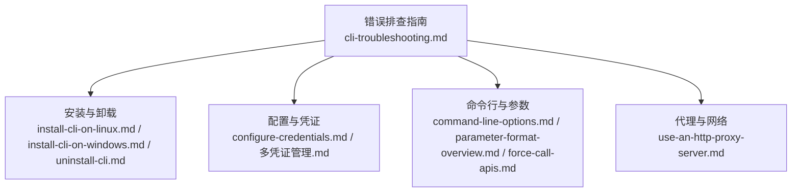
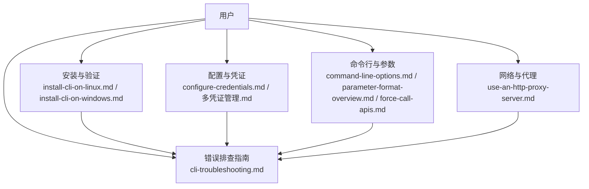
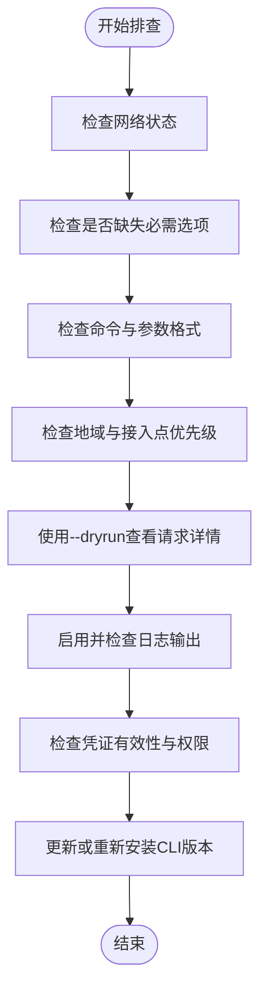
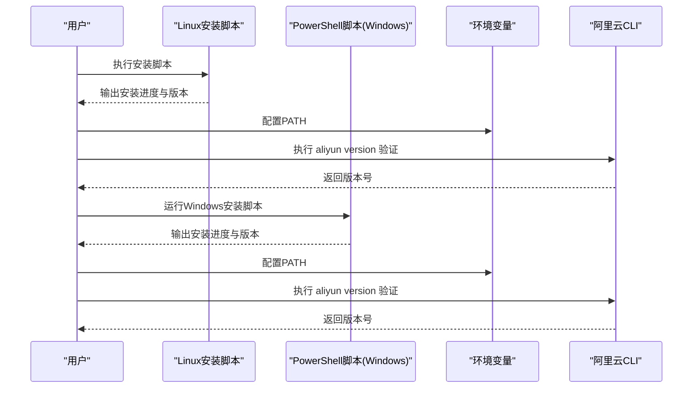
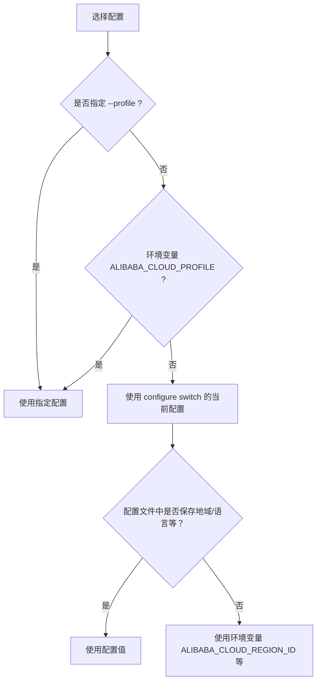
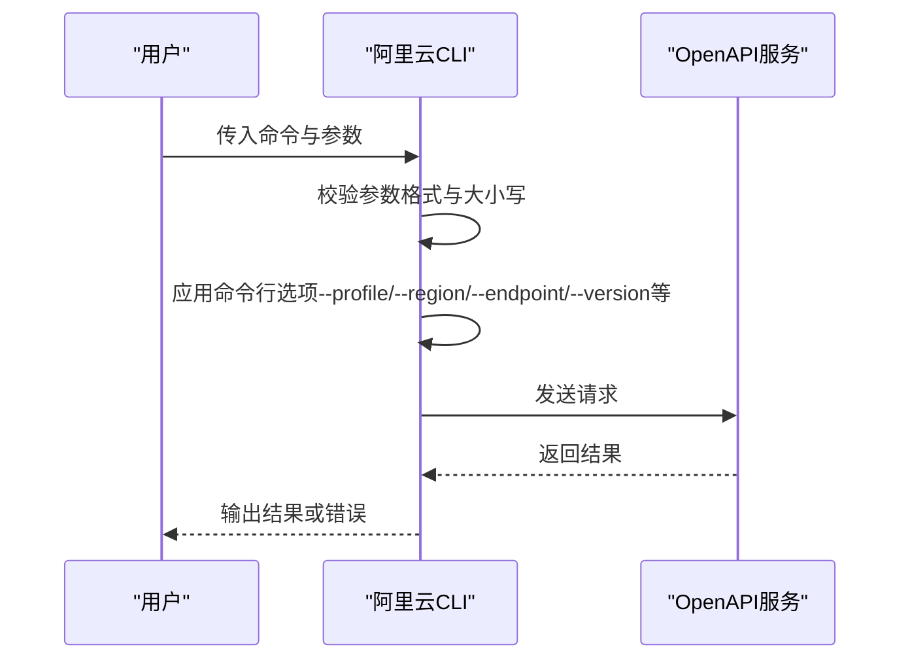
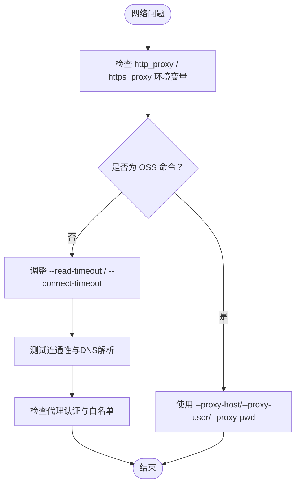
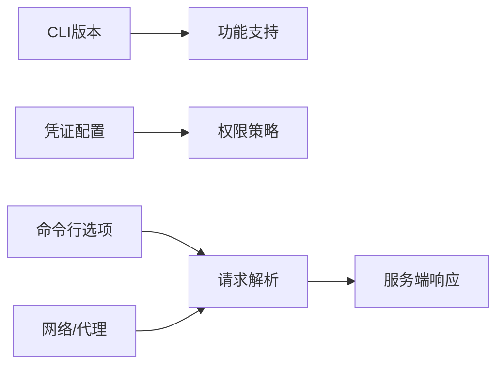

# 错误排查

<cite>
**本文引用的文件**
- [cli-troubleshooting.md](file://alibaba-cloud/reference/08-错误排查/cli-troubleshooting.md)
- [install-cli-on-linux.md](file://alibaba-cloud/reference/03-安装指南/install-cli-on-linux.md)
- [install-cli-on-windows.md](file://alibaba-cloud/reference/03-安装指南/install-cli-on-windows.md)
- [uninstall-cli.md](file://alibaba-cloud/reference/03-安装指南/uninstall-cli.md)
- [configure-credentials.md](file://alibaba-cloud/reference/04-配置阿里云CLI/configure-credentials.md)
- [多凭证管理.md](file://alibaba-cloud/reference/04-配置阿里云CLI/多凭证管理.md)
- [command-line-options.md](file://alibaba-cloud/reference/05-使用阿里云CLI/command-line-options.md)
- [parameter-format-overview.md](file://alibaba-cloud/reference/05-使用阿里云CLI/parameter-format-overview.md)
- [force-call-apis.md](file://alibaba-cloud/reference/05-使用阿里云CLI/force-call-apis.md)
- [use-an-http-proxy-server.md](file://alibaba-cloud/reference/04-配置阿里云CLI/use-an-http-proxy-server.md)
</cite>

## 目录
1. [简介](#简介)
2. [项目结构](#项目结构)
3. [核心组件](#核心组件)
4. [架构总览](#架构总览)
5. [详细组件分析](#详细组件分析)
6. [依赖分析](#依赖分析)
7. [性能考虑](#性能考虑)
8. [故障排查指南](#故障排查指南)
9. [结论](#结论)
10. [附录](#附录)

## 简介
本指南面向使用阿里云CLI的用户，系统性地介绍常见问题的诊断方法与故障排除步骤，覆盖安装问题、配置问题、命令执行问题、网络与代理问题等。文档提供“问题描述—可能原因—解决步骤—预防措施”的完整闭环，并给出与仓库内文件一一对应的来源索引，便于读者快速定位与复核。

## 项目结构
本仓库中与“错误排查”直接相关的内容主要分布在以下模块：
- 错误排查指南：提供通用排查流程与常见问题清单
- 安装指南：Linux/Windows安装与卸载流程
- 配置与凭证：凭证类型、优先级、多配置管理
- 使用与参数：命令行选项、参数格式、强制调用
- 代理与网络：HTTP/HTTPS代理配置与OSS专用代理选项

**图表来源**
- [cli-troubleshooting.md:1-111](file://alibaba-cloud/reference/08-错误排查/cli-troubleshooting.md#L1-L111)
- [install-cli-on-linux.md:1-93](file://alibaba-cloud/reference/03-安装指南/install-cli-on-linux.md#L1-L93)
- [install-cli-on-windows.md:1-160](file://alibaba-cloud/reference/03-安装指南/install-cli-on-windows.md#L1-L160)
- [uninstall-cli.md:1-254](file://alibaba-cloud/reference/03-安装指南/uninstall-cli.md#L1-L254)
- [configure-credentials.md:1-862](file://alibaba-cloud/reference/04-配置阿里云CLI/configure-credentials.md#L1-L862)
- [多凭证管理.md:1-203](file://alibaba-cloud/reference/04-配置阿里云CLI/多凭证管理.md#L1-L203)
- [command-line-options.md:1-37](file://alibaba-cloud/reference/05-使用阿里云CLI/command-line-options.md#L1-L37)
- [parameter-format-overview.md:1-126](file://alibaba-cloud/reference/05-使用阿里云CLI/parameter-format-overview.md#L1-L126)
- [force-call-apis.md:1-27](file://alibaba-cloud/reference/05-使用阿里云CLI/force-call-apis.md#L1-L27)
- [use-an-http-proxy-server.md:1-45](file://alibaba-cloud/reference/04-配置阿里云CLI/use-an-http-proxy-server.md#L1-L45)

**章节来源**
- [cli-troubleshooting.md:1-111](file://alibaba-cloud/reference/08-错误排查/cli-troubleshooting.md#L1-L111)

## 核心组件
- 通用排查流程：网络状态、选项完整性、命令与参数格式、地域与接入点、请求详情（模拟调用与日志）、凭证有效性与权限
- 安装与卸载：Linux/Windows安装方式、验证、卸载与残留清理
- 凭证体系：凭证优先级、模式与权限校验、多配置管理与切换
- 命令行与参数：命令行选项、参数格式与转义、强制调用与版本指定
- 代理与网络：HTTP/HTTPS代理、OSS专用代理参数

**章节来源**
- [cli-troubleshooting.md:7-111](file://alibaba-cloud/reference/08-错误排查/cli-troubleshooting.md#L7-L111)
- [install-cli-on-linux.md:5-93](file://alibaba-cloud/reference/03-安装指南/install-cli-on-linux.md#L5-L93)
- [install-cli-on-windows.md:5-160](file://alibaba-cloud/reference/03-安装指南/install-cli-on-windows.md#L5-L160)
- [uninstall-cli.md:5-254](file://alibaba-cloud/reference/03-安装指南/uninstall-cli.md#L5-L254)
- [configure-credentials.md:11-862](file://alibaba-cloud/reference/04-配置阿里云CLI/configure-credentials.md#L11-L862)
- [多凭证管理.md:1-203](file://alibaba-cloud/reference/04-配置阿里云CLI/多凭证管理.md#L1-L203)
- [command-line-options.md:1-37](file://alibaba-cloud/reference/05-使用阿里云CLI/command-line-options.md#L1-L37)
- [parameter-format-overview.md:1-126](file://alibaba-cloud/reference/05-使用阿里云CLI/parameter-format-overview.md#L1-L126)
- [force-call-apis.md:1-27](file://alibaba-cloud/reference/05-使用阿里云CLI/force-call-apis.md#L1-L27)
- [use-an-http-proxy-server.md:1-45](file://alibaba-cloud/reference/04-配置阿里云CLI/use-an-http-proxy-server.md#L1-L45)

## 架构总览
下图展示了“排查流程”在CLI使用链路中的位置与关键交互点：

**图表来源**
- [cli-troubleshooting.md:1-111](file://alibaba-cloud/reference/08-错误排查/cli-troubleshooting.md#L1-L111)
- [use-an-http-proxy-server.md:1-45](file://alibaba-cloud/reference/04-配置阿里云CLI/use-an-http-proxy-server.md#L1-L45)
- [install-cli-on-linux.md:1-93](file://alibaba-cloud/reference/03-安装指南/install-cli-on-linux.md#L1-L93)
- [install-cli-on-windows.md:1-160](file://alibaba-cloud/reference/03-安装指南/install-cli-on-windows.md#L1-L160)
- [configure-credentials.md:1-862](file://alibaba-cloud/reference/04-配置阿里云CLI/configure-credentials.md#L1-L862)
- [多凭证管理.md:1-203](file://alibaba-cloud/reference/04-配置阿里云CLI/多凭证管理.md#L1-L203)
- [command-line-options.md:1-37](file://alibaba-cloud/reference/05-使用阿里云CLI/command-line-options.md#L1-L37)
- [parameter-format-overview.md:1-126](file://alibaba-cloud/reference/05-使用阿里云CLI/parameter-format-overview.md#L1-L126)
- [force-call-apis.md:1-27](file://alibaba-cloud/reference/05-使用阿里云CLI/force-call-apis.md#L1-L27)

## 详细组件分析

### 组件A：通用错误排查流程
- 网络状态：确认可达性与代理配置
- 缺失选项：检查命令必需参数与--force/--version组合
- 命令与参数格式：大小写、引号、特殊字符处理
- 地域与接入点：优先级顺序与覆盖关系
- 请求详情：--dryrun模拟调用与日志输出
- 凭证有效性：优先级、模式与权限校验
- 版本与升级：确认CLI版本与更新

**图表来源**
- [cli-troubleshooting.md:7-111](file://alibaba-cloud/reference/08-错误排查/cli-troubleshooting.md#L7-L111)

**章节来源**
- [cli-troubleshooting.md:7-111](file://alibaba-cloud/reference/08-错误排查/cli-troubleshooting.md#L7-L111)

### 组件B：安装与卸载问题
- Linux安装：脚本安装、TGZ安装、配置全局调用、版本验证
- Windows安装：图形界面与PowerShell脚本安装、环境变量配置、版本验证
- 卸载：Homebrew、命令行界面、Bash/PowerShell脚本卸载、删除配置文件

**图表来源**
- [install-cli-on-linux.md:5-93](file://alibaba-cloud/reference/03-安装指南/install-cli-on-linux.md#L5-L93)
- [install-cli-on-windows.md:5-160](file://alibaba-cloud/reference/03-安装指南/install-cli-on-windows.md#L5-L160)
- [uninstall-cli.md:13-254](file://alibaba-cloud/reference/03-安装指南/uninstall-cli.md#L13-L254)

**章节来源**
- [install-cli-on-linux.md:5-93](file://alibaba-cloud/reference/03-安装指南/install-cli-on-linux.md#L5-L93)
- [install-cli-on-windows.md:5-160](file://alibaba-cloud/reference/03-安装指南/install-cli-on-windows.md#L5-L160)
- [uninstall-cli.md:5-254](file://alibaba-cloud/reference/03-安装指南/uninstall-cli.md#L5-L254)

### 组件C：凭证配置与多配置管理
- 凭证优先级：--profile > 环境变量 > configure switch > 配置文件 > 环境变量
- 凭证模式与权限：RAM角色ARN、ECS角色、外部程序、OIDC、CloudSSO、OAuth等
- 多配置管理：创建、切换、查看、删除、清理配置文件

**图表来源**
- [cli-troubleshooting.md:52-83](file://alibaba-cloud/reference/08-错误排查/cli-troubleshooting.md#L52-L83)
- [多凭证管理.md:164-181](file://alibaba-cloud/reference/04-配置阿里云CLI/多凭证管理.md#L164-L181)

**章节来源**
- [cli-troubleshooting.md:52-83](file://alibaba-cloud/reference/08-错误排查/cli-troubleshooting.md#L52-L83)
- [configure-credentials.md:65-862](file://alibaba-cloud/reference/04-配置阿里云CLI/configure-credentials.md#L65-L862)
- [多凭证管理.md:1-203](file://alibaba-cloud/reference/04-配置阿里云CLI/多凭证管理.md#L1-L203)

### 组件D：命令行选项与参数格式
- 命令行选项：--profile/--region/--endpoint/--version/--header/--body/--read-timeout/--connect-timeout/--retry-count/--secure/--insecure/--quiet/--help/--output/--pager/--force/--waiter/--dryrun
- 参数格式：大小写敏感、引号包裹、特殊字符处理、JSON数组与对象格式
- 强制调用：--force + --version 指定API版本

**图表来源**
- [command-line-options.md:1-37](file://alibaba-cloud/reference/05-使用阿里云CLI/command-line-options.md#L1-L37)
- [parameter-format-overview.md:1-126](file://alibaba-cloud/reference/05-使用阿里云CLI/parameter-format-overview.md#L1-L126)
- [force-call-apis.md:1-27](file://alibaba-cloud/reference/05-使用阿里云CLI/force-call-apis.md#L1-L27)

**章节来源**
- [command-line-options.md:1-37](file://alibaba-cloud/reference/05-使用阿里云CLI/command-line-options.md#L1-L37)
- [parameter-format-overview.md:1-126](file://alibaba-cloud/reference/05-使用阿里云CLI/parameter-format-overview.md#L1-L126)
- [force-call-apis.md:1-27](file://alibaba-cloud/reference/05-使用阿里云CLI/force-call-apis.md#L1-L27)

### 组件E：代理与网络问题
- HTTP/HTTPS代理：通过环境变量配置
- OSS专用代理：--proxy-host/--proxy-user/--proxy-pwd
- 网络连通性：超时、DNS、防火墙、代理认证

**图表来源**
- [use-an-http-proxy-server.md:1-45](file://alibaba-cloud/reference/04-配置阿里云CLI/use-an-http-proxy-server.md#L1-L45)

**章节来源**
- [use-an-http-proxy-server.md:1-45](file://alibaba-cloud/reference/04-配置阿里云CLI/use-an-http-proxy-server.md#L1-L45)

## 依赖分析
- CLI版本与功能支持：更新版本引入新API/参数，旧版本可能出现“未知命令/参数”
- 凭证与权限：凭证模式与权限策略需匹配，否则调用失败
- 命令行选项与参数格式：大小写、引号、特殊字符处理不当会导致解析错误
- 代理与网络：环境变量与OSS专用参数配置错误导致连接失败

**图表来源**
- [cli-troubleshooting.md:84-86](file://alibaba-cloud/reference/08-错误排查/cli-troubleshooting.md#L84-L86)
- [configure-credentials.md:65-862](file://alibaba-cloud/reference/04-配置阿里云CLI/configure-credentials.md#L65-L862)
- [command-line-options.md:1-37](file://alibaba-cloud/reference/05-使用阿里云CLI/command-line-options.md#L1-L37)
- [use-an-http-proxy-server.md:1-45](file://alibaba-cloud/reference/04-配置阿里云CLI/use-an-http-proxy-server.md#L1-L45)

**章节来源**
- [cli-troubleshooting.md:84-86](file://alibaba-cloud/reference/08-错误排查/cli-troubleshooting.md#L84-L86)
- [configure-credentials.md:65-862](file://alibaba-cloud/reference/04-配置阿里云CLI/configure-credentials.md#L65-L862)
- [command-line-options.md:1-37](file://alibaba-cloud/reference/05-使用阿里云CLI/command-line-options.md#L1-L37)
- [use-an-http-proxy-server.md:1-45](file://alibaba-cloud/reference/04-配置阿里云CLI/use-an-http-proxy-server.md#L1-L45)

## 性能考虑
- 超时与重试：合理设置--read-timeout/--connect-timeout/--retry-count，避免长时间阻塞
- 分页聚合：使用--pager一次性拉取全部结果，减少多次往返
- 并发与批量：谨慎使用批量操作，关注部分请求失败的处理

[本节为通用指导，不直接分析具体文件]

## 故障排查指南

### 一、安装与卸载类问题
- 症状：找不到aliyun命令、卸载后仍可执行、版本不一致
- 可能原因：
  - PATH未更新或未生效
  - 多种安装方式混用导致冲突
  - 卸载不彻底，残留配置文件
- 解决步骤：
  - Linux：确认安装脚本或TGZ安装路径已加入PATH，执行版本验证命令
  - Windows：图形界面或PowerShell脚本安装后重启终端，执行版本验证命令
  - 卸载：按原安装方式卸载，必要时删除用户配置目录
- 预防措施：
  - 统一安装方式，避免混合安装
  - 卸载后清理配置文件，确保PATH干净

**章节来源**
- [install-cli-on-linux.md:5-93](file://alibaba-cloud/reference/03-安装指南/install-cli-on-linux.md#L5-L93)
- [install-cli-on-windows.md:5-160](file://alibaba-cloud/reference/03-安装指南/install-cli-on-windows.md#L5-L160)
- [uninstall-cli.md:5-254](file://alibaba-cloud/reference/03-安装指南/uninstall-cli.md#L5-L254)

### 二、命令与参数类问题
- 症状：无法识别命令、参数解析异常、required parameters not assigned
- 可能原因：
  - 命令或参数大小写错误
  - 特殊字符未正确引号包裹
  - 缺少必需参数或--force/--version组合不正确
- 解决步骤：
  - 使用--help确认命令与参数
  - 按平台要求调整参数格式（引号、转义）
  - 对于未知API/参数，使用--force + --version强制调用
- 预防措施：
  - 严格区分大小写，按参数格式文档规范传参
  - 强制调用前先确认产品code、API名称、版本与接入点

**章节来源**
- [parameter-format-overview.md:1-126](file://alibaba-cloud/reference/05-使用阿里云CLI/parameter-format-overview.md#L1-L126)
- [force-call-apis.md:1-27](file://alibaba-cloud/reference/05-使用阿里云CLI/force-call-apis.md#L1-L27)
- [command-line-options.md:1-37](file://alibaba-cloud/reference/05-使用阿里云CLI/command-line-options.md#L1-L37)

### 三、凭证与权限类问题
- 症状：凭证无效、权限不足、调用失败
- 可能原因：
  - 使用了错误的配置或未切换到当前配置
  - 凭证模式不匹配或权限未授予
  - 凭证过期或模式依赖的外部系统不可用
- 解决步骤：
  - 使用配置列表与获取命令核对当前配置与参数
  - 切换到正确的配置，检查凭证模式与权限
  - 对RAM角色ARN/ECS角色等模式，确认角色与权限策略
- 预防措施：
  - 建立多配置管理规范，定期轮换与验证
  - 为角色与外部程序建立健康检查机制

**章节来源**
- [cli-troubleshooting.md:52-83](file://alibaba-cloud/reference/08-错误排查/cli-troubleshooting.md#L52-L83)
- [configure-credentials.md:65-862](file://alibaba-cloud/reference/04-配置阿里云CLI/configure-credentials.md#L65-L862)
- [多凭证管理.md:164-181](file://alibaba-cloud/reference/04-配置阿里云CLI/多凭证管理.md#L164-L181)

### 四、网络与代理类问题
- 症状：网络连接超时、代理认证失败、OSS命令无法通过代理
- 可能原因：
  - 未配置代理或环境变量错误
  - 代理不支持OSS命令的参数格式
  - DNS解析失败或防火墙拦截
- 解决步骤：
  - 配置http_proxy/https_proxy环境变量
  - OSS命令使用--proxy-host/--proxy-user/--proxy-pwd
  - 调整--read-timeout/--connect-timeout，测试连通性
- 预防措施：
  - 在企业网络环境中预先配置代理
  - 对关键命令设置合理的超时与重试策略

**章节来源**
- [use-an-http-proxy-server.md:1-45](file://alibaba-cloud/reference/04-配置阿里云CLI/use-an-http-proxy-server.md#L1-L45)
- [command-line-options.md:24-26](file://alibaba-cloud/reference/05-使用阿里云CLI/command-line-options.md#L24-L26)

### 五、版本与兼容性问题
- 症状：命令不存在或参数未知
- 可能原因：CLI版本过低，不包含目标API/参数
- 解决步骤：更新到最新版本，或使用--force + --version调用
- 预防措施：定期更新CLI，关注版本变更说明

**章节来源**
- [cli-troubleshooting.md:84-86](file://alibaba-cloud/reference/08-错误排查/cli-troubleshooting.md#L84-L86)
- [force-call-apis.md:7-12](file://alibaba-cloud/reference/05-使用阿里云CLI/force-call-apis.md#L7-L12)

## 结论
通过遵循本指南的通用排查流程与各组件的专项步骤，大多数阿里云CLI使用问题可以在较短时间内定位并解决。建议将“凭证优先级、参数格式、代理配置、版本兼容”作为日常排障的高频检查项，并建立多配置管理与定期验证机制，以降低故障率与恢复时间。

## 附录

### 常见问题清单与来源索引
- 找不到aliyun命令：安装与卸载
- 执行version版本不一致：安装与验证
- 卸载后仍可使用：卸载流程与残留清理
- 无法识别命令：参数格式与命令行选项
- 字符串解析异常：参数格式
- required parameters not assigned：参数格式与强制调用
- 配置身份凭证时fail to set configuration：凭证配置与多配置管理
- 网络连接超时：代理与网络
- 凭证无效：凭证优先级与权限

**章节来源**
- [cli-troubleshooting.md:90-99](file://alibaba-cloud/reference/08-错误排查/cli-troubleshooting.md#L90-L99)
- [install-cli-on-linux.md:80-93](file://alibaba-cloud/reference/03-安装指南/install-cli-on-linux.md#L80-L93)
- [install-cli-on-windows.md:147-160](file://alibaba-cloud/reference/03-安装指南/install-cli-on-windows.md#L147-L160)
- [uninstall-cli.md:13-254](file://alibaba-cloud/reference/03-安装指南/uninstall-cli.md#L13-L254)
- [parameter-format-overview.md:1-126](file://alibaba-cloud/reference/05-使用阿里云CLI/parameter-format-overview.md#L1-L126)
- [force-call-apis.md:1-27](file://alibaba-cloud/reference/05-使用阿里云CLI/force-call-apis.md#L1-L27)
- [configure-credentials.md:65-862](file://alibaba-cloud/reference/04-配置阿里云CLI/configure-credentials.md#L65-L862)
- [多凭证管理.md:1-203](file://alibaba-cloud/reference/04-配置阿里云CLI/多凭证管理.md#L1-L203)
- [use-an-http-proxy-server.md:1-45](file://alibaba-cloud/reference/04-配置阿里云CLI/use-an-http-proxy-server.md#L1-L45)