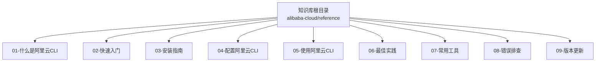
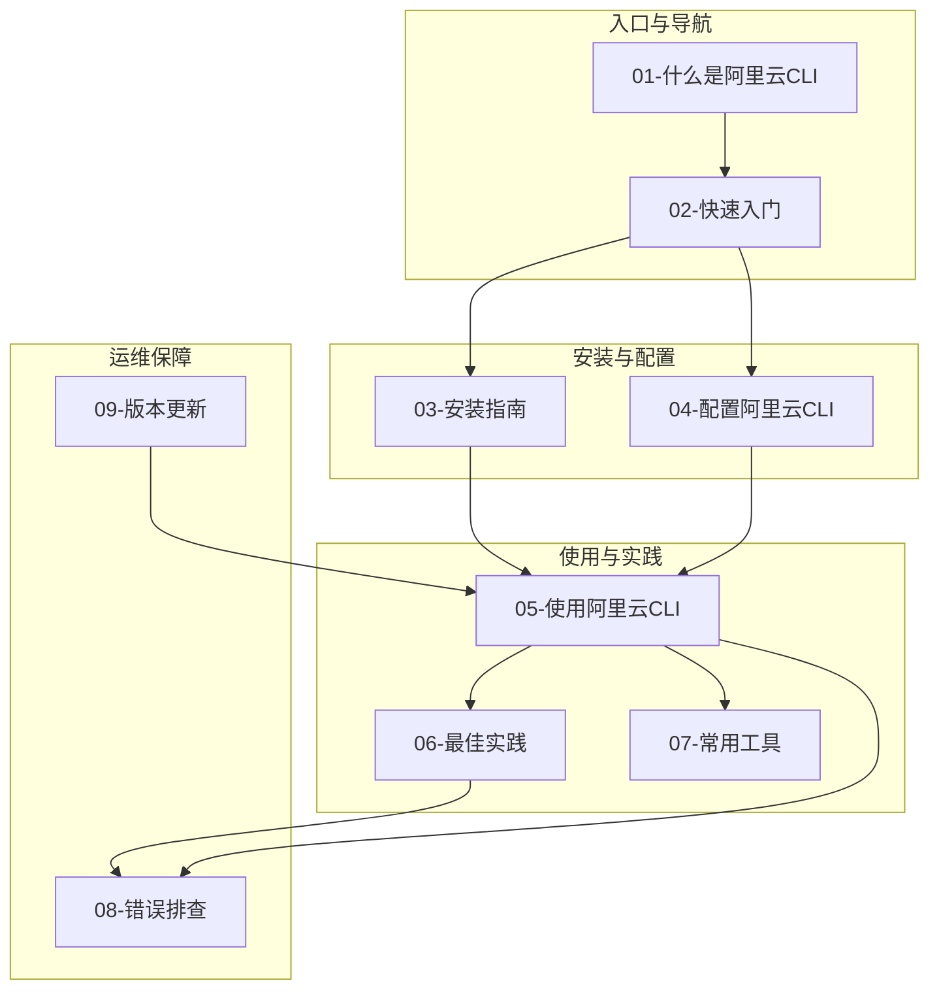
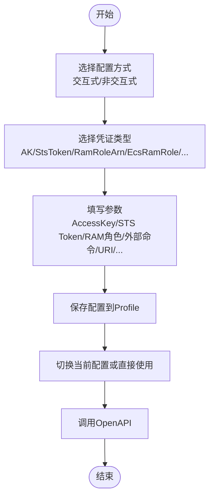
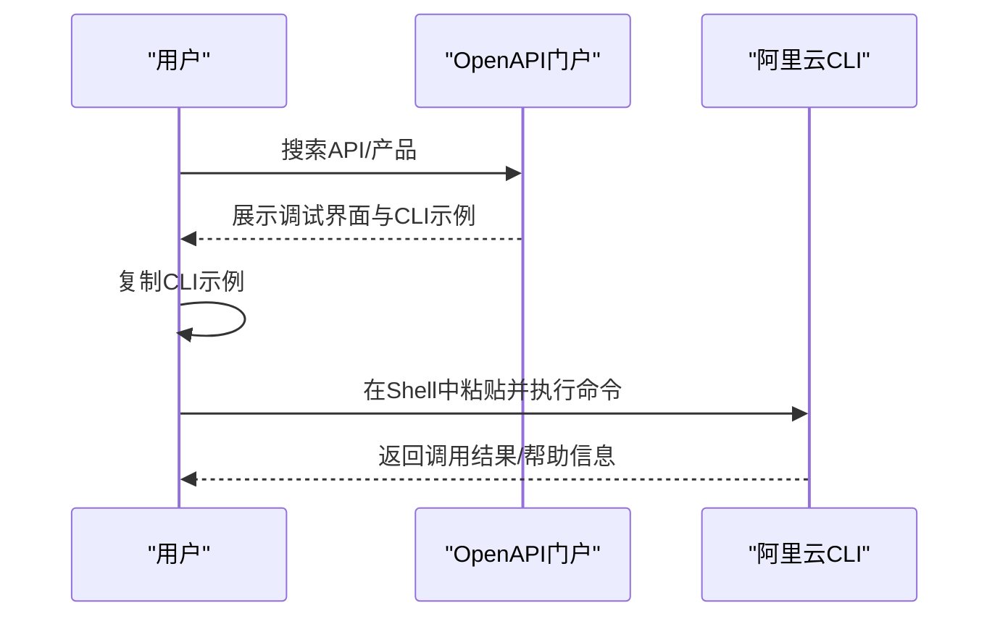
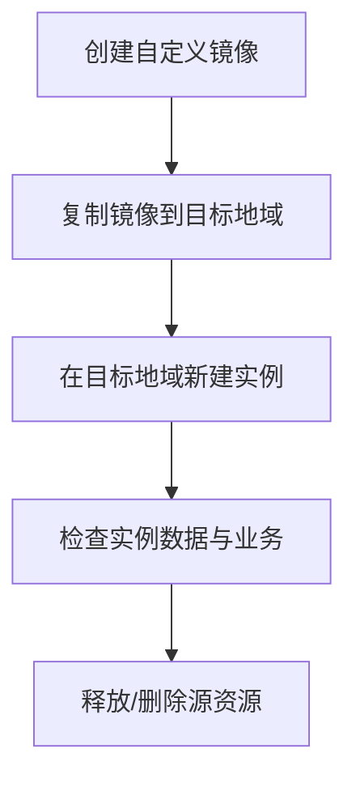
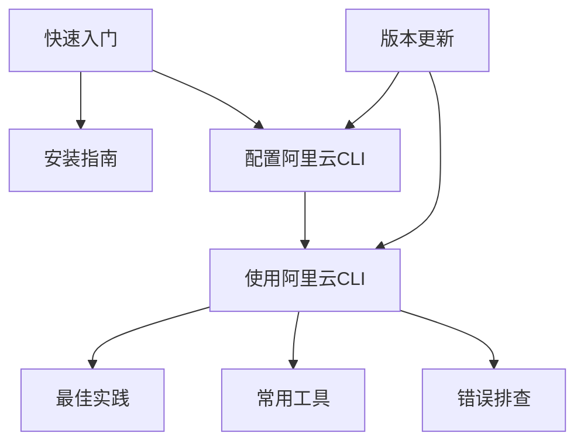

# 项目概述

<cite>
**本文引用的文件**
- [README.md](file://alibaba-cloud/reference/README.md)
- [what-is-alibaba-cloud-cli.md](file://alibaba-cloud/reference/01-什么是阿里云CLI/what-is-alibaba-cloud-cli.md)
- [quickly-start-using-alibaba-cloud-cli.md](file://alibaba-cloud/reference/02-快速入门/quickly-start-using-alibaba-cloud-cli.md)
- [install-cli-on-windows.md](file://alibaba-cloud/reference/03-安装指南/install-cli-on-windows.md)
- [configure-credentials.md](file://alibaba-cloud/reference/04-配置阿里云CLI/configure-credentials.md)
- [sample-commands.md](file://alibaba-cloud/reference/05-使用阿里云CLI/sample-commands.md)
- [use-alibaba-cloud-cli-to-migrate-ecs-instances-across-regions.md](file://alibaba-cloud/reference/06-最佳实践/use-alibaba-cloud-cli-to-migrate-ecs-instances-across-regions.md)
- [use-the-vim-editor.md](file://alibaba-cloud/reference/07-常用工具/use-the-vim-editor.md)
- [nano-editor-tutorial.md](file://alibaba-cloud/reference/07-常用工具/nano-editor-tutorial.md)
- [cli-troubleshooting.md](file://alibaba-cloud/reference/08-错误排查/cli-troubleshooting.md)
- [view-version-update-and-change-details.md](file://alibaba-cloud/reference/09-版本更新/view-version-update-and-change-details.md)
</cite>

## 目录
1. [引言](#引言)
2. [项目结构](#项目结构)
3. [核心组件](#核心组件)
4. [架构总览](#架构总览)
5. [详细组件分析](#详细组件分析)
6. [依赖分析](#依赖分析)
7. [性能考虑](#性能考虑)
8. [故障排查指南](#故障排查指南)
9. [结论](#结论)
10. [附录](#附录)

## 引言
本项目是面向阿里云CLI的知识库整理，依据阿里云官方文档中心的目录体系进行结构化编排，旨在帮助开发者与运维工程师快速掌握阿里云CLI的安装、配置、使用、最佳实践与排障要点。项目采用模块化、层次化的组织方式，覆盖从“入门”到“实战”的完整学习路径，既适合初学者建立概念与操作流程认知，也为有经验的用户提供可检索、可复用的技术参考。

## 项目结构
项目以“主题域”为维度划分章节，形成清晰的导航与检索路径：
- 01-什么是阿里云CLI：概念与能力概览
- 02-快速入门：安装、配置与调用OpenAPI的端到端流程
- 03-安装指南：多平台安装与验证
- 04-配置阿里云CLI：凭证类型、多配置与代理/自动补全
- 05-使用阿里云CLI：命令结构、参数格式、过滤与表格化输出、分页聚合、强制调用、轮询、模拟调用、日志调试、元数据导出
- 06-最佳实践：跨地域迁移ECS实例等真实场景
- 07-常用工具：Vim与Nano编辑器基础
- 08-错误排查：常见问题与诊断步骤
- 09-版本更新：变更日志与元数据对比

图表来源
- [README.md](file://alibaba-cloud/reference/README.md)

章节来源
- [README.md](file://alibaba-cloud/reference/README.md)

## 核心组件
- 概念与能力：明确CLI定位、与OpenAPI的关系、与专用产品CLI的区别，以及多产品集成、多凭证支持、流控退避、自动补全、输出格式、在线帮助、多系统支持等能力特性。
- 快速入门：以“安装—配置—生成命令—调用API”的四步法串联使用流程，强调凭证安全、地域选择与命令选项。
- 安装指南：覆盖Windows、Linux、macOS的安装步骤与验证方法，提供脚本化安装示例。
- 配置与凭证：详述交互式与非交互式配置方式，覆盖AK、StsToken、RamRoleArn、EcsRamRole、External、ChainableRamRoleArn、CredentialsURI、OIDC、CloudSSO、OAuth等凭证类型及其参数与配置示例。
- 使用指南：涵盖命令结构、参数格式、命令行选项、插件管理、帮助信息、OSS管理、结果过滤与表格化、分页聚合、强制调用、结果轮询、模拟调用、日志调试、元数据导出等。
- 最佳实践：以跨地域迁移ECS实例为例，展示镜像创建、复制、实例新建、检查与资源释放的完整链路。
- 常用工具：提供Vim与Nano编辑器的基础操作与实用技巧，便于在命令行中高效编辑配置与脚本。
- 故障排查：给出网络、命令/参数格式、地域接入点、请求详情、凭证有效性、版本更新等方面的排查步骤与常见错误码索引。
- 版本更新：指导如何查看主要变更与API元数据变更，支持在线与本地对比。

章节来源
- [what-is-alibaba-cloud-cli.md](file://alibaba-cloud/reference/01-什么是阿里云CLI/what-is-alibaba-cloud-cli.md)
- [quickly-start-using-alibaba-cloud-cli.md](file://alibaba-cloud/reference/02-快速入门/quickly-start-using-alibaba-cloud-cli.md)
- [install-cli-on-windows.md](file://alibaba-cloud/reference/03-安装指南/install-cli-on-windows.md)
- [configure-credentials.md](file://alibaba-cloud/reference/04-配置阿里云CLI/configure-credentials.md)
- [sample-commands.md](file://alibaba-cloud/reference/05-使用阿里云CLI/sample-commands.md)
- [use-alibaba-cloud-cli-to-migrate-ecs-instances-across-regions.md](file://alibaba-cloud/reference/06-最佳实践/use-alibaba-cloud-cli-to-migrate-ecs-instances-across-regions.md)
- [use-the-vim-editor.md](file://alibaba-cloud/reference/07-常用工具/use-the-vim-editor.md)
- [nano-editor-tutorial.md](file://alibaba-cloud/reference/07-常用工具/nano-editor-tutorial.md)
- [cli-troubleshooting.md](file://alibaba-cloud/reference/08-错误排查/cli-troubleshooting.md)
- [view-version-update-and-change-details.md](file://alibaba-cloud/reference/09-版本更新/view-version-update-and-change-details.md)

## 架构总览
本知识库采用“主题域—子主题—操作步骤/示例”的层次化组织，形成“入口—流程—细节—排障—演进”的闭环：

图表来源
- [README.md](file://alibaba-cloud/reference/README.md)
- [what-is-alibaba-cloud-cli.md](file://alibaba-cloud/reference/01-什么是阿里云CLI/what-is-alibaba-cloud-cli.md)
- [quickly-start-using-alibaba-cloud-cli.md](file://alibaba-cloud/reference/02-快速入门/quickly-start-using-alibaba-cloud-cli.md)
- [install-cli-on-windows.md](file://alibaba-cloud/reference/03-安装指南/install-cli-on-windows.md)
- [configure-credentials.md](file://alibaba-cloud/reference/04-配置阿里云CLI/configure-credentials.md)
- [sample-commands.md](file://alibaba-cloud/reference/05-使用阿里云CLI/sample-commands.md)
- [use-alibaba-cloud-cli-to-migrate-ecs-instances-across-regions.md](file://alibaba-cloud/reference/06-最佳实践/use-alibaba-cloud-cli-to-migrate-ecs-instances-across-regions.md)
- [cli-troubleshooting.md](file://alibaba-cloud/reference/08-错误排查/cli-troubleshooting.md)
- [view-version-update-and-change-details.md](file://alibaba-cloud/reference/09-版本更新/view-version-update-and-change-details.md)

## 详细组件分析

### 组件A：凭证与配置体系
- 设计理念：围绕“多凭证、多模式、可切换”的配置模型，支持安全与灵活性兼顾的凭证生命周期管理。
- 关键能力：
  - 交互式与非交互式配置
  - 多种凭证类型（AK、StsToken、RamRoleArn、EcsRamRole、External、ChainableRamRoleArn、CredentialsURI、OIDC、CloudSSO、OAuth）
  - 多配置文件与当前配置切换
  - 代理、自动补全、语言与输出格式等辅助设置
- 数据与流程：
  - 配置优先级与覆盖关系
  - 凭证刷新策略与安全边界
  - 与OpenAPI调用的衔接

图表来源
- [configure-credentials.md](file://alibaba-cloud/reference/04-配置阿里云CLI/configure-credentials.md)

章节来源
- [configure-credentials.md](file://alibaba-cloud/reference/04-配置阿里云CLI/configure-credentials.md)

### 组件B：命令生成与调用流程
- 设计理念：以OpenAPI门户为入口，生成标准化CLI命令，再在Shell中执行，形成“可视化—命令—执行”的闭环。
- 关键流程：
  - 登录OpenAPI门户
  - 搜索API或产品
  - 生成CLI示例并复制
  - 在Shell中运行命令，必要时附加选项（如--profile、--region、--help）

图表来源
- [quickly-start-using-alibaba-cloud-cli.md](file://alibaba-cloud/reference/02-快速入门/quickly-start-using-alibaba-cloud-cli.md)
- [sample-commands.md](file://alibaba-cloud/reference/05-使用阿里云CLI/sample-commands.md)

章节来源
- [quickly-start-using-alibaba-cloud-cli.md](file://alibaba-cloud/reference/02-快速入门/quickly-start-using-alibaba-cloud-cli.md)
- [sample-commands.md](file://alibaba-cloud/reference/05-使用阿里云CLI/sample-commands.md)

### 组件C：最佳实践（跨地域迁移ECS实例）
- 设计理念：以真实业务场景为载体，串联镜像创建、复制、实例新建、检查与资源释放的完整链路。
- 关键步骤：
  - 创建自定义镜像
  - 复制镜像到目标地域
  - 在目标地域新建实例
  - 检查数据一致性与业务可用性
  - 释放或删除源资源

图表来源
- [use-alibaba-cloud-cli-to-migrate-ecs-instances-across-regions.md](file://alibaba-cloud/reference/06-最佳实践/use-alibaba-cloud-cli-to-migrate-ecs-instances-across-regions.md)

章节来源
- [use-alibaba-cloud-cli-to-migrate-ecs-instances-across-regions.md](file://alibaba-cloud/reference/06-最佳实践/use-alibaba-cloud-cli-to-migrate-ecs-instances-across-regions.md)

### 组件D：排障与版本演进
- 排障：围绕网络、命令/参数格式、地域接入点、请求详情、凭证有效性、版本差异等维度提供系统化排查步骤。
- 版本更新：提供查看主要变更与API元数据变更的方法，支持在线与本地对比，便于跟踪兼容性与功能演进。

图表来源
- [cli-troubleshooting.md](file://alibaba-cloud/reference/08-错误排查/cli-troubleshooting.md)
- [view-version-update-and-change-details.md](file://alibaba-cloud/reference/09-版本更新/view-version-update-and-change-details.md)

章节来源
- [cli-troubleshooting.md](file://alibaba-cloud/reference/08-错误排查/cli-troubleshooting.md)
- [view-version-update-and-change-details.md](file://alibaba-cloud/reference/09-版本更新/view-version-update-and-change-details.md)

## 依赖分析
- 组件耦合与内聚：
  - “快速入门”与“安装/配置/使用”高度内聚，构成用户上手的主线路径
  - “最佳实践”与“使用指南”互补，前者提供场景化范式，后者提供工具与方法论
  - “排障”与“版本更新”作为支撑性组件，贯穿全链路
- 外部依赖与集成点：
  - OpenAPI门户用于生成CLI命令示例
  - 云命令行（Cloud Shell）用于在线调试
  - GitHub Releases用于版本变更与元数据对比
- 潜在循环依赖：
  - 本知识库为纯文档结构，不存在代码层面的循环依赖

图表来源
- [README.md](file://alibaba-cloud/reference/README.md)
- [quickly-start-using-alibaba-cloud-cli.md](file://alibaba-cloud/reference/02-快速入门/quickly-start-using-alibaba-cloud-cli.md)
- [configure-credentials.md](file://alibaba-cloud/reference/04-配置阿里云CLI/configure-credentials.md)
- [sample-commands.md](file://alibaba-cloud/reference/05-使用阿里云CLI/sample-commands.md)
- [use-alibaba-cloud-cli-to-migrate-ecs-instances-across-regions.md](file://alibaba-cloud/reference/06-最佳实践/use-alibaba-cloud-cli-to-migrate-ecs-instances-across-regions.md)
- [cli-troubleshooting.md](file://alibaba-cloud/reference/08-错误排查/cli-troubleshooting.md)
- [view-version-update-and-change-details.md](file://alibaba-cloud/reference/09-版本更新/view-version-update-and-change-details.md)

章节来源
- [README.md](file://alibaba-cloud/reference/README.md)

## 性能考虑
- 流控退避：利用内置的流控策略优雅退避，减少重试次数，提升整体调用效率与资源利用率
- 输出格式：在需要批量处理或与其他程序协同时，选择合适的输出格式（JSON/表格）以降低解析成本
- 分页聚合与结果轮询：对大规模数据或异步任务，采用聚合与轮询策略，避免一次性拉取造成压力峰值
- 代理与地域：合理配置代理与地域优先级，减少网络抖动与跨域调用带来的延迟

## 故障排查指南
- 一般排查步骤：
  - 检查网络连通性与代理设置
  - 核对命令结构与参数格式
  - 明确地域接入点优先级
  - 使用模拟调用与日志调试定位请求详情
  - 校验凭证配置与权限
- 常见问题与错误码：
  - 命令不存在/参数缺失
  - 凭证无效/权限不足
  - 版本差异导致的兼容性问题
- 版本与元数据：
  - 通过GitHub Releases查看主要变更
  - 对比导出的元数据，定位API定义与产品信息的变化

章节来源
- [cli-troubleshooting.md](file://alibaba-cloud/reference/08-错误排查/cli-troubleshooting.md)
- [view-version-update-and-change-details.md](file://alibaba-cloud/reference/09-版本更新/view-version-update-and-change-details.md)

## 结论
本知识库以“主题域—子主题—操作步骤/示例”的模块化结构，系统梳理了阿里云CLI从概念到实践的全链路知识，既满足初学者的入门需求，也为有经验的开发者提供了可检索、可复用的技术参考。通过“快速入门—安装配置—命令生成—最佳实践—排障—版本演进”的闭环设计，帮助用户高效掌握阿里云CLI并稳定落地到生产场景。

## 附录
- 相关链接：
  - 阿里云CLI GitHub仓库
  - OpenAPI门户
  - 阿里云官方文档中心

章节来源
- [README.md](file://alibaba-cloud/reference/README.md)